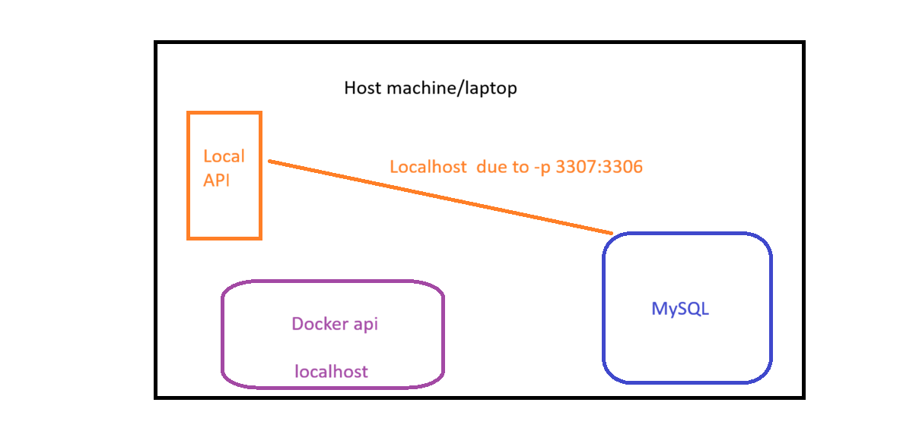

# Docker Networking and Docker Compose

> This resource follows the class demo. We ran MySQL in a container, pointed a small Express + Sequelize API at it, and then moved the API into a container as well - at which point it stopped being able to find the database. That failure is the whole lesson. We fix it by hand first with a Docker network, feel how tedious that is, and only then meet **Docker Compose**, which turns the entire setup into one file and one command. Where a word might be new, a plain-English version is given in *[brackets]* right after it.

## 1. Where we left off

In the previous module we containerised a single Express API. One image, one container, `docker run -p 8000:3000`, done. Everything the application needed was inside that one box.

Real back-end work is not like that. An API needs a database, and the database is a separate program with its own version, its own configuration and its own port. That gives us two containers, and immediately a question we have not had to ask before: **how does one container talk to another one?**

The answer is less obvious than it looks, because the first thing everybody tries - `localhost` - is exactly the thing that cannot work. So the lesson goes in three stages:

1. Run MySQL in a container and use it from the API running normally on the machine. This works.
2. Move the API into a container too. This breaks, and we take the break apart carefully.
3. Fix it properly with a Docker network, then replace all of that manual work with Docker Compose.

## 2. The API we are containerising

### 2.1 The shape of it

A small todo API. One Sequelize *[an ORM - a library that maps JavaScript objects onto database tables so you write JavaScript instead of SQL]* model, and only three endpoints:

```
POST /todos     create a todo
GET  /todos     list them
GET  /health    is this thing alive, and can it reach the database
```

There are no `routes/` or `controllers/` folders here on purpose. Full CRUD and a layered architecture would be the right call in a real project, but they would bury the one thing we are actually watching today: whether a request that has to reach the database succeeds or fails. Everything stays in `app.js` so the data path is visible on one screen.

`app.js` and `server.js` are still separate, as before. `app.js` builds and exports the Express app with no listening and no side effects; `server.js` imports it, connects to the database and starts listening. That split is what lets the tests import the app directly without ever opening a port.

### 2.2 The health endpoint is our instrument

The health endpoint from the previous module only reported that the process was running. That is no longer enough. Once there are two containers, "the API is up" and "the API can do its job" are different statements, and we need to tell them apart from outside:

```js
app.get('/health', async (req, res) => {
  let database = 'connected'

  try {
    await sequelize.authenticate()
  } catch (error) {
    database = 'disconnected'
  }

  res.status(database === 'connected' ? 200 : 503).json({
    status: database === 'connected' ? 'ok' : 'degraded',
    uptime: process.uptime(),
    timestamp: new Date().toISOString(),
    environment: ENVIRONMENT,
    database
  })
})
```

`sequelize.authenticate()` opens a connection and throws if it cannot. Two fields in the response matter. `database` answers the networking question. `environment` answers the configuration question - it reads `process.env.ENVIRONMENT || 'default'`, so `"default"` means no configuration reached this process at all.

Those two fields are the diagnostic tools for the rest of the lesson. Every time something breaks below, this endpoint is where we look first, and it will tell us **which** of the two things is wrong.

> A health check that only says "I am running" cannot tell you why the thing in front of you is broken.

### 2.3 Why a failed database connection does not kill the server

```js
async function start () {
  try {
    await sequelize.authenticate()
    await sequelize.sync()
    console.log('Database connected')
  } catch (error) {
    // Deliberately not fatal.
    console.error('Database connection failed:', error.message)
  }

  app.listen(PORT, () => console.log(`Server running on port ${PORT}`))
}
```

The obvious thing to write here is `process.exit(1)` in the `catch`. We deliberately do not. A container whose process exits on boot just disappears - `docker ps` shows nothing, and there is nothing left to ask questions of. By staying up, the API keeps answering `/health`, and `/health` can tell us that the database is the problem. The error is still printed, so `docker logs` has the detail.

This is a debugging decision for a teaching demo, not a universal rule. Production systems often *do* want to fail fast so an orchestrator can restart or reschedule them. But while you are learning what broke, a container you can interrogate beats a container that is gone.

### 2.4 The tests

Jest plus supertest *[a library that fires HTTP requests at an Express app in memory, no server or port needed]*, and they run against the real database rather than a mock - the point of the exercise is to prove the connection works.

- `/health` returns 200 with `status: "ok"`.
- `/health` reports `database: "connected"`.
- `/health` reports an `environment` that is not `"default"`, so we know configuration arrived.
- `POST /todos` returns 201 with an id; a missing title and an empty title both return 400.
- `GET /todos` returns an array containing the todo we just posted.

Two details in `tests/setup.js` that matter again in section 6:

```js
beforeAll(async () => { await sequelize.sync({ force: true }) })
afterAll(async () => { await sequelize.close() })
```

`sync({ force: true })` drops and recreates the table so each test file starts from a known empty database. Because every file shares **one real database**, they must not run at the same time - hence `jest --runInBand` in `package.json`, which runs test files one after another. And Sequelize keeps a connection pool *[a set of open database connections held ready for reuse]* open, so without `sequelize.close()` Jest finishes the tests and then hangs.

The important consequence: `npm test` only passes if a MySQL database is actually reachable. Remember that - it is the thing Compose makes cheap at the end.

## 3. MySQL in a container

### 3.1 Why not the MySQL already installed on the machine

Most of us already have MySQL installed locally, and it works. The problem is that we have no control over it. We do not know its exact version, what character set it defaults to, what was configured on it months ago, or what a classmate's copy looks like. It is the shared-machine problem from module 1 again: something everything depends on, that nobody owns, and that drifts.

A container replaces all of that with a line you can read: `mysql:8` with exactly these environment variables. It is the same version on every machine in the room, it can be thrown away and recreated in seconds, and it is far closer to what will actually run in the cloud.

### 3.2 Running it

```bash
docker run --name mysql-docker \
  -e MYSQL_ROOT_PASSWORD=root \
  -e MYSQL_DATABASE=todos \
  -e MYSQL_USER=admin \
  -e MYSQL_PASSWORD=admin123 \
  -p 3307:3306 \
  -d mysql:8
```

None of this is new syntax - it is the same `docker run` from last module with more `-e` flags. What is new is where the flags come from. `MYSQL_ROOT_PASSWORD`, `MYSQL_DATABASE`, `MYSQL_USER` and `MYSQL_PASSWORD` are not Docker features and they are not standard MySQL. They are the configuration surface *[the set of knobs an image documents for you to turn]* that the official `mysql` image chooses to expose, documented on its Docker Hub page. On first boot the image's entrypoint script reads them, initialises the data directory, creates the `todos` database and the `admin` user, then starts the server.

This is the pattern for every official database image you will use: read the image's documentation to find out which environment variables it accepts, then pass them with `-e`. `MYSQL_ROOT_PASSWORD` is the only mandatory one - without it the container refuses to start.

These are obviously terrible passwords. They are acceptable here because this database exists on one laptop for one lesson. Real credentials are handled differently, which is a topic of its own.

### 3.3 What `-p 3307:3306` really does

`3306` is MySQL's default port, and it is very likely already taken by the MySQL installed on the machine. Rather than fighting over it, we publish the container's port on a free one:

```
-p 3307:3306
    │     └── the port inside the container, where MySQL actually listens
    └──────── the port on your machine, where you can reach it
```

The container has not changed. MySQL inside it listens on 3306 exactly as it always does. `-p` adds a door from your machine into the container: traffic arriving at `localhost:3307` on your laptop is forwarded to port 3306 inside the container.

Hold on to that left/right distinction. It is the source of the second failure we hit in section 5.

> `-p` publishes a container port onto the host machine. It is the only reason `localhost:3307` means anything at all.

### 3.4 Connecting with MySQL Workbench

To prove the database is genuinely there, we connected to it with MySQL Workbench: host `127.0.0.1`, port `3307`, user `admin`, password `admin123`. The `todos` database is there, empty.

Worth pausing on what just happened. Workbench is installed on the machine, not in the container, and it connected to a MySQL server that only exists inside a container. **The database engine and the tools you use to look at it are separate programs.** The container ships the engine. Everything else - Workbench, the `mysql` CLI, your API - is a client that connects to it over the network. That is also why a database container is perfectly useful without any GUI inside it.

### 3.5 Pointing the API at it

Configuration goes in `.env`, as before:

```
ENVIRONMENT=development

DB_HOST=localhost
DB_PORT=3307      # the host side of -p
DB_NAME=todos
DB_USER=admin
DB_PASSWORD=admin123
DB_DIALECT=mysql
```

And Sequelize reads it:

```js
require('dotenv').config()
const { Sequelize } = require('sequelize')

const sequelize = new Sequelize(
  process.env.DB_NAME,
  process.env.DB_USER,
  process.env.DB_PASSWORD,
  {
    host: process.env.DB_HOST,
    port: process.env.DB_PORT,
    dialect: process.env.DB_DIALECT || 'mysql',
    logging: false
  }
)

module.exports = sequelize
```

`npm start`, then `GET /health`:

```json
{ "status": "ok", "environment": "development", "database": "connected" }
```

`npm test` passes too. This all works, and it is worth being precise about *why* `DB_HOST=localhost` is correct right now: the API is a normal Node process running on the laptop, and `-p 3307:3306` published the database onto that same laptop. Both ends are on the host machine. That statement is true today and false in ten minutes.

## 4. Putting the API in a container - and breaking it

### 4.1 The Dockerfile

Unchanged in shape from module 1, so read it rather than learn it:

```dockerfile
FROM node:22-alpine
WORKDIR /app
COPY package*.json .
RUN npm ci
COPY . .
EXPOSE 3000
CMD ["npm", "start"]
```

The one line worth re-stating is `COPY package*.json .` before `COPY . .`. Each instruction becomes a cached layer, and a layer is rebuilt only when its inputs change. Copying the package files first means that editing `app.js` invalidates only the final copy, not `npm ci`. Reverse the two and every code change reinstalls every dependency.

`.dockerignore` is also unchanged:

```
.vscode
node_modules
.gitignore
lecture*.md
.env
```

Note that `.env` is on that list, and that this is correct. Configuration and secrets do not belong baked into an image - an image gets pushed to a registry and shared, and it should be the same artefact whether it runs on your laptop or in production. It is also about to cause a visible failure, which is the point.

### 4.2 Build and run it naively

```bash
docker build -t todo-api .
docker run --name todo-api -p 3000:3000 -d todo-api
```

Then `http://localhost:3000/health`, which returns **503**:

```json
{
  "status": "degraded",
  "environment": "default",
  "database": "disconnected"
}
```

Two things are broken at once, and they have nothing to do with each other. Resist the urge to fix both in one go: if you change two things and the symptom changes, you have learned nothing about which change did it.

- `"environment": "default"` - no configuration reached the process. `.dockerignore` kept `.env` out of the image, and nothing replaced it.
- `"database": "disconnected"` - the real subject of this lesson.

### 4.3 Fix the configuration first

We have seen this one before. Configuration is supplied at **run time**, not build time:

```bash
docker rm -f todo-api
docker run --name todo-api -p 3000:3000 --env-file .env -d todo-api
```

`--env-file` reads the same `.env` and sets each line as an environment variable inside the container. Note that we had to remove and recreate the container: environment variables are fixed when a container is created, so there is no way to change them on a running one. Recreating containers is normal and expected - the container is disposable, the image is the thing you keep.

Health again:

```json
{
  "status": "degraded",
  "environment": "development",
  "database": "disconnected"
}
```

`environment` is now `development`, so configuration is definitely arriving inside the container. The database is **still** disconnected.

Doing it in this order matters. If we had fixed everything at once, the remaining failure could be waved away as "the `.env` did not load". We have now proved that it did. Whatever is wrong, it is not that.

### 4.4 Make the failure visible instead of guessing

```bash
docker logs todo-api
```

```
Database connection failed: connect ECONNREFUSED 127.0.0.1:3307
Server running on port 3000
```

There it is - and this is exactly why section 2.3 kept the server alive after a failed connection. `ECONNREFUSED` *[the target actively refused the connection - nothing is listening on that address and port]* against `127.0.0.1:3307`.

`docker logs` is the first place to look, always. The health endpoint tells you *that* something is wrong; the logs tell you *what*.

### 4.5 What `localhost` means inside a container

`DB_HOST=localhost` was a true statement while the API ran on the laptop. It is a false statement now, and it is worth being exact about why.

`localhost` and `127.0.0.1` are not a fixed place. They mean **"the machine I am currently running on"**, whatever that machine happens to be. A container has its own isolated network stack: its own network interface, its own IP address, and its own loopback interface. So inside the API container, `localhost` means *the API container*. Nothing is listening on port 3307 in there - the only process in that container is Node.

The API is not looking at the wrong port. It is looking at the **wrong machine**.



```
              your laptop (host)
 ┌──────────────────────────────────────────┐
 │   localhost:3307 ───────────┐            │   <- the door -p opened
 │                             │            │
 │  ┌──────────────┐    ┌──────▼─────────┐  │
 │  │ todo-api     │    │ mysql-docker   │  │
 │  │ localhost    │    │ :3306          │  │
 │  │  = itself    │    │ localhost      │  │
 │  └──────┬───────┘    │  = itself      │  │
 │         │            └────────────────┘  │
 │         └── localhost:3307 → dead end    │
 └──────────────────────────────────────────┘
```

Trace the request yourself: the API asks for `localhost:3307`, that resolves to the API container's own loopback, nothing is listening there, connection refused. It never leaves the container.

> Two containers on the same laptop are, as far as `localhost` is concerned, two different computers.

### 4.6 An aside: `host.docker.internal`

Someone always suggests this, and it is a fair suggestion, so it is worth naming and then putting down.

Docker Desktop provides a special hostname, `host.docker.internal`, which resolves from inside a container to the host machine. Setting `DB_HOST=host.docker.internal` with `DB_PORT=3307` genuinely would fix the symptom: the API would go out to the laptop, hit the published port, and come back into the MySQL container.

We are not doing it, for two reasons. It sends traffic on a pointless round trip out to the host and back in, for two containers sitting on the same machine. And more importantly, it is a Docker Desktop convenience for local development with no equivalent once these containers are deployed somewhere real - a cloud host has no `host.docker.internal`. We want the answer that survives the move to production, and containers talking to each other directly is that answer.

## 5. Docker networks

### 5.1 What a Docker network is

You are not networking students, so this stays at the level you need in order to work with it.

When Docker starts a container it attaches it to a network. By default that is a built-in network called `bridge` *[a virtual switch on the host that containers plug into, each getting its own private IP address]*. Containers on it can reach the outside world, and they can reach each other by IP address - but that is not much use to us, because those addresses are assigned by Docker and change whenever containers are recreated. You cannot write `172.18.0.2` into a `.env` file and expect it to still be true tomorrow.

What we want is to address a container **by name**, and that is the reason to create our own network rather than use the default one. On a user-defined bridge network, Docker runs an embedded DNS server *[the service that turns names into IP addresses]* that resolves container names to their current IP automatically. The default `bridge` network does not do this. Same kind of network, one very useful extra feature.

### 5.2 Creating one and putting containers on it

```bash
docker network create todo-network
docker network ls
```

`todo-network` appears in the list alongside the built-in `bridge`, `host` and `none`. A container joins a network with `--network` at creation time, so both containers have to be recreated:

```bash
docker rm -f mysql-docker todo-api

docker run --name mysql-docker \
  --network todo-network \
  -e MYSQL_ROOT_PASSWORD=root \
  -e MYSQL_DATABASE=todos \
  -e MYSQL_USER=admin \
  -e MYSQL_PASSWORD=admin123 \
  -p 3307:3306 \
  -d mysql:8

docker run --name todo-api \
  --network todo-network \
  -p 3000:3000 \
  --env-file .env \
  -d todo-api
```

Note that MySQL keeps `-p 3307:3306`. The API no longer needs it, but we still want Workbench and a locally run `npm test` to be able to reach the database from the laptop.

### 5.3 Addressing a container by name

`--name mysql-docker` is now doing double duty. It is what you type in `docker logs`, and it is the **hostname** that DNS resolves on `todo-network`. So from inside the API container, `mysql-docker` is a valid address for the database:

```
DB_HOST=mysql-docker
```

Names are stable in a way IPs are not. Recreate the database container and its IP will very likely change; the name does not. This is the same idea you will meet again in every container platform - you address a service by name, and something else keeps track of where it currently is.

### 5.4 It fails again, differently

Change `DB_HOST` to `mysql-docker`, recreate the API container, check the logs:

```
Database connection failed: connect ECONNREFUSED 172.18.0.2:3307
```

Read that carefully before changing anything, because it contains good news. The name resolved - `mysql-docker` became `172.18.0.2`, a real address on `todo-network`. DNS is working. The connection was then refused at that address, on port 3307.

And 3307 is the mistake. Go back to section 3.3: **3307 is a host port**. It exists because `-p` opened a door from the laptop into the container. On `todo-network` there is no laptop in the path at all - the API talks straight to the database container, and the database container listens on 3306, its own port, as it always has.

```
DB_HOST=mysql-docker
DB_PORT=3306
```

```
  container → container         host → container
  ─────────────────────         ─────────────────
  todo-api                      your laptop
     │                             │
     │ mysql-docker:3306           │ localhost:3307
     ▼                             ▼
  mysql-docker :3306            -p forwards to :3306
```

Both routes reach the same MySQL. They just arrive through different doors, and the address you use depends on which side you are standing on.

### 5.5 Confirming it

```bash
docker rm -f todo-api
docker run --name todo-api --network todo-network -p 3000:3000 --env-file .env -d todo-api
```

`GET /health` finally gives 200 with `"database": "connected"`. And if you want to be certain the container received what you think it did:

```bash
docker exec todo-api env | grep DB
```

That prints the environment variables as the process inside actually sees them. When configuration is the suspect, check it at the destination rather than trusting the file you edited.

> On a Docker network you address the service by name, on its own port. The published port is for you, not for them.

### 5.6 Now count the friction

It works. It is also genuinely annoying, and being annoyed at the right moment is the setup for the next section.

To hand this project to somebody else - or to yourself on another machine - you now have to remember, in order: create the network; run MySQL with five environment variables, a port mapping and the network flag; build the image; run the API with the network flag and the env file. Four commands, none of which live in the repository. They live in your shell history, or in a README that goes stale.

Worse is the daily loop. Developing a feature normally means running the API on your machine with `npm start` - fast restarts, a debugger, no rebuild - and that needs `DB_HOST=localhost` with `DB_PORT=3307`. Then you want to check that the containerised version behaves the same, and that needs `DB_HOST=mysql-docker` with `DB_PORT=3306`. Every switch is a hand edit of `.env`, and forgetting one produces the exact `ECONNREFUSED` we have already debugged twice.

None of this is hard. It is repetitive, undocumented and easy to get wrong - which is precisely the kind of problem a tool should absorb.

## 6. Docker Compose

### 6.1 What Compose is

**Docker Compose** is a tool for defining and running multi-container applications. Instead of a sequence of `docker run` commands, you describe the containers you want in a YAML *[a plain-text configuration format, indentation-based, no braces]* file - `compose.yaml`, or the still very common `docker-compose.yml` that we used - and start them all with one command.

It ships with Docker Desktop, so you already have it. `docker compose` is a subcommand of the same CLI; note that it is two words. The older hyphenated `docker-compose` is version 1 and is no longer maintained.

Two things to be clear about, because Compose is easy to over-read:

- It is **declarative**. The file describes the desired end state - these services, these images, these ports - and Compose works out what to create, recreate or leave alone. It is not a script of steps.
- It is aimed at **local development, testing and CI**. It runs containers on a single machine. It is not what runs your application in production across a cluster; that is the job of orchestrators like Kubernetes or a managed cloud container service. Compose being local is not a limitation to work around - it is what makes it a good development tool.

The real change is that the file lives in the repository next to the code. The setup stops being something you remember and becomes something you clone.

### 6.2 The database service

Start by translating the `docker run` we already have:

```yaml
services:
  db:
    image: mysql:8
    container_name: db
    environment:
      MYSQL_ROOT_PASSWORD: root
      MYSQL_DATABASE: todos
      MYSQL_USER: admin
      MYSQL_PASSWORD: admin123
    ports:
      - "3307:3306"
```

Everything under `services` is one container. `db` is the **service name**, chosen by us, and it is about to matter more than it looks. Each key is a flag you already know:

| `docker run` flag | Compose key | Notes |
|---|---|---|
| `mysql:8` (the image argument) | `image:` | The same image reference |
| `-e KEY=value` | `environment:` | One line per variable, written `KEY: value` |
| `-p 3307:3306` | `ports:` | A list; quote the value so YAML does not read it as a number |
| `--name db` | `container_name:` | Optional - without it Compose generates a name |
| `-d` | not in the file | Detached is a run-time choice: `docker compose up -d` |
| `--network todo-network` | not in the file | Compose creates a network for you - see 6.3 |

Then:

```bash
docker compose up -d      # create and start everything
docker compose ps         # what is running
docker compose logs db    # logs for one service
docker compose down       # stop and remove the containers and the network
```

You will see older examples that start with `version: "3.8"`. That key is obsolete in current Compose and produces a warning - it is a leftover from Compose v1 and can simply be deleted.

### 6.3 Adding the API

```yaml
services:
  db:
    image: mysql:8
    container_name: db
    environment:
      MYSQL_ROOT_PASSWORD: root
      MYSQL_DATABASE: todos
      MYSQL_USER: admin
      MYSQL_PASSWORD: admin123
    ports:
      - "3307:3306"

  app:
    image: todo-api
    container_name: todo-api
    environment:
      ENVIRONMENT: docker
      DB_HOST: db
      DB_PORT: 3306
      DB_NAME: todos
      DB_USER: admin
      DB_PASSWORD: admin123
      DB_DIALECT: mysql
    ports:
      - "3000:3000"
```

Three things to notice.

**The whole of section 5 has disappeared into this file.** Compose creates a network for the project automatically and puts every service on it, with the same name-based DNS we set up by hand. There is no `docker network create`, no `--network` flag, and nothing to remember.

**`DB_HOST: db` is the service name.** On the Compose network each service is reachable at its own name, so `db` is the hostname for MySQL. The container name changed from `mysql-docker` to `db` - that is not cosmetic, it is the address the API dials, and renaming the service means changing `DB_HOST` with it. `DB_PORT` is `3306`, container to container, for exactly the reason we hit in 5.4. The `"3307:3306"` on `db` is still there purely so *you* can reach the database from the laptop.

**Configuration is inline rather than read from `.env`.** Compose also supports `env_file: [.env]`, which is the direct equivalent of `--env-file`. We moved to an explicit `environment:` block because the values the container needs (`db`, `3306`) are genuinely different from the values a locally run API needs (`localhost`, `3307`). Keeping them in the file means the container's configuration is visible and version-controlled, and `.env` is left alone for running on the host. This only works because these are throwaway credentials; real secrets do not go into a file you commit.

One caveat on `image: todo-api`: that is the image we built earlier with `docker build -t todo-api .`, and Compose expects to find it locally. It will not build it for you here. If the image is missing, the `app` service fails to start.

### 6.4 Profiles: two ways to work

We do not always want both containers. Most of the time you are writing code, running the API with `npm start`, and you only want a database. Sometimes you want to check the containerised version end to end. Compose handles this with **profiles**: a service tagged with a profile is only started when that profile is asked for.

```yaml
  app:
    image: todo-api
    container_name: todo-api
    profiles:
      - app
    environment:
      ...
```

`db` has no profile, so it always starts. `app` starts only on request:

```bash
docker compose up -d                  # database only
docker compose --profile app up -d    # database and API
```

Which gives two clean modes:

```
  npm start (on the host)        --profile app (both in containers)
  ───────────────────────        ─────────────────────────────────
  your laptop                    todo-api container
     │ localhost:3307               │ db:3306
     ▼                              ▼
  db container                   db container
```

The left-hand mode uses your `.env` with `DB_HOST=localhost` and `DB_PORT=3307`, unchanged. The right-hand mode uses the `environment:` block with `db` and `3306`. The two configurations no longer overwrite each other, and you stop hand-editing `.env` every time you switch.

### 6.5 The payoff

This is the part worth remembering from the whole lesson. Cloning the project onto a machine that has never seen it:

```bash
git clone <repo>
cd class-demo
npm i
docker compose up -d
npm test
```

The tests pass. No network to create, no `docker run` flags to look up, no README instructions to follow, no local MySQL install and no negotiation with whatever version was already on the machine. The database is described by a file in the repository, and the file *is* the setup.

Then, to check the containerised deployment:

```bash
docker build -t todo-api .
docker compose --profile app up -d
```

and `http://localhost:3000/health` is answered by the API running in a container, talking to the database over the Compose network.

> The value of Compose is not that it saves typing. It is that the environment stops living in your head and starts living in the repository.

### 6.6 Reading `environment` back out

The `/health` response now tells you exactly which of the three worlds you are in, using the field from section 2.2:

| `environment` | What it means |
|---|---|
| `development` | The API is running on your machine via `npm start`, reading `.env` |
| `docker` | The API is running in a container, configured by the `environment:` block in the Compose file |
| `default` | Nothing loaded - no `.env`, no `-e`, no Compose configuration. Something is wrong |

That is a small thing that pays for itself constantly. When you are switching between these modes several times an hour, one request tells you which one you are actually looking at.

## 7. Command reference

```bash
# Networks
docker network create todo-network      # create a user-defined bridge network
docker network ls                       # list networks
docker network inspect todo-network     # which containers are attached, and their IPs
docker run --network todo-network ...   # attach at creation time (only at creation time)

# Inspecting a running container
docker logs <container>                 # its output - always the first place to look
docker exec <container> env             # the environment variables the process actually got
docker exec -it <container> sh          # a shell inside the container

# Compose
docker compose up -d                    # create and start the default services
docker compose --profile app up -d      # include services behind the "app" profile
docker compose ps                       # what this project is running
docker compose logs -f app              # follow one service's logs
docker compose down                     # stop and remove the containers and the network
docker compose config                   # print the resolved file - good for debugging YAML
```

### 7.1 The recurring mistakes

| Symptom | Usual cause |
|---|---|
| `ECONNREFUSED 127.0.0.1:<port>` from inside a container | `localhost` in `DB_HOST` - it means the container itself |
| `ECONNREFUSED <container ip>:3307` | Using the published host port container-to-container; use `3306` |
| `getaddrinfo ENOTFOUND db` | The containers are not on the same network, or the service name is spelled differently |
| Environment changes have no effect | Environment is fixed at container creation - recreate the container |
| `"environment": "default"` in `/health` | No configuration reached the process at all |
| Compose warns about `version` | The `version:` key is obsolete; delete it |
| `npm test` fails on connection | No database running - `docker compose up -d` first |

## 8. Sources

1. Docker Docs, *Networking overview* - [docs.docker.com/engine/network](https://docs.docker.com/engine/network/)
2. Docker Docs, *Bridge network driver* (user-defined bridges and embedded DNS) - [docs.docker.com/engine/network/drivers/bridge](https://docs.docker.com/engine/network/drivers/bridge/)
3. Docker Docs, *Networking in Compose* - [docs.docker.com/compose/how-tos/networking](https://docs.docker.com/compose/how-tos/networking/)
4. Docker Docs, *Docker Compose overview* - [docs.docker.com/compose](https://docs.docker.com/compose/)
5. Docker Docs, *Compose file reference - services* - [docs.docker.com/reference/compose-file/services](https://docs.docker.com/reference/compose-file/services/)
6. Docker Docs, *Using profiles with Compose* - [docs.docker.com/compose/how-tos/profiles](https://docs.docker.com/compose/how-tos/profiles/)
7. Docker Docs, *Environment variables in Compose* - [docs.docker.com/compose/how-tos/environment-variables](https://docs.docker.com/compose/how-tos/environment-variables/)
8. Docker Docs, *Explore networking features on Docker Desktop* (`host.docker.internal`) - [docs.docker.com/desktop/features/networking](https://docs.docker.com/desktop/features/networking/)
9. Docker Hub, official `mysql` image (environment variables) - [hub.docker.com/_/mysql](https://hub.docker.com/_/mysql)
10. Sequelize Docs, *Getting started* - [sequelize.org/docs/v6/getting-started](https://sequelize.org/docs/v6/getting-started/)
