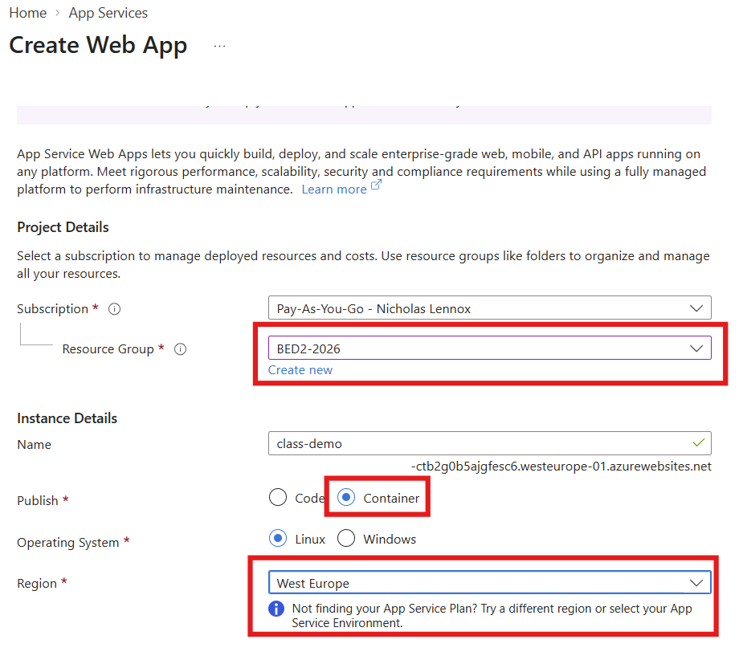
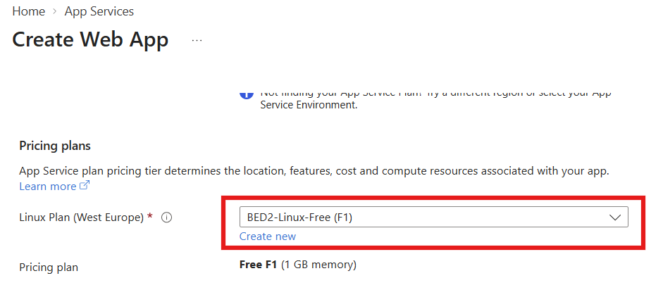
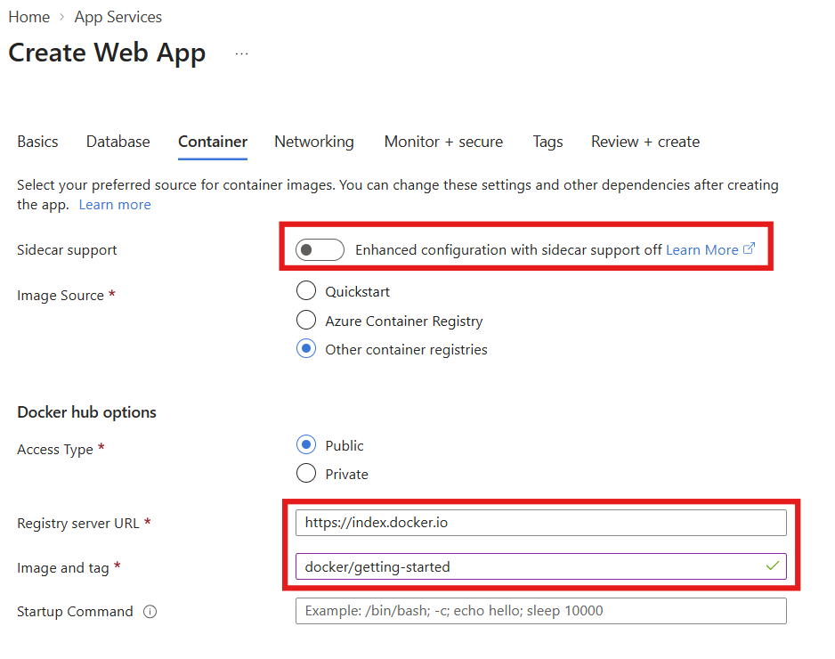
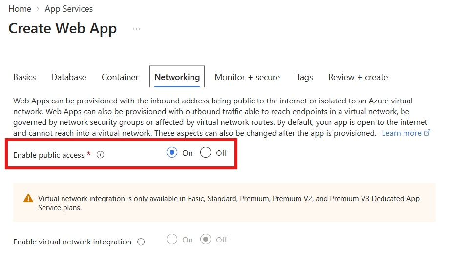
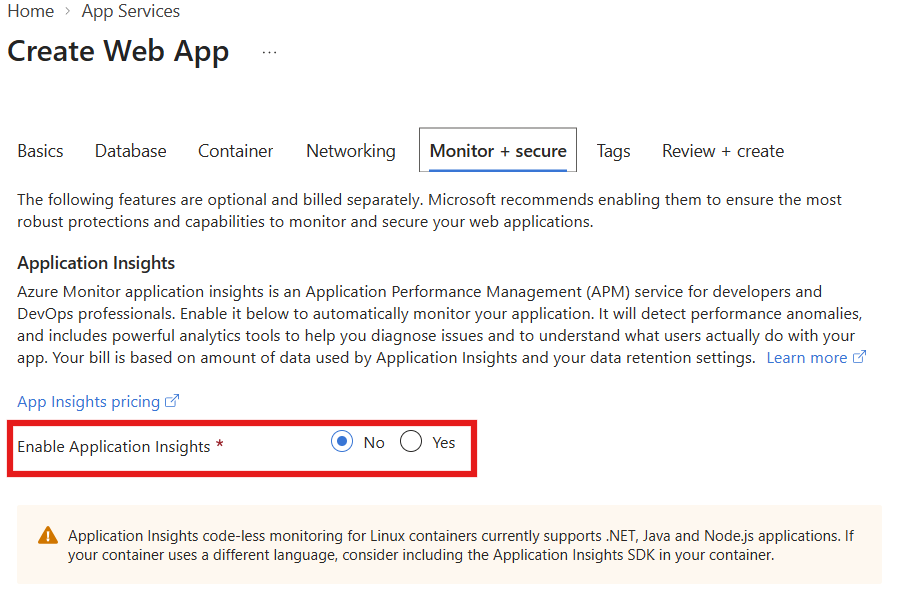
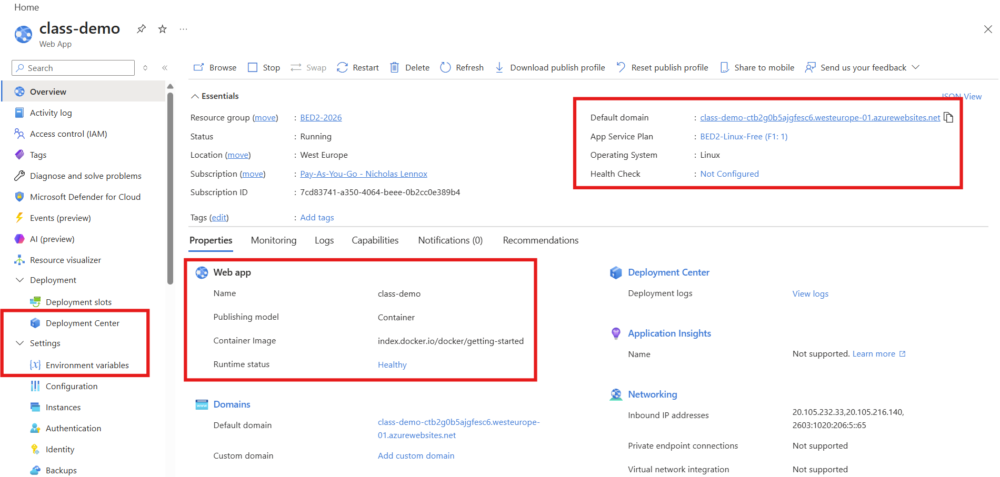
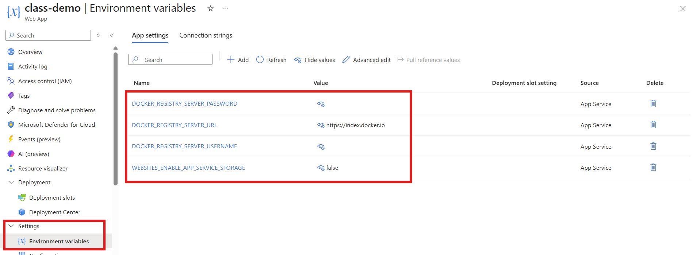
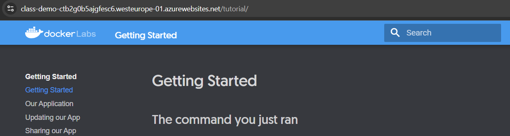

# A First Deployment: A Container on Azure App Service

> Everything we have built so far has run on our own machines. This lesson takes a container image and runs it on someone else's computer for the first time. Most of the work is not the deployment itself - that turns out to be a form with six tabs - it is deciding **which** Azure service is the right place for a web API in a container, and then finding where the ideas we already know (images, ports, environment variables, registries) have been hidden in someone else's dashboard. Where a word might be new, a plain-English version follows it in *[brackets]*.

## 1. Where we left off

Module 1 ended with a single containerised Express API: one image, one `docker run`, one port published to the host ([Containerising a Node.js API with Docker](../../module-1/04-intro-to-docker/lecture.md)). Yesterday we added a database, watched the API lose it the moment it moved into a container of its own, and fixed that with a network and then with Docker Compose ([Docker Networking and Docker Compose](../01-docker-networking-and-compose/lecture.md)). The kata that goes with this lesson is that same work done from scratch on a project that has none of it.

All of that still ran on one laptop. Compose is a local tool - it starts containers on a single machine, and that is what makes it good for development. It is not what runs an application in production. So the question this lesson opens is the obvious next one: the image is built, it runs, it is configured from the outside. Where do we put it?

Today we answer that with somebody else's image rather than our own API. That is deliberate. If the deployment misbehaves, we want exactly one candidate for the cause.

## 2. The thing we are deploying

`docker/getting-started` is the tutorial image Docker publishes - a small static site, served on port 80, with no configuration, no database and no dependencies. We ran it locally before touching Azure:

```bash
docker run -d -p 80:80 docker/getting-started
```

and then opened `http://localhost`. Nothing here is new; this is the same `docker run` we have used since module 1, and the point of running it is that afterwards, when the same page appears on an Azure URL, the only thing that has changed is where it is running.

> A first deployment should have exactly one variable in it, and that variable is the platform.

## 3. Choosing where to run a container

Azure will run a container for you in at least half a dozen places. They are not interchangeable, and the differences are not about capability - almost all of them *can* serve an HTTP request. The differences are about what the service does for you and what it expects you to bring.

### 3.1 The obvious first answer, and why it did not work

**Azure Container Instances (ACI)** looks like the right answer, because it is the one that sounds like what we want: give it an image, get a running container. Microsoft's own comparison describes ACI as "a single pod of Hyper-V isolated containers on demand" and "a lower-level 'building block' option", and is explicit about what comes with it: "Concepts like scale, load balancing, and certificates aren't provided with ACI containers."

That sentence is easy to skim past and it is the whole story. A running container is not a reachable web application. Between a container and a browser there normally sits a public address, a DNS name, a certificate for HTTPS and something routing traffic to the right instance. ACI is the layer *below* all of that. When we deployed to it, we ended up with a container that was running and that we could not usefully reach, and nothing in the service is designed to close that gap for us - that is what "building block" means. ACI is intended to be assembled into something by another service, or driven by a platform such as AKS, rather than pointed at directly.

The other problem is configuration. Our API is, as of yesterday, almost entirely defined by its environment variables. A hosting service that does not put configuration front and centre is the wrong shape for the thing we are about to deploy.

### 3.2 The second answer, and why not yet

**Azure Container Apps** is the modern general-purpose option: serverless containers, built on Kubernetes with open-source pieces underneath (KEDA for scaling, Dapr for service-to-service concerns, Envoy for traffic), with service discovery, revisions, traffic splitting and scale-to-zero.

It would work. But making an app reachable there means configuring **ingress** *[the rules describing how outside traffic enters a cluster and which service it reaches]*, and ingress belongs to a set of ideas - clusters, revisions, internal versus external traffic - that we have not covered.

### 3.3 What we actually used

**Azure App Service** provides, in Microsoft's words, "fully managed hosting for web applications including websites and web APIs", deployable "using code or containers", and it is "optimized for web applications".

That is a precise description of what we have: one web API, in one container, that should answer HTTP on a URL. App Service gives us the public URL, the certificate and the routing without a single decision on our part, and it puts configuration in an obvious place. Everything we do not want to think about yet, it does; everything the lesson is about, it exposes.

> Choose the service by what it is optimised for, not by what it can be made to do. Almost anything can serve an HTTP request; the question is how much you have to build around it before it does.

## 4. How Azure is organised

Before creating anything, it is worth knowing what the thing you are about to create sits inside, because that hierarchy is how Azure decides who pays and who is allowed.


Reading it from the top: a **billing account** and its agreement sit above everything and are where invoices are produced. A **Microsoft Entra tenant** *[the directory of identities - the users and applications that can sign in]* is the identity boundary. Underneath, **subscriptions** are the unit that gets billed and the boundary most quotas apply to. **Management groups** exist to apply policy across many subscriptions at once. And inside a subscription, a **resource group** is a container for the resources themselves.

The resource group is the one that matters day to day. It is a plain container - a folder - but two properties make it useful:

- Everything in it shares a lifecycle. Deleting a resource group deletes everything inside it. For our purposes that is the cleanup mechanism: one delete removes the web app, the plan and anything else the lesson leaves behind.
- It is the natural unit for looking at cost. If everything for a course, project or environment lives in its own group, "what is this costing" has an answer.

That second point is the [CapEx/OpEx](../../module-1/03-cost-and-virtualization/lecture.md) lesson arriving in practice. Metered billing only helps if you can see and stop what is running. We created a group called `BED2-2026` and put everything in it.

### 4.1 Regions

A **region** is a set of datacenters within a latency-defined perimeter, connected by a dedicated network. You pick one when you create most resources, and the choice is not cosmetic:

- **Latency.** The region is where the machine physically is. West Europe is close to us; a region in the US is not.
- **Data residency.** Which country's jurisdiction the data sits in is often a legal constraint rather than a technical one.
- **Availability of services and tiers.** Not every Azure service, and not every pricing tier of every service, exists in every region. This is the one that bites without warning - the portal's own hint on the create form is *"Not finding your App Service Plan? Try a different region"*, which is Azure telling you that the tier you want is not offered where you are looking.

Related, and worth knowing the name of: within a region, **availability zones** are physically separate datacenters with independent power, cooling and networking. A **zone-redundant** deployment spreads instances across them so that losing one building does not take the application down. It costs more and it requires a tier that supports it, so it is not something we will use - but "which zone" and "which region" are different questions and get confused constantly.

We used **West Europe** throughout, and the resource group, the App Service plan and the web app all share it.

## 5. Creating the Web App

The portal walks you through tabs. Most of the fields have sensible defaults; a handful decide what you actually get.

### 5.1 Basics



Three fields do real work here.

**Resource group** puts the app in the container from section 4. Everything else we create in this lesson goes in the same one.

**Publish: Container.** The default is `Code`, which means "hand App Service a zip of source and let it build and run it with a runtime we provide". `Container` means "we have already built the image; run that". This one radio button changes what the rest of the form asks for.

**Region** must be somewhere the plan you want exists - see 4.1, and the hint sitting right underneath the field.

Note what the **Name** field does as you type: it becomes the hostname. `class-demo` produced `class-demo-<generated>.westeurope-01.azurewebsites.net`. That name is public DNS, which is why Azure appends a unique suffix.

### 5.2 The App Service plan



This is the field that needs explaining, because it is the one that costs money and the one that is easiest to misread.

An **App Service plan** "defines a set of compute resources for a web app to run". It is the VMs. It fixes the operating system, the region, how many VM instances there are, how big they are, and the pricing tier. The web app is *hosted in* the plan; several apps can share one plan, and if they do, they share those same VMs and scale together.

So the mental model is two layers, not one: the plan is the rented hardware, the app is the thing running on it. That is also how billing works - **the plan carries the charge, not the app**. Creating a second web app inside an existing plan adds no new cost line; creating a second plan does.

We used **F1 (Free)**. Free and Shared are the two "shared compute" tiers: your app runs on the same VM as other App Service apps, including other customers', with a CPU quota allocated to it, and it cannot scale out. In exchange, the Free tier is not billed at all. The trade is the honest one for a classroom - limited CPU, no scaling, no custom domain - and the plan can be scaled up to a paid tier later without recreating the app.

> The app is not the thing you pay for. The plan underneath it is.

### 5.3 Container



**Sidecar support** is off, and stays off. A **sidecar** *[a second container that runs alongside your main one, in the same host, providing a supporting service to it]* is how you bolt on things like a metrics collector, a log shipper or a proxy without building them into your own image. App Service allows up to nine of them per Linux app, with one container designated the main one. It is a genuinely useful pattern and it is entirely unnecessary for a single self-contained image, which is what we have.

**Image Source** offers Quickstart, Azure Container Registry and other registries. **Azure Container Registry (ACR)** is Azure's own private registry - the same role Docker Hub plays, inside your subscription, with Azure permissions in front of it. It is the natural destination for our own images later on. Today we used **Other container registries** with **Access Type: Public**, `https://index.docker.io` as the registry server, and `docker/getting-started` as the image and tag. Public Docker Hub needs no credentials, which is why the first deployment uses it.

**Startup Command** is left empty: the image already has a `CMD`, and this field is the override, equivalent to putting a command after the image name in `docker run`.

One thing this form does not ask about is worth knowing before you deploy your own API. **App Service assumes your custom container listens on port 80.** Our API listens on 3000. If the container's port is not 80, you set an application setting called `WEBSITES_PORT` to the port it does use, and App Service routes to that instead. There is no published-port mapping to write here, because you do not get to choose the outside port - it is 443 and 80, in front of Azure's own front ends. App Service also allows a container to expose only one port for HTTP.

### 5.4 Networking



**Enable public access: On.** Off is a real and reasonable choice for an internal API reached over a private network, and it is exactly wrong for a demo whose entire purpose is being reachable from a browser.

Where this lives afterwards is not obvious - it is not a top-level item in the app's menu, and looking for something called "firewall" does not find it. The path is **Settings → Networking**, then the **Access Restrictions** option. That is where a priority-ordered allow/deny list of IP addresses or subnets goes. With no rules defined, the app is reachable from anywhere; add one rule and an implicit *deny all* appears at the end of the list.

### 5.5 Monitor + secure



**Enable Application Insights: No.** Application Insights is Azure Monitor's application performance monitoring service - request rates, response times, failure traces, dependency calls. It is genuinely good and it is billed on the volume of data it ingests, which is the reason to leave it off for a throwaway demo rather than any objection to the tool.

The rest of the tabs (Database, Tags) we left alone. A database is a resource we can add to the group later; nothing about creating the web app requires one to exist.

## 6. Reading the deployment back

### 6.1 The overview blade



Creating the app is not the same as the app being ready. Azure has to allocate the plan, pull the image and start the container, and that takes a few minutes - refreshing the URL immediately and getting an error page means very little.

The things to actually read on this screen:

- **Default domain** - the URL. This is what you open.
- **Runtime status** - `Healthy` here. This is App Service's own verdict, not your application's. It decides a container has started by making an HTTP request to it and seeing whether anything answers; a 404 counts, which is why `GET /robots933456.txt` turns up in container logs and can be ignored.
- **Container Image** - `index.docker.io/docker/getting-started`, echoing back exactly what we typed on the Container tab.
- **App Service Plan** - a link to the plan from 5.2, because the plan is a separate resource with its own blade and its own bill.
- **Health Check: Not Configured** - a feature where you nominate a path in your app (`/health`, for instance) and App Service polls it and takes unhealthy instances out of rotation. We are not using it, but note what it implies: the health endpoint we spent yesterday building is exactly the interface a platform expects to find.

### 6.2 Environment variables



This blade is where the last two lessons land.

Under **Settings → Environment variables**, App Service keeps a list of **app settings** - name/value pairs which, when the app runs, "are automatically injected into the process as environment variables". That is the same mechanism as `docker run -e`, `--env-file`, and the `environment:` block in a Compose service. Different interface, identical idea: the image is fixed, the configuration arrives at start-up from outside it.

Which means the `ENVIRONMENT`, `DB_HOST` and `DB_PORT` we have been moving in and out of `.env` files have an obvious home here, and a fourth value for the `environment` field in our health response - `azure` - is one row in this table.

Four settings are already present, and none of them were typed by us:

| Setting | What it is |
|---|---|
| `DOCKER_REGISTRY_SERVER_URL` | The registry we pointed at - `https://index.docker.io`. |
| `DOCKER_REGISTRY_SERVER_USERNAME` | Credentials for pulling the image, empty for a public repository. |
| `DOCKER_REGISTRY_SERVER_PASSWORD` | As above. These three are reserved names, and Microsoft's documentation notes that for security reasons none of them are exposed to the application itself. |
| `WEBSITES_ENABLE_APP_SERVICE_STORAGE` | `false`. Controls whether writes to `/home` inside the container survive restarts and are shared across instances. On Linux custom containers it is disabled by default, which is the containers-are-disposable assumption stated as a setting. |

So the platform configures itself through the same channel it offers you. It also means an application setting is not automatically an application's setting - some of these names belong to App Service, and it will not hand them to your process.

> Every environment we have run in - laptop, Docker network, Compose, Azure - has a different way of writing configuration down and the same way of delivering it. An application that reads its config from the environment is portable across all four without a code change.

### 6.3 Where the deployment itself is configured

The **Deployment Center**, under **Deployment** in the left menu, is where the image source lives after creation - changing the tag, pointing at a different registry, wiring up a webhook so a new push redeploys automatically. We did not go into it; it is the door to continuous deployment, and continuous deployment is a lesson of its own.

Worth knowing the name of one more thing you will meet in the documentation: the **SCM site** at `https://<app-name>.scm.azurewebsites.net`. It is a separate administrative site that runs alongside your app - the deploy endpoint and the **Kudu** console, from which you can browse files, read Docker logs, open an SSH session into the container, and check the environment the process actually received at `/Env`. It is the platform's own maintenance access, which is why it has its own hostname and can be given its own access restrictions.

### 6.4 The result



The same page we ran locally in section 2, on a public HTTPS URL, with a certificate we did not create, on a machine we do not own. Nothing about the image changed.

## 7. What this changes for our own API

We deployed a static site with no configuration to keep the number of moving parts at one. Taking the API we have actually been building through the same form means three additional things, all of which we now have names for:

- **The port.** Our container listens on 3000, App Service expects 80. That is one app setting, `WEBSITES_PORT=3000`.
- **The configuration.** Everything in `.env` becomes rows on the Environment variables blade - which is precisely why the kata makes you take the hardcoded values out first. An application with its database host compiled into it cannot be deployed twice.
- **The database.** Not solved today. A container running in App Service cannot reach a MySQL container on your laptop, and Compose does not follow you into the cloud - Azure's answer is a managed database service, added to the same resource group, addressed by hostname and credentials that arrive as app settings.

And one thing that has quietly stopped being our problem: HTTPS. App Service terminates TLS at its front ends, so encrypted traffic is unwrapped before it reaches the container. The application does not implement TLS and should not try to.

## 8. Sources

1. Microsoft Learn, *Comparing Container Apps with other Azure container options* - [learn.microsoft.com/en-us/azure/container-apps/compare-options](https://learn.microsoft.com/en-us/azure/container-apps/compare-options)
2. Microsoft Learn, *Azure App Service plans overview* - [learn.microsoft.com/en-us/azure/app-service/overview-hosting-plans](https://learn.microsoft.com/en-us/azure/app-service/overview-hosting-plans)
3. Microsoft Learn, *Configure a custom container for Azure App Service* - [learn.microsoft.com/en-us/azure/app-service/configure-custom-container](https://learn.microsoft.com/en-us/azure/app-service/configure-custom-container)
4. Microsoft Learn, *Tutorial: Configure a sidecar for a custom container app* - [learn.microsoft.com/en-us/azure/app-service/tutorial-custom-container-sidecar](https://learn.microsoft.com/en-us/azure/app-service/tutorial-custom-container-sidecar)
5. Microsoft Learn, *Set up access restrictions in Azure App Service* - [learn.microsoft.com/en-us/azure/app-service/app-service-ip-restrictions](https://learn.microsoft.com/en-us/azure/app-service/app-service-ip-restrictions)
6. Microsoft Learn, *Azure billing offers and Microsoft Entra tenants* - [learn.microsoft.com/en-us/azure/cloud-adoption-framework/ready/landing-zone/design-area/azure-billing-microsoft-entra-tenant](https://learn.microsoft.com/en-us/azure/cloud-adoption-framework/ready/landing-zone/design-area/azure-billing-microsoft-entra-tenant)
7. Microsoft Learn, *Azure regions overview* - [learn.microsoft.com/en-us/azure/reliability/regions-overview](https://learn.microsoft.com/en-us/azure/reliability/regions-overview)
8. Docker Hub, `docker/getting-started` - [hub.docker.com/r/docker/getting-started](https://hub.docker.com/r/docker/getting-started)
