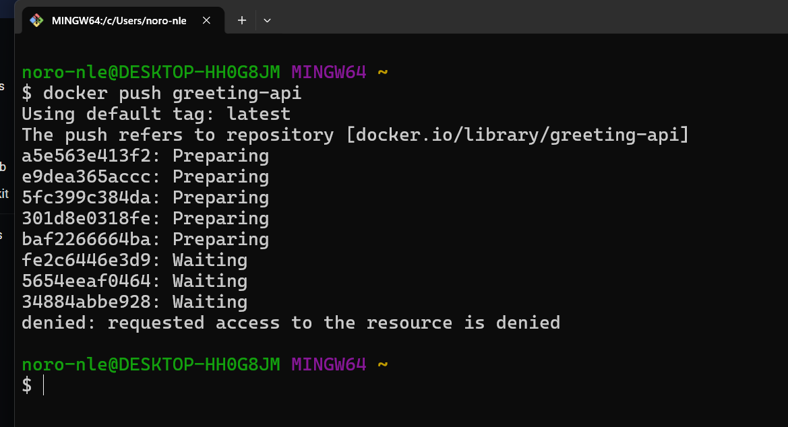
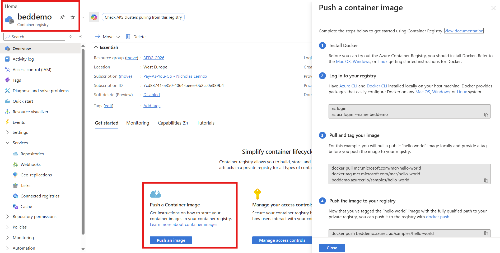
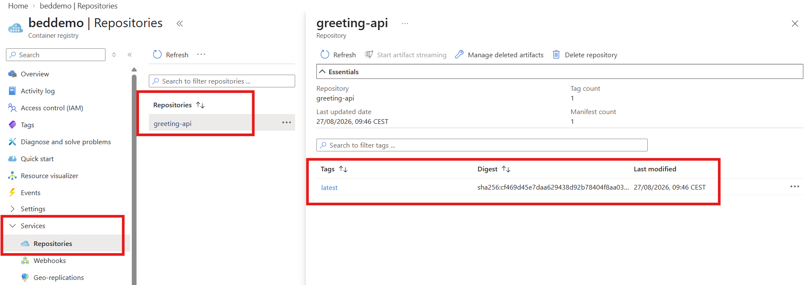
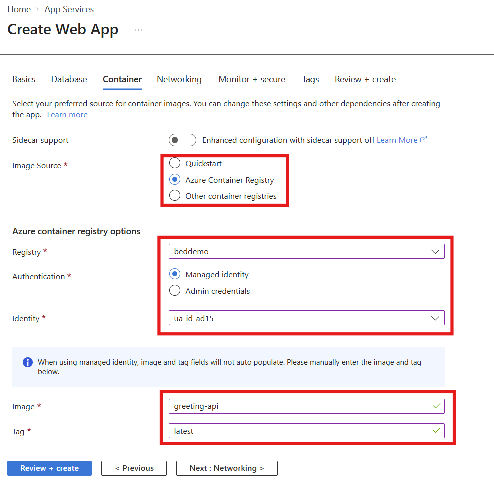
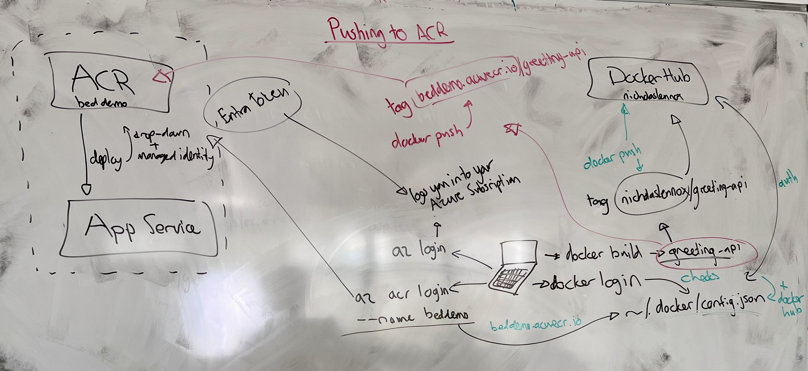

# Private Registries: Pushing to Azure Container Registry

> Everything we have pushed or pulled so far has gone to or come from Docker Hub, and it worked because Docker Hub is public and Docker treats it as the default. This lesson takes our own image and puts it somewhere private, which breaks both of those assumptions at once. The first thing that happens is a `docker push` that fails, and the reason it fails is the mechanic the whole lesson is built on: **the name of an image is the address it gets pushed to**. Once that is clear, the rest - logging in to a private registry, tagging for two destinations, and letting Azure pull the image on our behalf - is the same idea applied three times. Where a word might be new, a plain-English version follows it in *[brackets]*.

## 1. Where we left off

Two things from earlier lessons meet in this one.

In module 1 we built an image from a Dockerfile, tagged it, and pushed it to Docker Hub ([Containerising a Node.js API with Docker](../../module-1/04-intro-to-docker/lecture.md)). That worked, and we moved on quickly, which means the *why* behind `docker login` and `docker tag` never got picked apart.

Yesterday we deployed a container to Azure App Service ([A First Deployment: A Container on Azure App Service](../02-first-azure-deployment/lecture.md)). We used `docker/getting-started` from public Docker Hub, and on the Container tab we set **Access Type: Public**, which meant no username, no password, no permissions. That lesson noted that Azure Container Registry was "the natural destination for our own images later on". Later on is today.

So the shape of this lesson is: take the API image we built, put it in a registry that is ours and is private, and then have App Service pull it from there. Doing that surfaces every piece of credential handling that public Docker Hub had been hiding.

One piece of setup before any of it: the **Azure CLI** *[a command-line tool for driving Azure - the same operations the portal performs, typed instead of clicked]* needs to be installed. On Windows that is the MSI installer linked in the sources.

## 2. The credentials Docker is already carrying

We started somewhere that looks unrelated: `docker login`.

```bash
docker login
```

It did not ask for anything. It reported a login as `nicholaslennox` from credentials that were already on the machine, because a Docker login persists - you stay signed in until you run `docker logout` or the credential is replaced. That persistence is the point of noticing it now.

Where does it live? In Docker's own configuration file, `~/.docker/config.json` (`%USERPROFILE%\.docker\config.json` on Windows). Open it and you will not find a password. What you find is a `credsStore` entry naming an external credential helper, and a list of registry hostnames Docker holds credentials for. Docker's documentation is explicit about the two modes: with a credential store configured, the secret is held by the operating system's keychain and `config.json` only records *that there is one*; without one, "Docker stores credentials in the `config.json` file in a base64-encoded format", which is encoding, not encryption, and is the less secure option.

The part to hold on to is the shape of that file: **a list, keyed by registry.** Not one login - a set of them, and Docker picks which one to use based on what you are pushing. We come back to this file twice.

There is also a contrast being set up here. A Docker Hub credential is long-lived by design. It is meant for a developer's own laptop, where re-authenticating every few hours would be friction with no security benefit worth the cost. The Azure credential we get in section 6 lasts **three hours**. Both choices are defensible; they are optimising for different things, and knowing that a credential has a lifetime is what stops "it worked this morning" from being a mystery.

## 3. The push that failed

The project in [`class-demo/`](./class-demo/) is deliberately the smallest thing that can be an API. One route, one dependency:

```js
const express = require('express')

const app = express()

// App Service expects port 80 unless it is told otherwise with the WEBSITES_PORT setting.
const PORT = 3000

// The one line we come back and change, so we can watch a new image reach Azure.
app.get('/greeting', (req, res) => {
  res.status(200).json({ greeting: 'howzit' })
})

app.listen(PORT, () => {
  console.log(`Server running on port ${PORT}`)
})
```

The Dockerfile is the same shape as the one from module 1 - Alpine base, dependencies installed from the lockfile before the source is copied so that layer caches:

```dockerfile
# Base image: the Node runtime we need, on a small Linux distro
FROM node:22-alpine

# Working directory inside the container - everything below is relative to it
WORKDIR /app

# Copy the package files first so the install layer can be cached
COPY package*.json .

# Install exactly what package-lock.json pins
RUN npm ci

# Copy the rest of the project (minus whatever .dockerignore excludes)
COPY . .

# Documentation only - this does not publish anything
EXPOSE 3000

CMD ["npm", "start"]
```

We built it with the most obvious name available:

```bash
docker build -t greeting-api .
```

And then tried to push it:



```
$ docker push greeting-api
Using default tag: latest
The push refers to repository [docker.io/library/greeting-api]
a5e563e413f2: Preparing
...
denied: requested access to the resource is denied
```

Three lines of that output are worth reading slowly, because between them they explain the whole failure.

**`Using default tag: latest`.** We never wrote a tag, so Docker supplied one. `greeting-api` and `greeting-api:latest` are the same thing.

**`The push refers to repository [docker.io/library/greeting-api]`.** This is the important one. We typed one word; Docker expanded it into three parts. An image reference has the form `[HOST[:PORT]/]NAMESPACE/REPOSITORY[:TAG]`, and Docker fills in whatever is missing: when the host is omitted "Docker defaults to Docker Hub (`docker.io`)", and when the namespace is omitted it defaults to `library`, which is the namespace reserved for Docker's own official images.

**`denied: requested access to the resource is denied`.** Of course it is. We just asked to publish an image into the namespace that holds `node`, `nginx` and `mysql`. We are authenticated - section 2 proved that - and we are authenticated as somebody who has no business writing there.

So the push did not fail for want of a login. It failed because the name pointed at the wrong place, and the name was the only instruction Docker had about where to go. This is the same relationship Git has with remotes, moved somewhere less obvious: in Git the destination is a named remote you configure separately, in Docker **the destination is part of the image's name**, and nothing else specifies it.

> `docker push` has no destination argument. The image name *is* the destination.

## 4. What `docker tag` actually does

The fix is to give the image a name that points somewhere we are allowed to write:

```bash
docker tag greeting-api nicholaslennox/greeting-api
docker push nicholaslennox/greeting-api
```

That succeeded, and the `nicholaslennox` prefix is doing exactly one job: it is the namespace on Docker Hub that our credentials have write access to.

The word "tag" is used for two different things here and the collision causes real confusion, so it is worth separating them.

- In `docker build -t greeting-api .`, the `-t` is short for `--tag` and it names the image being built. Docker's own reference calls the value an "image identifier (format: `[registry/]repository[:tag]`)" - so the thing `-t` takes is a *full reference*, of which the `:tag` part is only the last component.
- In `docker tag SOURCE TARGET`, the command's job is to "create a tag TARGET_IMAGE that refers to SOURCE_IMAGE" - it adds a second name pointing at an image that already exists.

The second one is the one people misread. `docker tag` **does not copy anything**. It does not build, it does not duplicate layers, it does not take measurable time. Run `docker images` after tagging and you will see two rows with two different names and the *same* IMAGE ID, because there is one image and two names for it. A tag is a label on a box, not another box.

### 4.1 Rebuilding, and which names follow

This is the question the room kept circling, and it has a clean answer once you accept that names point at image IDs rather than at each other.

Suppose you have built `greeting-api`, tagged it as `nicholaslennox/greeting-api`, changed a line in `app.js`, and rebuilt with `docker build -t greeting-api .`. The build produces a **new image with a new ID**. The name `greeting-api` moves to it, because that is the name you passed to `-t`. The name `nicholaslennox/greeting-api` does not move - it is still pointing at the old image ID, which is still sitting on your machine. Push it and you push yesterday's code.

So the answer to "do the other tags update too?" is **no, and this is the mistake to expect**. After every rebuild you either re-run `docker tag` for each destination, or you skip the separate tag step altogether, because `-t` may be given more than once:

```bash
docker build \
  -t greeting-api \
  -t nicholaslennox/greeting-api \
  -t beddemo.azurecr.io/greeting-api \
  .
```

One build, one image, three names, all guaranteed to be pointing at the same thing. It also answers the other question the notation raises: yes, `-t` accepts a fully-qualified name with a registry host in it - there is nothing special about `docker tag` that `-t` lacks.

### 4.2 Why tag for more than one place at all

We pushed the same image to Docker Hub *and* to a private registry in this lesson, and that is not a normal thing to do. It was done for contrast: two destinations, one mechanism, so the mechanism becomes visible.

But the practice of building once and naming for several destinations is real. The usual reason is that the same artifact has to travel through more than one place - a registry per environment, a mirror in another region, a public copy of something also kept internally. What makes it worth doing this way is precisely what the section above established: because a tag is an alias rather than a copy, naming an image for five destinations costs nothing, and it guarantees that all five receive **the identical image**, rather than five separate builds that happen to have come from the same source.

> Build once, name for every destination it needs to reach. A rebuild invalidates every name you do not re-apply.

## 5. Creating the registry

**Azure Container Registry (ACR)** is a private registry inside your own Azure subscription: the same role Docker Hub plays - stores images, serves pulls - but with Azure's identity and permissions system in front of it instead of a public read.

We created it through the portal rather than the CLI. That was deliberate. We had just installed the Azure CLI and had not used it for anything yet, and creating a resource is a poor place to meet a new tool, because when something goes wrong you cannot tell whether the problem is the resource or the command. The portal form has few decisions in it - a name, the [resource group](../02-first-azure-deployment/lecture.md) (`BED2-2026`, the same one as yesterday), a region, and a pricing tier.

The one place it bites is the region, and only on **Azure for Students** subscriptions. Some regions refuse the deployment with a validation error mentioning a policy, and the policy itself is close to impossible to find from the error message. There is no diagnosis to do here: pick a different region and try again. Recognising the pattern - *a validation error about policy on a student subscription means the region, not you* - is worth more than whichever region happens to work today. We used West Europe.

Once it exists, the registry's Overview blade has a **Push a Container Image** panel that is genuinely useful:



It gives you the four commands with your own registry's name already substituted in, which is a better reference than the tutorial in the documentation - Microsoft's written walkthrough has drifted in places, and is best treated as a source for commands rather than a sequence to follow step by step.

Two things to read off that panel before moving on. The registry is called `beddemo`. Its **login server** is `beddemo.azurecr.io` - the registry name plus Azure's registry domain. That hostname is what has to appear at the front of an image name for Docker to send anything here.

## 6. Logging in to a registry that is not Docker Hub

Two commands, and they are not the same command twice.

```bash
az login
az acr login --name beddemo
```

`az login` signs you in to **Azure** - the browser opens and you authenticate with Microsoft Entra ID *[Azure's identity service: the directory holding the accounts that can sign in to a tenant]*, the same way you sign in to the portal. This gets you a token for your Azure subscription. It has nothing to do with Docker, and the credentials it produces live in the Azure CLI's own directory, `~/.azure/`, where the token cache is a separate file (`msal_token_cache.bin`, encrypted on Windows and plaintext on Linux and macOS) from the profile information in `azureProfile.json`. Look in `~/.docker/config.json` at this point and nothing has changed.

`az acr login --name beddemo` is the bridge between the two. Microsoft's documentation describes the mechanism directly: "the CLI uses the token created when you executed `az login` to seamlessly authenticate your session with your registry", and "`az acr login` uses the Docker client to set a Microsoft Entra token in the `docker.config` file." So the guess made in class was right - it *is* running a Docker login underneath, using a token obtained from your Azure identity in place of a password you type. That is also why it needs the Docker CLI and a running Docker daemon.

Run it, go back to `~/.docker/config.json`, and `beddemo.azurecr.io` has appeared alongside the Docker Hub entry. That is the payoff for having opened the file in section 2: it is not *a* login, it is a **collection** of logins keyed by registry hostname, one of which - Docker Hub - doubles as the fallback when a name does not say otherwise.

### 6.1 Three hours

The token `az acr login` places in the Docker config is valid for **three hours**. Microsoft states it plainly: "always sign in to the registry before running a `docker` command. If your token expires, refresh it by using the `az acr login` command again."

Compare that with the Docker Hub credential from section 2, which is still sitting there from whenever it was last set. The difference is a deliberate trade. A short-lived token limits the damage when it leaks, because a stolen credential that expires this afternoon is a much smaller problem than one that works for a year. The cost is that somebody, or something, has to keep refreshing it.

For you at a laptop that cost is one command. For an automated system - a build pipeline, or a web app that has to pull an image every time it restarts - "somebody re-runs a login command every three hours" is not a plan. That gap is what section 8 solves, and noticing it now is what makes the solution look like a solution rather than a checkbox on a form.

> Credential management is not a security detail bolted on to deployment. It is a running cost, and the design question is always who pays it.

## 7. Tagging and pushing to ACR

By this point there is nothing new left in the mechanics, which is the intended feeling:

```bash
docker tag greeting-api beddemo.azurecr.io/greeting-api
docker push beddemo.azurecr.io/greeting-api
```

The name now begins with a registry host, so Docker does not fall back to `docker.io`. It looks up `beddemo.azurecr.io` in `config.json`, finds the token `az acr login` put there, and the push goes through with no prompt and no drama.



The portal view is where the terminology needs pinning down, because the words overlap badly.

Under **Services → Repositories** there is one entry, `greeting-api`. A **repository** is the named collection - all the versions of one image, sharing a name. Inside it, **Tags** lists `latest`, the version label we never chose and Docker supplied for us. Next to the tag is a **digest**, `sha256:cf469d45e7daa629438d92b78404f8aa03...` - the content hash of the image, which is what the tag actually points at.

That is the same relationship as section 4, now visible on the server side. The tag is a movable label; the digest is the image. Push a rebuilt image under the same `latest` tag and the label moves to a new digest while the old one stays behind, unnamed. It is also why "which version is deployed?" is a question `latest` answers badly - `latest` means "whatever was pushed most recently", not a version.

## 8. Getting it back down again: App Service and managed identity

Yesterday's deployment pulled a public image and needed nothing at all. Docker Hub serves anonymous pulls, subject to a rate limit, so App Service simply asked and received.

A private registry will not do that. Something has to prove to `beddemo.azurecr.io` that it is allowed to pull, and that something is a web app in a datacenter, not a person at a keyboard. ACR offers three broad answers:

| Approach | What it is | Where it fits |
|---|---|---|
| **Admin account** | A single username and password built into the registry, disabled by default. | Quick tests only. Microsoft's own guidance: it is "designed for a single user... Don't share the admin account credentials among multiple users." Everyone using it appears as the same user. |
| **Service principal or token** | A non-human identity with its own credential and an expiry, granted specific roles. | Automation from outside Azure - a CI pipeline on another platform, an external device. |
| **Managed identity** | An identity Azure creates and maintains for an Azure resource, whose credentials Azure rotates and never shows you. | Anything running *inside* Azure. This is the case we are in. |

A **managed identity** *[an identity attached to an Azure resource, so the resource can authenticate to other Azure services without any credential being stored in it or handled by you]* is the direct answer to the three-hour problem from 6.1. Nobody re-runs a login command; there is no password in a configuration file to leak, because there is no password. The platform is on both ends of the transaction and can therefore hold the credential itself.

On the Container tab of the Create Web App form, that is what choosing **Azure Container Registry** as the image source offers:



Reading the form:

- **Image Source: Azure Container Registry**, rather than yesterday's "Other container registries". Choosing it turns **Registry** into a dropdown of the registries your subscription can see, which is why `beddemo` is simply there to be picked instead of typed as a URL.
- **Authentication: Managed identity**, with **Admin credentials** as the alternative - the first and third rows of the table above, offered as a radio button.
- **Identity: `ua-id-ad15`** - a *user-assigned* managed identity, which the wizard offered to create for us. The distinction is worth a sentence: a **system-assigned** identity is created with the resource and deleted with it, one per resource; a **user-assigned** identity is its own Azure resource, which you can attach to several apps and which outlives any one of them. For a single demo app either is fine.
- **Image** and **Tag** typed by hand as `greeting-api` and `latest`, because - as the blue notice on the form says - the image and tag fields do not auto-populate when managed identity is selected.

What is not on this form is the permission itself. For the pull to work, that identity has to hold the **`AcrPull`** role on the registry - Azure's role-based access control, granting read access to the registry's contents and nothing more. Going through this wizard does that wiring for you. It is also the first thing to check when a deployment of this shape fails with an authorisation error, because it is the one moving part the form never shows.

> The real payoff of keeping the registry and the runtime on one platform is not convenience. It is that the credential stops existing as something anyone has to hold.

## 9. A port we did not have to configure

Yesterday's lesson said that App Service assumes a custom container listens on port 80, and that a container listening anywhere else needs a `WEBSITES_PORT` app setting. Our container listens on 3000. We expected to set it, did not, and the app worked anyway - so what happened?

The cause is almost certainly the `EXPOSE 3000` line in the Dockerfile: App Service inspects the image and forwards traffic to the port the image declares. Microsoft's guidance for custom containers pairs the two - "To manually configure a custom port, use the `EXPOSE` instruction in the Dockerfile and the app setting `WEBSITES_PORT`". The App Service on Linux FAQ describes the detection more narrowly, saying that "If your container listens to port 80 or 8080, App Service is able to automatically detect it. If it listens to any other port, you need to set the `WEBSITES_PORT` app setting". The guidance published by Microsoft's own App Service OSS engineers describes `WEBSITES_PORT` as being for the case where "your `Dockerfile` does **NOT** have the `EXPOSE` instruction set in it".

Those three statements do not fully agree with one another, and the behaviour we observed matches the last of them. The honest conclusion has two halves. Mechanically: `EXPOSE` is the reason it worked, which is a satisfying result for an instruction module 1 introduced as "documentation only" - it *is* documentation, and this is a platform reading that documentation. Practically: **set `WEBSITES_PORT` anyway.** It is one app setting, it costs nothing, it makes explicit something that is otherwise inferred, and every source above agrees that it works. Depending on behaviour the documentation describes inconsistently is how you end up with a deployment that breaks after a platform update for no reason you can see.

## 10. The whole picture

Both paths, drawn side by side at the end of class:



Read it as two routes sharing a starting point. In the middle is the laptop and the single image `docker build` produced. To the right, the Docker Hub route: `docker login` writes a credential into `~/.docker/config.json`, the image is tagged `nicholaslennox/greeting-api`, and `docker push` reads the name, matches Docker Hub, and sends it. To the left, the Azure route: `az login` gets an Entra token for the subscription, `az acr login --name beddemo` converts that into a registry credential in the same `config.json`, the image is tagged `beddemo.azurecr.io/greeting-api`, and the identical `docker push` command sends it somewhere else entirely - because the name is different, and only because the name is different. Then down the left-hand side, App Service pulls from ACR using a managed identity, with no credential in the picture at all.

The diagram shows both because the contrast is the teaching device. It is not a description of a normal workflow - you would not routinely publish the same image to a public registry and a private one. What is normal is the part the two halves have in common: one build, a name per destination, and a push that does what the name tells it to.

## 11. Command reference

```bash
# Who am I, and to which registries
docker login                            # Docker Hub by default; persists until logout
cat ~/.docker/config.json               # the credential list, keyed by registry host

# Naming
docker build -t greeting-api .                        # name the image being built
docker build -t greeting-api -t beddemo.azurecr.io/greeting-api .   # several names, one build
docker tag greeting-api nicholaslennox/greeting-api   # add an alias to an existing image
docker images                                         # two names, one IMAGE ID

# Azure
az login                                # sign in to Azure with Entra ID
az acr login --name beddemo             # exchange that for a registry token (valid 3 hours)

# Pushing
docker push nicholaslennox/greeting-api       # -> Docker Hub
docker push beddemo.azurecr.io/greeting-api   # -> ACR
```

### 11.1 The recurring mistakes

| Symptom | Usual cause |
|---|---|
| `denied: requested access to the resource is denied` | The image name has no registry and no namespace, so Docker is pushing to `docker.io/library/` |
| The push goes to Docker Hub when you meant ACR | The tag is missing the `<registry>.azurecr.io/` prefix - check the `repository [...]` line in the push output |
| Pushed fine this morning, `unauthorized` now | The `az acr login` token has expired; run it again |
| Pushed a rebuild, the deployed app is unchanged | Only the short name was re-applied by `-t`; the registry-prefixed tag still points at the old image ID |
| App Service cannot pull from ACR | The managed identity does not hold the `AcrPull` role on the registry |
| The container starts, but requests time out | The listening port is neither 80 nor 8080, is not declared with `EXPOSE`, and `WEBSITES_PORT` is not set |

## 12. Sources

1. Docker Docs, *docker image tag* - [docs.docker.com/reference/cli/docker/image/tag](https://docs.docker.com/reference/cli/docker/image/tag/)
2. Docker Docs, *docker login* - [docs.docker.com/reference/cli/docker/login](https://docs.docker.com/reference/cli/docker/login/)
3. Docker Docs, *docker buildx build* (the `-t`/`--tag` option) - [docs.docker.com/reference/cli/docker/buildx/build](https://docs.docker.com/reference/cli/docker/buildx/build/)
4. Microsoft Learn, *Install the Azure CLI on Windows* - [learn.microsoft.com/en-us/cli/azure/install-azure-cli-windows](https://learn.microsoft.com/en-us/cli/azure/install-azure-cli-windows?view=azure-cli-latest&pivots=msi)
5. Microsoft Learn, *Azure Container Registry authentication options* - [learn.microsoft.com/en-us/azure/container-registry/container-registry-authentication](https://learn.microsoft.com/en-us/azure/container-registry/container-registry-authentication?tabs=azure-cli)
6. Microsoft Learn, *Quickstart: Create a container registry in the Azure portal* - [learn.microsoft.com/en-us/azure/container-registry/container-registry-get-started-portal](https://learn.microsoft.com/en-us/azure/container-registry/container-registry-get-started-portal?tabs=azure-cli)
7. Microsoft Learn, *Push and pull an image with Azure Container Registry* - [learn.microsoft.com/en-us/azure/container-registry/container-registry-get-started-docker-cli](https://learn.microsoft.com/en-us/azure/container-registry/container-registry-get-started-docker-cli?tabs=azure-cli)
8. Microsoft Learn, *MSAL-based Azure CLI* - [learn.microsoft.com/en-us/cli/azure/msal-based-azure-cli](https://learn.microsoft.com/en-us/cli/azure/msal-based-azure-cli?view=azure-cli-latest)
9. Microsoft Learn, *Configure a custom container for Azure App Service* - [learn.microsoft.com/en-us/azure/app-service/configure-custom-container](https://learn.microsoft.com/en-us/azure/app-service/configure-custom-container?pivots=container-linux)
10. Microsoft Learn, *FAQ - Azure App Service on Linux* - [learn.microsoft.com/en-us/troubleshoot/azure/app-service/faqs-app-service-linux-new](https://learn.microsoft.com/en-us/troubleshoot/azure/app-service/faqs-app-service-linux-new)
11. Azure App Service OSS blog, *What's the difference between PORT and WEBSITES_PORT* - [azureossd.github.io/2023/02/15/Whats-the-difference-between-PORT-and-WEBSITES_PORT](https://azureossd.github.io/2023/02/15/Whats-the-difference-between-PORT-and-WEBSITES_PORT/)
