# Continuous Integration with GitHub Actions

> Last lesson we automated a deployment out of `main`. This one is about what is allowed to reach `main` in the first place. We build a pipeline in three stages - make something run, make it able to fail, then move it to where a failure can still be stopped. Where a word might be new, a plain-English version follows it in *[brackets]*.

## 1. Where we left off

In [Automating a Deployment](../01-intro-to-automation/lecture.md) we removed the last human step from a deployment. A push to the container registry fires a webhook, the App Service's SCM sidecar receives it, the image is pulled, the container restarts. The [continuous deployment kata](../02-practical-cd-app-service/kata/) had you build that yourself.

That process has one input: an image built from the code that is on `main`. Whatever is on `main` gets built, gets pushed, gets deployed. Nothing between you and production asks whether the code works.

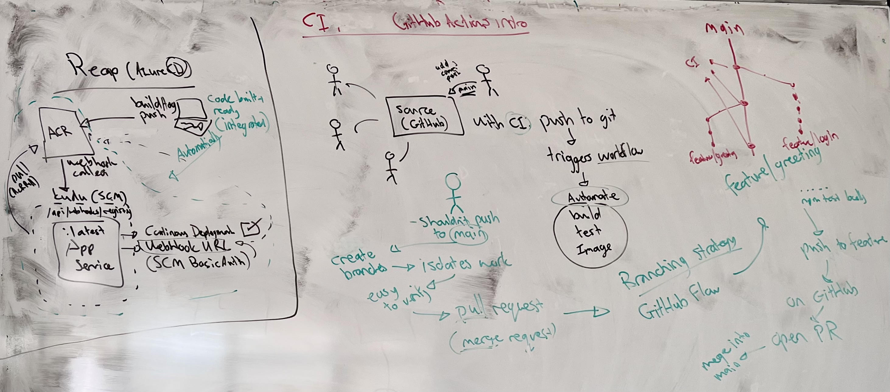

The left-hand box is last lesson. Everything to the right of it is this one.

## 2. Why `main` needs a gate

Until now the working pattern has been: you, alone, on `main`, pushing whenever something is finished. It works because there is exactly one of you and you know what state the code is in.

The reality of a codebase is many developers touching it at once - different team members, different teams, sometimes different departments. If everyone pushes straight to `main`, `main` becomes whatever the most recent person happened to save. And now that a push to `main` triggers a deployment, that is not just untidy, it is the thing that reaches your users.

So `main` has a job: **it is the stable, deployable snapshot of the application.** At any moment, the code on `main` should be code you would be willing to ship, because the automation is going to ship it whether you are willing or not.

**Continuous integration (CI)** *[the practice of merging everyone's work into the shared branch frequently, with an automated build-and-test run on every change to catch breakage as it arrives rather than at the end]* is how that promise gets kept. The automation runs the checks that a human would otherwise have to remember to run, on every single change, without being asked.

> CD deploys whatever is on `main`. CI decides what is allowed onto `main`.

## 3. What a workflow is made of

GitHub's implementation of this is **GitHub Actions**, and it comes with its own vocabulary.

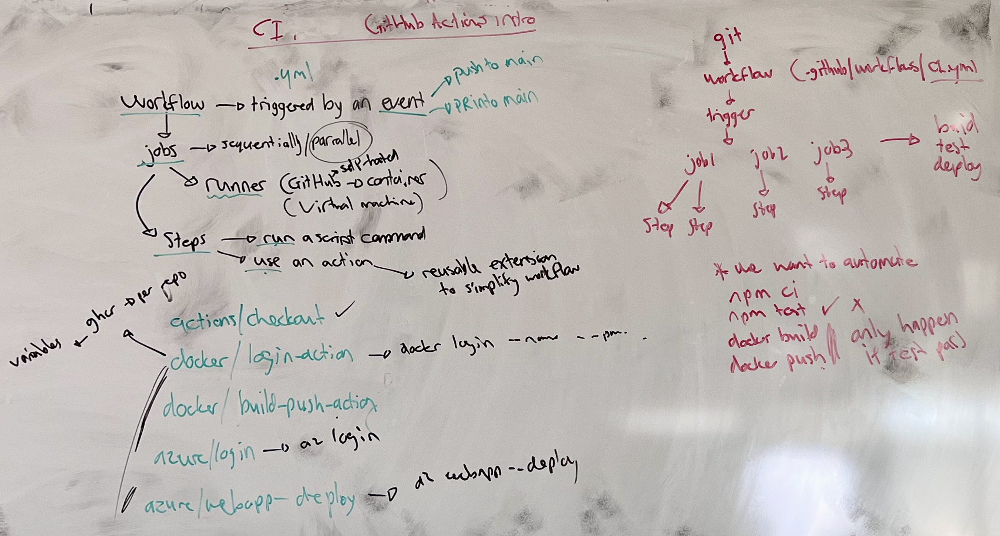

A **workflow** is a YAML file in your repository, at `.github/workflows/`. That path is not a convention you could rename - it is where GitHub looks. The file is version-controlled like everything else, which means your pipeline arrives in the repository the same way your code does: in a commit.

A workflow is triggered by an **event**. A push to a branch is an event. A pull request opened against a branch is an event. So is a schedule, or a manual click. The event is what the `on:` key describes.

A workflow contains one or more **jobs**, and each job runs on a **runner** *[a fresh virtual machine that GitHub starts up for you, runs your job on, and then throws away]*. Jobs run in parallel by default; you can make one wait for another when it needs to. GitHub provides the runners we will use, but you can also register your own hardware as a self-hosted runner if you need to.

A job is a list of **steps**, and a step does one of exactly two things:

- `run:` executes a shell command on the runner, the same way you would type it in your own terminal.
- `uses:` pulls in an **action** *[a reusable, packaged piece of workflow that somebody else has already written and published, so you configure it rather than script it]*.

`actions/checkout` is the one you will use in every workflow you ever write. `docker/login-action`, `docker/build-push-action`, `azure/login` and `azure/webapp-deploy` are the ones this module is heading towards - each of them wrapping a command you have already run by hand.

When you open the Actions tab on a repository with no workflows, GitHub offers a gallery of starter templates. They are worth reading later; we wrote the file by hand instead, because the point was to know what each line does. Two things make that less painful: install the **GitHub Actions** extension in VS Code, which validates the schema as you type, and remember that YAML takes indentation literally.

## 4. Stage 1 - make something run

The first workflow does nothing useful on purpose. It exists to answer one question: what does it take to get GitHub to run *anything*?

`.github/workflows/CI.yml`:

```yaml
# Name of the workflow
name: CI

# Trigger
on:
    push:
        branches: [main]

jobs:
    # Our single job
    say-hello:
        # Configuring the runner
        runs-on: ubuntu-latest
        # Our simple step
        steps:
            - name: Say hello
              run: echo "Hello world"
```

Four things are being declared. `name` is what shows in the Actions tab. `on` says a push to `main` and nothing else. `runs-on: ubuntu-latest` asks GitHub for a current Ubuntu runner. And `steps` is a list - which is why every step starts with `- `, and why `run:` lines up under `name:` rather than under the dash.

Commit that file and push it. Open the **Actions** tab:

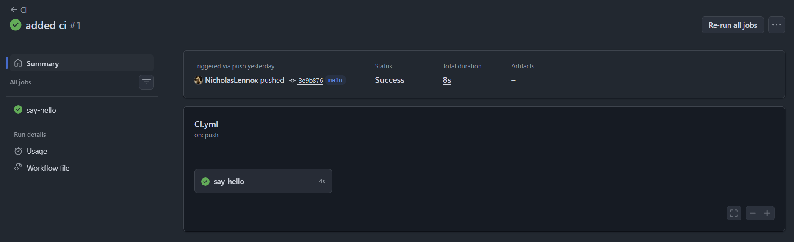

The run is named after the commit message, not the workflow. Click into it and expand the job:

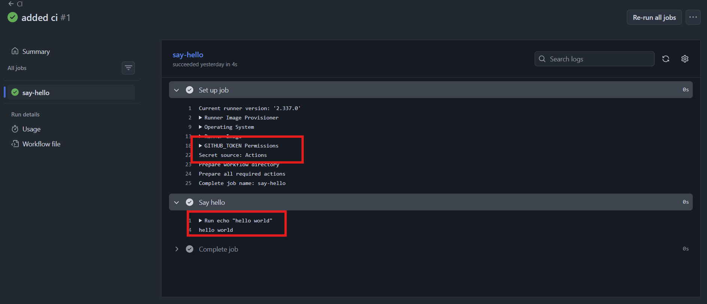

Two boxes worth reading. At the bottom, under the `Say hello` step, is the output of the `echo` - proof that a machine somewhere ran your command.

Above it, in **Set up job**, is everything GitHub did before your step: it names the runner version, the runner image, the operating system, and then `GITHUB_TOKEN Permissions` with `Secret source: Actions`. GitHub mints a token for each run, scoped to this repository, and expires it when the run ends. That is what lets a step talk back to the repository without you storing a credential anywhere - and it is the first of a set of values GitHub injects into every run. They all carry the `GITHUB_` prefix, and the [default environment variables reference](https://docs.github.com/en/actions/reference/workflows-and-actions/variables#default-environment-variables) lists the full set. We will come back to it when we need a value from it.

> The pipeline is a file in your repository. It gets there the same way every other change does - by being pushed.

## 5. Stage 2 - a step that can fail

A workflow that prints a greeting cannot tell you anything. To be a check, it has to be able to go red.

The app in `class-demo/` is simple on purpose. One endpoint, and two tests against it:

```javascript
app.get("/health", (req, res) => {
  res.status(200).json({ status: "ok" });
});
```

```javascript
describe("GET /health", () => {
  it("responds with 200", async () => {
    const response = await request(app).get("/health");

    expect(response.status).toBe(200);
  });

  it("responds with a status of ok", async () => {
    const response = await request(app).get("/health");

    expect(response.body).toEqual({ status: "ok" });
  });
});
```

Locally you verify a change by running two commands: `npm ci` *[installs exactly the versions pinned in `package-lock.json`, rather than resolving fresh ones the way `npm install` does]* and `npm test`. So that is what the job does:

```yaml
# Name of workflow
name: CI

# Trigger
on:
    push:
        branches: [main]

jobs:
    test:
        runs-on: ubuntu-latest
        # Replicating what we do locally to verify
        steps:
            # Checkout is pulling the code from github to the runner
            - name: Checkout code
              uses: actions/checkout@v4

            - name: Install dependencies
              run: npm ci

            - name: Run tests
              run: npm test
```

The runner is a blank machine - GitHub does not put your code on it just because the workflow lives in your repository. Nothing is there until something fetches it, and `actions/checkout` is that something. This is also the first `uses:` in the file, so it is worth noticing the difference in shape: `run:` gets a command, `uses:` gets an owner, a repository, and a version tag.

Push a change, and:

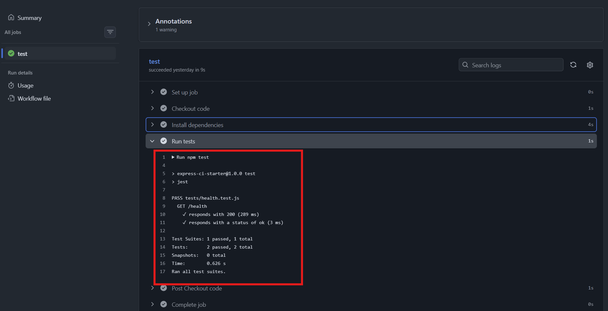

### 5.1 Breaking it on purpose

Change the second test to expect `'okay'` where the endpoint returns `'ok'`, confirm it fails locally, and push it to `main`.

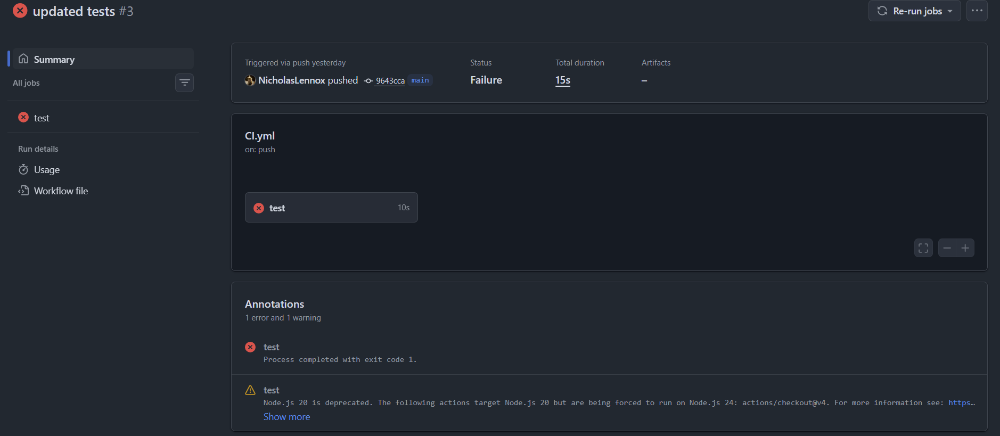

Red, in 15 seconds, without anyone being asked to look. The Summary page gives you the shape of the failure - which job, how long, and an **Annotations** panel pulling the important lines out of the log. Here the error annotation reads `Process completed with exit code 1`.

Jest exits with a non-zero status when a test fails. The runner treats a non-zero exit from a step as a failed step, a failed step fails the job, and a failed job fails the run. There is no clever integration between GitHub and Jest - GitHub is watching an exit code, exactly as your shell does.

Expand the failing step to see why:

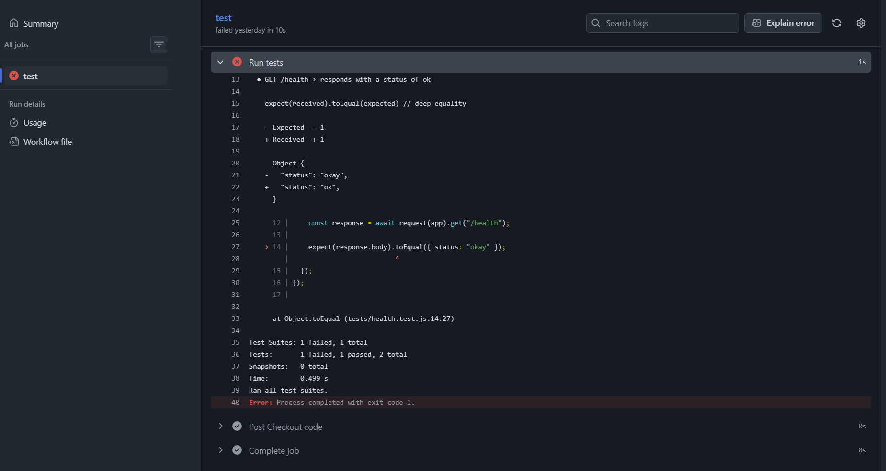

The log is the same output you would have got locally: the diff between expected and received, the offending line with a caret under it, the file and line number `tests/health.test.js:14:27`, the summary counts, and the `exit code 1` at the end. Nothing has been hidden or summarised - a runner log is the terminal output of a machine you cannot log into, and it is the first place to look every time.

For failures that are less obvious than a two-letter typo, there is an **Explain error** button on the log view, which hands the log, the job definition and the referenced files to Copilot:

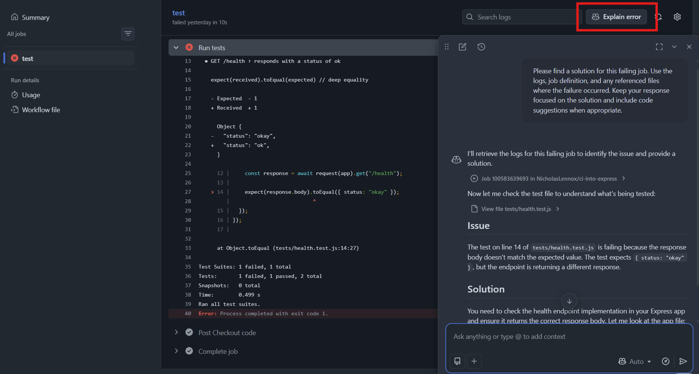

> A step fails when its command exits non-zero.

### 5.2 Which version of Node is this running on?

The failed run also carried a warning annotation, and it opens a question the workflow has been quietly dodging:

```
Node.js 20 is deprecated. The following actions target Node.js 20 but are being
forced to run on Node.js 24: actions/checkout@v4
```

That warning is specifically about the runtime an *action* is written against - `actions/checkout@v4` expects Node 20, GitHub is retiring Node 20 for actions, so it runs it on Node 24 instead and warns you.

But it points at something about your own code too. Nowhere in the file did we say what Node version to test under. The runner ships with a default, and that default moves as GitHub updates its images. Your app is built against a specific version - the `Dockerfile` in the demo says `node:22-alpine`. If the runner tests on something else, a green pipeline is not evidence about the environment you actually deploy to.

The fix is an action that installs the version you want before the tests run:

```yaml
- name: Use Node 22
  uses: actions/setup-node@v4
  with:
      node-version: 22
```

> You can add this to your workflow job before the `npm ci` step.

`with:` is how you pass configuration into an action - the equivalent of the flags you would give a command. Each action documents its own inputs; `node-version` is one of `setup-node`'s. See the [`with` syntax reference](https://docs.github.com/en/actions/reference/workflows-and-actions/workflow-syntax#jobsjob_idstepswith).

## 6. The gate is in the wrong place

Fix the test, push again, and the run goes green. But look at what just happened over those two pushes.

The broken code was on `main`. The pipeline ran, correctly, and told us - after the fact - that `main` was broken. For a stretch of minutes, the branch that section 2 called the stable, deployable snapshot was neither, and the CD pipeline from last lesson would have been perfectly happy to build and deploy it.

## 7. Stage 3 - moving the gate to the pull request

The change to the workflow is four lines:

```yaml
on:
    pull_request:
        branches: [main]
```

The workflow now runs when a pull request is opened against `main`, and not on a push. Push that change to `main` directly - the file has to be on the branch before it can guard it - and that is the last thing we push to `main` by hand.

### 7.1 GitHub Flow

The trigger only makes sense alongside a way of working that produces pull requests. The common one is **GitHub Flow**: a lightweight, branch-based cycle where nobody commits to `main`.

1. Branch off `main` for the thing you are working on.
2. Commit to that branch.
3. Open a **pull request** *[a request to merge one branch into another, which stays open as a place to discuss the change - GitLab calls the same thing a merge request]*.
4. Address comments and checks; push more commits to the same branch.
5. Merge.
6. Delete the branch.

The branch is what makes this work. It isolates your half-finished work from everyone else's, it gives the change a name, and it gives the pull request something to compare against.

### 7.2 The branch

Branch names are conventionally prefixed by what they are for - `feature/`, `fix/`, `chore/`. We took `feature/hello`, and made a real change this time: the endpoint returns `okay` and both the endpoint and its test agree on it.

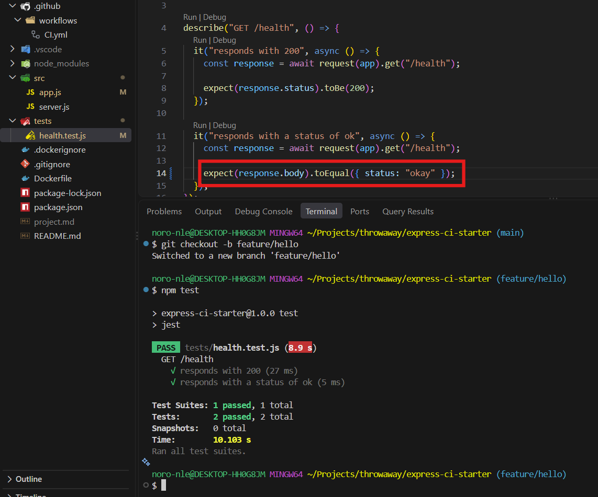

Note the terminal at the bottom: `npm test`, locally, before anything is pushed. CI is a safety net, not a replacement for running your own tests - a red pipeline is a slow, public way to find out something you could have found out in ten seconds.

Commit, and push the branch with `-u` so it starts tracking a remote branch of the same name:

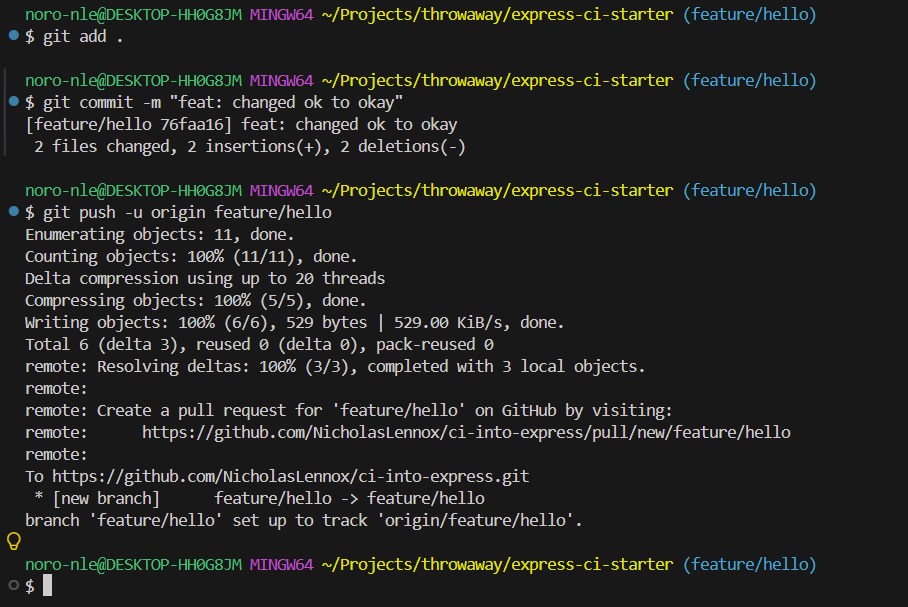

Read the last few lines of that push. Git prints a URL for opening a pull request from the branch you just pushed. You can use it, or go to the repository's **Pull requests** tab and open one there.

### 7.3 The pull request

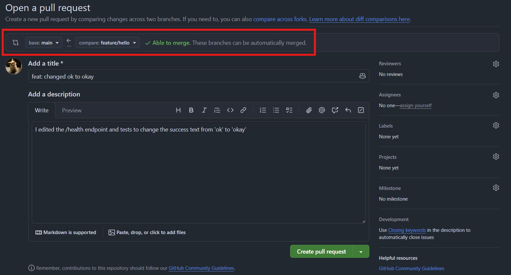

The boxed row at the top is the part to read before anything else: **base: `main` ← compare: `feature/hello`**, and a note that the branches can be automatically merged. That is the first check, and it has nothing to do with Actions - GitHub is telling you the two branches have not diverged in a way that needs a human to resolve.

Give it a title and a description that says what changed and why, and create it. Then the second check runs, because this is the event the workflow is now listening for:

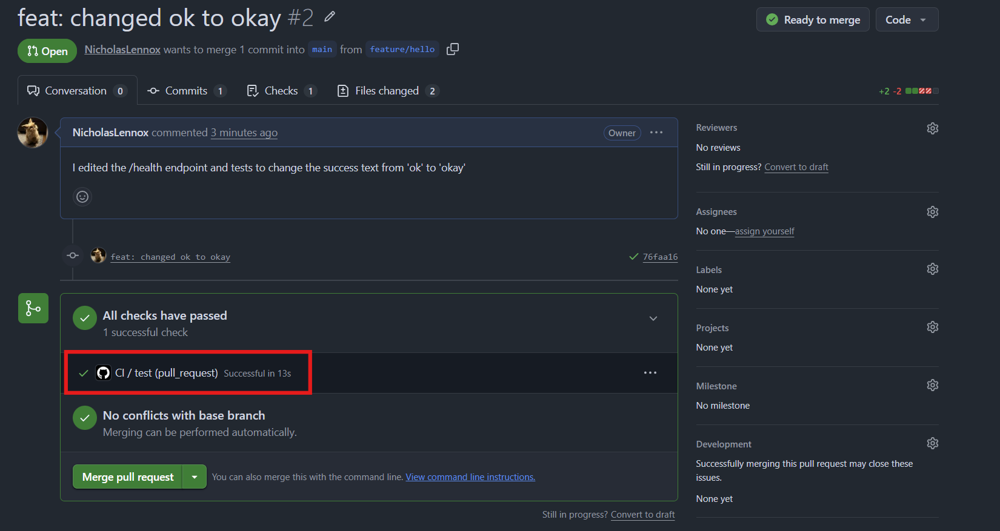

`CI / test (pull_request)` - the workflow, the job, and the event that triggered it. Green, alongside **No conflicts with base branch**, and the **Merge pull request** button is available.

Had a test failed, that row would be red and the button would tell you so. The failure is attached to a change that is *not yet* on `main`, and the change stays where it is until somebody deals with it.

A pull request is not a moment, it is a period. It can stay open as long as it needs to. Teammates comment on the diff, you push more commits to the same branch, and every push re-runs the workflow against the new state. The back-and-forth continues until the reviewers are happy and the checks are green.

### 7.4 Closing the cycle

Merge it:

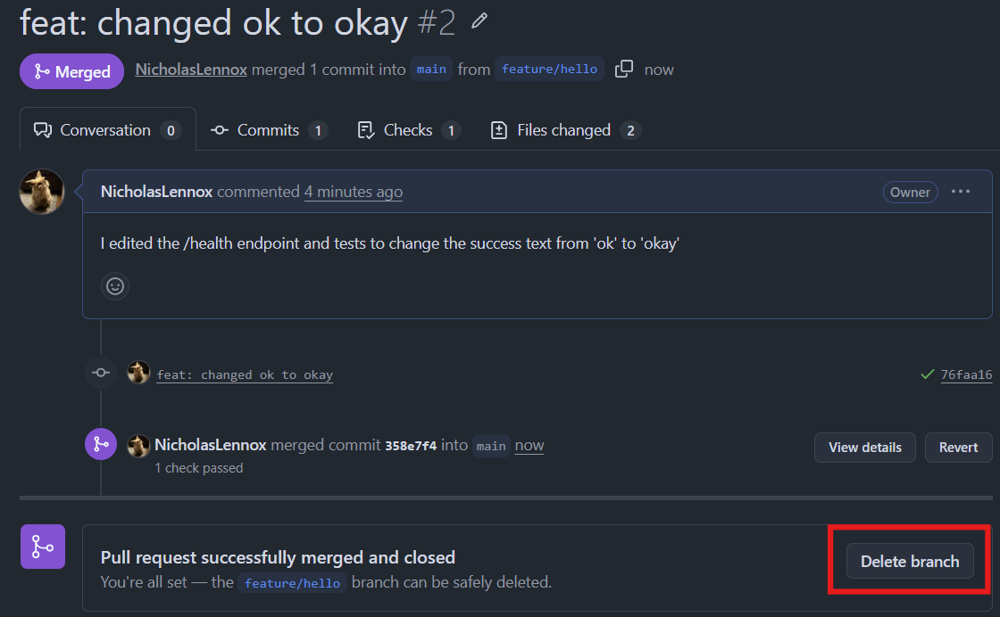

`main` has moved, one check passed, and GitHub offers to delete the branch it no longer needs. Take it - the branch has served its purpose and leaving it behind is how repositories accumulate hundreds of dead branches.

That deletes the remote branch. Your local one is still there, and still checked out, so finish up locally:

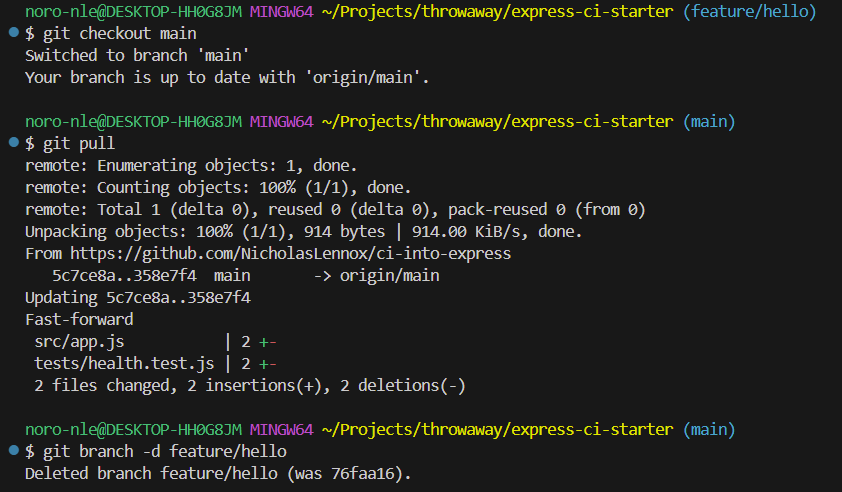

`git checkout main`, `git pull` to bring down the merge commit, and `git branch -d feature/hello`. The lowercase `-d` refuses to delete a branch whose commits have not been merged anywhere, so it doubles as a check that you are deleting the right thing.

That is one complete cycle of a feature, and it is the loop that development actually runs on.

> A check on `main` reports the damage. A check on a pull request prevents it.

## 8. Command reference

One feature, start to finish:

```bash
git checkout -b feature/hello        # branch off main
# ... make the change, then:
npm test                             # verify locally first
git add .
git commit -m "feat: changed ok to okay"
git push -u origin feature/hello     # -u sets the branch to track origin
# ... open the PR on GitHub, wait for the check, merge, delete the remote branch
git checkout main
git pull                             # bring down the merge
git branch -d feature/hello          # safe delete: refuses if unmerged
```

And the workflow file in the state the lesson ended in:

```yaml
# Name of workflow
name: CI

# Trigger
on:
    pull_request:
        branches: [main]

jobs:
    test:
        runs-on: ubuntu-latest
        # Replicating what we do locally to verify
        steps:
            # Checkout is pulling the code from github to the runner
            - name: Checkout code
              uses: actions/checkout@v4

            - name: Install dependencies
              run: npm ci

            - name: Run tests
              run: npm test
```

## 9. Sources

1. GitHub Docs, *Understanding GitHub Actions* - [docs.github.com/en/actions/get-started/understand-github-actions](https://docs.github.com/en/actions/get-started/understand-github-actions)
2. GitHub Docs, *GitHub-hosted runners* - [docs.github.com/en/actions/concepts/runners/github-hosted-runners](https://docs.github.com/en/actions/concepts/runners/github-hosted-runners)
3. GitHub Docs, *Variables reference - default environment variables* - [docs.github.com/en/actions/reference/workflows-and-actions/variables#default-environment-variables](https://docs.github.com/en/actions/reference/workflows-and-actions/variables#default-environment-variables)
4. GitHub Docs, *Workflow syntax - `jobs.<job_id>.steps[*].with`* - [docs.github.com/en/actions/reference/workflows-and-actions/workflow-syntax#jobsjob_idstepswith](https://docs.github.com/en/actions/reference/workflows-and-actions/workflow-syntax#jobsjob_idstepswith)
5. GitHub Docs, *GitHub flow* - [docs.github.com/en/get-started/using-github/github-flow](https://docs.github.com/en/get-started/using-github/github-flow)
