# Building and Pushing an Image from the Pipeline

> Last lesson the pipeline could tell us whether the code was good. It could not produce anything. This one adds a second job that builds the Docker image and pushes it to a registry, which means the manual `docker build`, `docker tag`, `docker push` cycle from module 2 stops being something a person does. The central failure is an image name the registry refuses, and it comes from a value GitHub hands you. Where a word might be new, a plain-English version follows it in *[brackets]*.

The finished repository: [github.com/NicholasLennox/ci-with-docker](https://github.com/NicholasLennox/ci-with-docker)

## 1. Where we left off

[Continuous Integration with GitHub Actions](../03-intro-to-CI/lecture.md) ended with a workflow that checks out the code, installs dependencies and runs the tests. It answers one question — did this change break anything — and then stops.

Meanwhile, every image we have put in a registry we put there by hand. In [module 2](../../module-2/03-azure-container-registry/lecture.md) we built, tagged and pushed to Docker Hub and to ACR from a laptop, and in [lesson 1 of this module](../01-intro-to-automation/lecture.md) we automated everything *after* the registry: a push fires a webhook, the App Service pulls and restarts. The gap is in the middle. Something still has to get the image into the registry.

One change to `.github/workflows/CI.yml` before starting: the trigger is back on `push` to `main` rather than `pull_request`, for the reason the last lesson closed on — while the pipeline is the thing being built, the branch stays open and you push straight to it.

```yaml
# Trigger
on:
    push:
        branches: [main]
```

## 2. Making one job wait for another

Building an image is only worth doing if the tests passed, so it belongs in a second job rather than three more steps on the end of the first one.

Added to `.github/workflows/CI.yml` at the same indentation as the `test` job, and deliberately doing nothing yet:

```yaml
    build-and-push:
        # This pauses the job until test passes
        needs: test
        runs-on: ubuntu-latest
        steps:
            - name: Checkout code
              uses: actions/checkout@v4

            - name: Show what we have
              run: ls -la
```

Without `needs`, jobs in a workflow run in parallel — they are independent by default, and `needs` is what introduces an order.

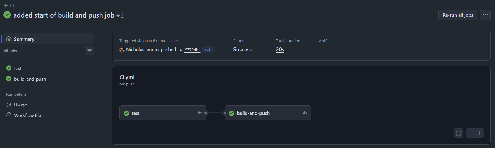

The summary draws the relationship. Two boxes, an arrow, and durations on each.

### 2.1 What a failed dependency looks like

Then we broke a test locally and pushed, to see what `needs` does when the thing it waits for does not arrive:

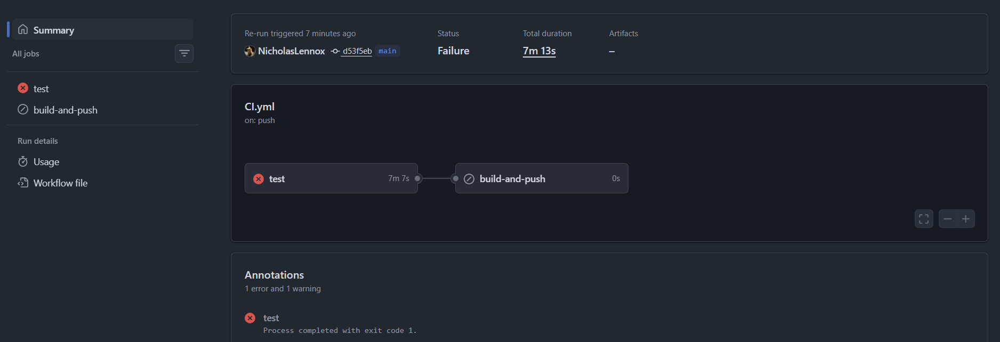

`test` is red with `Process completed with exit code 1`. `build-and-push` carries a different icon from either red or green — it is **skipped**. No runner was ever allocated for it, nothing ran, and it did not fail.

That distinction matters when reading a run at a glance. A red job is a thing you have to go and look at. A skipped job is usually a consequence of a red one further up.

The checkout step is in this job too, and it is not a copy-paste error. **Each job gets its own runner**, freshly created, with nothing on it. The second job knows nothing about the first one's disk.

> Each job starts on a machine that has never seen your code.

## 3. Assembling the push

With the ordering proved, the stub step comes out and the real work goes in. Three separate things arrive with it.

### 3.1 Permission to write packages

```yaml
        # The default GITHUB_TOKEN is read-only, so grant it push access to ghcr
        permissions:
          packages: write
```

This sits on the job, above `runs-on`. Last lesson we saw `GITHUB_TOKEN Permissions` scroll past in the **Set up job** log without needing to care what it said. Now we care: the token a run is given is read-only by default, and pushing a package is a write. `permissions` is where that is widened, and it applies to the job it is written on.

### 3.2 The values Actions hands you

Four values in the steps below were configured by nobody:

| Value | What it holds |
|---|---|
| `github.actor` | the username that triggered the run |
| `github.sha` | the commit SHA being built |
| `github.repository` | `Owner/repo`, as GitHub spells it |
| `secrets.GITHUB_TOKEN` | a token minted for this run and discarded when it ends |

These come from the same set of run-time values the last lesson pointed at in the [variables reference](https://docs.github.com/en/actions/reference/workflows-and-actions/variables#default-environment-variables). Nothing is stored, nothing is configured, and the token cannot outlive the run.

### 3.3 Two tags, one build

```yaml
                  tags: |
                    ghcr.io/${{ github.repository }}:${{ github.sha }}
                    ghcr.io/${{ github.repository }}:latest
```

The `|` makes `tags:` a list, and a list of names costs one build — the same "one image, several names" relationship established in module 2, where `docker tag` was shown to add an alias rather than copy anything.

The two names answer different questions. The commit SHA answers *which code is this*, and it never moves. `latest` answers *what is current*, and it moves on every push. Anything watching a registry for a change is watching a moving tag — the ACR webhook from lesson 1 was scoped to `greeting-api:latest` for exactly this reason — so neither is a substitute for the other.

The job, assembled:

```yaml
    build-and-push:
        # Waits for the test job to pass before starting
        needs: test

        # The default GITHUB_TOKEN is read-only, so grant it push access to ghcr
        permissions:
          packages: write

        runs-on: ubuntu-latest
        steps:
            # Each job runs on a fresh runner, so we need to checkout again
            - name: Checkout code
              uses: actions/checkout@v4

            - name: Log in to GHCR
              uses: docker/login-action@v4
              with:
                  registry: ghcr.io
                  username: ${{ github.actor }}
                  password: ${{ secrets.GITHUB_TOKEN }}

            - name: Build and push
              uses: docker/build-push-action@v7
              with:
                  # Build context: the repo root, where the Dockerfile lives
                  context: .
                  push: true
                  tags: |
                    ghcr.io/${{ github.repository }}:${{ github.sha }}
                    ghcr.io/${{ github.repository }}:latest
```

Two actions doing what we used to type. `docker/login-action` is `docker login` against a named registry. `docker/build-push-action` is `docker build` and `docker push`, with `push: true` being the difference between building and publishing.

## 4. The name the registry refused

That run failed.

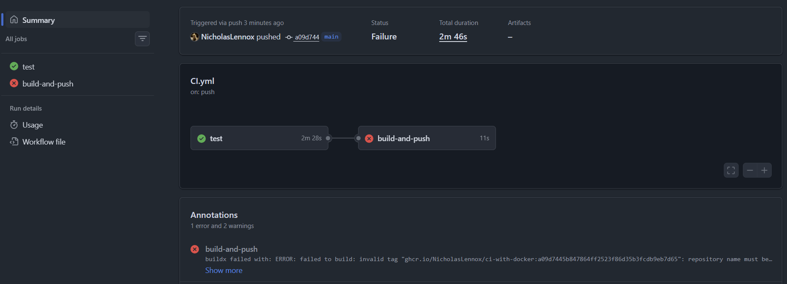

The `test` job is green and `build-and-push` is red — the first three steps of it succeeded, including the GHCR login, and the build step is where it stopped:

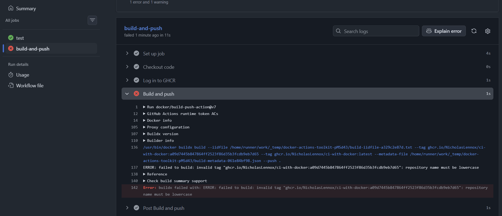

The log shows the full `docker buildx build` command the action assembled, with `--tag ghcr.io/NicholasLennox/ci-with-docker:a09d7445...`, and then:

```
ERROR: failed to build: invalid tag "ghcr.io/NicholasLennox/ci-with-docker:a09d7445b847864ff2523f86d35b3fcdb9eb7d65": repository name must be lowercase
```

`github.repository` gives back the repository exactly as GitHub spells it, and GitHub allows capital letters in a repository name. Docker does not allow them in an image name. Note where this failed: the login had already succeeded, and the build never started. Nothing reached the registry — the Docker CLI rejected the name before there was anything to send.

### 4.1 Asking the built-in agent, and checking its answer

The **Explain error** button from last lesson is on this log too, so we used it on a failure with a real cause rather than a typo in a test:

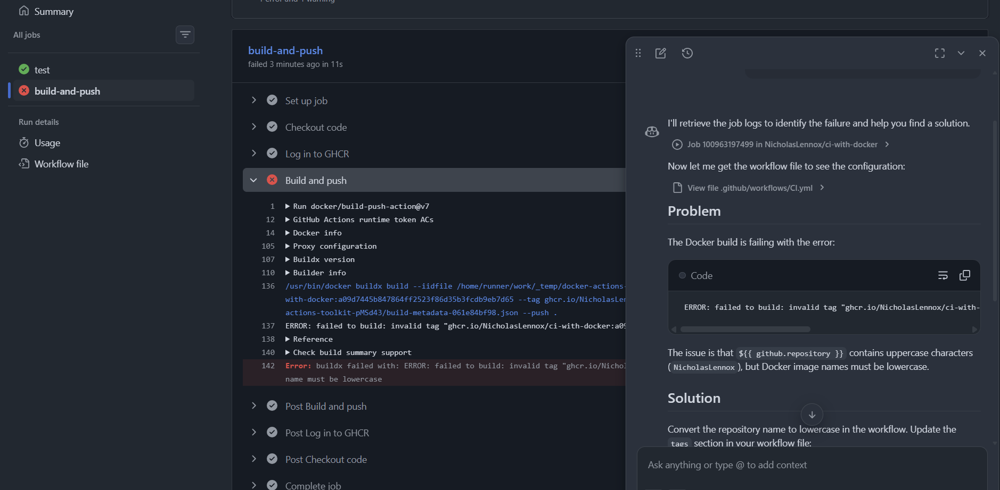

It read the logs, opened the workflow file, and diagnosed it correctly: `${{ github.repository }}` contains uppercase characters, and Docker image names must be lowercase.

Then it proposed this fix:

```yaml
tags: ghcr.io/${{ github.repository | lower }}   # not valid
```

That is not GitHub Actions syntax. There is no pipe operator in expressions, and there is no `lower`. It looks like a Jinja or Liquid template filter, which is a different templating language that happens to use `{{ }}` as well. The workflow would not have parsed.

A correct diagnosis and an invented fix, in the same answer, from a tool built into the product it is wrong about. Read both parts.

### 4.2 Why there is no neat fix

The reason the agent had to invent something is that the thing it wanted does not exist. Expressions are not a programming language — they are substitution. The complete function list is `contains`, `startsWith`, `endsWith`, `format`, `join`, `toJSON`, `fromJSON`, `hashFiles` and `case`, plus `success()`, `failure()`, `always()` and `cancelled()`. Nothing lowercases a string.

So the work has to move somewhere that has a shell, or stop being derived at all. We took the second, which is one line — a job-level `env` block on `build-and-push`, above `steps`:

```yaml
        # hardcoded in lowercase, because github.repository keeps the original casing
        env:
          OWNER: nicholaslennox
```

and then `ghcr.io/${{ env.OWNER }}/${{ github.event.repository.name }}` for the tags — the owner stated, the repository name taken from the context, where it is already lowercase.

The other route, for a repository you do not own or one that will be forked, is a `run` step that lowercases it in bash and hands the result on:

```yaml
            - name: Lowercase the image name
              run: echo "IMAGE=ghcr.io/${GITHUB_REPOSITORY,,}" >> $GITHUB_ENV
```

That works because a `run` step is a shell, and a shell can do things expressions cannot. It also puts the two surfaces side by side: `${{ github.repository }}` is a **context expression**, substituted into the file before the step runs, and the only form that works inside `with:`. `$GITHUB_REPOSITORY` is an **environment variable** that exists only inside the shell of a `run` step. Same value, two places, and they are not interchangeable.

> An expression is a substitution, not a language.

## 5. Where the image went

With a lowercase name the run went green:

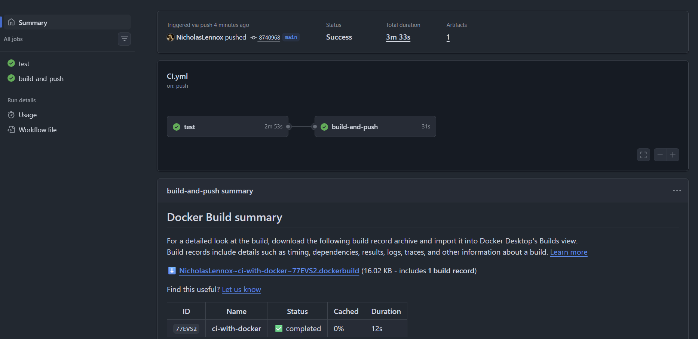

and the tag it actually used is in the log:

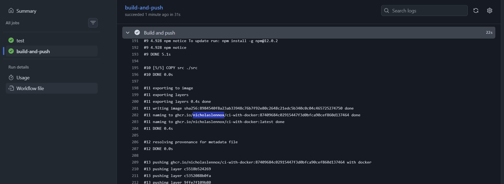

The image is now in **GHCR (GitHub Container Registry)** — GitHub's own registry, at `ghcr.io`. It is part of **GitHub Packages** *[GitHub's service for hosting the things a repository produces, rather than its source: container images, npm packages, Maven artifacts and so on, kept alongside the code and sharing its permissions]*. That is why the login in section 3 needed no account setup: the registry is part of the platform the code already lives on, and `GITHUB_TOKEN` is already an identity there. A fuller description is in [the introduction to GitHub Packages](https://docs.github.com/en/packages/learn-github-packages/introduction-to-github-packages).

It appears on the repository page, in the sidebar:

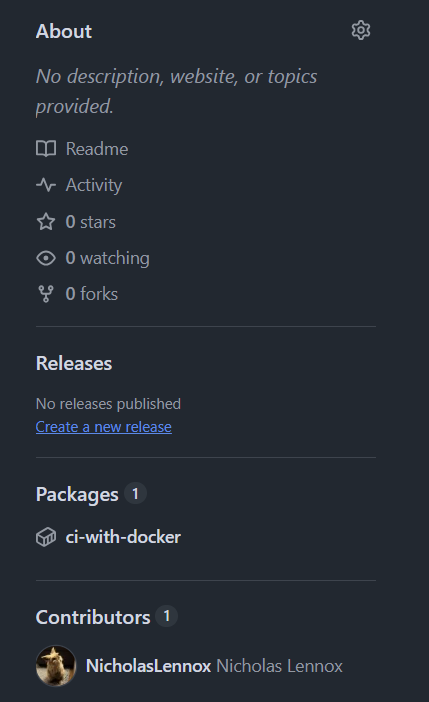

and opening it gives the registry's own view of what we pushed:

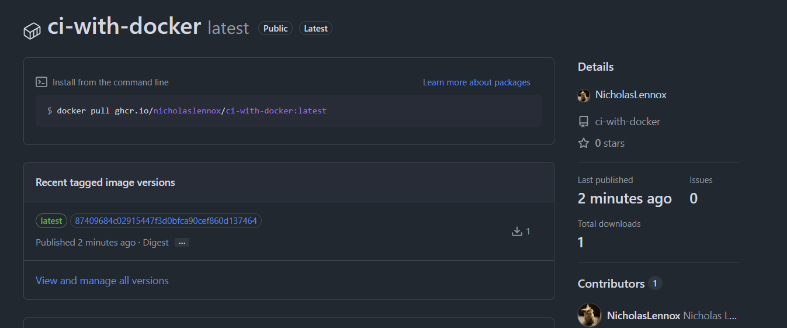

Two things to read here. The **Install from the command line** box shows `docker pull ghcr.io/nicholaslennox/ci-with-docker:latest` — the address, lowercase, in the form module 2 established as *the name is the destination*. And under **Recent tagged image versions**, `latest` and the commit SHA appear against a single published entry, because they are two names on one image.

## 6. Naming the image, not the repository

Deriving the image name from the repository name works, but it is not what usually happens. A repository is often named for the project or the exercise; the image is named for the thing it runs. Those are frequently different, and the second version stopped deriving the name at all — the same job-level `env` block, now holding the whole name:

```yaml
        env:
          IMAGE: nicholaslennox/health-api
```

with the tags reduced to `ghcr.io/${{ env.IMAGE }}:${{ github.sha }}` and `:latest`.

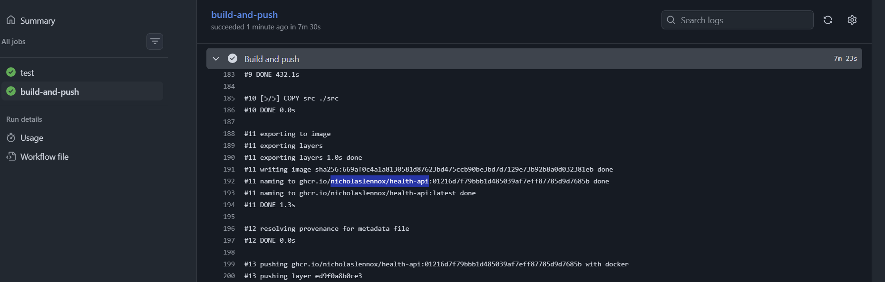

The repository is still `ci-with-docker`. The image is now `health-api`. And the result of having pushed under both names is visible on the repository page:

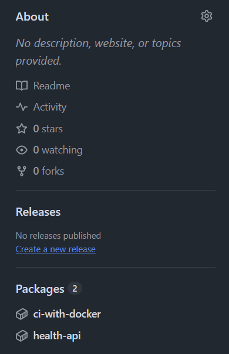

Two packages, `ci-with-docker` and `health-api`, from the same source, the same Dockerfile, the same bytes. The registry did not deduplicate them into one entry with two names, because a name is not a label on an image — it is the address of the **repository** the image is filed under. Push to a second address and you get a second repository, holding its own set of tags.

That is the same distinction from module 2, now with both halves visible: adding a *tag* gives one image another label in the same place, and changing the *name* puts it somewhere else entirely.

> A tag is another label in the same repository. A different name is a different repository.

## 7. A second registry: ACR

GHCR is the short path — the registry is on the platform the pipeline is already running on, and the credential arrived for free. Pushing to Azure Container Registry instead is worth doing for two reasons, and neither of them is that ACR is better.

The first is that the credential stops being free. Nothing hands the runner an Azure identity, so we have to obtain one, store it, and hand it over — which is the first time in this module that a secret has been something we manage.

The second is that lesson 1 already built the other half of this. The webhook, the SCM endpoint and the App Service pull all work from an image in `beddemo`. GHCR is not wired to any of that. Putting the image in ACR is what connects today's pipeline to the deployment we automated a week ago.

### 7.1 The admin credentials

ACR's **admin account** was introduced in module 2 as the quick option: a single username and password built into the registry, disabled by default. **Settings → Access keys**, tick **Admin user**, and it appears — a username, and two passwords:

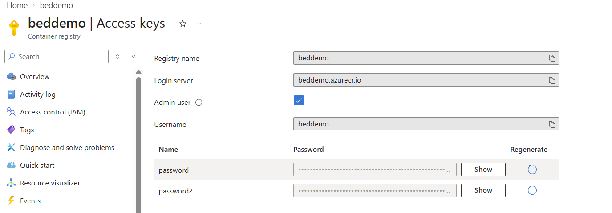

Microsoft's guidance on this is worth keeping in view. The admin account is documented as being for a single user and mainly for testing, and the recommended answer for unattended pushes from a pipeline is a service principal *[a non-human identity in Azure with its own credential, its own expiry and its own roles]*. We are using the admin account because it is one blade and two fields, and the mechanism we are teaching — get a credential, store it, pass it to a login action — is identical either way.

### 7.2 Repository secrets

Those values cannot go in the workflow file. The file is in the repository, and anyone who can read the repository can read it.

**Settings → Secrets and variables → Actions → New repository secret**, twice:

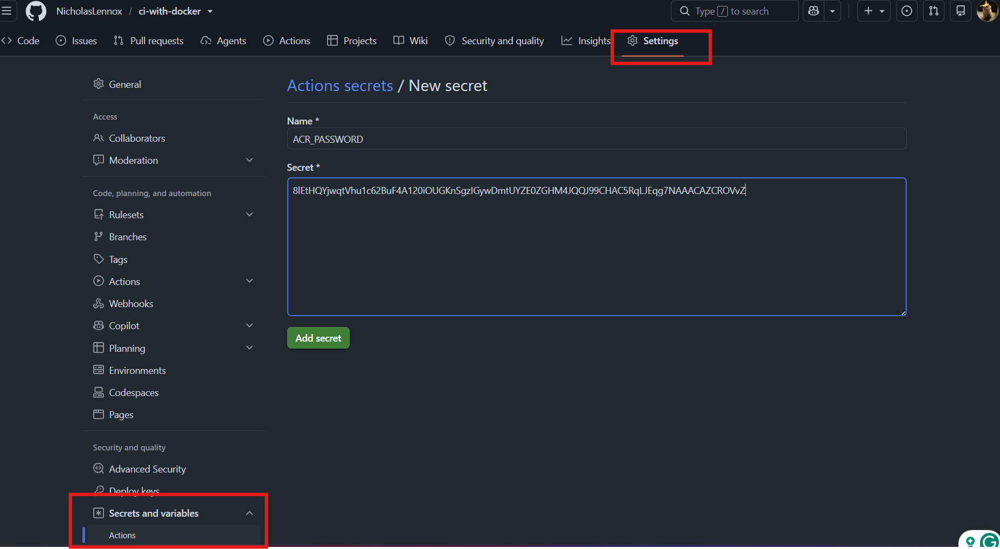

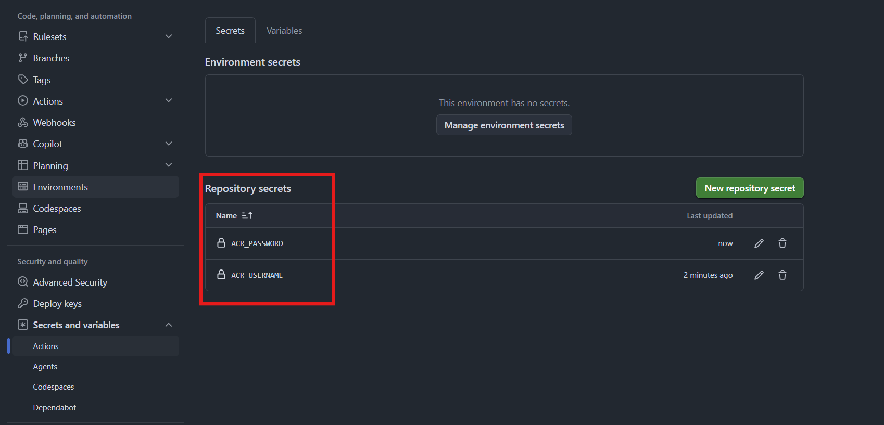

A **secret** *[a value stored encrypted by GitHub, which workflows can use but nobody — including you — can read back afterwards]* is write-only from the outside. The list shows the names and when they were updated, and there is no way to display a value; if you lose it, you replace it.

Reading them in a workflow is the same `secrets.` prefix that `GITHUB_TOKEN` uses, which makes the contrast easy to state: `secrets.GITHUB_TOKEN` was created by the platform, scoped to one repository, and destroyed at the end of the run. `secrets.ACR_USERNAME` and `secrets.ACR_PASSWORD` were created by us and expire when we decide they do.

### 7.3 The second job

```yaml
    push-to-acr:
      needs: test
      runs-on: ubuntu-latest
      steps:
          - name: Checkout code
            uses: actions/checkout@v4

          - name: Log in to ACR
            uses: docker/login-action@v4
            with:
                # Need to point to our ACR
                registry: beddemo.azurecr.io
                # Admin creds are saved as secrets in the repo
                username: ${{ secrets.ACR_USERNAME }}
                password: ${{ secrets.ACR_PASSWORD }}

          - name: Build and push
            uses: docker/build-push-action@v7
            with:
                context: .
                push: true
                tags: |
                  beddemo.azurecr.io/health-api:${{ github.sha }}
                  beddemo.azurecr.io/health-api:latest
```

The same two actions, in the same order, with three values changed: the registry host, where the credentials come from, and the names on the image. Everything that made this work for GHCR makes it work for ACR.

This is a *second* job rather than two more steps on the GHCR one, and that was a teaching choice — having both side by side makes the differences readable. Real pipelines would more often log in to both registries in one job and pass all four tags to a single build step, which builds the image once instead of twice.

It declares `needs: test`, not `needs: build-and-push`. Both push jobs wait for the tests and neither waits for the other:

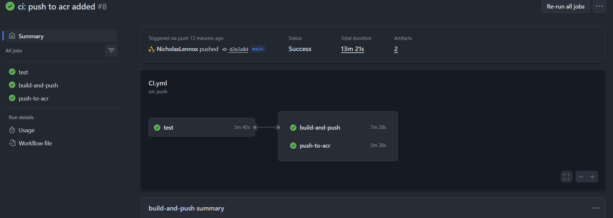

The graph shows it directly — one box on the left, two stacked on the right, starting together. `needs` builds a dependency graph, not a queue.

### 7.4 Reading what the action did

`docker/build-push-action` writes a summary onto the run page, and it lists the inputs it was given:

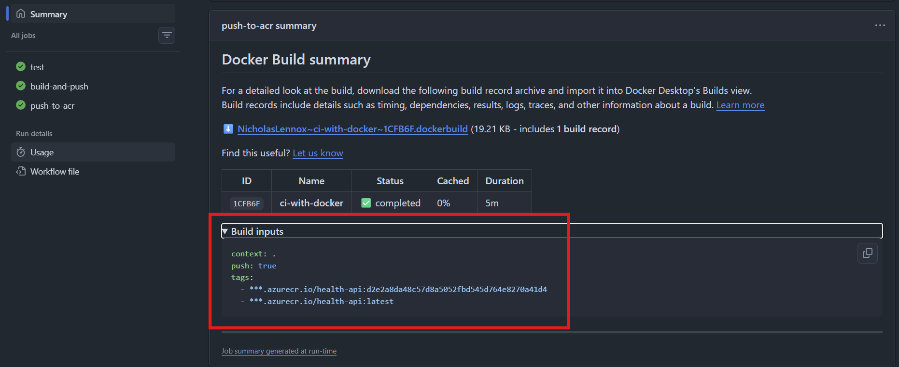

`context: .`, `push: true`, and the two tags — which is the fastest way to confirm what a templated `tags:` block actually expanded to, without reading the whole log.

The registry host is printed as `***.azurecr.io`. GitHub masks secret values wherever they appear in log output, and it does so by matching the literal string. An ACR's admin username is the registry's own name, so `beddemo` is stored in `ACR_USERNAME` — and every other occurrence of `beddemo` gets redacted along with it, including the part of the hostname that was never a secret.

On the Azure side, the registry now holds a second repository:

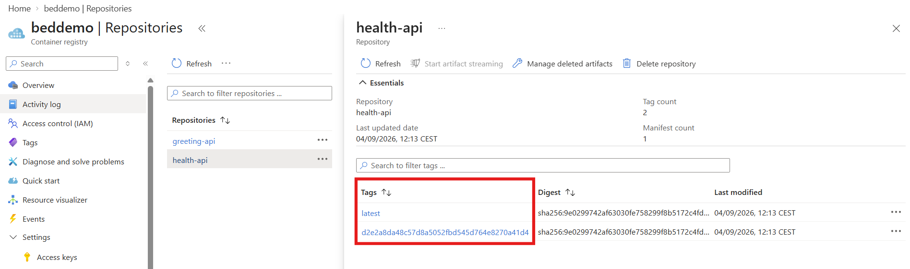

`greeting-api` from module 2, and `health-api` from the pipeline. Opening it: **Tag count 2**, **Manifest count 1** *[a manifest is the registry's record of one image — which layers it is made of, for which platform; the digest is its hash]*. Two tags, `latest` and `d2e2a8da48c5...`, both pointing at the digest `sha256:9e0299742af6...`. One image, two names, stated by the registry itself.

Every merge from the last lesson's pull request cycle now leaves an image behind, named after the commit it was built from — so a developer can go back and find exactly what was built from exactly which code.

> `latest` tells you what is current. The SHA tag tells you what it was built from.

## 8. The finished workflow

```yaml
# Name of workflow
name: CI

# Trigger
on:
    push:
        branches: [main]

jobs:
    test:
        runs-on: ubuntu-latest
        # Replicating what we do locally to verify
        steps:
            # Checkout pulls the repo code onto the runner (jobs start with an empty machine)
            - name: Checkout code
              uses: actions/checkout@v4

            - name: Install dependencies
              run: npm ci

            - name: Run tests
              run: npm test

    build-and-push:
        # Waits for the test job to pass before starting
        needs: test

        # The default GITHUB_TOKEN is read-only, so grant it push access to ghcr
        permissions:
          packages: write

        runs-on: ubuntu-latest

        # The image name, stated in lowercase rather than derived from the repository
        env:
          IMAGE: nicholaslennox/health-api

        steps:
            # Each job runs on a fresh runner, so we need to checkout again
            - name: Checkout code
              uses: actions/checkout@v4

            - name: Log in to GHCR
              uses: docker/login-action@v4
              with:
                  registry: ghcr.io
                  # Both values are provided by Actions on every run
                  username: ${{ github.actor }}
                  password: ${{ secrets.GITHUB_TOKEN }}

            - name: Build and push
              uses: docker/build-push-action@v7
              with:
                  # Build context: the repo root, where the Dockerfile lives
                  context: .
                  push: true
                  # env.IMAGE allows us to use a custom image name
                  tags: |
                    ghcr.io/${{ env.IMAGE }}:${{ github.sha }}
                    ghcr.io/${{ env.IMAGE }}:latest

    push-to-acr:
      needs: test
      runs-on: ubuntu-latest
      steps:
          - name: Checkout code
            uses: actions/checkout@v4

          - name: Log in to ACR
            uses: docker/login-action@v4
            with:
                # Need to point to our ACR
                registry: beddemo.azurecr.io
                # Admin creds are saved as secrets in the repo
                username: ${{ secrets.ACR_USERNAME }}
                password: ${{ secrets.ACR_PASSWORD }}

          - name: Build and push
            uses: docker/build-push-action@v7
            with:
                context: .
                push: true
                tags: |
                  beddemo.azurecr.io/health-api:${{ github.sha }}
                  beddemo.azurecr.io/health-api:latest
```

Nothing here deploys. The pipeline verifies a change and publishes an image, and stops. What happens next is still the lesson 1 webhook, watching `latest` on a repository in `beddemo` and restarting a container when it moves — which is now being fed by a machine instead of by hand.

### 8.1 The recurring mistakes

| Symptom | Usual cause |
|---|---|
| `repository name must be lowercase` | The image name came from `github.repository`, which keeps the owner's capitals |
| The push gets a `403` | The job has no `permissions: packages: write` |
| The second job cannot find your files | It needs its own `actions/checkout`; each job is a new machine |
| Both push jobs run at the same time and you wanted them ordered | The second one declares `needs: test`, not `needs: <the first push job>` |
| A `lower` or `\|` filter in an expression does not parse | Expressions have no pipe operator and no case functions |
| A value that is not secret is printed as `***` | It matches the literal text of a secret — an ACR admin username is the registry name |

## 9. Sources

1. GitHub Docs, *Introduction to GitHub Packages* - [docs.github.com/en/packages/learn-github-packages/introduction-to-github-packages](https://docs.github.com/en/packages/learn-github-packages/introduction-to-github-packages)
2. GitHub Docs, *Publishing and installing a package with GitHub Actions* - [docs.github.com/en/packages/managing-github-packages-using-github-actions-workflows/publishing-and-installing-a-package-with-github-actions](https://docs.github.com/en/packages/managing-github-packages-using-github-actions-workflows/publishing-and-installing-a-package-with-github-actions)
3. GitHub Docs, *Expressions* (the complete function list) - [docs.github.com/en/actions/reference/workflows-and-actions/expressions](https://docs.github.com/en/actions/reference/workflows-and-actions/expressions)
4. GitHub Docs, *Contexts* - [docs.github.com/en/actions/reference/workflows-and-actions/contexts](https://docs.github.com/en/actions/reference/workflows-and-actions/contexts)
5. GitHub Docs, *Workflow syntax for GitHub Actions* (`jobs.<job_id>.needs`, `jobs.<job_id>.permissions`) - [docs.github.com/en/actions/reference/workflows-and-actions/workflow-syntax](https://docs.github.com/en/actions/reference/workflows-and-actions/workflow-syntax)
6. GitHub Docs, *Variables reference - default environment variables* - [docs.github.com/en/actions/reference/workflows-and-actions/variables#default-environment-variables](https://docs.github.com/en/actions/reference/workflows-and-actions/variables#default-environment-variables)
7. GitHub Docs, *Using secrets in GitHub Actions* - [docs.github.com/en/actions/how-tos/write-workflows/choose-what-workflows-do/use-secrets](https://docs.github.com/en/actions/how-tos/write-workflows/choose-what-workflows-do/use-secrets)
8. GitHub Docs, *Workflow commands for GitHub Actions* (the `$GITHUB_ENV` syntax) - [docs.github.com/en/actions/reference/workflows-and-actions/workflow-commands](https://docs.github.com/en/actions/reference/workflows-and-actions/workflow-commands)
9. `docker/login-action` - [github.com/docker/login-action](https://github.com/docker/login-action)
10. `docker/build-push-action` - [github.com/docker/build-push-action](https://github.com/docker/build-push-action)
11. Microsoft Learn, *Azure Container Registry authentication options* - [learn.microsoft.com/en-us/azure/container-registry/container-registry-authentication](https://learn.microsoft.com/en-us/azure/container-registry/container-registry-authentication)
