# Deploying from the Pipeline: `webapps-deploy` and the Publish Profile

> Lesson 1 automated a deployment by letting Azure do the work: the registry raised a webhook and the App Service went and pulled. That only works when the registry is Azure's own. This page takes the other route - the pipeline itself tells App Service what to run - and builds it on the GHCR image from lesson 4. Work through it at your own pace. Where a word might be new, a plain-English version follows it in *[brackets]*.

## 1. Why there is a second way to deploy

In [lesson 1](../01-intro-to-automation/lecture.md) we ticked **Continuous deployment** in the Deployment Center and Azure did the rest: it generated a webhook URL pointing at the App Service's SCM endpoint, handed it to Azure Container Registry, and from then on a push to `greeting-api:latest` made the container restart on the new image.

That path is short because both ends belong to Azure. The registry knows how to call a webhook, the App Service knows how to receive one, and the credential to connect them is generated for you. The cost of that convenience is the assumption underneath it: **the CD toggle exists because the registry is ACR**.

Lesson 4 pushed the same image to two registries, GHCR and ACR.

A pipeline frequently does not run inside the cloud it deploys to - a build on GitHub, GitLab or Jenkins pushing to Azure, AWS or anywhere else. 

When the pipeline is outside, nothing on the platform is watching it, and the deployment has to be something the pipeline **does** rather than something the platform **notices**.

> Azure's continuous deployment toggle is ACR's feature. Deploying from anywhere else is your pipeline's job.

## 2. The starter application

The app is the smallest thing that can demonstrate a deployment carrying configuration with it. `src/app.js`:

```javascript
const express = require("express");

require("dotenv").config();

const app = express();

const ENVIRONMENT = process.env.ENVIRONMENT || "default";

app.get("/health", (req, res) => {
  res.status(200).json({
    status: "ok",
    environment: ENVIRONMENT,
  });
});

module.exports = app;
```

`/health` reports the environment it was given. The fallback is the literal string `"default"`.

The third test in `tests/health.test.js` is the one that matters here:

```javascript
  it("reports the environment it was given", async () => {
    const response = await request(app).get("/health");

    expect(response.body.environment).not.toBe("default");
  });
```

It does not assert a particular environment. It asserts that *somebody supplied one*. That somebody is going to be the GitHub runner in this lesson.

## 3. The pipeline you are starting from

`.github/workflows/ci-cd.yml` is where lesson 4 finished: a `test` job, and a `build-and-push` job that publishes to GHCR under two tags.

```yaml
# Name of workflow
name: CI/CD

# Trigger
on:
    push:
        branches: [main]

# Workflow-level, so the build job and the deploy job cannot disagree about
# which image they mean. Written out in lowercase (for Docker).
env:
  IMAGE: ghcr.io/nicholaslennox/cd-demo-api

jobs:
    test:
        runs-on: ubuntu-latest

        # The tests assert the app reports the environment it was given, and
        # .env never reaches the runner. Without this the app reports "default"
        # and the test fails. Scoped to this job.
        env:
          ENVIRONMENT: test

        steps:
            # Jobs start on an empty machine, so the code has to be fetched
            - name: Checkout code
              uses: actions/checkout@v4

            # Runners ship whatever Node version is current. Pin it to the one
            # the Dockerfile uses, so we test on what we ship.
            - name: Set up Node.js 22
              uses: actions/setup-node@v4
              with:
                node-version: '22'

            - name: Install dependencies
              run: npm ci

            - name: Run tests
              run: npm test

    build-and-push:
        # Only build an image out of code that passed
        needs: test

        # GITHUB_TOKEN is read-only by default, we need to write to our packages to add an image to our registry.
        permissions:
          packages: write

        runs-on: ubuntu-latest

        steps:
            # Each job gets its own fresh runner, so we check out again
            - name: Checkout code
              uses: actions/checkout@v4

            - name: Log in to GHCR
              uses: docker/login-action@v4
              with:
                  registry: ghcr.io
                  # Both values are provided by Actions on every run
                  username: ${{ github.actor }}
                  password: ${{ secrets.GITHUB_TOKEN }}

            - name: Build and push
              uses: docker/build-push-action@v7
              with:
                  # Build context: the repo root, where the Dockerfile lives
                  context: .
                  push: true
                  # One build, two names: the SHA never moves, latest always does
                  tags: |
                    ${{ env.IMAGE }}:${{ github.sha }}
                    ${{ env.IMAGE }}:latest
```

It runs green:

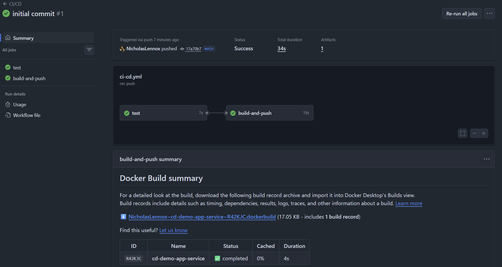

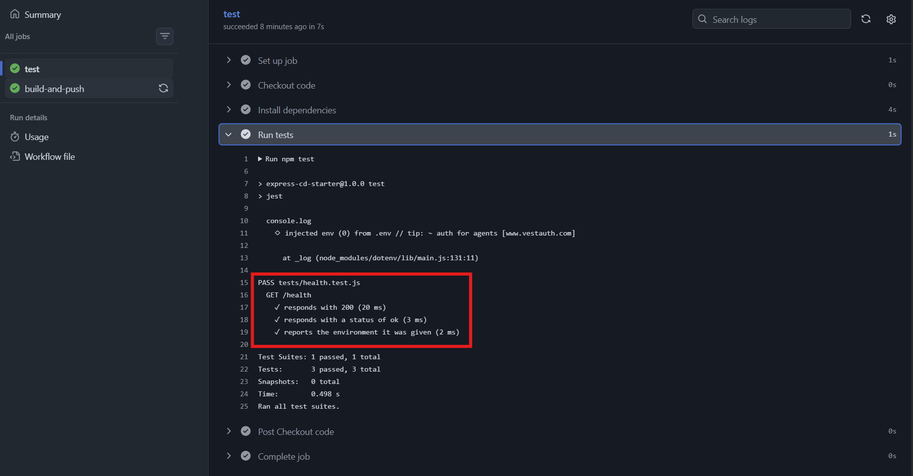

All three tests pass, including the environment one - and since `.env` is git-ignored, the only place that value could have come from is the `env:` block in the workflow.

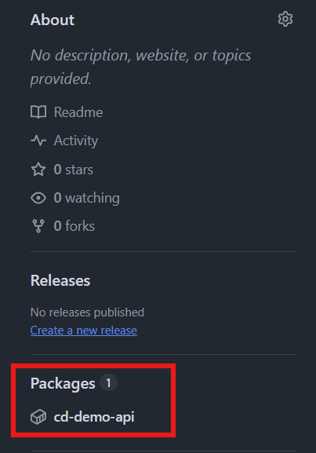

The image is a **package** on the repository. GitHub Packages hosts several kinds of artifacts - npm, Maven, NuGet - and a container registry is one of them, which is why a Docker image appears under the same heading as things that are not images at all.

Three details in that file are worth a closer look before adding to it.

### 3.1 The permission you do not need

```yaml
        permissions:
          packages: write
```

Almost every example you find - in documentation, in blog posts, and in whatever an AI suggests - writes this block as `contents: read` **and** `packages: write`. Ours has only one line, and it works. The reason is a rule that is easy to miss:

`GITHUB_TOKEN` starts each run with a default set of permissions. **The moment you write a `permissions` block, every permission you do not name is set to `none`** - it is a replacement, not an addition. So naming `packages: write` silently removes read access to the repository contents.

That would break `actions/checkout`, except that this repository is **public**, and cloning a public repository needs no permission at all. On a private repository the same file fails at the checkout step, and `contents: read` is exactly what it is missing. The examples are not wrong; they are written for the case that needs it.

**Naming one permission sets every permission you did not name to `none`.** That is the sentence to remember, because the failure it causes appears in a step you did not edit.

### 3.2 Where a variable is visible

`ENVIRONMENT` is doing something new. In lesson 4 we used a workflow-level `env` to hold an image name - a value for the workflow's own benefit. Here it is a value the **application** reads, injected so the tests can pass.

It is also placed deliberately. `env:` can sit at three levels, and each one is visible to less:

```yaml
name: Variable Scopes Example
on: push

env:
  GLOBAL_VAR: "I am available everywhere" # Workflow level

jobs:
  build:
    runs-on: ubuntu-latest
    env:
      JOB_VAR: "I am available only in this job" # Job level

    steps:
      - name: Print variables
        run: |
          echo "Global: $GLOBAL_VAR"
          echo "Job: $JOB_VAR"

      - name: Single step variable
        env:
          STEP_VAR: "I am available only right here" # Step level
        run: echo "Step:$STEP_VAR"
```

`IMAGE` is at workflow level because two jobs need it and they must agree. `ENVIRONMENT` is at job level because only the tests need it - `build-and-push` has no business knowing it. Narrower is better for the same reason it is in any other language: a value that cannot be read somewhere cannot be misused there.

### 3.3 Which Node, and where

```yaml
            - name: Set up Node.js 22
              uses: actions/setup-node@v4
              with:
                node-version: '22'
```

This is in the `test` job and nowhere else, and the reason is worth following.

`npm ci` and `npm test` run **directly on the runner**, which is a virtual machine GitHub provisions with whatever Node version is current at the time. Our target is Node 22, because that is what the `Dockerfile` says:

```dockerfile
FROM node:22-alpine
```

If the runner tests on Node 24 and we ship Node 22, a green pipeline is evidence about a version we are not deploying.

`build-and-push` has no `setup-node` step because nothing in it runs Node on the runner. It runs `docker build`, and the version inside the image comes from `FROM node:22-alpine`. Docker is supplying the runtime there, so the runner's own Node is irrelevant.

The rule underneath: pin the toolchain wherever a step uses the **runner's** tools, and let the image decide wherever a step uses **Docker's**.

## 4. Push, not pull

Lesson 1's webhook said **"something changed, look again"**. The App Service had been configured once with an image name, so it already knew what to fetch.

The action says **"run this exact image"**. Nothing on the Azure side is watching a registry - the pipeline rewrites the App Service's image setting itself, on every deployment.

```
Lesson 1        ACR ──"something changed"──▶ App Service ──pulls :latest

This lesson   Actions ──"run :<sha>"───────▶ App Service ──pulls :<sha>
```

Both go through the SCM endpoint from lesson 1, and both end with the App Service pulling. The difference is what it was told - and that is why the credential is different too. A webhook only had to deliver a message. The action changes the app's configuration, which is more to be allowed to do.

So there are four things to set up, in order:

1. An App Service to deploy to, created with the Azure CLI.
2. SCM basic authentication enabled on it, so a password-based credential exists.
3. That credential, downloaded as a publish profile and stored as a repository secret.
4. A `deploy-app-service` job that uses it.

## 5. Creating the App Service from the CLI

We have built App Services through the portal before. This time it is the CLI, partly because it is faster and partly because a command is something you can put in a document and repeat exactly.

Sign in first, so the CLI is scoped to the right subscription:

```bash
az login
```

An App Service needs three things to exist: a **resource group** to live in, an **App Service plan**, and an image to run.

If you need to create the first two, the commands are:

```bash
# Locations have exact names - list them rather than guessing
az account list-locations --output table

az group create --name <your-rg-name> --location westeurope

az appservice plan create \
  --name <your-plan-name> \
  --resource-group <your-rg-name> \
  --sku F1 \
  --is-linux
```

`--sku F1` is the free tier and `--is-linux` matters, because a Linux plan is what runs Linux containers. If you find yourself typing the same location repeatedly, `az configure --defaults location=<location>` will stop asking.

We reused what module 2 already left behind - the resource group `BED2-2026` and the plan `BED2-Linux-Free` - so only the web app itself is new:

```bash
az webapp create \
  --name <your-unique-webapp-name> \
  --resource-group <your-rg-name> \
  --plan <your-plan-name> \
  --container-image-name "nginx:latest"
```

which for this demo was:

```bash
az webapp create \
  --name cd-demo-bed2 \
  --resource-group BED2-2026 \
  --plan BED2-Linux-Free \
  --container-image-name "nginx:latest"
```

### 5.1 Why it is created running nginx

`--container-image-name` is required, and our image does not exist yet - the pipeline has not run against this app. So we give it a placeholder.

**nginx** *[a very widely used open-source web server, and one of the smallest, most reliable public images available]* is a common choice for this. Nothing about it relates to our app; it is a stand-in that is guaranteed to exist and start.

The reason a placeholder is needed at all is that the image name is what tells Azure **what kind of App Service to build**. Creating one with a runtime like Node or .NET produces a managed platform that expects source code. Creating one with a container image produces a host with a container runtime, expecting an image to pull. That decision is made at creation time, and validation will not let the command through without it. The placeholder buys the right kind of infrastructure, and the first deployment replaces the image on it.

The command prints a large block of JSON. No errors means it worked, and the line to find near the top is the address:

```json
"defaultHostName": "cd-demo-bed2.azurewebsites.net"
```

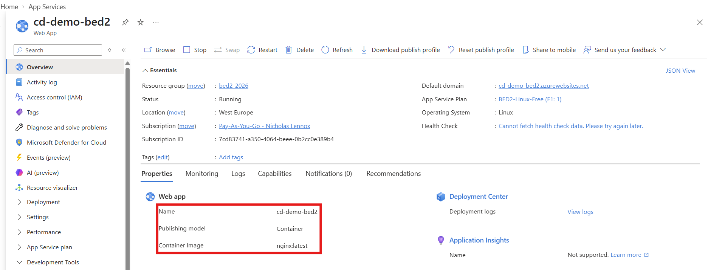

## 6. Giving the pipeline permission to deploy

**A note on the approach before we take it.** What follows uses SCM basic authentication and a publish profile. It works, it is what a great deal of existing tooling does, and it is the clearest way to see the mechanics - one credential, one secret, one input on the action. It is **not** the currently recommended approach, because of what a publish profile is: a long-lived password, in plain text, that does not rotate on its own. Section 9 covers why that matters and what replaces it.

### 6.1 Enabling SCM basic auth

The credential we need does not exist until it is switched on. This is the same setting from lesson 1 - **Settings → Configuration → Platform settings → SCM Basic Auth Publishing Credentials** - and it can be done from the CLI, though it is considerably more painful there than in the portal:

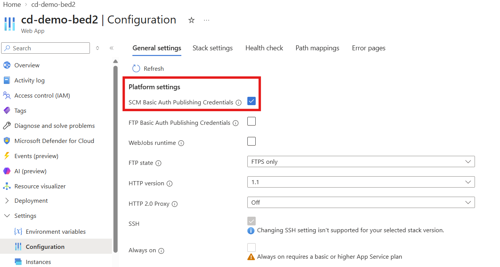

Lesson 1 needed this so that a webhook URL could carry a username and password. This time the credentials go into a file we hand to GitHub, but they are the same credentials, guarding the same endpoint.

### 6.2 The publish profile

A **publish profile** *[an XML file listing every way a particular App Service can be published to, and the credentials for each]* can be downloaded from the App Service's Overview blade:

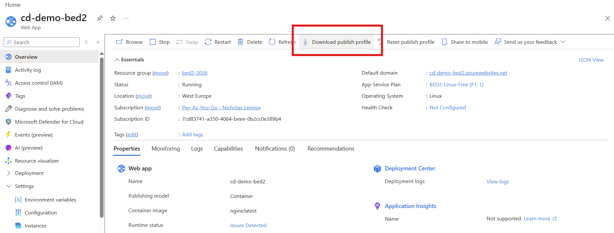

or fetched from the CLI, which is often more convenient because the next step is to paste it somewhere:

```bash
az webapp deployment list-publishing-profiles \
  --resource-group <resource-group> \
  --name <app-name> \
  --xml
```

The `--xml` matters. The action expects the XML form, not the JSON the CLI would give you by default.

To get it straight onto the clipboard, pipe it - the command differs by platform:

```bash
# Windows (Git Bash, or cmd)
az webapp deployment list-publishing-profiles -g BED2-2026 -n cd-demo-bed2 --xml | clip

# macOS
az webapp deployment list-publishing-profiles -g BED2-2026 -n cd-demo-bed2 --xml | pbcopy

# Linux
az webapp deployment list-publishing-profiles -g BED2-2026 -n cd-demo-bed2 --xml | xclip -selection clipboard
```

The file holds one `<publishProfile>` per publishing method. Trimmed to the first one, with the password removed:

```xml
<publishData>
  <publishProfile profileName="cd-demo-bed2 - Web Deploy"
                  publishMethod="MSDeploy"
                  publishUrl="cd-demo-bed2.scm.azurewebsites.net:443"
                  userName="$cd-demo-bed2"
                  userPWD="REDACTED"
                  destinationAppUrl="http://cd-demo-bed2.azurewebsites.net">
    <databases />
  </publishProfile>
  <!-- further profiles: FTP, ZipDeploy -->
</publishData>
```

Two things in there should look familiar from lesson 1. The `publishUrl` is the `.scm.` hostname - the SCM sidecar, not the app itself. And `userName` begins with a `$`, exactly as the generated webhook URL's username did.

That password is in plain text, it is valid until somebody actively changes it, and it grants the right to redeploy the application. Do not commit it, do not paste it into a chat, and do not leave it in your downloads folder.

> A publish profile is a password in a file.

### 6.3 Storing it as a repository secret

**Settings → Secrets and variables → Actions → New repository secret**, named `AZURE_WEBAPP_PUBLISH_PROFILE`, with the whole XML document as the value:

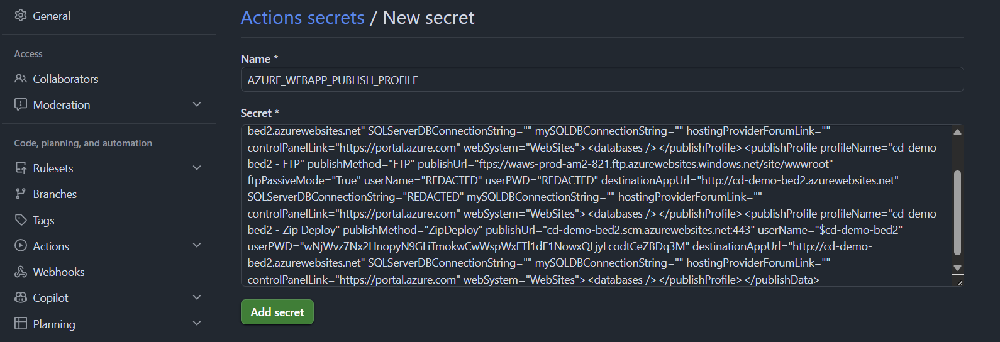

This is the same mechanism as the ACR credentials in lesson 4 - stored encrypted, readable by workflows, not readable by you afterwards, and masked if anything prints it.

## 7. The deploy job

Added to `.github/workflows/ci-cd.yml` as a third job, at the same indentation as `test` and `build-and-push`:

```yaml
    # Job added this lesson
    deploy-app-service:
      # There is nothing to deploy until the image is in the registry
      needs: build-and-push

      runs-on: ubuntu-latest

      env:
        APP_SERVICE_NAME: cd-demo-bed2

      steps:
        - name: Deploy Container to Azure Web App
          uses: azure/webapps-deploy@v3
          with:
            app-name: ${{ env.APP_SERVICE_NAME }}
            # Pass the publish profile
            publish-profile: ${{ secrets.AZURE_WEBAPP_PUBLISH_PROFILE }}
            # Deploy our specific version instead of latest
            images: '${{ env.IMAGE }}:${{ github.sha }}'
```

Four things are worth naming.

`needs: build-and-push` is not optional. Without it the job starts immediately, in parallel with `test`, and asks App Service to run an image tag that has not been pushed yet.

There is **no checkout step**. Every other job so far has needed one; this job never touches the repository's files. It sends a name and a credential to an HTTP endpoint. Nothing to check out.

`images` uses `${{ github.sha }}`, not `latest`. The workflow pushed both tags, and either would technically work - but `latest` means "whatever was pushed most recently", which by the time the deploy job runs might be a different run's image. Deploying the SHA deploys the artifact this run produced.

`IMAGE` comes from the workflow-level `env` at the top of the file, which is why it was put there: `build-and-push` and `deploy-app-service` are naming the same image, and a workflow-level variable is what stops the two from drifting apart.

Commit, push, and the pipeline runs all three jobs:

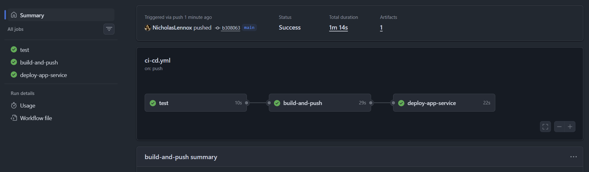

Expanding the deploy step shows exactly what it did:

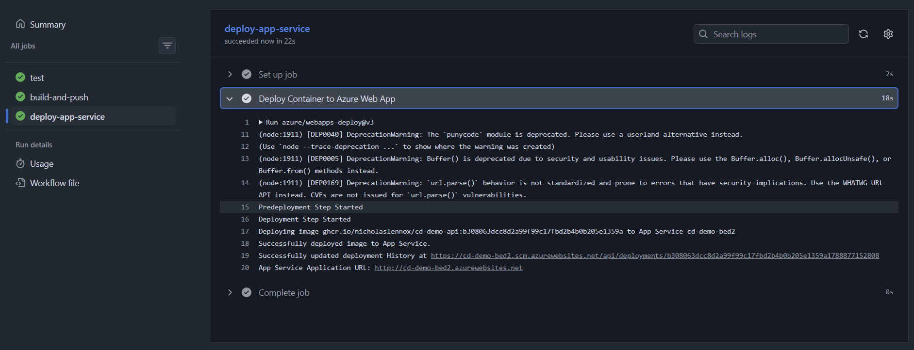

```
Deploying image ghcr.io/nicholaslennox/cd-demo-api:b308063dcc... to App Service cd-demo-bed2
Successfully deployed image to App Service.
Successfully updated deployment History at https://cd-demo-bed2.scm.azurewebsites.net/api/deployments/...
App Service Application URL: http://cd-demo-bed2.azurewebsites.net
```

The deployment history was written to a URL on the `.scm.` host. That is the confirmation that the action went through the SCM sidecar - the same service Kudu exposes and the same one lesson 1's webhook was posting to.

## 8. What changed on Azure

The App Service's own record of what it is running has been rewritten:

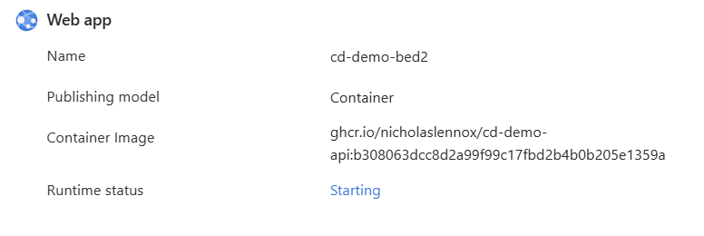

**Publishing model: Container**, and **Container Image: `ghcr.io/nicholaslennox/cd-demo-api:b308063dcc...`** - the placeholder nginx is gone, replaced by the exact image this run built. Runtime status **Starting**, because rewriting that setting restarts the container.

The Deployment Center shows the same thing as a form:

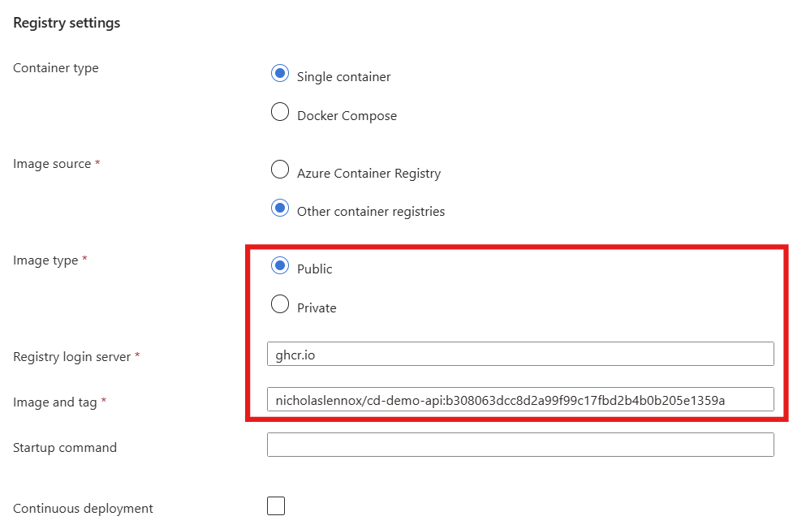

**Image source: Other container registries**, **Registry login server: `ghcr.io`**, and the image and tag filled in by the action. Note **Continuous deployment** is unticked - there is no webhook here, and nothing is watching. Every deployment arrives because a pipeline pushed it.

Note also **Image type: Public**. This deployment worked without any registry credential because the GHCR package is public and App Service could simply pull it. Had we made the package private, this form would need a username and password - a GitHub personal access token with read access to packages - filled in before the pull could succeed.

Watching the application logs on the Kudu site, the same place lesson 1 used, shows the new container coming up:

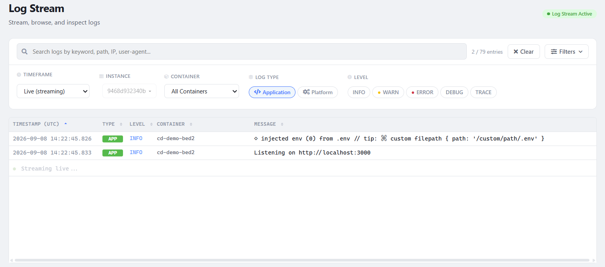

And the endpoint answers:

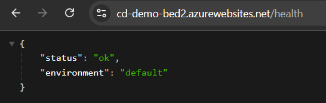

```json
{
  "status": "ok",
  "environment": "default"
}
```

Deployed, running, and reporting `"default"` - the fallback from section 2, which means nothing supplied `ENVIRONMENT`.

Nothing is broken. The workflow set `ENVIRONMENT` on the **test** job, which configured a process on a runner that no longer exists. `.dockerignore` keeps `.env` out of the image. So the running container was given no value, and said so. To fix it, `ENVIRONMENT` has to be added as an **app setting** on the App Service which will also be visible in Kudu's Environment tab.

> Configuration does not travel inside the image. Each place the app runs supplies its own.

## 9. The two things this leaves open

Both are real work and both are out of scope here, so what follows is orientation and references rather than instructions.

### 9.1 A private registry

Our package is public, which is why section 8 needed no registry credential. Making it private moves the pull behind authentication, and the App Service then needs a credential of its own - a GitHub personal access token with `read:packages`, entered in the Deployment Center's registry settings. The pipeline's `GITHUB_TOKEN` cannot help here; it belongs to the workflow run and is gone by the time Azure pulls.

### 9.2 Getting rid of the password

The publish profile works, and the problem with it is structural rather than a matter of being careful. Enabling SCM basic auth puts an endpoint on the public internet that accepts a username and password. That password does not expire, does not rotate, and is the same one every time. It sits in a GitHub secret, in whatever downloaded file you forgot to delete, and in the clipboard history of the machine you copied it on. Anyone who obtains it can redeploy your application, for as long as nobody notices.

The recommended replacement removes the password entirely. Instead of storing a secret, you configure a trust relationship: Azure is told to accept identity tokens issued by GitHub's OIDC provider *[OpenID Connect: a standard way for one system to prove to another who is asking, using a short-lived signed token rather than a shared password]*, for one specific repository and branch. GitHub mints a fresh token for each run, Azure exchanges it for its own access token, and nothing long-lived is stored anywhere.

The cost is setup. Instead of one secret and one input on the action, you create a user-assigned managed identity, grant it a role on the App Service, register a federated credential describing which repository may use it, store three non-secret identifiers, add an `azure/login` step, and grant the workflow `id-token: write`. Every one of those is a new concept, which is why it is not in this lesson.

To read about it:

- [Deploy to App Service using GitHub Actions](https://learn.microsoft.com/en-us/azure/app-service/deploy-github-actions?tabs=applevel%2Caspnetcore#generate-deployment-credentials) - covers all three credential options side by side, including the publish profile we used.
- [What does the user-assigned identity option do for GitHub Actions?](https://learn.microsoft.com/en-us/azure/app-service/deploy-continuous-deployment?tabs=github#what-does-the-user-assigned-identity-option-do-for-github-actions) - what Azure sets up when it does this for you, which is the shortest description of the moving parts.
- [Configuring OpenID Connect in cloud providers](https://docs.github.com/en/actions/how-tos/secure-your-work/security-harden-deployments/oidc-in-cloud-providers#adding-permissions-settings) - the GitHub half, including the `id-token: write` permission.

## 10. The whole path

End to end, with the credential each step uses:

```
  git push to main
        │
        ▼
   ┌─────────┐      ┌─────────────────┐      ┌────────────────────┐
   │  test   │ ───▶ │ build-and-push  │ ───▶ │ deploy-app-service │
   └─────────┘      └─────────────────┘      └────────────────────┘
   env:              GITHUB_TOKEN             AZURE_WEBAPP_
   ENVIRONMENT       + packages: write        PUBLISH_PROFILE
   = test            (issued per run)         (a stored password)
        │                    │                         │
        ▼                    ▼                         ▼
   npm ci, npm test    ghcr.io/…:<sha>          App Service image
   on Node 22          ghcr.io/…:latest         setting rewritten
                                                to :<sha>, restarts
                                                         │
                                                         ▼
                                                  pulls from ghcr.io
                                                  (public - no credential)
```

Three jobs, three credentials, and none of them interchangeable. The first is not a credential at all - it is configuration the tests need. The second is issued by GitHub for one run and expires with it. The third is a password you generated, stored, and are now responsible for.

Read the diagram right to left and it also answers "why did this deployment happen?". The App Service changed because the deploy job told it to. The deploy job ran because the build job produced an image. The build job ran because the tests passed. Each arrow is a `needs:`, and removing any one of them lets a later stage run on something that was never checked.

## 11. Sources

1. Microsoft Learn, *Deploy to App Service using GitHub Actions* - [learn.microsoft.com/en-us/azure/app-service/deploy-github-actions](https://learn.microsoft.com/en-us/azure/app-service/deploy-github-actions?tabs=applevel%2Caspnetcore#generate-deployment-credentials)
2. `Azure/webapps-deploy` action - [github.com/Azure/webapps-deploy](https://github.com/Azure/webapps-deploy)
3. Microsoft Learn, *az webapp create* - [learn.microsoft.com/en-us/cli/azure/webapp](https://learn.microsoft.com/en-us/cli/azure/webapp)
4. Microsoft Learn, *az appservice plan create* - [learn.microsoft.com/en-us/cli/azure/appservice/plan](https://learn.microsoft.com/en-us/cli/azure/appservice/plan?view=azure-cli-latest#az-appservice-plan-create)
5. Microsoft Learn, *az group create* - [learn.microsoft.com/en-us/cli/azure/group](https://learn.microsoft.com/en-us/cli/azure/group?view=azure-cli-latest#az-group-create)
6. Microsoft Learn, *Continuous deployment to App Service - user-assigned identity* - [learn.microsoft.com/en-us/azure/app-service/deploy-continuous-deployment](https://learn.microsoft.com/en-us/azure/app-service/deploy-continuous-deployment?tabs=github#what-does-the-user-assigned-identity-option-do-for-github-actions)
7. GitHub Docs, *Store information in variables* - [docs.github.com/en/actions/how-tos/write-workflows/choose-what-workflows-do/use-variables](https://docs.github.com/en/actions/how-tos/write-workflows/choose-what-workflows-do/use-variables)
8. GitHub Docs, *Using secrets in GitHub Actions* - [docs.github.com/en/actions/how-tos/write-workflows/choose-what-workflows-do/use-secrets](https://docs.github.com/en/actions/how-tos/write-workflows/choose-what-workflows-do/use-secrets)
9. GitHub Docs, *Workflow syntax - `jobs.<job_id>.permissions`* - [docs.github.com/en/actions/reference/workflows-and-actions/workflow-syntax](https://docs.github.com/en/actions/reference/workflows-and-actions/workflow-syntax)
10. GitHub Docs, *Configuring OpenID Connect in cloud providers* - [docs.github.com/en/actions/how-tos/secure-your-work/security-harden-deployments/oidc-in-cloud-providers](https://docs.github.com/en/actions/how-tos/secure-your-work/security-harden-deployments/oidc-in-cloud-providers#adding-permissions-settings)
11. GitHub Docs, *Introduction to GitHub Packages* - [docs.github.com/en/packages/learn-github-packages/introduction-to-github-packages](https://docs.github.com/en/packages/learn-github-packages/introduction-to-github-packages)
