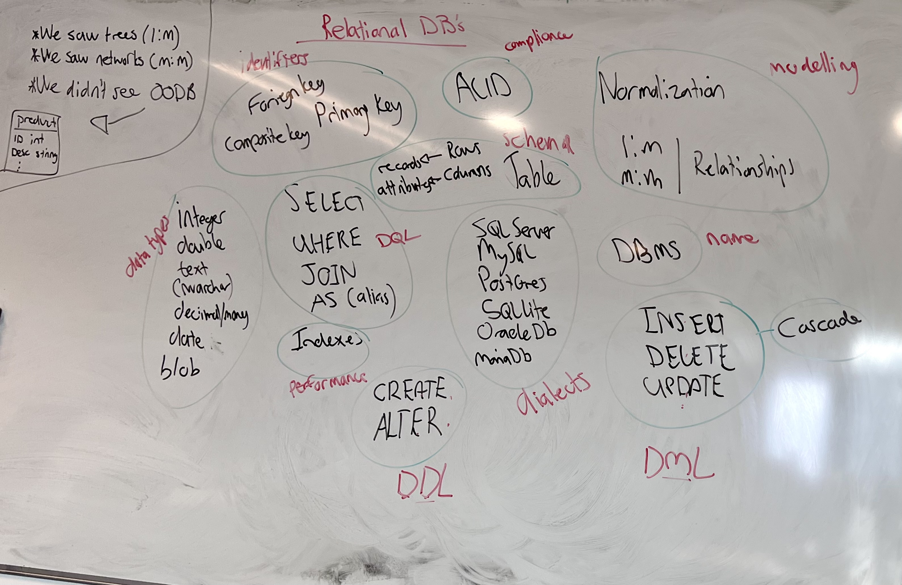
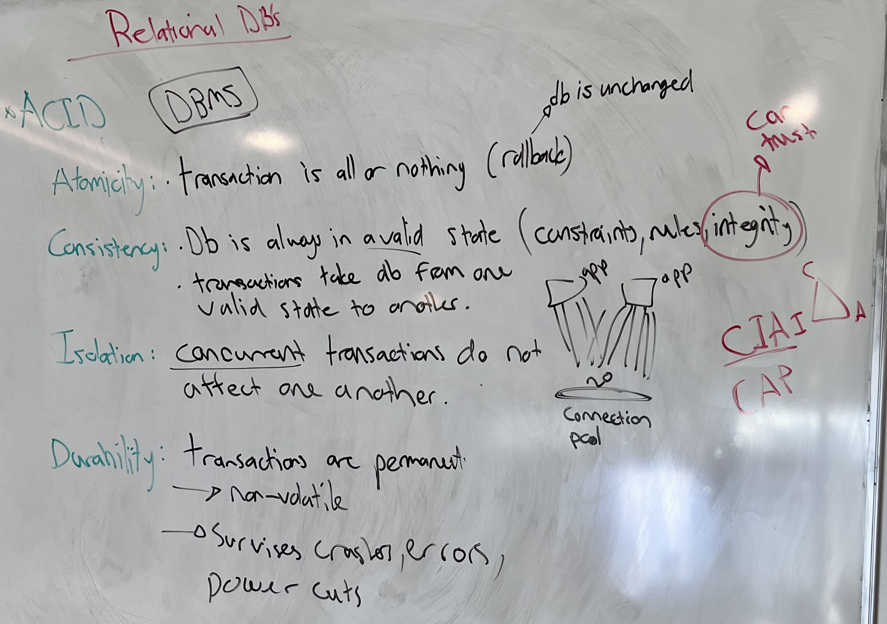
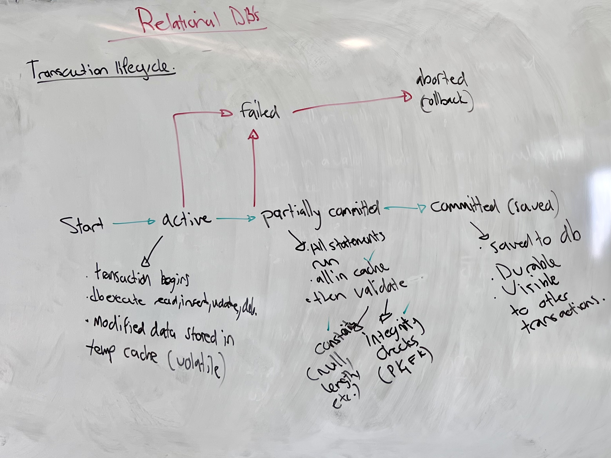
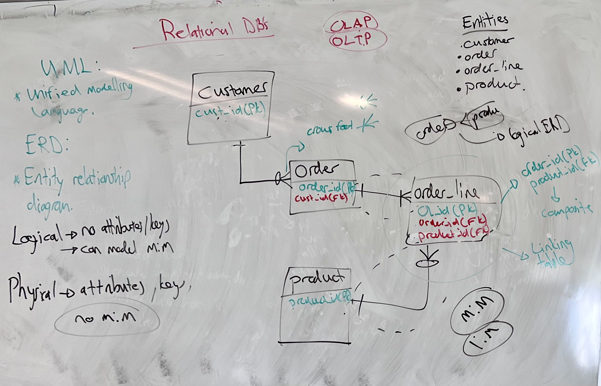
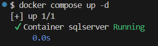
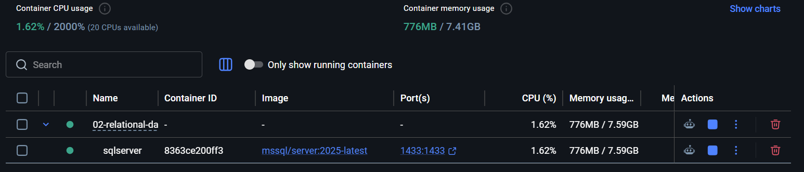
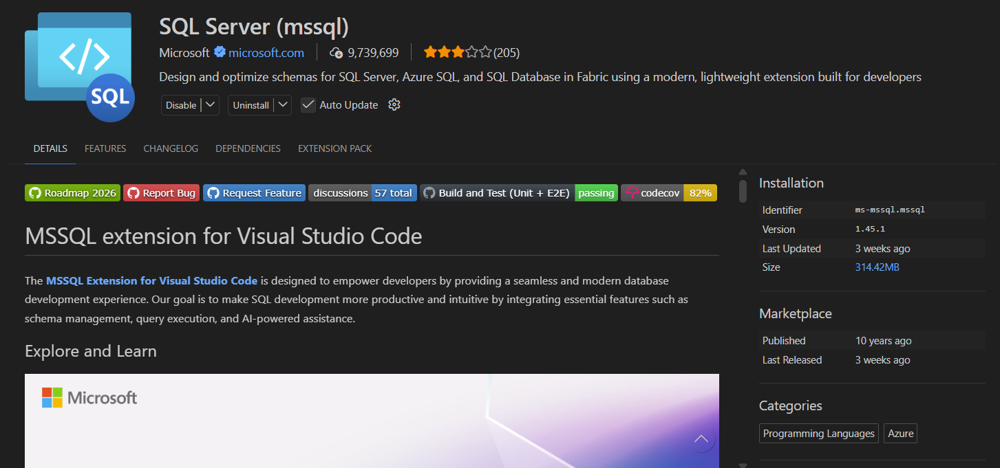
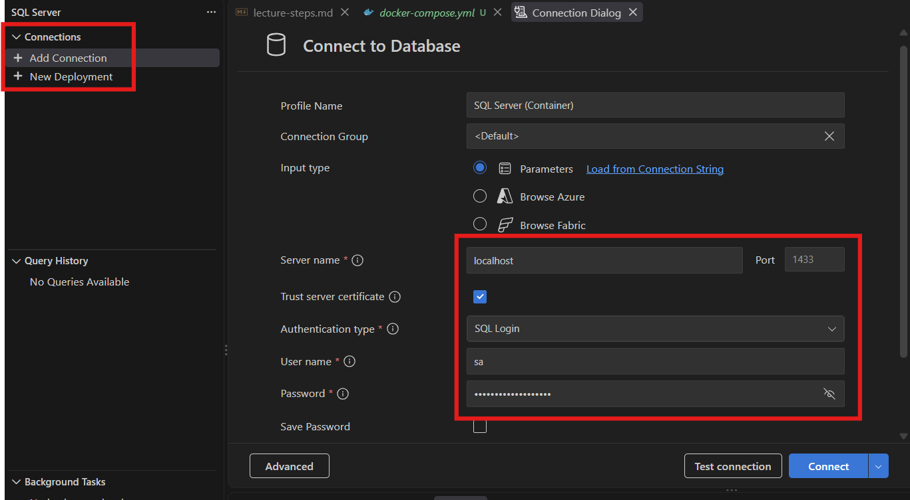
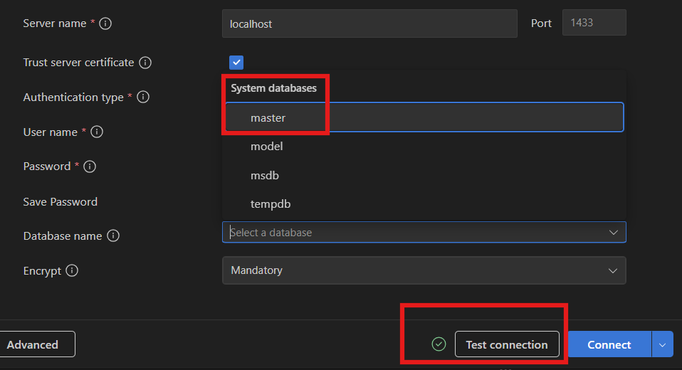
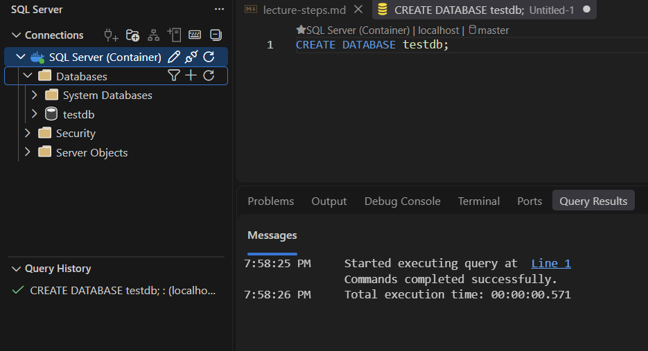

# Relational Databases: Recap and Setup

> You have worked with relational databases before. This lesson re-establishes the vocabulary, spends longer than last year on ACID and transactions, redraws an ERD, and ends with a SQL Server instance running in Docker on your machine - the environment for the rest of the course. Terms you may not have met, or may have forgotten, get a plain-English version in brackets.

## 1. Where we are

[Last lesson](../01-early-data-models/lecture.md) covered two shapes data was stored in before SQL: the **tree** (`1:M`, one path to everything) and the **network** (`M:M`, links carry data).

There was a third model we did not draw: the **object-oriented database (OODB)**. The idea was that a `Product` class in your code - an `ID` integer, a `Description` string - would be stored as-is, with no translation between the program's objects and the database's records. That is a real advantage, and it is also why the model fell away. The stored objects were tied to one language's type system, and an integer in one object-oriented language is not the same thing as an integer in another. SQL went the other way: a single standard that is nobody's native language, so every language maps to it.

## 2. The vocabulary

We started by putting every term the room associated with relational databases on the board, then grouping them. The groups, with the label we gave each one:



| Group | Terms |
|---|---|
| **Schema** | table, row (also called **record**), column (also called **attribute**) |
| **Identifiers** | **primary key**, **foreign key**, **composite key** |
| **Data types** | integer, double, text (`nvarchar`), decimal/money, date, blob |
| **Modelling** | relationships, `1:M`, `M:M`, normalization |
| **Compliance** | ACID |
| **Performance** | indexes |
| **Name** | DBMS |
| **Dialects** | SQL Server, MySQL, PostgreSQL, SQLite, Oracle, MariaDB |

Three of the groups were SQL keywords, and they fall into the three sub-languages that SQL is made of:

- **DQL (Data Query Language)** - reading: `SELECT`, `WHERE`, `JOIN`, `AS`.
- **DML (Data Manipulation Language)** - changing rows: `INSERT`, `UPDATE`, `DELETE`. **Cascade** sits with these - what happens to dependent rows when the row they point at is deleted.
- **DDL (Data Definition Language)** - changing the structure: `CREATE`, `ALTER`, `DROP`.

A **DBMS** *[database management system - the software that owns the files, enforces the rules and runs your queries; SQL Server is one]* is the thing you actually connect to. The list under *dialects* is a list of DBMSs, and each speaks a slightly different SQL.

## 3. ACID

ACID is the set of guarantees a relational DBMS makes about **transactions** *[a unit of work made of one or more statements that either all take effect or none do]*.



### 3.1 Atomicity

A transaction is all or nothing. If any statement in it fails, the DBMS **rolls back** *[undoes every change the transaction made]* and the database is exactly as it was before the transaction started.

### 3.2 Consistency

The database is always in a valid state. A transaction takes it from one valid state to another, and *valid* means every constraint *[a rule the schema declares - a column cannot be null, a value must be unique, a foreign key must point at a row that exists]* holds.

This is the property the others exist to protect. Keys and constraints are there to guarantee **integrity** - that the data can be trusted - and a DBMS that lets an order reference a customer that does not exist has failed at its one job.

### 3.3 Isolation

Concurrent transactions do not affect one another. Each one behaves as if it were the only thing running.

The reason this needs guaranteeing is that transactions are not run one at a time. An application talks to the database through a **connection pool** *[a set of open connections kept ready, so that each request borrows one rather than opening its own]*, and several requests are in flight at once. Two of them can be working on the same row at the same time.

The sketch on the board was a **race condition** *[a bug where the result depends on which of two concurrent operations happens to finish first]*. Two requests each borrow a connection. Both read a product's stock and see `1`. Both subtract one and write `0`. Two items have been sold; one existed. Nothing in either transaction was wrong on its own.

Isolation is what stops that. How strictly the DBMS enforces it is configurable - there are **isolation levels**, and stricter levels cost throughput. That trade-off is further than we need to go right now; two readable walkthroughs if you want it: [Isolation Levels in Databases Explained](https://codefinity.com/blog/Isolation-Levels-in-Databases-Explained) and [Understanding Database Isolation Levels](https://shbhmrzd.github.io/databases/transactions/isolation-levels/2025/12/26/understanding-database-isolation-levels.html).

### 3.4 Durability

A committed transaction is permanent. It has been written to **non-volatile** storage *[storage that keeps its contents without power - disk, not RAM]*, so it survives a crash, an error, or a power cut.

> Keys and constraints exist to keep the data trustworthy.

## 4. The transaction lifecycle

Every query you run goes through a transaction. Sometimes it is one statement; sometimes it is a batch that inserts or updates many rows. Either way the DBMS walks the same path.



```
                              +--------+          +--------------------+
                        +---->| failed |--------->| aborted (rollback) |
                        |     +--------+          +--------------------+
                        |          ^
                        |          |
+-------+      +--------+      +---------------------+      +-------------------+
| start |----->| active |----->| partially committed |----->| committed (saved) |
+-------+      +--------+      +---------------------+      +-------------------+
```

- **Active.** The transaction has begun. The DBMS executes its reads, inserts, updates and deletes, and the modified data is held in a temporary cache - **volatile** *[lost if the power goes]*, and not yet the database.
- **Partially committed.** Every statement has run. Everything is still in the cache, and now the DBMS validates: constraints (not null, length, and so on) and integrity checks (does every foreign key point at a real primary key?).
- **Committed.** Validation passed. The changes are written to the database, they are durable, and they are visible to other transactions.
- **Failed → aborted.** A statement errored while active, or validation failed while partially committed. The DBMS rolls back and the database is unchanged.

Until *committed*, nothing has happened as far as anyone else is concerned. That is atomicity and isolation in one diagram.

In T-SQL *[Transact-SQL, SQL Server's dialect]* a transaction spanning several statements looks like this:

```sql
BEGIN TRANSACTION;
    UPDATE product SET stock = stock - 1 WHERE product_id = 42;
    INSERT INTO order_line (order_id, product_id, quantity) VALUES (7, 42, 1);
COMMIT TRANSACTION;      -- or ROLLBACK TRANSACTION to undo both
```

A single statement run on its own gets the same treatment - SQL Server wraps it in a transaction for you and commits it when it succeeds.

## 5. Modelling: the ERD

**UML** *[Unified Modeling Language - a standard set of diagram types for describing software]* includes the diagram we use for databases, the **ERD** *[entity relationship diagram]*.

We modelled a customer order system.



### 5.1 Entities first

The **entities** *[the things the system stores - each becomes a table]* are `customer`, `order`, `order_line` and `product`. Each got a box.

### 5.2 Then the lines

The lines between the boxes carry **cardinality** *[how many of one thing relate to how many of the other]*, drawn in **crow's foot notation**. At each end of a line, the symbol says how many rows on that side can take part:

- a single bar means **one**
- a crow's foot (three prongs) means **many**
- a circle means **zero** - the relationship is optional on that side

So `customer` to `order` is one-to-many: a bar on the customer side, a crow's foot on the order side. The circle on the order side says a customer can exist with zero orders. There is no circle on the customer side, because an order cannot exist without a customer. The line between `order_line` and `product` reads the same way: a product can sit on zero or many order lines, and every order line names exactly one product.

### 5.3 Logical to physical

A **logical ERD** has no attributes and no keys. It is allowed to say `order` to `product` is many-to-many and leave it there, and at the top right of the board that is exactly what we drew first.

A **physical ERD** has attributes and keys, and it has no `M:M`. A relational database cannot store a many-to-many directly, so the relationship is broken into two one-to-manys through a **linking table** *[a table whose job is to hold the pairs - which order has which product]*. That is what `order_line` is: `order` has many order lines, `product` appears on many order lines.

`order_line` also carries a `quantity`, which is why it was in the entity list from the start. A linking table that holds nothing but the two foreign keys exists only to make the `M:M` work; one that holds extra data is an entity in its own right.

### 5.4 Surrogate or composite

The last decision was what the primary key of `order_line` should be. There are two options:

| | Primary key | Foreign keys |
|---|---|---|
| **Composite** | `(order_id, product_id)` together | the same two columns |
| **Surrogate** | `order_line_id`, a new column with no meaning outside the table | `order_id`, `product_id` |

A **composite key** *[a primary key made of more than one column]* is the textbook answer, and the board has it on the side. We chose the **surrogate** *[a generated identifier that stands in for the natural one]*: one `order_line_id` plus the two foreign keys. It is easier to work with: one column to reference, one column to join on.

> Logical ERDs may say `M:M`. Physical ones break it into a linking table.

## 6. Running SQL Server

The DBMS for this course is **SQL Server**. It runs in a container, from a Compose file, and you connect to it from VS Code. Compose was covered in [Docker networking and Compose](../../../01-cloud-services/module-2/01-docker-networking-and-compose/lecture.md); nothing here is new Compose, just a new service.

### 6.1 The Compose file

This is [`docker-compose.yml`](docker-compose.yml) in the lesson folder:

```yaml
services:
  sqlserver:
    image: mcr.microsoft.com/mssql/server:2025-latest
    container_name: sqlserver
    environment:
      ACCEPT_EULA: "Y"
      MSSQL_SA_PASSWORD: "YourStr0ng!Passw0rd"   # move this to a .env file
      MSSQL_PID: "Developer"                      # free, full-featured, non-prod
    ports:
      - "1433:1433"
    volumes:
      - mssql-data:/var/opt/mssql
    restart: unless-stopped
    healthcheck:
      test: ["CMD-SHELL", "/opt/mssql-tools18/bin/sqlcmd -S localhost -U sa -P \"$$MSSQL_SA_PASSWORD\" -C -Q 'SELECT 1' || exit 1"]
      interval: 10s
      timeout: 5s
      retries: 10
      start_period: 30s

volumes:
  mssql-data:
```

The three environment variables are the ones the image requires. `ACCEPT_EULA` accepts Microsoft's licence. `MSSQL_SA_PASSWORD` sets the password for `sa` *[the built-in system administrator login]* - it has to be at least eight characters and use three of the four sets: uppercase, lowercase, digits, symbols, or the container will start and immediately stop. `MSSQL_PID` picks the edition; `Developer` is the full product, free, and licensed for anything except production.

`1433` is SQL Server's default port, published to the host so VS Code can reach it at `localhost`.

The named volume `mssql-data` is mounted where SQL Server keeps its data files. That is durability in Compose terms: `docker compose down` removes the container and the volume stays, so your databases are there when you bring it back up. `docker compose down -v` removes the volume too, and with it everything you created.

The `healthcheck` runs `sqlcmd` inside the container every ten seconds and asks for `SELECT 1`. SQL Server takes a while to start, so the container reports *healthy* only once it is actually answering queries, and `start_period` gives it thirty seconds before failures count.

### 6.2 Up

```bash
docker compose up -d
```



Docker Desktop shows the same thing: a Compose project named after the folder, one container in it, the image tag and the port mapping.



### 6.3 Connecting from VS Code

Install the **SQL Server (mssql)** extension from Microsoft. Its identifier is `ms-mssql.mssql` if you want to search by that.



Once it is installed, a SQL Server icon appears in the activity bar. Open it, and under **Connections** choose **Add Connection**.



Fill in:

| Field | Value |
|---|---|
| Server name | `localhost` |
| Port | `1433` |
| Trust server certificate | ticked |
| Authentication type | SQL Login |
| User name | `sa` |
| Password | the value of `MSSQL_SA_PASSWORD` in the Compose file |

*Trust server certificate* is needed because the extension encrypts the connection by default and the container is using a certificate it generated for itself. Ticking the box tells the extension to accept it.

Press **Test connection**. A green tick means the container is up, the port is reachable and the password matches. Then open the **Database name** dropdown and pick `master`.



`master` is one of SQL Server's four **system databases** *[databases the server creates for its own use - the others in the list are `model`, `msdb` and `tempdb`]*. It holds the server's own configuration, including the list of databases that exist, which makes it the right place to be when you want to create one.

### 6.4 The first query

Right-click the connection and choose **New Query**. The editor tab shows which connection and which database it is bound to. Type:

```sql
CREATE DATABASE testdb;
```

and run it.



Four areas of this screenshot are where your attention goes for the rest of the course:

- **The editor.** The header line above the query names the connection and the database. Check it before you run anything.
- **Query Results**, in the bottom panel. A `CREATE` has no rows to return, so you get the **Messages** tab: when it started, that it completed, how long it took. A `SELECT` gets a **Results** tab next to it with the rows.
- **The Databases tree**, in the left panel. `testdb` appears under **Databases** - after a refresh. The tree does not watch the server; press the refresh icon on the **Databases** node.
- **Query History**, bottom left. Every query you have run, with a tick or a cross. Useful when a query worked five minutes ago and you cannot remember what you changed.

## 7. Sources

1. GeeksforGeeks, *ACID Properties in DBMS* - [geeksforgeeks.org](https://www.geeksforgeeks.org/dbms/acid-properties-in-dbms/)
2. Codefinity, *Isolation Levels in Databases Explained* - [codefinity.com](https://codefinity.com/blog/Isolation-Levels-in-Databases-Explained)
3. Shubham Raizada, *Understanding Database Isolation Levels* - [shbhmrzd.github.io](https://shbhmrzd.github.io/databases/transactions/isolation-levels/2025/12/26/understanding-database-isolation-levels.html)
4. Microsoft Learn, *Docker: Run containers for SQL Server on Linux* - [learn.microsoft.com](https://learn.microsoft.com/en-us/sql/linux/quickstart-install-connect-docker)
5. Microsoft Learn, *MSSQL extension for Visual Studio Code* - [learn.microsoft.com](https://learn.microsoft.com/en-us/sql/tools/visual-studio-code-extensions/mssql/mssql-extension-visual-studio-code)
