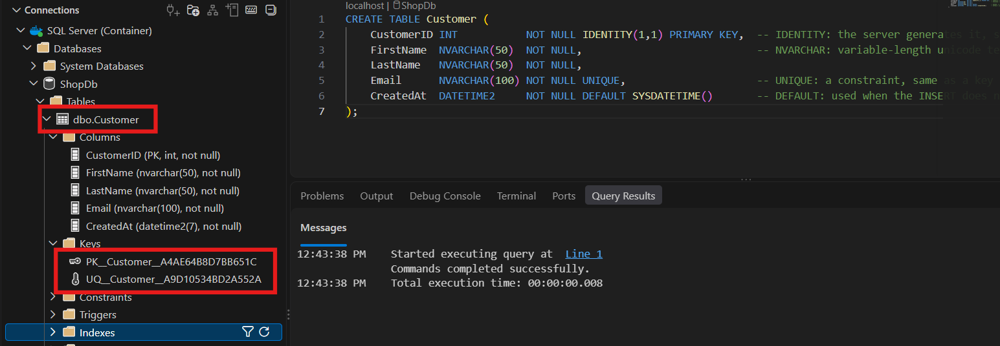
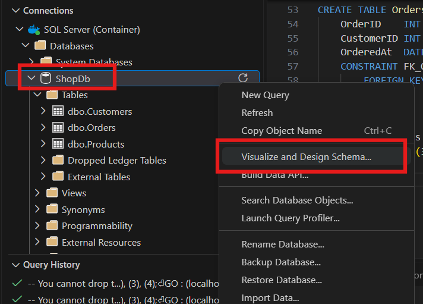
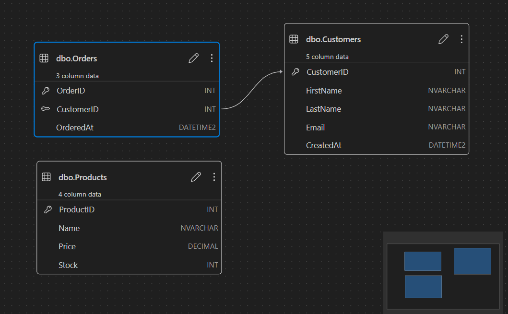
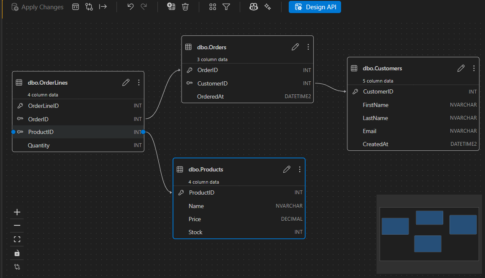

# Using SQL Server: DDL, DML and DQL

> Last lesson ended with SQL Server running in a container and VS Code connected to it. This lesson uses that connection to build a database by hand in T-SQL: a database, four tables, their constraints, seed data, and then queries across all of it. Most of the lesson is watching the server refuse things - duplicate emails, explicit identity values, strings that are not dates, deletes that would orphan rows - because the refusals are what the constraints are for. New terms get a plain-English version in brackets. The finished script is [`class-demo/schema-and-data.sql`](class-demo/schema-and-data.sql) and the queries are [`class-demo/queries.sql`](class-demo/queries.sql). The keywords used are collected in the [quick reference](#11-quick-reference) at the end.

## 1. Where we are

[Last lesson](../02-relational-databases-recap/lecture.md) set up the environment: SQL Server 2025 in a container from a Compose file, the **mssql** extension in VS Code, a connection to `localhost` as `sa`, and one `CREATE DATABASE testdb` run against `master` to prove it all worked. Everything here assumes that container is up and that connection exists.

**T-SQL** *[Transact-SQL, SQL Server's dialect of SQL]* is what we write. Three conventions before the first statement:

- **PascalCase** for databases, tables and columns: `ShopDb`, `Customers`, `FirstName`. This is what Microsoft's own tutorials and sample databases use. MySQL and PostgreSQL people tend to write `snake_case`.
- **Case does not matter.** SQL Server's default **collation** *[the rules it uses to compare and sort text]* is case-insensitive, so `Customers`, `customers` and `CUSTOMERS` are the same table, and `WHERE LastName = 'hansen'` matches `Hansen`.
- **Keywords in capitals** - `SELECT`, `FROM`, `CREATE TABLE` - is a habit, not a rule. Some people write them lowercase. Pick one and stay with it.

One inconsistency runs through this page and you will see it in the screenshots. The first half of the lesson uses singular table names - `Customer`. From section 7 onward the tables are plural - `Customers`, `Products`, `Orders`, `OrderLines`. That was a change of mind partway through the class, and it is exactly the thing you should not do in a real schema: both conventions exist, Microsoft's samples lean singular, and the only rule is to pick one and keep it. What the switch does show is how a script like this gets built - one table, then a reset, then three tables and seed data - and how the schema gets reshaped while it grows.

## 2. A database and a table

### 2.1 `CREATE DATABASE` and `GO`

A query window is bound to one database - `master` by default - and everything you run in it runs against that one. From `master` you can create others:

```sql
CREATE DATABASE ShopDb;
GO

USE ShopDb;
GO
```

`GO` is not T-SQL. It is a **batch separator** *[a marker the tooling uses to split a script into chunks that are sent to the server one at a time]*. Everything between one `GO` and the next is a **batch**, and each batch is sent, run and reported on its own. A one-line script does not need it. A script that creates a database, switches to it, and creates tables does: without `GO` the whole thing is one unit that succeeds or fails together, and some statements have to be the first thing in their batch. With `GO` after each step, each one can fail or succeed independently and the Messages panel tells you which one did what. Every larger script in this lesson is built this way.

`USE ShopDb` switches the connection to the new database. The editor header does not update - it still says `master` - but the switch happens when the batch runs, and everything after it lands in `ShopDb`.

### 2.2 The first table

```sql
CREATE TABLE Customer (
    CustomerID INT           NOT NULL IDENTITY(1,1) PRIMARY KEY,
    FirstName  NVARCHAR(50)  NOT NULL,
    LastName   NVARCHAR(50)  NOT NULL,
    Email      NVARCHAR(100) NOT NULL UNIQUE,
    CreatedAt  DATETIME2     NOT NULL DEFAULT SYSDATETIME()
);
```

Each line has three parts: the column name on the left, the data type in the middle, and everything after that is **constraints** *[rules the server enforces on the column - what it may not contain, what it must be]*.

`CustomerID INT NOT NULL IDENTITY(1,1) PRIMARY KEY`. `IDENTITY(1,1)` is the T-SQL spelling of auto-increment: the server generates the value, starting at 1, stepping by 1. `PRIMARY KEY` creates a constraint on the table. This is the **inline** way to declare a constraint - written on the column, no separate `CONSTRAINT` line. Section 7 shows the longer form.

`FirstName NVARCHAR(50) NOT NULL`. **NVARCHAR** *[variable-length Unicode text - the N is for national, meaning it can hold any script, not just Latin letters]* with a maximum of 50 characters.

`Email NVARCHAR(100) NOT NULL UNIQUE`. `UNIQUE` is a constraint: no two rows may have the same email. The question that comes up is why the email is not the primary key, since it already identifies one customer. It is a **natural key** *[a value from the domain itself that happens to be unique - an email, a national ID number]*, and natural keys are almost never good primary keys. A primary key is looked up constantly and stored in every table that references it, so it needs to be small and fast to compare. An integer is; a 100-character string is not. So the pattern you will see everywhere is a natural key kept as a `UNIQUE` column, and a separate auto-incremented integer as the actual primary key.

`CreatedAt DATETIME2 NOT NULL DEFAULT SYSDATETIME()`. **DATETIME2** is the date-and-time type to use. It exists alongside the older `DATETIME` because `DATETIME` has a limited range (1753 onward) and a precision of about three milliseconds; `DATETIME2` covers year 1 onward, is precise to 100 nanoseconds, and is what Microsoft recommends for new work. `CreatedAt` is a housekeeping column - when was this row created - and you will often see an `UpdatedAt` next to it. The `DEFAULT` is the part that matters: the column is `NOT NULL`, so something has to be there, and if the `INSERT` does not supply a value the server uses the default. Here the default is a call to `SYSDATETIME()`, a built-in function that reads the system clock.

### 2.3 What the server stored

After the statement runs, the table appears in the Connections tree under `ShopDb > Tables`:



The statement said `Customer`; the tree says `dbo.Customer`. The database came from the connection - the header at the top of the editor reads `localhost | ShopDb`. **dbo** *[database owner]* is the default **schema** *[a namespace inside a database - a way to group tables, procedures and functions that belong together, for instance everything one team owns]*. If you never name a schema, everything goes into `dbo` and you never see it except in the tree.

The **Columns** folder shows what the server actually stored: `CustomerID (PK, int, not null)`, `FirstName (nvarchar(50), not null)`, and so on down to `CreatedAt (datetime2(7), not null)`. The `(7)` is the default precision of `DATETIME2` - seven decimal places of seconds. We did not write it; the server filled it in.

The **Keys** folder has two entries: `PK__Customer__A4AE64B8D7BB651C` and `UQ__Customer__A9D10534BD2A552A`. `PK__` is the primary key, `UQ__` is the unique constraint on `Email`. We never named either, so SQL Server made names up - a prefix, the table, and random hex. The `UNIQUE` constraint lives under Keys because SQL Server treats a unique column as a key: a **candidate key** *[a column that could identify a row on its own, just not the one chosen as primary]*.

**Constraints** holds check and default constraints - the `DEFAULT SYSDATETIME()` on `CreatedAt` is in there with a `DF__` name. **Triggers** are code the server runs automatically on insert, update or delete; the folder is empty and this course does not cover them. **Indexes** - the primary key and the unique constraint are each backed by an index, which is how the server checks uniqueness quickly. Indexes come later in the course.

Messages says `Commands completed successfully`. There is no result grid, because `CREATE TABLE` returns nothing.

## 3. Inserting a row and reading it back

```sql
INSERT INTO Customer (FirstName, LastName, Email)
VALUES ('Ola', 'Nordmann', 'ola@example.no');
```

```
(1 row affected)
```

Still no grid - `INSERT` does not return rows, it reports how many it touched. Only three columns are listed. `CustomerID` and `CreatedAt` are not, and `IDENTITY` and `DEFAULT` fill them in.

To see the row, right-click the table in the tree and choose **Select Top 1000**. The extension generates this:

```sql
SELECT TOP (1000) [CustomerID]
      ,[FirstName]
      ,[LastName]
      ,[Email]
      ,[CreatedAt]
  FROM [ShopDb].[dbo].[Customer]
```

| CustomerID | FirstName | LastName | Email          | CreatedAt                   |
|-----------:|-----------|----------|----------------|-----------------------------|
| 1          | Ola       | Nordmann | ola@example.no | 2026-09-17 10:54:28.4963487 |

This time the result is a grid in the **Results** tab, because `SELECT` returns rows. One row: `CustomerID` 1, the three values we typed, and a `CreatedAt` nobody typed.

Three things in the generated script that we do not write by hand:

- **Square brackets.** `[CustomerID]`, `[FirstName]`. They mark the name as an identifier so it cannot be read as a keyword. A column called `Order` or `Group` works if you write `[Order]`. The generator brackets everything to be safe. We write brackets only when a name needs them - a reserved word, or a name with a space in it.
- **The fully qualified name.** `[ShopDb].[dbo].[Customer]` is `database.schema.table`. The generated script does not know which connection it will run on, so it spells everything out. When we write SQL by hand we rely on the defaults - the connected database, the `dbo` schema - and write `Customer`.
- **`TOP (1000)`.** The first 1000 rows. This is T-SQL; MySQL and PostgreSQL spell it `LIMIT`. One of the small ways SQL Server's dialect differs.

## 4. What the constraints refuse

The table definition is a contract, and the server enforces it. Every `INSERT` below is meant to fail, and each failure names the rule it broke. This is the consistency in ACID from [last lesson](../02-relational-databases-recap/lecture.md#32-consistency), seen one constraint at a time.

### 4.1 A duplicate email

The same `INSERT` as section 3, run a second time:

```sql
INSERT INTO Customer (FirstName, LastName, Email)
VALUES ('Ola', 'Nordmann', 'ola@example.no');
```

```
Msg 2627, Level 14, State 1, Line 1
Violation of UNIQUE KEY constraint 'UQ__Customer__A9D10534BD2A552A'. Cannot insert duplicate key in object 'dbo.Customer'. The duplicate key value is (ola@example.no).
The statement has been terminated.
```

`CustomerID` would have been fine - it is generated, so the row would just get the next number. `Email` has `UNIQUE` on it, and the error names the constraint by the same `UQ__` name the tree showed in section 2. `The statement has been terminated` means nothing was written; the row is not half in.

The Messages panel does not wrap long lines, so an error like this runs off the right edge. Scroll, or copy the text out.

### 4.2 An explicit identity value

```sql
INSERT INTO Customer (CustomerID, FirstName, LastName, Email)
VALUES (10, 'Kari', 'Nordmann', 'kari@example.no');
```

```
Msg 544, Level 16, State 1, Line 1
Cannot insert explicit value for identity column in table 'Customer' when IDENTITY_INSERT is set to OFF.
```

`IDENTITY` means the server owns the column. You do not choose the value, and by default it will not let you. There is a switch (`SET IDENTITY_INSERT ... ON`) for cases like migrating data in from another system, and that is the only time you would use it.

The shorthand form of `INSERT`, with no column list, hits the same error:

```sql
INSERT INTO Customer
VALUES (10, 'Kari', 'Nordmann', 'kari@example.no', SYSDATETIME());
```

Without a column list, `VALUES` has to supply every column in table order, and the first value lands on `CustomerID`. That is why we always list the columns: it lets us skip the ones the server fills in, and it keeps working when the table changes.

### 4.3 The wrong type in `CreatedAt`

`CreatedAt` is a `DATETIME2`. Three attempts at handing it something else, in this order.

A string that is not a date:

```sql
INSERT INTO Customer (FirstName, LastName, Email, CreatedAt)
VALUES ('Kari', 'Nordmann', 'kari@example.no', 'Klokka 2');
```

```
Msg 241, Level 16, State 1, Line 1
Conversion failed when converting date and/or time from character string.
```

The word to read is *conversion*. The server did not reject the value for being a string. It took the string, tried to turn it into a `DATETIME2`, and the conversion did not work.

An integer:

```sql
INSERT INTO Customer (FirstName, LastName, Email, CreatedAt)
VALUES ('Kari', 'Nordmann', 'kari@example.no', 10000);
```

```
Msg 206, Level 16, State 2, Line 1
Operand type clash: int is incompatible with datetime2
```

A different error. No conversion was attempted, because there is no rule for turning an `int` into a `datetime2` - the types are flatly incompatible. Strings get a conversion attempt; integers do not.

A string that is a time but not a date:

```sql
INSERT INTO Customer (FirstName, LastName, Email, CreatedAt)
VALUES ('Kari', 'Nordmann', 'kari@example.no', '1PM');
```

```
(1 row affected)
```

It went in. Selecting it back:

| CustomerID | FirstName | LastName | Email           | CreatedAt                   |
|-----------:|-----------|----------|-----------------|-----------------------------|
| 3          | Kari      | Nordmann | kari@example.no | 1900-01-01 13:00:00.0000000 |

The time is 13:00 - the server understood `1PM` - and the date is `1900-01-01`, because none was given and that is the base date a `DATETIME2` gets when only a time is supplied.

The three together show **implicit conversion** *[the server turning a value into the column's type on its own, without being asked]*. SQL Server tries to make what you gave it fit the column and only errors when it cannot. Sometimes that is an error you can read; sometimes it is a value you did not intend, written silently. `1900-01-01` is worse than an error, because nothing told you.

We do not hand-write dates into `CreatedAt`. The `DEFAULT` calls `SYSDATETIME()`, and if we ever need to supply one we call `SYSDATETIME()` ourselves.

### 4.4 The gaps in the identity

A third customer inserted normally, then everything selected back:

| CustomerID | FirstName | LastName | Email           | CreatedAt                   |
|-----------:|-----------|----------|-----------------|-----------------------------|
| 1          | Ola       | Nordmann | ola@example.no  | 2026-09-17 10:54:28.4963487 |
| 3          | Kari      | Nordmann | kari@example.no | 1900-01-01 13:00:00.0000000 |
| 6          | Nicholas  | Lennox   | nick@example.no | 2026-09-17 11:12:29.4445968 |

Three rows with IDs 1, 3 and 6. Not 1, 2, 3.

Every failed `INSERT` above consumed an identity value. The server hands out the next number first, then the row is rejected and rolled back - and the counter does not roll back with it. Each failure burns a number, and the gaps are where the failures were.

There is a bigger jump you will meet eventually: a table goes from ID 9 to ID 1009, or from 12 to 10012, after the server restarts. SQL Server pre-allocates identity values in blocks and keeps the block in memory for speed. If the instance restarts or fails over unexpectedly, the unused part of the block is lost and the next row gets the first value of the next block - a jump of a thousand for an `INT` column. It is documented behaviour, not a bug, and since SQL Server 2017 there is a database option, `IDENTITY_CACHE`, to switch it off.

Both of these point the same way. An identity column is managed in the background. It is a handle for the row - not a count, not a position, not guaranteed to be consecutive. You do not set it and you do not read meaning into it. Nine rows does not mean IDs 1 to 9.

> A constraint is a rule the server enforces so that no statement, from anywhere, can break it.

## 5. `UPDATE` without a `WHERE`

```sql
UPDATE Customer
SET LastName = 'Knutsen'
WHERE CustomerID = 1
```

```
(1 row affected)
```

`SET` names the column and the new value; `WHERE` picks the row.

The same statement with the `WHERE` left off:

```sql
UPDATE Customer
SET LastName = 'Knutsen'
```

```
(3 rows affected)
```

Every customer in the table is now called Knutsen. The server did not stop, warn or ask. An `UPDATE` with no `WHERE` is a valid statement that means *every row*, and the server did what it was told.

Bulk updates are a real thing you do on purpose - converting a column, renaming values, combining fields. When you do one you need to know that is what you are doing. The rows-affected count is the first thing to read after any `UPDATE`: if you expected 1 and got 3, you already know. The same applies to `DELETE`, which without a `WHERE` empties the table.

If this happens to real data, the only way back is a backup. Regular backups, and backups you can restore from a script, are what make an `UPDATE` without a `WHERE` recoverable.

## 6. A script that resets the database

Before building the rest of the schema, the script gets a preamble that resets the database every time it runs. The top of [`class-demo/schema-and-data.sql`](class-demo/schema-and-data.sql):

```sql
-- You cannot drop the database you are connected to. Switch to master first.
USE master;
GO

-- DB_ID returns NULL when there is no database with that name.
-- IF only covers the next statement, so BEGIN ... END groups the two.
IF DB_ID('ShopDb') IS NOT NULL
BEGIN
    -- The object explorer keeps its own connection open, and SQL Server will
    -- not drop a database that has connections. Kick everyone off first.
    ALTER DATABASE ShopDb SET SINGLE_USER WITH ROLLBACK IMMEDIATE;
    DROP DATABASE ShopDb;
END
GO

CREATE DATABASE ShopDb;
GO

USE ShopDb;
GO
```

```
Started executing query at Line 1
Commands completed successfully.
Started executing query at Line 4
Nonqualified transactions are being rolled back. Estimated rollback completion: 0%.
Nonqualified transactions are being rolled back. Estimated rollback completion: 100%.
Started executing query at Line 14
Commands completed successfully.
Started executing query at Line 17
Commands completed successfully.
```

`USE master`, `GO`, `CREATE DATABASE` and `USE ShopDb` are section 2. The new parts are the `IF` block and the `ALTER DATABASE` line.

`USE master` comes first because you cannot drop the database you are connected to.

`IF DB_ID('ShopDb') IS NOT NULL` checks whether the database exists. `DB_ID` takes a name and returns the database's internal ID number, or `NULL` if there is no such database - it looks the name up in `sys.databases`, the catalogue in `master` that lists every database on the server. Not null means it exists, so tear it down. Null means it does not, the block is skipped, and the script goes straight to `CREATE`.

`BEGIN ... END` is a **statement block** *[a group of statements treated as one - the same job curly braces do in C# or JavaScript]*. `IF` on its own governs only the single next statement. There are two here, so they are wrapped in a block.

`ALTER DATABASE ShopDb SET SINGLE_USER WITH ROLLBACK IMMEDIATE` is DDL - it changes a setting on the database, not its contents. `SINGLE_USER` allows one connection; `WITH ROLLBACK IMMEDIATE` disconnects everyone else right now and rolls back whatever they were doing. SQL Server will not drop a database that has open connections, and there are nearly always some - the Connections tree in VS Code holds one, a connection pool holds several. In a GUI this is the *close existing connections* checkbox you have to tick before a drop goes through. This line is the script version of that checkbox, and after it `DROP DATABASE` works.

The Messages output above is four batches, one `Started executing query` per `GO`. The second batch prints `Nonqualified transactions are being rolled back. Estimated rollback completion: 0% ... 100%` - the `ROLLBACK IMMEDIATE` doing what it says - then the drop, then create and use complete normally.

This preamble can sit at the top of any script you write for your own schema. Run the file, get a clean database.

## 7. The rest of the schema

### 7.1 Three tables and their data

Below the preamble, the script builds three tables and seeds them. From [`class-demo/schema-and-data.sql`](class-demo/schema-and-data.sql):

```sql
CREATE TABLE Customers (
    CustomerID INT           NOT NULL IDENTITY(1,1) PRIMARY KEY,  -- IDENTITY: the server generates it, starting at 1, step 1
    FirstName  NVARCHAR(50)  NOT NULL,                            -- NVARCHAR: variable-length unicode text, max 50 characters
    LastName   NVARCHAR(50)  NOT NULL,
    Email      NVARCHAR(100) NOT NULL UNIQUE,                     -- UNIQUE: a constraint, same as a key but not *the* key
    CreatedAt  DATETIME2     NOT NULL DEFAULT SYSDATETIME()       -- DEFAULT: used when the INSERT does not supply a value
);
GO

CREATE TABLE Products (
    ProductID INT           NOT NULL IDENTITY(1,1) PRIMARY KEY,
    Name      NVARCHAR(100) NOT NULL,
    Price     DECIMAL(10,2) NOT NULL,   -- DECIMAL(10,2): 10 digits, 2 after the point. Never FLOAT for money.
    Stock     INT           NOT NULL DEFAULT 0
);
GO

CREATE TABLE Orders (
    OrderID    INT       NOT NULL IDENTITY(1,1) PRIMARY KEY,
    CustomerID INT       NOT NULL,                                     -- the FK column ...
    OrderedAt  DATETIME2 NOT NULL DEFAULT SYSDATETIME(),
    CONSTRAINT FK_Orders_Customers                                     -- ... and the constraint that makes it one. Named, so error messages name it.
        FOREIGN KEY (CustomerID) REFERENCES Customers (CustomerID)
);
GO
```

and, further down in the same file, the data:

```sql
-- CustomerIDs 1-5.
INSERT INTO Customers (FirstName, LastName, Email)
VALUES
    ('Kari',  'Nordmann', 'kari@example.no'),
    ('Per',   'Hansen',   'per@example.no'),
    ('Ingrid','Berg',     'ingrid@example.no'),
    ('Lars',  'Haugen',   'lars@example.no'),
    ('Nora',  'Solberg',  'nora@example.no');
GO

-- ProductIDs 1-5.
INSERT INTO Products ([Name], Price, Stock)
VALUES
    ('Keyboard',   899.00, 12),
    ('Mouse',      349.00, 30),
    ('Monitor',   2999.00,  4),
    ('USB-C hub',  499.00,  0),
    ('Headset',   1299.00,  8);
GO

-- OrderIDs 1-4. Per has two orders, Ingrid and Lars one each.
-- Kari and Nora have none.
INSERT INTO Orders (CustomerID)
VALUES (2), (2), (3), (4);
GO
```

`Customers` is the table from section 2 with a plural name. The `INSERT` now takes several rows in one `VALUES` - a comma-separated list of tuples - which is how you seed a table.

`[Name]` in the `Products` insert is the bracket rule from section 3. `Name` is not reserved, but it is close enough to system words that the tooling brackets it, and so do we.

`Price DECIMAL(10,2)`: ten digits in total, two of them after the point, so up to `99,999,999.99`. `DECIMAL` is an exact type. `FLOAT` is not - the point floats, so how many decimal places you get depends on how large the number is, and `0.01` is not guaranteed to come back as exactly `0.01`. That is fine for physics and useless for money. Never `FLOAT` for money.

Two decimal places is the common convention for prices, and it still drifts. Every time a value is rounded to whole cents on the way in, a fraction is lost, and over enough transactions the total in the system stops matching the real books. The practice in accounting and banking systems is to store more precision - four or six decimal places - and round only in the application, after the values have been pulled and added up for a report. SQL Server's own `MONEY` type stores four decimal places, and its documentation warns about the rounding that happens when you calculate with it.

`Stock INT NOT NULL DEFAULT 0` is the same `DEFAULT` idea as `CreatedAt`, with a constant instead of a function.

### 7.2 The foreign key, written out

In `Orders`, `CustomerID INT NOT NULL` is just an integer column. What makes it a **foreign key** *[a column whose values must exist as primary keys in another table]* is the separate line at the bottom of the table:

```sql
    CONSTRAINT FK_Orders_Customers
        FOREIGN KEY (CustomerID) REFERENCES Customers (CustomerID)
```

Left to right: `CONSTRAINT`, then the name we give it; then the kind of constraint, `FOREIGN KEY`; then in brackets the column in *this* table it applies to; then `REFERENCES` the table and column it points at.

The name is `FK_Orders_Customers`: a prefix saying what it is, then this table, then the referenced table. Compare section 2, where the unnamed primary key became `PK__Customer__A4AE64B8D7BB651C`. A name you chose is readable when it turns up in an error message, and it will.

The same constraint can be written inline, the way `PRIMARY KEY` was:

```sql
    CustomerID INT NOT NULL FOREIGN KEY REFERENCES Customers (CustomerID),
```

Shorter, but you do not get to name it, and it is easy to miss when reading a wide table. The script uses the long form. It is what you will see in real schemas and in generated code, so it is worth being able to read.

The `Orders` insert supplies only `CustomerID`s - `(2), (2), (3), (4)` - and every one of them is a customer that exists. That is what the foreign key checks.

### 7.3 Ten batches

Running the whole file:

```
1:33:30 PM   Started executing query at Line 1
             Commands completed successfully.
1:33:30 PM   Started executing query at Line 4
             Nonqualified transactions are being rolled back. Estimated rollback completion: 0%.
             Nonqualified transactions are being rolled back. Estimated rollback completion: 100%.
1:33:33 PM   Started executing query at Line 11
             Commands completed successfully.
1:33:33 PM   Started executing query at Line 14
             Commands completed successfully.
1:33:33 PM   Started executing query at Line 17
             Commands completed successfully.
1:33:33 PM   Started executing query at Line 26
             (5 rows affected)
1:33:33 PM   Started executing query at Line 35
             Commands completed successfully.
1:33:33 PM   Started executing query at Line 43
             (5 rows affected)
1:33:33 PM   Started executing query at Line 52
             Commands completed successfully.
1:33:33 PM   Started executing query at Line 61
             (4 rows affected)
```

One `Started executing query` per `GO`, top to bottom. The first four are the reset preamble; then create, insert, create, insert, create, insert. `CREATE TABLE` reports *commands completed*; `INSERT` reports rows affected - 5, 5, 4, matching the seed. The three-second gap is the drop and recreate; everything after it lands in the same second. Each batch runs and reports on its own, so when something breaks you can see which one.

### 7.4 The schema as a diagram

The extension can draw what it finds. Right-click the database in the tree and choose **Visualize and Design Schema...**:





Three tables with their columns and types. Primary keys carry one icon - a key drawn diagonally - and foreign keys another, drawn horizontally. `CustomerID` in `Orders` has the foreign-key icon, and the arrow from it to `CustomerID` in `Customers` is `FK_Orders_Customers` drawn as a line.

This is not the crow's-foot notation from [last lesson](../02-relational-databases-recap/lecture.md#52-then-the-lines). In crow's foot the *many* end would sit on `Orders` - one customer has many orders, which is why the `CustomerID` column lives in `Orders`. This tool draws the arrow the other way, from the foreign key to the primary key it references. It shows the direction of the reference, not the cardinality. Read it with what you know about ERDs and work out what it means.

`Products` is on its own. Nothing references it yet.

### 7.5 Deleting a referenced row

Two deletes. A customer with no orders:

```sql
DELETE FROM Customers
WHERE CustomerID = 1
```

```
(1 row affected)
```

Kari is customer 1, and the `Orders` seed only referenced 2, 3 and 4. Nothing points at her, so she goes.

A customer who has orders:

```sql
DELETE FROM Customers
WHERE CustomerID = 2
```

```
Msg 547, Level 16, State 0, Line 1
The DELETE statement conflicted with the REFERENCE constraint "FK_Orders_Customers". The conflict occurred in database "ShopDb", table "dbo.Orders", column 'CustomerID'.
The statement has been terminated.
```

Per has two orders, and both rows in `Orders` have `CustomerID = 2`. `FK_Orders_Customers` says every `CustomerID` in `Orders` must exist in `Customers`. Deleting Per would leave two orders pointing at a customer who is not there - **orphans** *[rows whose foreign key points at nothing]* - so the server refuses. This is **referential integrity** *[the guarantee that every reference between tables points at a row that exists]*, and it is the reason the constraint was written.

The error names the constraint - `FK_Orders_Customers`, the name we chose, so it reads - and tells you where the conflict is: table `dbo.Orders`, column `CustomerID`. The complaint comes from the child table, not the one you tried to delete from. A foreign key can be told to behave differently on delete; the default is to refuse, and the default is the safe one.

### 7.6 `OrderLines`: two foreign keys and a `CHECK`

The last table joins `Orders` to `Products`. From the schema section of [`class-demo/schema-and-data.sql`](class-demo/schema-and-data.sql):

```sql
CREATE TABLE OrderLines (
    OrderLineID INT NOT NULL IDENTITY(1,1) PRIMARY KEY,
    OrderID     INT NOT NULL,
    ProductID   INT NOT NULL,
    Quantity    INT NOT NULL,
    CONSTRAINT FK_OrderLines_Orders
        FOREIGN KEY (OrderID)   REFERENCES Orders (OrderID),
    CONSTRAINT FK_OrderLines_Products
        FOREIGN KEY (ProductID) REFERENCES Products (ProductID),
    CONSTRAINT CK_OrderLines_Quantity  -- CHECK: a rule about the value itself
        CHECK (Quantity > 0)
);
GO
```

and its seed, at the end of the file:

```sql
INSERT INTO OrderLines (OrderID, ProductID, Quantity)
VALUES
    (1, 1, 2),   -- order 1 (Per): two keyboards
    (1, 2, 1),   -- order 1 (Per): a mouse
    (2, 3, 2),   -- order 2 (Per again): two monitors
    (3, 5, 1),   -- order 3 (Ingrid): a headset
    (4, 2, 3),   -- order 4 (Lars): three mice
    (4, 1, 1);   -- order 4 (Lars): a keyboard
GO
```

Three constraints at the bottom, all in the long form. The two foreign keys are the same shape as section 7.2. `Products` is now referenced by something.

`CK_OrderLines_Quantity` is a **CHECK constraint** *[a rule about the value in a column - is this value allowed]*. It is not about uniqueness and not about another table. `CHECK (Quantity > 0)` says a line on an order cannot have a zero or negative quantity, because that makes no sense for a shop. The primary key, unique and foreign key constraints are structural, and the server knows what they mean. A `CHECK` is a business rule that we chose to push down into the database, so that no `INSERT` or `UPDATE`, from any application, can break it. `CK_` is its prefix, alongside `PK_`, `FK_` and `UQ_`.

All three could be written inline on their columns:

```sql
    OrderID   INT NOT NULL FOREIGN KEY REFERENCES Orders (OrderID),
    ProductID INT NOT NULL FOREIGN KEY REFERENCES Products (ProductID),
    Quantity  INT NOT NULL CHECK (Quantity > 0)
```

With three constraints on one table you can see why the long form is preferred: they read as a list at the bottom instead of being buried in the column definitions.

The seed has positive quantities throughout, so it goes in. Change the first row to `-2` and run the insert again:

```sql
INSERT INTO OrderLines (OrderID, ProductID, Quantity)
VALUES
    (1, 1, -2),
    (1, 2, 1),
    (2, 3, 2),
    (3, 5, 1),
    (4, 2, 3),
    (4, 1, 1);
GO
```

```
Msg 547, Level 16, State 0, Line 80
The INSERT statement conflicted with the CHECK constraint "CK_OrderLines_Quantity". The conflict occurred in database "ShopDb", table "dbo.OrderLines", column 'Quantity'.
The statement has been terminated.
```

The same `Msg 547` as the foreign-key delete, the same shape: the constraint, the table, the column. One of the six rows was bad, and none of the six went in. One statement is one transaction - all or nothing.

When the whole file is run with the bad row in it, the batches above this one - the reset, the tables, the other inserts - run and stay run. Only this batch fails.

### 7.7 The whole schema

With the quantity back to `2` and the file run from the top, the diagram is complete:



Four tables, three arrows: `OrderLines` to `Orders` and to `Products`, `Orders` to `Customers`. Each arrow is one `FOREIGN KEY` line in the script. This is the schema for the rest of the lesson.

> Name your constraints. The name is what the error message shows you.

## 8. Querying one table

Each query below is followed by the rows it returned when run against the database that `schema-and-data.sql` builds. `CreatedAt` is left out of the result tables where it is not the point; every `SELECT *` below returns it.

```sql
SELECT * FROM Customers;
```

| CustomerID | FirstName | LastName | Email             | CreatedAt                   |
|-----------:|-----------|----------|-------------------|-----------------------------|
| 1          | Kari      | Nordmann | kari@example.no   | 2026-09-17 12:03:41.4564430 |
| 2          | Per       | Hansen   | per@example.no    | 2026-09-17 12:03:41.4564430 |
| 3          | Ingrid    | Berg     | ingrid@example.no | 2026-09-17 12:03:41.4564430 |
| 4          | Lars      | Haugen   | lars@example.no   | 2026-09-17 12:03:41.4564430 |
| 5          | Nora      | Solberg  | nora@example.no   | 2026-09-17 12:03:41.4564430 |

Every column, every row. The five `CreatedAt` values are identical because one `INSERT` put all five in, and `SYSDATETIME()` was called once for the statement. The rows came back in ID order, but nothing promised that - without `ORDER BY` the server returns rows in whatever order it finds them.

```sql
SELECT * FROM Customers
ORDER BY LastName;
```

| CustomerID | FirstName | LastName |
|-----------:|-----------|----------|
| 3          | Ingrid    | Berg     |
| 2          | Per       | Hansen   |
| 4          | Lars      | Haugen   |
| 1          | Kari      | Nordmann |
| 5          | Nora      | Solberg  |

Same rows, sorted on `LastName`. The IDs are out of sequence, because the ID is a key, not an order. Ascending is the default; `DESC` flips it.

```sql
SELECT * FROM Customers
WHERE LastName = 'Hansen';
```

| CustomerID | FirstName | LastName |
|-----------:|-----------|----------|
| 2          | Per       | Hansen   |

`WHERE` filters rows, and `=` is an exact match on the whole value. `'hansen'` in lowercase matches too, because of the case-insensitive collation from section 1.

```sql
SELECT * FROM Customers
WHERE LastName = 'Ha';
```

| CustomerID | FirstName | LastName |
|-----------:|-----------|----------|

Zero rows and no error. The query is fine; it found nothing, because nobody's `LastName` is exactly `Ha`. `Hansen` and `Haugen` both start with it, but `=` means *is*, not *starts with*.

```sql
SELECT * FROM Customers
WHERE LastName LIKE 'Ha%';
```

| CustomerID | FirstName | LastName |
|-----------:|-----------|----------|
| 2          | Per       | Hansen   |
| 4          | Lars      | Haugen   |

`LIKE` instead of `=`, and `%` is the **wildcard** *[a placeholder that stands for any characters, including none]*. `'Ha%'` is *starts with Ha*, and both come back. The `%` is what turns a value into a pattern.

It works at either end, or both:

```sql
SELECT * FROM Customers
WHERE LastName LIKE '%n';
```

| CustomerID | FirstName | LastName |
|-----------:|-----------|----------|
| 1          | Kari      | Nordmann |
| 2          | Per       | Hansen   |
| 4          | Lars      | Haugen   |

```sql
SELECT * FROM Customers
WHERE LastName LIKE '%a%';
```

| CustomerID | FirstName | LastName |
|-----------:|-----------|----------|
| 1          | Kari      | Nordmann |
| 2          | Per       | Hansen   |
| 4          | Lars      | Haugen   |

`'%n'` is *ends with n*; `'%a%'` is *contains an a anywhere*. When a user types `ha` into a search box, what runs underneath is a `LIKE '%ha%'` against one or more columns. (`_` matches exactly one character, if you ever need it.)

## 9. Joining two tables

### 9.1 `JOIN`

```sql
SELECT *
FROM Customers
JOIN Orders
ON Customers.CustomerID = Orders.CustomerID
```

| CustomerID | FirstName | LastName | Email             | OrderID | CustomerID | OrderedAt                   |
|-----------:|-----------|----------|-------------------|--------:|-----------:|-----------------------------|
| 2          | Per       | Hansen   | per@example.no    | 1       | 2          | 2026-09-17 12:03:41.4851423 |
| 2          | Per       | Hansen   | per@example.no    | 2       | 2          | 2026-09-17 12:03:41.4851423 |
| 3          | Ingrid    | Berg     | ingrid@example.no | 3       | 3          | 2026-09-17 12:03:41.4851423 |
| 4          | Lars      | Haugen   | lars@example.no   | 4       | 4          | 2026-09-17 12:03:41.4851423 |

The real output has all eight columns - five from `Customers`, then three from `Orders`.

`JOIN` puts the two tables side by side, and `ON` says which rows belong together: a row from `Customers` and a row from `Orders` pair up when their `CustomerID` matches. Reading left to right, the `Customers` columns come first, then the `Orders` columns, and `CustomerID` appears twice because both tables have one. That is the seam.

Four rows. Per appears twice because he has two orders - one output row per match, so a customer with two orders becomes two rows. Kari and Nora are not there: they have no order, so there is no `Orders` row to pair them with. The result is the **intersection** *[the values two sets have in common - a set being just a collection of values]* of the two tables on `CustomerID`.

`INNER JOIN` is the same statement. `JOIN` is inner by default, and you will see both spellings.

### 9.2 `LEFT JOIN`

```sql
SELECT *
FROM Customers
LEFT JOIN Orders
ON Customers.CustomerID = Orders.CustomerID
```

| CustomerID | FirstName | LastName | Email             | OrderID | CustomerID | OrderedAt                   |
|-----------:|-----------|----------|-------------------|--------:|-----------:|-----------------------------|
| 1          | Kari      | Nordmann | kari@example.no   | NULL    | NULL       | NULL                        |
| 2          | Per       | Hansen   | per@example.no    | 1       | 2          | 2026-09-17 12:03:41.4851423 |
| 2          | Per       | Hansen   | per@example.no    | 2       | 2          | 2026-09-17 12:03:41.4851423 |
| 3          | Ingrid    | Berg     | ingrid@example.no | 3       | 3          | 2026-09-17 12:03:41.4851423 |
| 4          | Lars      | Haugen   | lars@example.no   | 4       | 4          | 2026-09-17 12:03:41.4851423 |
| 5          | Nora      | Solberg  | nora@example.no   | NULL    | NULL       | NULL                        |

Six rows. `LEFT JOIN` keeps every row from the left table - `Customers`, the one in `FROM` - whether or not it matched. Kari and Nora are back, with `NULL` in every `Orders` column because there was nothing to fill them with. Per still appears twice.

`LEFT JOIN` is the join you will see most in real code. The pattern is: the complete set of one entity, with the related rows filled in where they exist. Customers and their orders, if any. Products and their reviews, if any. An inner join silently drops the ones with nothing on the other side, which is often not what the question asked. (`RIGHT JOIN` and `FULL JOIN` exist and are rare.)

### 9.3 Choosing columns, and the ambiguous one

```sql
SELECT FirstName, LastName, OrderID
FROM Customers
JOIN Orders
ON Customers.CustomerID = Orders.CustomerID
```

| FirstName | LastName | OrderID |
|-----------|----------|--------:|
| Per       | Hansen   | 1       |
| Per       | Hansen   | 2       |
| Ingrid    | Berg     | 3       |
| Lars      | Haugen   | 4       |

Columns from either table, and the server works out which table each name belongs to. Add `CustomerID`:

```sql
SELECT CustomerID, FirstName, LastName, OrderID
FROM Customers
JOIN Orders
ON Customers.CustomerID = Orders.CustomerID
```

```
Msg 209, Level 16, State 1, Line 1
Ambiguous column name 'CustomerID'.
```

Both tables have a `CustomerID` and the query did not say which. The server will not guess. `FirstName` worked because only `Customers` has one. The `ON` clause already showed the fix - `Customers.CustomerID` - and the usual way to write it is with **aliases** *[a short name given to a table for the rest of the query]*:

```sql
SELECT c.CustomerID, FirstName, LastName, OrderID
FROM Customers AS c
JOIN Orders AS o
ON c.CustomerID = o.CustomerID
```

| CustomerID | FirstName | LastName | OrderID |
|-----------:|-----------|----------|--------:|
| 2          | Per       | Hansen   | 1       |
| 2          | Per       | Hansen   | 2       |
| 3          | Ingrid    | Berg     | 3       |
| 4          | Lars      | Haugen   | 4       |

`AS c` and `AS o` name the tables, and `c.CustomerID` says which one is meant. `Customers.CustomerID` in full works too; the alias is just shorter, and once three or four tables are joined you want it. The convention is a letter or two from the table name. The `AS` is optional - `Customers c` is the same - but it is clearer with.

### 9.4 `GROUP BY`

Per has two rows. To get one row per customer with how many orders they have:

```sql
SELECT FirstName, LastName, COUNT(OrderID) AS [Num Orders]
FROM Customers AS c
JOIN Orders AS o
ON c.CustomerID = o.CustomerID
```

```
Msg 8120, Level 16, State 1, Line 1
Column 'Customers.FirstName' is invalid in the select list because it is not contained in either an aggregate function or the GROUP BY clause.
```

`COUNT` is an **aggregate** *[a function that takes many rows and collapses them into one value - COUNT, SUM, AVG, MIN, MAX]*. The error is the server saying: you asked me to collapse `OrderID` into a count, and you also asked for `FirstName` and `LastName`, and you have not said how those fit. Collapse everything into one row? Then which `FirstName`?

Aggregates and `GROUP BY` go together. `GROUP BY` says what the buckets are; the aggregate runs once per bucket. Every column in the `SELECT` that is not inside an aggregate has to be in the `GROUP BY` - that is the rule the error is quoting.

```sql
SELECT FirstName, LastName, COUNT(OrderID) AS [Num Orders]
FROM Customers AS c
JOIN Orders AS o
ON c.CustomerID = o.CustomerID
GROUP BY FirstName, LastName
```

| FirstName | LastName | Num Orders |
|-----------|----------|-----------:|
| Ingrid    | Berg     | 1          |
| Per       | Hansen   | 2          |
| Lars      | Haugen   | 1          |

One row per customer. The four joined rows were bucketed by `(FirstName, LastName)`; Per's two rows fell into one bucket and `COUNT` saw two. `AS [Num Orders]` names the output column, and the brackets are there because the name has a space in it.

Kari and Nora are not here. This is still an inner join, so customers with zero orders never made it into the rows being counted. Swap in the `LEFT JOIN` from 9.2 and see what `COUNT` does with them.

> `GROUP BY` says what the buckets are. The aggregate runs once per bucket.

## 10. The whole schema in one query

Each `JOIN` adds one table, and its `ON` says how it attaches to what is already there. The way to build one of these is to start wide, look at what comes back, and narrow it down. That is how you will write queries against a requirement, and it is also how you will read the SQL an ORM generates for you when you need to see what it is doing.

### 10.1 Three tables, then four

```sql
SELECT *
FROM Customers AS c
JOIN Orders AS o
ON c.CustomerID = o.CustomerID
JOIN OrderLines AS ol
ON o.OrderID = ol.OrderID
```

| CustomerID | FirstName | LastName | OrderID | OrderLineID | ProductID | Quantity |
|-----------:|-----------|----------|--------:|------------:|----------:|---------:|
| 2          | Per       | Hansen   | 1       | 1           | 1         | 2        |
| 2          | Per       | Hansen   | 1       | 2           | 2         | 1        |
| 2          | Per       | Hansen   | 2       | 3           | 3         | 2        |
| 3          | Ingrid    | Berg     | 3       | 4           | 5         | 1        |
| 4          | Lars      | Haugen   | 4       | 5           | 2         | 3        |
| 4          | Lars      | Haugen   | 4       | 6           | 1         | 1        |

The real output is twelve columns - all of `Customers`, all of `Orders`, all of `OrderLines` - with `CustomerID` and `OrderID` each appearing twice at the seams.

The second `JOIN` chains on: `Customers` to `Orders` on `CustomerID` as before, then `Orders` to `OrderLines` on `OrderID`. Six rows now, one per order line, because that is the finest-grained table in the join. Per has three lines across his two orders. `ProductID` is in the output because `OrderLines` carries it, so the product is one more hop away:

```sql
SELECT *
FROM Customers AS c
JOIN Orders AS o
ON c.CustomerID = o.CustomerID
JOIN OrderLines AS ol
ON o.OrderID = ol.OrderID
JOIN Products AS p
ON ol.ProductID = p.ProductID
```

| CustomerID | FirstName | LastName | OrderID | OrderLineID | ProductID | Quantity | Name     | Price   | Stock |
|-----------:|-----------|----------|--------:|------------:|----------:|---------:|----------|--------:|------:|
| 2          | Per       | Hansen   | 1       | 1           | 1         | 2        | Keyboard | 899.00  | 12    |
| 2          | Per       | Hansen   | 1       | 2           | 2         | 1        | Mouse    | 349.00  | 30    |
| 2          | Per       | Hansen   | 2       | 3           | 3         | 2        | Monitor  | 2999.00 | 4     |
| 3          | Ingrid    | Berg     | 3       | 4           | 5         | 1        | Headset  | 1299.00 | 8     |
| 4          | Lars      | Haugen   | 4       | 5           | 2         | 3        | Mouse    | 349.00  | 30    |
| 4          | Lars      | Haugen   | 4       | 6           | 1         | 1        | Keyboard | 899.00  | 12    |

Sixteen columns in the real output. The same six rows, with the product on the end. The path is `Customers -> Orders -> OrderLines -> Products`, and each arrow in the diagram from section 7.7 is one `ON` clause.

### 10.2 Narrowing it down

```sql
SELECT c.FirstName, c.LastName, o.OrderedAt, ol.Quantity, p.Name, p.Price
FROM Customers AS c
JOIN Orders AS o
ON c.CustomerID = o.CustomerID
JOIN OrderLines AS ol
ON o.OrderID = ol.OrderID
JOIN Products AS p
ON ol.ProductID = p.ProductID
```

| FirstName | LastName | OrderedAt                   | Quantity | Name     | Price   |
|-----------|----------|-----------------------------|---------:|----------|--------:|
| Per       | Hansen   | 2026-09-17 12:43:07.5814551 | 2        | Keyboard | 899.00  |
| Per       | Hansen   | 2026-09-17 12:43:07.5814551 | 1        | Mouse    | 349.00  |
| Per       | Hansen   | 2026-09-17 12:43:07.5814551 | 2        | Monitor  | 2999.00 |
| Ingrid    | Berg     | 2026-09-17 12:43:07.5814551 | 1        | Headset  | 1299.00 |
| Lars      | Haugen   | 2026-09-17 12:43:07.5814551 | 3        | Mouse    | 349.00  |
| Lars      | Haugen   | 2026-09-17 12:43:07.5814551 | 1        | Keyboard | 899.00  |

One or two columns from each of the four tables, each prefixed with its alias. It reads like a receipt: who, when, what, how many, at what price. The wide `SELECT *` showed what was available; this takes what the question needs.

### 10.3 A report per customer

A summary per customer: how many things they bought, and how much they spent. The plan before the query: group on the customer; add up `Quantity` across all their order lines; and for the money, add up price times quantity, because `Price` is per unit and a line with two monitors is `2 * 2999`, not `2999`. The grouping is on `Email` rather than on first and last name - `Email` is the natural key from section 2, and two people can share a name.

```sql
SELECT c.Email, SUM(ol.Quantity) AS [Total Products], SUM(ol.Quantity * p.Price) AS [Total Spent]
FROM Customers AS c
JOIN Orders AS o
ON c.CustomerID = o.CustomerID
JOIN OrderLines AS ol
ON o.OrderID = ol.OrderID
JOIN Products AS p
ON ol.ProductID = p.ProductID
GROUP BY c.Email
```

| Email             | Total Products | Total Spent |
|-------------------|---------------:|------------:|
| ingrid@example.no | 1              | 1299.00     |
| lars@example.no   | 4              | 1946.00     |
| per@example.no    | 5              | 8145.00     |

`SUM` is an aggregate like `COUNT`. One row per email; six order lines collapsed into three customers. Per: `2 + 1 + 2 = 5` products, and `2 * 899 + 349 + 2 * 2999 = 8145`.

The second `SUM` takes an expression, not a column. `Quantity * Price` is worked out per line first, and then the lines are added up. The line total is not stored anywhere in the schema - it is calculated in the query - and that is why the join has to reach all the way to `Products`: the quantity is on the order line, the price is on the product, and the report needs both.

A query like this is what you would save as a **view** *[a stored query with a name, that you can then `SELECT` from as if it were a table]* - `SELECT * FROM CustomerSummary` instead of a four-table join every time.

This is how reports come out of a relational database: join across the schema, pick the columns, group and aggregate. The ORM you have been using generates statements like these; the API serves their results.

> Start wide, look at what comes back, then narrow it to what the question needs.

## 11. Quick reference

The keywords used in this lesson, grouped by the sub-language they belong to.

**DDL** - defining structure

| Keyword | What it does |
|---|---|
| `CREATE DATABASE name` | Makes a new database. Run from `master`. |
| `USE name` | Points the connection at a database. Everything after it runs there. |
| `DROP DATABASE name` | Deletes a database and everything in it. You cannot be connected to it. |
| `ALTER DATABASE name SET ...` | Changes a setting on a database. `SET SINGLE_USER WITH ROLLBACK IMMEDIATE` disconnects everyone else. |
| `CREATE TABLE name ( ... )` | Makes a table. Each line inside is `column type constraints`. |
| `INT`, `NVARCHAR(n)`, `DECIMAL(p,s)`, `DATETIME2` | Column types: whole number, text up to `n` characters, exact number with `p` digits and `s` after the point, date and time. |
| `NOT NULL` | The column must have a value. |
| `IDENTITY(1,1)` | The server generates the value - start at 1, step by 1. Do not supply it. |
| `PRIMARY KEY` | The column that identifies the row. Unique and not null. |
| `UNIQUE` | No two rows may share a value in this column. |
| `DEFAULT value` | Used when an `INSERT` leaves the column out. Can be a function: `DEFAULT SYSDATETIME()`. |
| `CONSTRAINT name ...` | Starts a named constraint. `FK_`, `PK_`, `UQ_`, `CK_` prefixes say which kind. |
| `FOREIGN KEY (col) REFERENCES Table (col)` | This column's values must exist in that table's column. |
| `CHECK (condition)` | A rule about the value itself. `CHECK (Quantity > 0)`. |

**DML** - changing rows

| Keyword | What it does |
|---|---|
| `INSERT INTO Table (cols) VALUES (...)` | Adds a row. Several `(...)` separated by commas add several. |
| `UPDATE Table SET col = value WHERE ...` | Changes rows. Without `WHERE`, every row. |
| `DELETE FROM Table WHERE ...` | Removes rows. Without `WHERE`, every row. |

**DQL** - reading rows

| Keyword | What it does |
|---|---|
| `SELECT cols FROM Table` | Reads rows. `*` is every column. |
| `TOP (n)` | Only the first `n` rows. T-SQL; other dialects use `LIMIT`. |
| `WHERE condition` | Keeps only the rows where the condition holds. |
| `LIKE 'pattern'` | Pattern match in a `WHERE`. `%` is any characters, `_` is one. |
| `ORDER BY col` | Sorts. Ascending by default, `DESC` for descending. |
| `AS name` | Renames a column in the output, or gives a table a short alias. `[brackets]` if the name has a space. |
| `JOIN Table ON a.col = b.col` | Pairs rows from two tables where the `ON` holds. Same as `INNER JOIN`. |
| `LEFT JOIN Table ON ...` | Every row from the left table, `NULL` where the right has no match. |
| `COUNT(col)`, `SUM(expr)` | Aggregates: collapse many rows into one value. Also `AVG`, `MIN`, `MAX`. |
| `GROUP BY cols` | One row per distinct combination of these columns. Required for every non-aggregated column in the `SELECT`. |

**Script control**

| Keyword | What it does |
|---|---|
| `GO` | Ends a batch. Not T-SQL - the tooling splits the script here and sends each piece separately. |
| `IF condition` | Runs the next statement only if the condition holds. |
| `BEGIN ... END` | Groups several statements into one block, for an `IF`. |
| `DB_ID('name')` | The database's ID, or `NULL` if it does not exist. |
| `SYSDATETIME()` | The current date and time from the server's clock. |
| `[name]` | Brackets around an identifier, when it is a reserved word or has a space. |

### 11.1 The errors you will see

| Message | What it means |
|---|---|
| `Violation of UNIQUE KEY constraint 'UQ__...'` | A value already exists in a `UNIQUE` column |
| `Cannot insert explicit value for identity column ... IDENTITY_INSERT is set to OFF` | You supplied a value for an `IDENTITY` column - leave it out |
| `Conversion failed when converting date and/or time from character string` | A string that could not be turned into a date |
| `Operand type clash: int is incompatible with datetime2` | No conversion exists between the two types |
| `The DELETE statement conflicted with the REFERENCE constraint "FK_..."` | Other rows point at the one you tried to delete |
| `The INSERT statement conflicted with the CHECK constraint "CK_..."` | A value failed the `CHECK` rule |
| `Ambiguous column name 'CustomerID'` | Two joined tables have that column - prefix it with an alias |
| `Column '...' is invalid in the select list because it is not contained in either an aggregate function or the GROUP BY clause` | Add the column to `GROUP BY`, or wrap it in an aggregate |
| `Cannot drop database ... because it is currently in use` | Something is still connected - `USE master` first, then the `ALTER DATABASE ... SINGLE_USER` line |
| `(0 rows affected)` or an empty grid | Not an error. The statement ran and matched nothing - check the `WHERE` |
| `(3 rows affected)` when you expected 1 | The `WHERE` matched more than you meant, or is missing |

## 12. Sources

1. Microsoft Learn, *Transact-SQL reference* - [learn.microsoft.com](https://learn.microsoft.com/en-us/sql/t-sql/language-reference)
2. Microsoft Learn, *Tutorial: Writing Transact-SQL statements* - [learn.microsoft.com](https://learn.microsoft.com/en-us/sql/t-sql/tutorial-writing-transact-sql-statements)
3. Microsoft Learn, *Data types (Transact-SQL)* - [learn.microsoft.com](https://learn.microsoft.com/en-us/sql/t-sql/data-types/data-types-transact-sql)
4. Microsoft Learn, *datetime2 (Transact-SQL)* - [learn.microsoft.com](https://learn.microsoft.com/en-us/sql/t-sql/data-types/datetime2-transact-sql)
5. Microsoft Learn, *decimal and numeric (Transact-SQL)* - [learn.microsoft.com](https://learn.microsoft.com/en-us/sql/t-sql/data-types/decimal-and-numeric-transact-sql)
6. Microsoft Learn, *money and smallmoney (Transact-SQL)* - [learn.microsoft.com](https://learn.microsoft.com/en-us/sql/t-sql/data-types/money-and-smallmoney-transact-sql)
7. Microsoft Learn, *Data type conversion (Database Engine)* - [learn.microsoft.com](https://learn.microsoft.com/en-us/sql/t-sql/data-types/data-type-conversion-database-engine)
8. Microsoft Learn, *IDENTITY (Property) (Transact-SQL)* - [learn.microsoft.com](https://learn.microsoft.com/en-us/sql/t-sql/statements/create-table-transact-sql-identity-property)
9. Microsoft Learn, *SET IDENTITY_INSERT (Transact-SQL)* - [learn.microsoft.com](https://learn.microsoft.com/en-us/sql/t-sql/statements/set-identity-insert-transact-sql)
10. Microsoft Learn, *ALTER DATABASE SCOPED CONFIGURATION (Transact-SQL)* - the `IDENTITY_CACHE` option - [learn.microsoft.com](https://learn.microsoft.com/en-us/sql/t-sql/statements/alter-database-scoped-configuration-transact-sql)
11. Microsoft Learn, *SQL Server utilities statements - GO* - [learn.microsoft.com](https://learn.microsoft.com/en-us/sql/t-sql/language-elements/sql-server-utilities-statements-go)
12. Microsoft Learn, *DB_ID (Transact-SQL)* - [learn.microsoft.com](https://learn.microsoft.com/en-us/sql/t-sql/functions/db-id-transact-sql)
13. Microsoft Learn, *sys.databases (Transact-SQL)* - [learn.microsoft.com](https://learn.microsoft.com/en-us/sql/relational-databases/system-catalog-views/sys-databases-transact-sql)
14. Microsoft Learn, *ALTER DATABASE SET options (Transact-SQL)* - [learn.microsoft.com](https://learn.microsoft.com/en-us/sql/t-sql/statements/alter-database-transact-sql-set-options)
15. Microsoft Learn, *Primary and foreign key constraints* - [learn.microsoft.com](https://learn.microsoft.com/en-us/sql/relational-databases/tables/primary-and-foreign-key-constraints)
16. Microsoft Learn, *LIKE (Transact-SQL)* - [learn.microsoft.com](https://learn.microsoft.com/en-us/sql/t-sql/language-elements/like-transact-sql)
17. Microsoft Learn, *FROM clause plus JOIN, APPLY, PIVOT (Transact-SQL)* - [learn.microsoft.com](https://learn.microsoft.com/en-us/sql/t-sql/queries/from-transact-sql)
18. Microsoft Learn, *SELECT - GROUP BY (Transact-SQL)* - [learn.microsoft.com](https://learn.microsoft.com/en-us/sql/t-sql/queries/select-group-by-transact-sql)
19. Microsoft Learn, *Views* - [learn.microsoft.com](https://learn.microsoft.com/en-us/sql/relational-databases/views/views)
