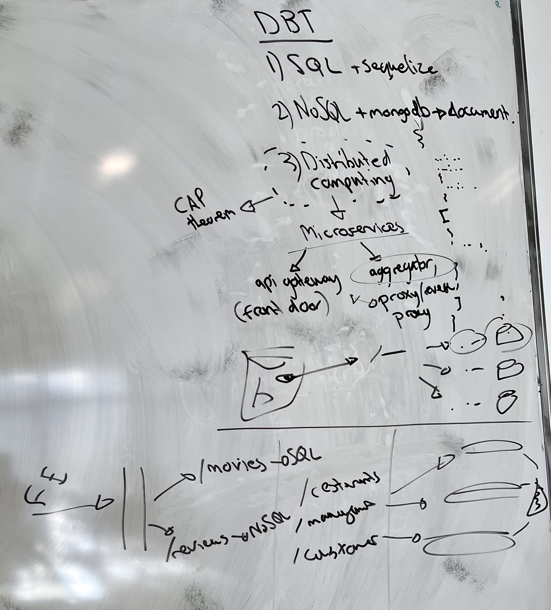
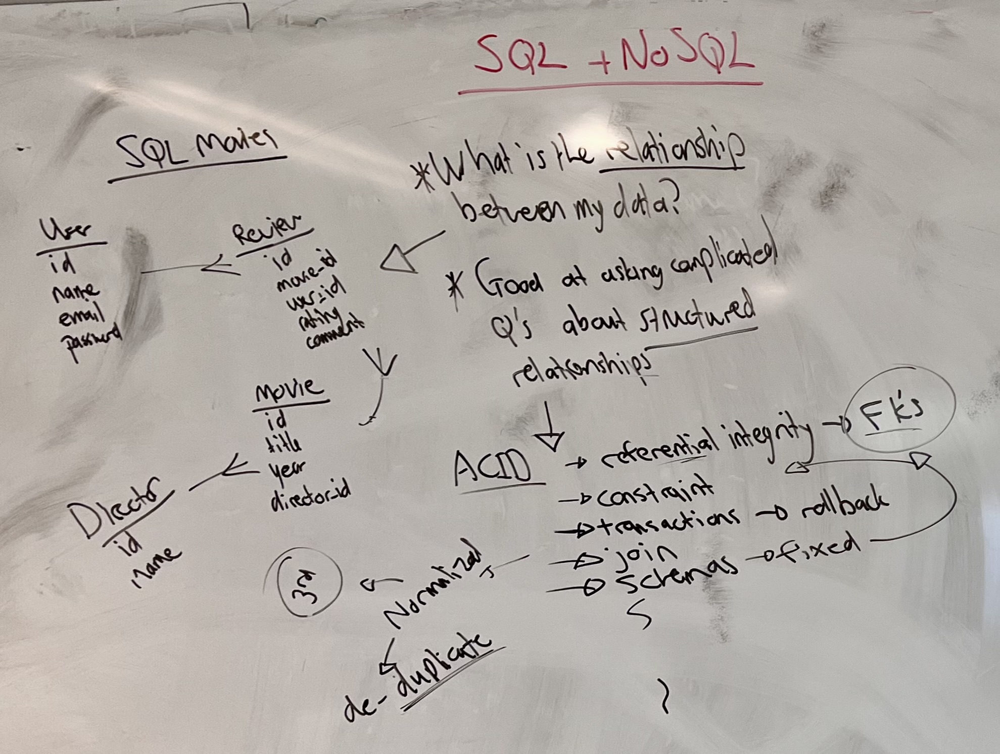
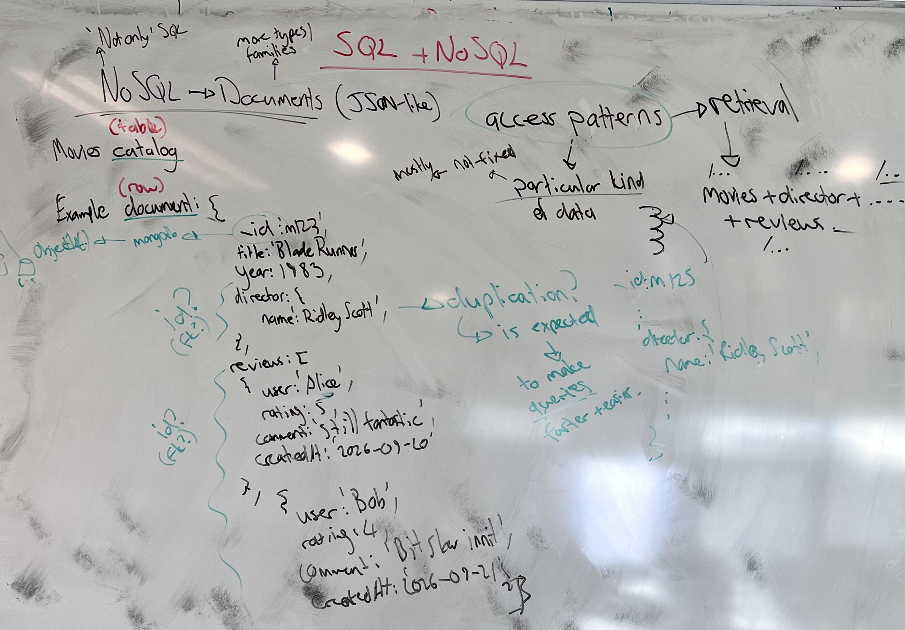
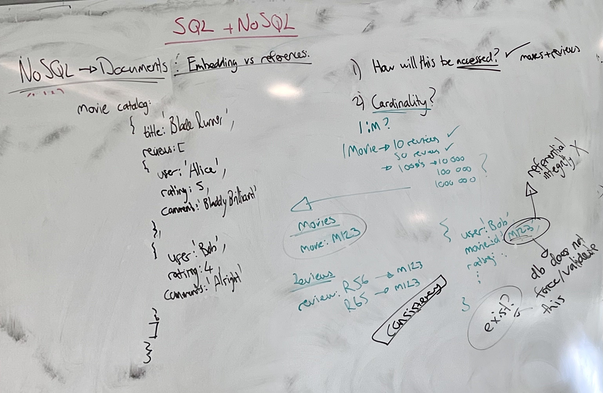
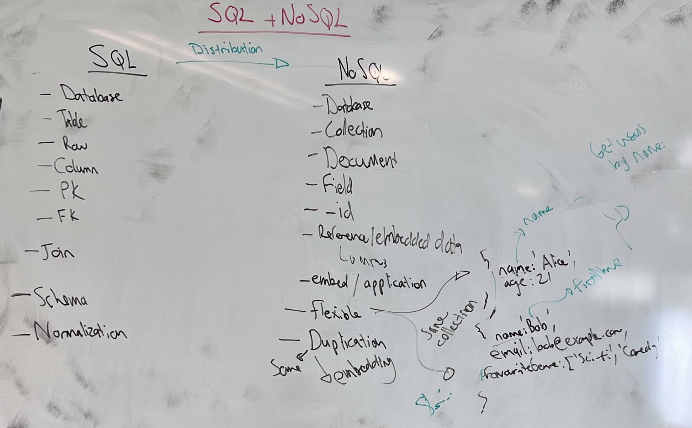
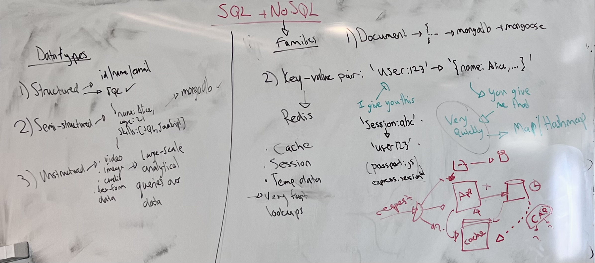

# Introduction to NoSQL and the Document Model

> This lesson introduces NoSQL, and in particular the document model, off the back of the SQL you worked with last week. New terms get a plain-English version in brackets.

## 1. Where we are in the course

This subject runs over three modules, and each one is a different way of storing or splitting up data.



1. **SQL and Sequelize** - last week. Relational databases, T-SQL, and the ORM on top of them.
2. **NoSQL and MongoDB** - this week, focused on documents.
3. **Distributed computing** - next week, focused on microservices, and the last module before the assignment.

The bottom of the board is a sketch of example ssytems that can be build with what we are learning, but its not important for now. 

## 2. What SQL is built for

It helps to remind ourselves of what SQL is for before we look at NoSQL.



To illustrate this, a small schema for a movie site was drawn. It has the following entities: `User`, `Review`, `Movie` and `Director`, with foreign keys and crow's feet between them to capture the relationships. A review points at a movie and at a user. A movie points at a director.

Before any of that could be drawn, you had to answer one question: **what is the relationship between my data?** Entities first, then the lines between them. That question is the entry point to the whole relational model, and SQL is very good at answering complicated questions asked in those terms.

For any of those answers to be worth having, the data has to be trustworthy, and trustworthy means it has **integrity** *[the data obeys the rules the schema declares, at all times]*. For example:

- **ACID** guarantees transactions.
- **Referential integrity**, so a review cannot point at a movie that does not exist. No **orphaned records** *[a row whose foreign key points at something that has been deleted]*.
- **Constraints** and checks, declaring the rules in the schema itself.
- **Transactions** and rollback, so a sequence of statements that ends in an invalid state leaves no trace.
- **Joins**, to bring the separated data back together at query time.
- **Fixed schemas**, which every write is validated against.
- **Normalization** to third normal form, which exists to de-duplicate. One fact lives in one place, you change it there, and every query sees the change.

None of that is free. Shaping data into a relational state is work you do up front, before you store anything, and the payoff comes later when you query it. That is a good trade when relationships are the point. It is a worse trade when they are not.

> SQL is good at asking complicated questions about structured relationships.

## 3. A different starting question

**NoSQL** does not mean "no SQL". It means **not only SQL**. It covers several families of databases that are not relational, and we are starting with **documents** because they are the closest to something you already write: JSON.

The two models start from different questions.

| | The question you start from |
|---|---|
| **Relational** | What are the relationships between my data? |
| **Document** | What does my application need together? |

The second question is about **access patterns** *[the shapes in which your application actually reads and writes data - what gets fetched, how often, and what gets fetched alongside it]*. You are not asking how the data relates. You are asking what a page, a screen or an endpoint needs handed to it in one go.

### 3.1 A movie as a document

With NoSQL there is some new terminology, namely; a **collection** is the table, and a **document** is the row.



```json
{
  "_id": "m123",
  "title": "Blade Runner",
  "year": 1982,
  "director": { "name": "Ridley Scott" },
  "reviews": [
    { "user": "Alice", "rating": 5, "comment": "Still fantastic",  "createdAt": "2026-09-20" },
    { "user": "Bob",   "rating": 4, "comment": "Bit slow innit",   "createdAt": "2026-09-21" }
  ]
}
```

In the relational version, `director` and each review were separate tables reached through a foreign key. Here there is no key and nothing to follow. The director is **embedded** *[stored inside the document itself, rather than in a separate record it points at]*, and so are the reviews.

Rendering a movie page against the relational schema means fetching the movie, then the director, then the reviews - three trips, stitched together in your application code before you can respond. Against this document it is one read, and what comes back is already the shape the page needs.

### 3.2 Why `_id` is not a number

`_id` is MongoDB's name for the primary key, and by default its value is an **ObjectId** *[a 12-byte identifier MongoDB generates, written as a long hexadecimal string]* rather than a number that counts up.

The reason is **sharding** *[splitting one logical collection across several machines, each holding part of the data]*. Suppose documents 1 to 3 live on the first shard, 4 and 5 on the second, and 6 to 10 on the third. You now insert a new document on the first shard. What number does it get? To answer that, the shard would have to ask every other shard what the highest number it has issued is, and do it on every single insert.

So the problem gets avoided instead of solved. An ObjectId is generated in a way that makes it unique on its own, without anyone being consulted. No coordination, no waiting.

This comes back later in the course, so it is enough for now to know why the id looks the way it does.

### 3.3 Duplication is expected

Ridley Scott is inside the Blade Runner document. He is also inside `m125`, and inside every other film he directed. In a normalized relational schema that is exactly the thing you designed the `Director` table to prevent.

Here it is expected, and it is expected because you are optimising for reads. You store the data in the shape you retrieve it in, and the cost of that is storing some of it more than once.

Besides storage, this approach has real consequences. For examples, there is no single place to change his name, so if it has to change it has to change everywhere, and nothing in the database will tell you that you missed one. You can end up with "Ridley Scott" in one document and "Ridly Scott" in another, and a query that looks for one will not find the other.

> Relational databases de-duplicate so that writes are safe; document databases duplicate so that reads are cheap.

## 4. Embedding or referencing

Embedding is not the only option. A document can hold a value that identifies another document, which gives you something that looks like a relationship back.



Two questions decide it, in this order.

**How will this be accessed?** If movies and reviews are always wanted together, that is an argument for embedding. If reviews are usually wanted on their own - a moderation queue, a "your reviews" page - that is an argument against.

**What is the cardinality?** One movie with ten reviews is fine embedded. Fifty is fine. But systems grow, and the same question at a thousand, ten thousand, a hundred thousand, a million reviews has a different answer, because every read of the movie now drags all of them along with it. At that point reviews get their own collection:

```js
// movies collection
{ "_id": "M123", "title": "Blade Runner" }

// reviews collection
{ "_id": "R56", "movieId": "M123", "user": "Bob", "rating": 4 }
{ "_id": "R65", "movieId": "M123", "user": "Alice", "rating": 5 }
```

That `movieId` field looks like a foreign key. **Nothing checks it.** There is no declaration anywhere that says this field refers to the `movies` collection, so the database will happily store `"movieId": "M999"` when no such movie exists, and it will happily let you delete `M123` while two reviews still point at it. You have just created orphans, and nothing will tell you.

In the relational model, referential integrity was a guarantee the database made. Here, keeping references valid is your application's job unless you explicitly ask the database to help - and MongoDB does have features for that, which we will come to.

That is a question about **consistency** *[whether every part of the system agrees about what the data currently is]*.

> A reference in a document is a convention, not a constraint.

## 5. The same ideas under different names



| SQL | Document |
|---|---|
| Database | Database |
| Table | Collection |
| Row | Document |
| Column | Field |
| Primary key | `_id` |
| Foreign key | Reference or embedded data |
| `JOIN` | Embedded document, or application logic |
| Schema | Flexible document structure |
| Normalization | Embedding and selective duplication |
| SQL | A database-specific query API |

### 5.1 Flexible schemas, and where the rules go

Two documents in the *same collection* can have different fields:

```js
{ "name": "Alice", "age": 21 }
{ "name": "Bob", "email": "bob@example.com", "favouriteGenres": ["sci-fi", "horror"] }
```

Nothing rejects either one. That is the **flexible schema** *[the database does not require documents in a collection to have the same fields]*, and it is genuinely useful when the shape of your data is still moving.

Now suppose the second document had `firstName` instead of `name`. Your "get all users called Bob" query returns nothing, and the document is right there in the collection. That is **schema drift** *[documents in one collection gradually diverging in shape, usually because nothing stopped them]*, and it is a bug that never surfaces as an error. It surfaces as missing results.

So the schema has not gone away. It has moved. If the database does not enforce a shape, your application has to, which is why MongoDB offers **schema validation** and constraints - so the rules can be declared once in the database rather than repeated through every route that touches the collection.

### 5.2 When does a project actually move to NoSQL?

It is not a switch anyone flips.

It comes with **scale** and it comes with **distribution**. While the whole application is one service talking to one database, the relational model is doing useful work and costing you little. As it grows and separates - movies, users, reviews, recommendations, each one its own service with its own data, deployed and scaled independently - referential integrity between them stops being available, because there is no longer one database that can see both sides of the relationship. At the same time the access patterns drift: what a service mostly needs is "when we fetch this, give us all of that with it".

Which is why the solution is usually a combination of both appraoches. Parts of a system where relationships and correctness dominate stay relational. Parts that are read constantly in a fixed shape move to documents. From that, your system can grow to accomodate scaling and add in new features are independent services.

## 6. What each one costs

| | Relational | Document |
|---|---|---|
| **Good at** | relationships and joins, constraints and transactions, consistency, complex queries and reporting | flexible structure, natural JSON, easy mapping onto the objects your code already has |
| **You pay in** | up-front modelling, and work at query time to reassemble what you separated | duplicated data, consistency handled in the application, and real pain if the access patterns change later |

A relational schema is designed around the data, so a question nobody anticipated is usually still answerable with a new query. A document schema is designed around the questions, so a question nobody anticipated can mean reshaping documents you have millions of.

This flexibility is also what gets document databases chosen for the wrong reason. You do not have to design a structure before you can store anything, so if you need a front end showing some data, all you need is the data and the shape of it. That is a real advantage, and it is also how projects end up with all the validation logic they avoided writing in the schema written three times over in the application instead.

## 7. Three kinds of data



Documents sit in the middle of a broader picture.

**Structured** data has a fixed shape known in advance - `id | name | age | email`. Rows and columns. This is SQL's home ground.

**Semi-structured** data carries its own description. The field names travel with the values, so two records can differ without anything breaking.

```js
{ "name": "Alice", "age": 21, "skills": ["SQL", "JavaScript"] }
```

This is where documents live, and where MongoDB sits.

**Unstructured** data is video, audio, images, free-form text - things with no field names at all, or so little structure that querying them the way you query a table is not possible. It arrives in large volumes, gets dumped somewhere cheap, and is read by analytical tools that crawl it looking for patterns rather than by queries that ask precise questions. We are not working with unstructured data in this module.

## 8. The other families

Documents are one family of NoSQL database, and there are four in total. The next one is **key-value**.

A key-value store does exactly what the name says. You give it a key, it gives you back the value, very fast:

```
"user:123"     ->  { "name": "Alice", ... }
"session:abc"  ->  "user456"
```

There are no queries, no relationships and no fields to filter on. It is a **hash map** *[the data structure behind a JavaScript object or a `Map` - one key gives you one value in roughly constant time]*, kept in memory, available over the network. 

**Redis** is the most common implementation of this structure. It is used for caching, for session data and for temporary data - we have seen something similar in the first year with what `express-session` and `passport.js` are doing when a user logs in/out.

Once an application is split into services, each with its own data, each service tends to get its own cache. A request routed to one service is answered from that service's cache, and nothing outside that service knows the cache exists, let alone what is in it. So when the underlying data changes, who tells the cache?

That is **cache invalidation**, and it is one of the genuinely hard problems in this field. The difficulty is not clearing a cache, it is knowing when what you are holding has gone **stale** *[still being served, but no longer matching the real data]*.

The same shape shows up without any cache at all. If your database is **replicated** *[the same data kept on several machines so reads can be spread across them]*, a purchase written to one replica takes time to reach the others. Get routed to a different replica in that window and your purchase appears to be missing. It is not missing, it just has not arrived yet, and no amount of engineering removes the delay entirely - it can only be made small. Living with that deliberately is called **eventual consistency**.

The remaining two families, **wide-column** and **graph**, plus CAP theorem, ACID against BASE, and where eventual consistency comes from, are for later lessons.

## 9. Sources

1. MongoDB, *Documents* - [mongodb.com/docs](https://www.mongodb.com/docs/manual/core/document/)
2. MongoDB, *Data Modeling* - [mongodb.com/docs](https://www.mongodb.com/docs/manual/data-modeling/)
3. MongoDB, *BSON Types* (ObjectId) - [mongodb.com/docs](https://www.mongodb.com/docs/manual/reference/bson-types/)
4. MongoDB, *Schema Validation* - [mongodb.com/docs](https://www.mongodb.com/docs/manual/core/schema-validation/)
5. MongoDB, *Sharding* - [mongodb.com/docs](https://www.mongodb.com/docs/manual/sharding/)
6. Redis, *Develop with Redis* - [redis.io/docs](https://redis.io/docs/latest/develop/)
