# Getting Started with MongoDB

> In this lesson you will install MongoDB locally and interact with the server using the mongosh shell. New terms get a plain-English version in brackets.

**By the end of this lesson you should be able to:**

1. **Describe** MongoDB as a document database and the data model it stores.
2. **Distinguish** the operational workload we are using from the other workloads MongoDB supports.
3. **Install** MongoDB Community Server locally and connect to it with `mongosh`.
4. **Explain** the relationship between a database, a collection and a document.
5. **Describe** what BSON adds to JSON and the limits it puts on a document.
6. **Demonstrate** the creation of a database and collection.
7. **Insert** one document or many into a collection.
8. **Write** a `find` query that filters on one or more fields using comparison operators.
9. **Distinguish** between an inclusion projection and an exclusion projection.
10. **Explain** why `_id` can be excluded from an inclusion projection when no other field can.
11. **Update** many documents in one command using a filter and an update operator.
12. **Describe** the three parts an ObjectId is built from.
13. **Explain** why an index makes a lookup cheap.
14. **Contrast** the MongoDB Shell and Compass as ways of running the same query.

## Contents

1. [Where we left off](#1-where-we-left-off)
2. [What MongoDB is](#2-what-mongodb-is)
   - [2.1 A document database](#21-a-document-database)
   - [2.2 The workloads it takes on](#22-the-workloads-it-takes-on)
   - [2.3 Where we sit in that picture](#23-where-we-sit-in-that-picture)
3. [Getting MongoDB running](#3-getting-mongodb-running)
   - [3.1 The server](#31-the-server)
   - [3.2 The shell](#32-the-shell)
   - [3.3 Running it in Docker instead](#33-running-it-in-docker-instead)
4. [Databases, collections and documents](#4-databases-collections-and-documents)
   - [4.1 The three levels](#41-the-three-levels)
   - [4.2 What a document is made of](#42-what-a-document-is-made-of)
5. [Creating a database and a collection](#5-creating-a-database-and-a-collection)
   - [5.1 Switching to a database that does not exist yet](#51-switching-to-a-database-that-does-not-exist-yet)
   - [5.2 The first document](#52-the-first-document)
6. [Where the `_id` comes from](#6-where-the-_id-comes-from)
   - [6.1 The three parts of an ObjectId](#61-the-three-parts-of-an-objectid)
   - [6.2 Why that makes indexes matter](#62-why-that-makes-indexes-matter)
7. [CRUD](#7-crud)
   - [7.1 The four operations](#71-the-four-operations)
   - [7.2 A collection to practise on](#72-a-collection-to-practise-on)
8. [Filtering](#8-filtering)
   - [8.1 One condition](#81-one-condition)
   - [8.2 Several conditions](#82-several-conditions)
9. [Choosing which fields come back](#9-choosing-which-fields-come-back)
   - [9.1 Leaving a field out](#91-leaving-a-field-out)
   - [9.2 Asking for specific fields](#92-asking-for-specific-fields)
   - [9.3 `_id` is the exception](#93-_id-is-the-exception)
10. [Updating and removing documents](#10-updating-and-removing-documents)
    - [10.1 Updating many at once](#101-updating-many-at-once)
    - [10.2 Removing documents](#102-removing-documents)
11. [The same queries in Compass](#11-the-same-queries-in-compass)
12. [Asking for the query in English](#12-asking-for-the-query-in-english)
13. [Command reference](#13-command-reference)
14. [Sources](#14-sources)

## 1. Where we left off

[Last lesson](../01-intro-to-nosql/lecture.md) was about the shape of the thing: collections and documents, `_id`, embedding against referencing, and what you give up when the database stops enforcing referential integrity. All of that was the document model in general. MongoDB is the particular product that implements it, and it is the one we use for the rest of this module.

[Back to contents](#contents)

## 2. What MongoDB is

### 2.1 A document database

The [MongoDB Manual](https://www.mongodb.com/docs/manual/) opens by describing MongoDB as a document database that stores data in flexible, JSON-like documents, so you can model data the same way your application code uses it.

**Document** is the unit. Not a row spread over several tables, but one record holding everything that belongs together, which is the model you met last lesson.

**JSON-like** means the structure you write in JavaScript goes in more or less as you wrote it. There is no object-relational mapper in between turning objects into rows and back, which is the layer Sequelize was doing for us in module 1.

**Flexible** means the schema is not declared in advance, so you can change the shape of what you store without migrating what is already there. The manual's phrasing is that you can evolve your data model without downtime.

### 2.2 The workloads it takes on

The manual goes further than "it stores documents". It calls MongoDB a **fully-transactional operational database** that supports a range of workload types:

| Workload | What it means |
|---|---|
| Document-based structured search (**OLTP**) | The everyday reads and writes an application makes - the thing we are doing today |
| **Aggregation** | Grouping, joining and computing over many documents in a pipeline |
| **Full-text search** | Searching the words inside documents, rather than matching a field exactly |
| **Vector search** | Searching by meaning rather than by wording |
| **Geospatial search** | Queries about location - what is near this point, what falls inside this area |
| **Time series** | Measurements arriving continuously, stored and queried by time |

**Transactions.** A **transaction** *[a group of operations that either all take effect or none do]* is the guarantee you associate with SQL and ACID. MongoDB has multi-document ACID transactions, but the manual is blunt about when to use them: an operation on a single document is already atomic, so if related data is embedded in one document, you do not need a transaction to keep it consistent. It also warns that a distributed transaction costs more than a single-document write and is not a substitute for designing the documents properly ([Transactions](https://www.mongodb.com/docs/manual/core/transactions/)). Embedding, from last lesson, is what buys you consistency here - the transaction is the fallback when the data genuinely will not fit in one document.

**Time series.** A [time series collection](https://www.mongodb.com/docs/manual/core/timeseries-collections/) is a special kind of collection for measurements that arrive continuously - sensor readings, stock ticks, application metrics, logs. You declare which field holds the timestamp and which field identifies the series, and MongoDB stores the data in a columnar format organised by time, which cuts disk usage and makes queries over a time range much cheaper. This is the same workload the wide-column stores from last lesson's self-study were built for, solved a different way.

**Vector search.** A **vector embedding** *[an array of numbers produced by a model, positioning a piece of text or an image by its meaning]* lets you search for things that mean the same rather than things that are spelled the same. Search for "red fruit" and a vector search returns apples and strawberries without either word appearing. This is the machinery under retrieval-augmented generation, where an application finds the relevant documents and hands them to a language model as context ([Vector Search overview](https://www.mongodb.com/docs/atlas/atlas-vector-search/vector-search-overview/)). Note that this one is not in the Community Server you are about to install - it comes with Atlas, MongoDB's hosted service, or a self-managed deployment configured for it.

### 2.3 Where we sit in that picture

We are using MongoDB as an **operational database** *[the database an application reads from and writes to while it is running, as opposed to one used for analysis after the fact]*. Documents in, documents out, filtered and updated as an application would. Everything in this lesson is that first row of the table.

The rest of the table is there so that you know it exists. When somebody says a company runs MongoDB, they might mean any of those six things, and the shape of the data they are storing will be very different in each case.

[Back to contents](#contents)

## 3. Getting MongoDB running

For our setup, we will need two things:

### 3.1 The server

**MongoDB Community Server** is the database itself - the process that holds your data and answers queries. The program is called `mongod`, and once installed it sits there listening on port `27017`.

Download it from [mongodb.com/try/download/community](https://www.mongodb.com/try/download/community). On Windows the installer will offer to run it as a service, which means it starts with the machine and you never think about it again. In other OS's you may need to manually start the service, or you will get a connection refused error.

### 3.2 The shell

**`mongosh`**, the MongoDB Shell, is the client. It connects to the server and gives you a prompt to type commands into. Download it from [mongodb.com/try/download/shell](https://www.mongodb.com/try/download/shell), and the [shell documentation](https://www.mongodb.com/docs/mongodb-shell/) covers the connection options we are not using.

Run `mongosh` with no arguments and it connects to `mongodb://127.0.0.1:27017` - the server on your own machine, on the default port. The prompt it drops you at is `test>`, which is the database you are currently pointed at.

What you type into it is JavaScript. The shell is a JavaScript environment, which is why filters and documents get written as object literals rather than in a separate query language.

### 3.3 Running it in Docker instead

If you would rather not install a server on your machine, you can run one in a container. This worked fine for students in class who went that route, and if you have done [the Docker lesson](../../../01-cloud-services/module-1/04-intro-to-docker/lecture.md) there is nothing new in it:

```bash
docker run --name mongodb -p 27017:27017 -d mongodb/mongodb-community-server:latest
```

The `-p 27017:27017` publishes the container's port on your machine, so `mongosh` on the host connects exactly as it would to an installed server. You still install the shell separately. The full instructions are in [Install MongoDB Community With Docker](https://www.mongodb.com/docs/manual/administration/install-community-docker/).

[Back to contents](#contents)

## 4. Databases, collections and documents

Two of these three words are borrowed from SQL, and both mean something slightly different here.

### 4.1 The three levels

The manual's page on [Databases and Collections](https://www.mongodb.com/docs/manual/core/databases-and-collections/) defines them as a nesting:

| Level | What it is |
|---|---|
| **Database** | A container holding one or more collections |
| **Collection** | A grouping of documents, the rough equivalent of a table |
| **Document** | One record, the basic unit of data |

One server holds many databases, one database holds many collections, one collection holds many documents. An application typically owns one database.

The difference from SQL is at the collection level. A table declares its columns before it will accept a row. A collection declares nothing - the manual's wording is that collections do not require their documents to have the same schema by default. *By default* is doing work in that sentence: you can turn a schema on with **schema validation**, which is how you get the guarantees back when you want them.

The other difference is that you do not have to create either one first. MongoDB creates a database and a collection implicitly, the first time you write to them:

```js
use myNewDB                            // nothing exists yet
db.myNewCollection.insertOne( { x: 1 } )   // now both do
```

We will use the explicit `createCollection` in a moment, because watching the database appear makes the point better than having it happen silently. Both routes give you the same result.

### 4.2 What a document is made of

The [Documents](https://www.mongodb.com/docs/manual/core/document/) page calls a document the basic unit of data, and says it is stored as **BSON** *[Binary JSON - JSON's structure, stored as binary, with more types than JSON has]*.

BSON is why a document is not simply JSON. JSON has strings, numbers, booleans, arrays, objects and null. BSON adds the types a database needs: a proper date, a 32-bit and a 64-bit integer as distinct things, a decimal for money, binary data, and `ObjectId`. When the shell prints `ObjectId('6ab38f...')` rather than a plain string, that is a BSON type being shown to you as what it is.

A few rules come with the format:

- **Field names must be unique within a document.** Duplicates are not supported.
- **`_id` is reserved** as the primary key. It has to be unique in the collection, it cannot be changed once written, and it can be almost any BSON type - just not an array. If you leave it out, MongoDB generates an ObjectId for you, which is what we are about to watch happen.
- **`_id` is always the first field.** If you insert a document with it somewhere in the middle, the server moves it to the front.
- **A document cannot exceed 16 MB.** That is a real cap on embedding. Last lesson's question about a movie with a million reviews has a hard answer here: at some point the embedded array will not fit, and referencing stops being a design preference. For files bigger than the limit there is a separate API, GridFS.

> A collection does not care what shape its documents are. The 16 MB limit is the one thing it will not negotiate.

[Back to contents](#contents)

## 5. Creating a database and a collection

### 5.1 Switching to a database that does not exist yet

`show dbs` lists the databases on the server. On a fresh install you get three, and none of them are yours:

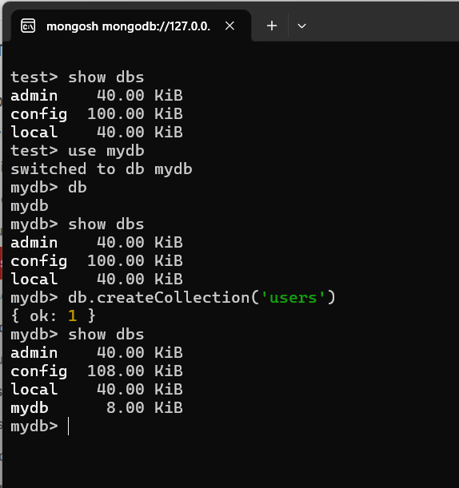

`admin`, `config` and `local` are MongoDB's own. `admin` holds users and roles, `config` holds internal configuration, and `local` holds data that is specific to that one server. Leave all three alone.

`use mydb` switches you to a database called `mydb`, and the prompt changes to `mydb>` to prove it. Typing `db` on its own confirms which one you are pointed at.

Then run `show dbs` again. `mydb` is not in the list.

Switching to a database does not create it. The prompt says `mydb`, `db` says `mydb`, and there is still no such database on the server - `use` has set your **context** *[which database the commands you type will be sent to]* and nothing more. This is the implicit creation from 4.1 seen from the other side: nothing gets written to disk until something needs storing.

Give it a reason to exist:

```js
db.createCollection('users')
```

```js
{ ok: 1 }
```

Now `show dbs` lists `mydb` at 8.00 KiB. The collection is what the database was waiting for.

> `use` sets your context. The database gets created when something needs to be stored in it.

### 5.2 The first document

`show collections` lists what is in the current database, and `users` is now there. Put something in it:

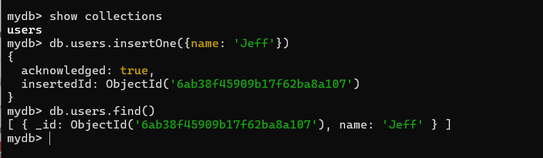

```js
db.users.insertOne({ name: 'Jeff' })
```

```js
{
  acknowledged: true,
  insertedId: ObjectId('6ab38f45909b17f62ba8a107')
}
```

We never described what a user is. There is no declaration anywhere that a user has a name, or that the name is a string, or that it is required. We told MongoDB that a `users` collection exists and then handed it an object, and the object went in. Any other shape would also have gone in - that is the flexible schema, in practice.

`db.createCollection` came back as `{ ok: 1 }`, which is the raw response format a database command has used for a long time. `insertOne` comes back as an object with `acknowledged: true`, which is the shell's driver telling you the server confirmed the write. Same idea, two different layers answering, and you will see both formats as you work.

`db.users.find()` returns every document in the collection, and there is the one we inserted - with an `_id` on it that we never supplied.

[Back to contents](#contents)

## 6. Where the `_id` comes from

Last lesson we covered *why* the `_id` is a long hexadecimal string rather than a number that counts up: in a **sharded** *[split across several machines, each holding part of the data]* deployment, handing out the next number means asking every other machine what it has already used, on every single insert. An **ObjectId** avoids the question by being unique without anyone being consulted.

### 6.1 The three parts of an ObjectId

An ObjectId is 12 bytes, and the [BSON types reference](https://www.mongodb.com/docs/manual/reference/bson-types/) breaks it into three pieces:

| Bytes | What it is |
|---|---|
| 4 | A timestamp - seconds since the Unix epoch, when the ObjectId was created |
| 5 | A random value, generated once per process and reused for that process's lifetime |
| 3 | A counter, starting at a random number and incrementing with each ObjectId |

That is why it is not a **GUID** *[a globally unique identifier, generated purely at random]*, even though it is doing a GUID's job - it is not random all the way through. The timestamp separates two processes running at different times, the random per-process value separates two processes running at the same time, and the counter separates two inserts from the same process in the same second.

None of those three require talking to another machine. Look back at the bulk insert in the next section and you can see the counter working: the ids run `...107`, `...108`, `...109`, `...10a`, `...10b`, all the way to `...110`. The front of each string is identical and only the tail moves.

Because the timestamp sits at the front, sorting by `_id` sorts roughly by insertion time.

### 6.2 Why that makes indexes matter

Finding a document by its `_id` means finding one 12-byte value among however many the collection holds. Without help, the only way to do that is to read every document in the collection and compare - a **collection scan**. A thousand documents is nothing. Ten million, and every lookup reads ten million documents.

An **index** *[a separate structure the database keeps alongside the collection, holding one field's values in sorted order]* is the help. The manual's [Indexes](https://www.mongodb.com/docs/manual/indexes/) page says MongoDB's indexes are B-trees, which means the values are kept ordered and the database can discard most of them at each step rather than walking the lot. What the index stores against each value is enough to go and fetch the actual document.

You do not have to create the one on `_id`. Every collection gets a unique index on `_id` automatically, which is why Compass reports `Indexes 1` on a collection you have never configured. Any other field you filter on a lot is a candidate for one of your own.

Indexes are not free. Every insert and every update has to update the index as well as the document, so a collection written to constantly and read from rarely pays for indexes it is not using.

> Without an index the database reads everything to find one thing.

[Back to contents](#contents)

## 7. CRUD

### 7.1 The four operations

Everything from here on is CRUD - create, read, update, delete - and the manual's [CRUD Operations](https://www.mongodb.com/docs/manual/crud/) section is organised exactly that way:

| | Methods |
|---|---|
| **Create** | `insertOne`, `insertMany` |
| **Read** | `find` |
| **Update** | `updateOne`, `updateMany`, `replaceOne` |
| **Delete** | `deleteOne`, `deleteMany` |

Two things the manual repeats under every one of those headings, which are worth having before you start.

**Every operation targets a single collection.** There is no statement that writes to two collections, the way a SQL statement can join across tables. If a piece of work spans two collections, that is two operations from your application.

**Every write is atomic at the level of one document.** A single document either takes the whole update or none of it, and no reader ever sees it half-updated. That guarantee stops at the document boundary, which is the reason section 2.2 said embedding buys you consistency: data inside one document is covered by this automatically, data spread across two documents is not.

### 7.2 A collection to practise on

One document is not enough to query against, so we made a second collection with something to filter on:

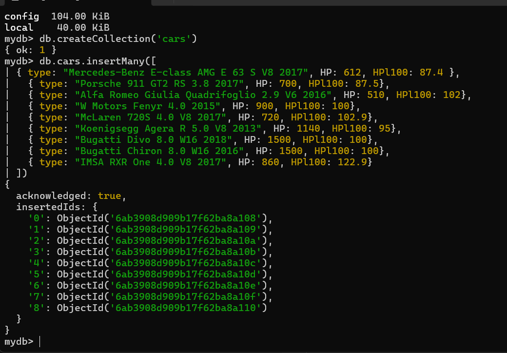

```js
db.createCollection('cars')

db.cars.insertMany([
  { type: "Mercedes-Benz E-class AMG E 63 S V8 2017", HP: 612, HPl100: 87.4 },
  { type: "Porsche 911 GT2 RS 3.8 2017", HP: 700, HPl100: 87.5},
  { type: "Alfa Romeo Giulia Quadrifoglio 2.9 V6 2016", HP: 510, HPl100: 102},
  { type: "W Motors Fenyr 4.0 2015", HP: 900, HPl100: 100},
  { type: "McLaren 720S 4.0 V8 2017", HP: 720, HPl100: 102.9},
  { type: "Koenigsegg Agera R 5.0 V8 2013", HP: 1140, HPl100: 95},
  { type: "Bugatti Divo 8.0 W16 2018", HP: 1500, HPl100: 100},
  { type: "Bugatti Chiron 8.0 W16 2016", HP: 1500, HPl100: 100},
  { type: "IMSA RXR One 4.0 V8 2017", HP: 860, HPl100: 122.9}
])
```

`insertMany` takes an array and comes back with an `insertedIds` object - one generated ObjectId per document, keyed by its position in the array you passed.

Every document here happens to have the same three fields, which is a choice we made rather than a rule the collection enforced. Adding a tenth car with a `torque` field and no `HPl100` would be accepted without complaint.

`db.cars.find()` with no arguments gives you all nine. Chain `.limit(2)` and you get the first two:

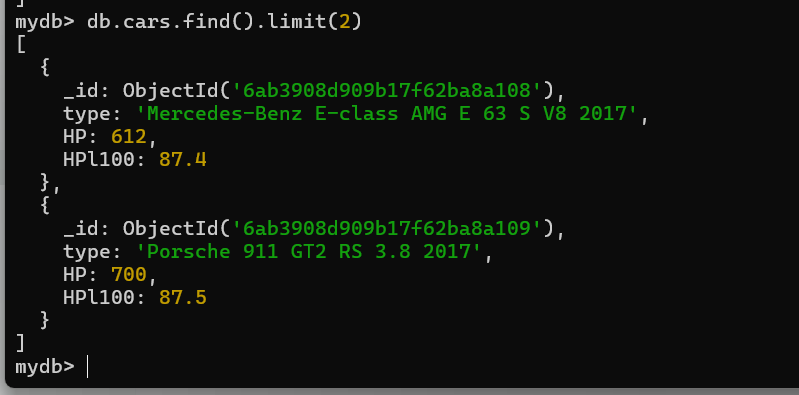

```js
db.cars.find().limit(2)
```

Every field comes back, including the `_id` we did not ask for. Both of those are defaults we are about to change.

[Back to contents](#contents)

## 8. Filtering

### 8.1 One condition

`find` takes an object, and that object is the filter:

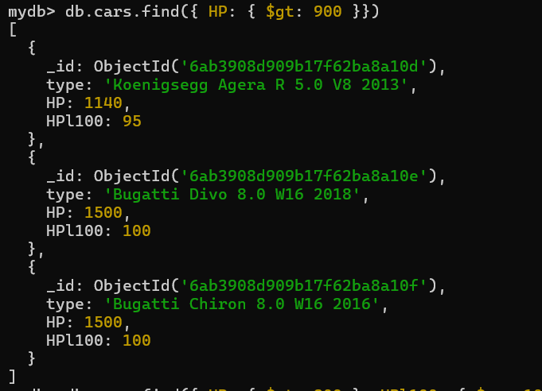

```js
db.cars.find({ HP: { $gt: 900 }})
```

Read it from the outside in. The outer object is the filter. Each property in it names a field to test - here, `HP`. The value is not the value you are looking for; it is another object, saying *how* to test. `$gt` is greater than, and `900` is what to compare against.

Three cars come back: the Koenigsegg at 1140 and the two Bugattis at 1500 each. The W Motors Fenyr at exactly 900 does not, because `$gt` is strictly greater than.

Operators beginning with `$` are how MongoDB distinguishes an instruction from a field name. `$gt` is one of the eight in [Comparison Query Operators](https://www.mongodb.com/docs/manual/reference/operator/query-comparison/), all eight of which are in [section 13](#13-command-reference).

### 8.2 Several conditions

Add another property to the filter object and you have added another condition:

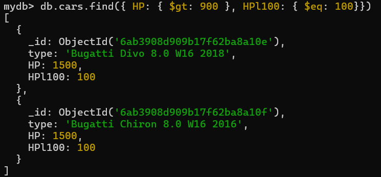

```js
db.cars.find({ HP: { $gt: 900 }, HPl100: { $eq: 100}})
```

Now it is horsepower above 900 **and** `HPl100` exactly 100, and the Koenigsegg drops out on the second condition. Every property you add is another test the document has to pass, so a filter object with three properties is three conditions joined with AND.

`$or` does the other one. It takes an array of whole filters rather than sitting inside a field, and it is in the query operator reference alongside the comparison operators.

[Back to contents](#contents)

## 9. Choosing which fields come back

So far every query has returned whole documents. `find` takes a *second* object, called the **projection** *[the specification of which fields to return, rather than which documents]*, and each property in it is a field you want either kept or dropped. `1` means include, `0` means exclude. The manual covers this under [Project Fields to Return from Query](https://www.mongodb.com/docs/manual/tutorial/project-fields-from-query-results/).

### 9.1 Leaving a field out

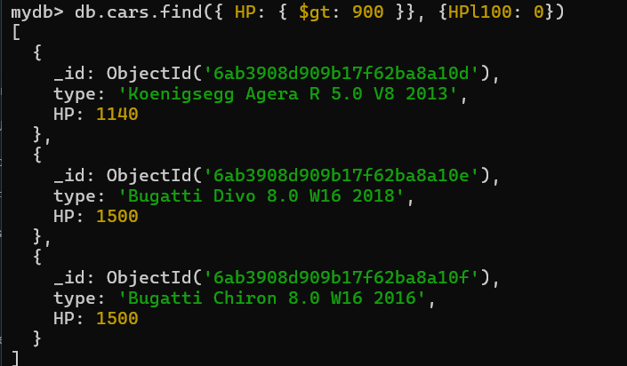

```js
db.cars.find({ HP: { $gt: 900 }}, {HPl100: 0})
```

Same three cars as before, minus one field. `HPl100` is named with a `0`, so it does not come back. Everything not named is returned as normal - this is an **exclusion projection**, and naming one field to drop is all you have to do.

### 9.2 Asking for specific fields

The other direction is to name what you want:

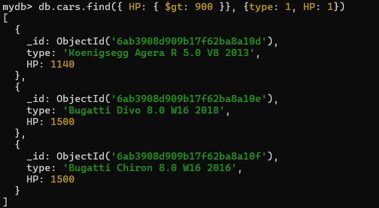

```js
db.cars.find({ HP: { $gt: 900 }}, {type: 1, HP: 1})
```

An **inclusion projection**. We asked for `type` and `HP`, and we got `type`, `HP` and `_id`.

`_id` comes back whether you ask for it or not. It is the field that identifies the document, and a result set you cannot map back to the documents it came from is usually not what anyone wanted. If you are rendering these cars in a front end, the `_id` is what a click has to send back to the server, and you would carry it in a hidden field rather than showing it to the user.

### 9.3 `_id` is the exception

If you genuinely do not want it, you can say so:

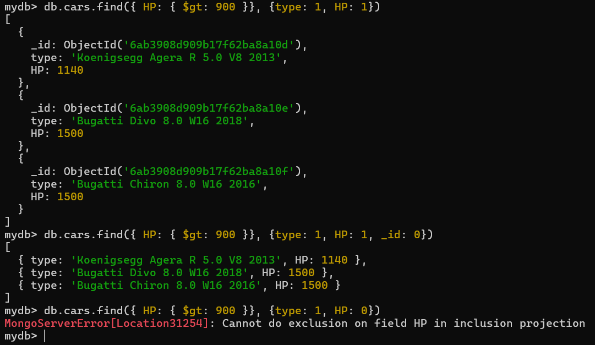

```js
db.cars.find({ HP: { $gt: 900 }}, {type: 1, HP: 1, _id: 0})
```

```js
[
  { type: 'Koenigsegg Agera R 5.0 V8 2013', HP: 1140 },
  { type: 'Bugatti Divo 8.0 W16 2018', HP: 1500 },
  { type: 'Bugatti Chiron 8.0 W16 2016', HP: 1500 }
]
```

Two `1`s and a `0` in the same projection, and it works. So the natural next move is to mix them on ordinary fields - include `type`, exclude `HP`:

```js
db.cars.find({ HP: { $gt: 900 }}, {type: 1, HP: 0})
```

```js
MongoServerError[Location31254]: Cannot do exclusion on field HP in inclusion projection
```

A projection is one thing or the other. Either it is a list of the fields you want, and everything else is dropped, or it is a list of the fields you do not want, and everything else is kept. The moment `type: 1` appears, MongoDB has decided this is an inclusion projection, and `HP: 0` is then asking it to exclude a field that was already being excluded by not being mentioned.

`_id` gets to break that rule because it is the only field that is included by default. Turning it off is not mixing two modes, it is switching off the one exception.

> A projection is a list of what you want or a list of what you don't. `_id` is the only field allowed in the wrong list.

The two-objects-to-`find` syntax is what the shell and Compass use. When we come to query MongoDB from an Express application, the filter and the projection are still the same two objects - they just get handed over differently.

[Back to contents](#contents)

## 10. Updating and removing documents

### 10.1 Updating many at once

There are methods for updating a single document, but the bulk version shows the shape more clearly, and the single version is the same thing with a narrower filter:

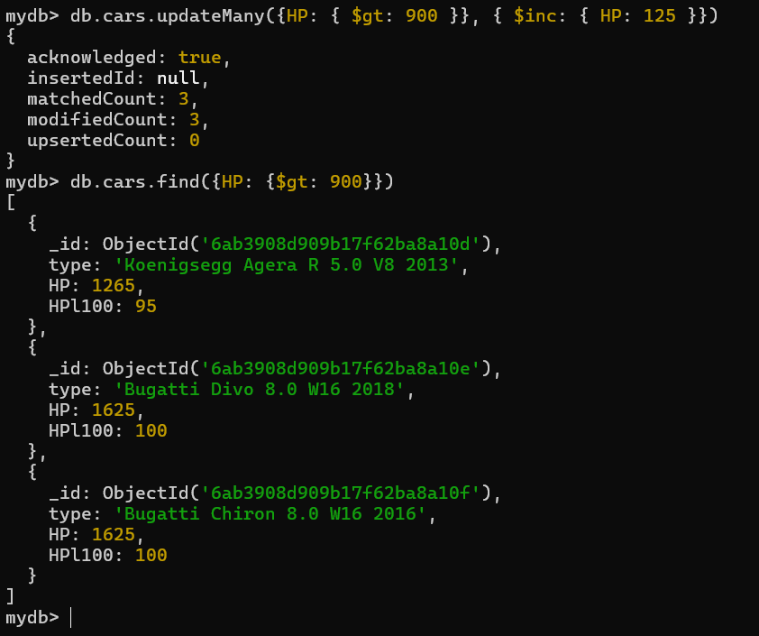

```js
db.cars.updateMany({HP: { $gt: 900 }}, { $inc: { HP: 125 }})
```

Two objects again, and they split the work between them. The first says **which** documents, the second says **what to do** to them. The first object is the filter you have already been writing. The second uses an **update operator** - `$inc` increments a field by the amount you give it, so every matching car gains 125 horsepower. The full set is in [Update Operators](https://www.mongodb.com/docs/manual/reference/operator/update/).

```js
{
  acknowledged: true,
  insertedId: null,
  matchedCount: 3,
  modifiedCount: 3,
  upsertedCount: 0
}
```

`matchedCount` and `modifiedCount` are reported separately on purpose. Three documents matched the filter and three were changed, but those numbers can differ - setting a field to the value it already holds matches without modifying.

`upsertedCount` is zero because we did not ask for an **upsert** *[update the matching documents, or insert a new one if nothing matched]*. It is an option on the update rather than the default.

Running the same find afterwards shows 1265, 1625 and 1625.

The other operator you will reach for constantly is `$set`, which assigns a value rather than adding to one. One of them has to be there: hand `updateMany` a plain object with no operator in it and it errors rather than treating it as a partial update. Replacing a document wholesale is a separate method, `replaceOne`.

### 10.2 Removing documents

Deletes take the same filter object as everything else:

```js
db.cars.deleteOne({ type: "Bugatti Divo 8.0 W16 2018" })  // the first match, and only that one
db.cars.deleteMany({ HP: { $lt: 700 } })                   // every match
```

`db.cars.drop()` removes the whole collection, and `db.dropDatabase()` removes the database you are currently pointed at. Practise both on `mydb`, where it costs nothing.

[Back to contents](#contents)

## 11. The same queries in Compass

**MongoDB Compass** is the graphical client - a GUI for querying, aggregating and analysing your data, in [its own documentation's](https://www.mongodb.com/docs/compass/) words. Connect it to the same server, and `mydb` and `cars` are in the sidebar with the nine documents we inserted:

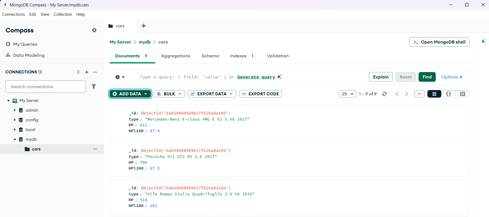

The query bar at the top takes the filter object - the same object, typed the same way:

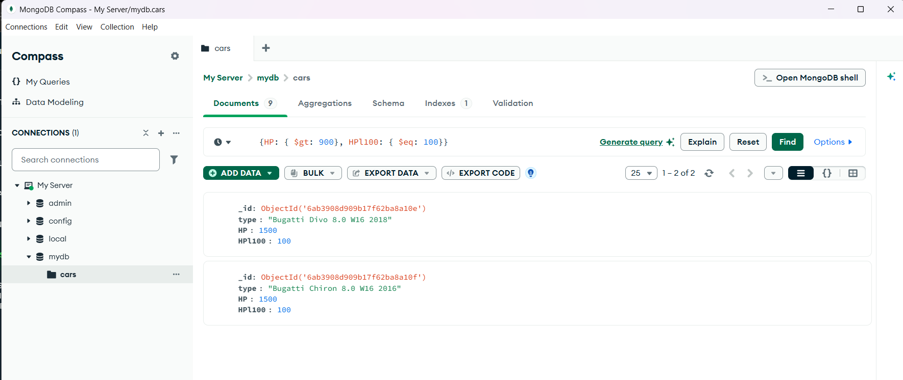

Open **Options** and the projection gets its own box, labelled **Project**, alongside sort, skip and limit:

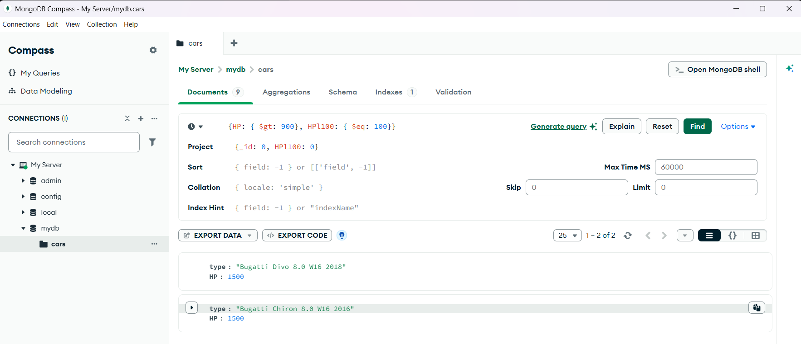

Nothing here is a different way of querying MongoDB. It is the same filter and the same projection in separate input boxes instead of separate arguments.

Use the shell to practise. Typing the query is what makes the syntax stick, and it is closer to what querying from Node will feel like. Compass earns its place when you want to see what is actually in a collection without composing a query to find out - and the tabs along the top of it, **Aggregations**, **Schema**, **Indexes** and **Validation**, are four topics from section 2 and section 4 with a user interface on them.

[Back to contents](#contents)

## 12. Asking for the query in English

The **Generate query** link in the Compass screenshots above does what it says: you describe what you want in English and it writes the filter. MongoDB documents the approach, including prompt patterns for getting a usable query out of a general-purpose LLM, in [Natural Language to MongoDB Queries](https://www.mongodb.com/docs/manual/natural-language-to-mongodb/).

What that page mostly recommends is context: give the model a couple of real documents from the collection and its indexes, not just the question.

This gets useful once queries get long. A filter that returns plausible results is not the same as a filter that asks the question you meant, and the difference is invisible unless you can read the syntax yourself.

[Back to contents](#contents)

## 13. Command reference

Everything in the shell hangs off `db`, which is whichever database `use` last pointed you at.

| Command | What it does |
|---|---|
| `show dbs` | List the databases on the server |
| `use <name>` | Point at a database, creating nothing |
| `db` | Show which database you are pointed at |
| `show collections` | List the collections in the current database |
| `db.createCollection('<name>')` | Create a collection |
| `db.<coll>.insertOne({...})` | Insert one document |
| `db.<coll>.insertMany([{...}])` | Insert an array of documents |
| `db.<coll>.find(filter, projection)` | Find documents, both arguments optional |
| `db.<coll>.find().limit(n)` | Cap the number of results |
| `db.<coll>.updateMany(filter, update)` | Update every matching document |
| `db.<coll>.deleteMany(filter)` | Delete every matching document |
| `db.<coll>.drop()` | Delete the collection |
| `db.dropDatabase()` | Delete the current database |

Comparison operators, for the inner object of a filter:

| Operator | Matches |
|---|---|
| `$eq` | Equal to the value |
| `$ne` | Not equal to the value |
| `$gt` | Greater than |
| `$gte` | Greater than or equal to |
| `$lt` | Less than |
| `$lte` | Less than or equal to |
| `$in` | Equal to any value in an array |
| `$nin` | Equal to none of the values in an array |

[Back to contents](#contents)

## 14. Sources

1. MongoDB, *MongoDB Manual* - [mongodb.com/docs/manual](https://www.mongodb.com/docs/manual/)
2. MongoDB, *Install MongoDB Community Edition* - [mongodb.com/try/download/community](https://www.mongodb.com/try/download/community)
3. MongoDB, *Download MongoDB Shell* - [mongodb.com/try/download/shell](https://www.mongodb.com/try/download/shell)
4. MongoDB, *MongoDB Shell documentation* - [mongodb.com/docs/mongodb-shell](https://www.mongodb.com/docs/mongodb-shell/)
5. MongoDB, *Install MongoDB Community With Docker* - [mongodb.com/docs](https://www.mongodb.com/docs/manual/administration/install-community-docker/)
6. MongoDB, *Databases and Collections* - [mongodb.com/docs](https://www.mongodb.com/docs/manual/core/databases-and-collections/)
7. MongoDB, *Documents* - [mongodb.com/docs](https://www.mongodb.com/docs/manual/core/document/)
8. MongoDB, *CRUD Operations* - [mongodb.com/docs](https://www.mongodb.com/docs/manual/crud/)
9. MongoDB, *Transactions* - [mongodb.com/docs](https://www.mongodb.com/docs/manual/core/transactions/)
10. MongoDB, *Time Series Collections* - [mongodb.com/docs](https://www.mongodb.com/docs/manual/core/timeseries-collections/)
11. MongoDB, *Vector Search overview* - [mongodb.com/docs](https://www.mongodb.com/docs/atlas/atlas-vector-search/vector-search-overview/)
12. MongoDB, *Comparison Query Operators* - [mongodb.com/docs](https://www.mongodb.com/docs/manual/reference/operator/query-comparison/)
13. MongoDB, *Project Fields to Return from Query* - [mongodb.com/docs](https://www.mongodb.com/docs/manual/tutorial/project-fields-from-query-results/)
14. MongoDB, *Update Operators* - [mongodb.com/docs](https://www.mongodb.com/docs/manual/reference/operator/update/)
15. MongoDB, *BSON Types* (ObjectId) - [mongodb.com/docs](https://www.mongodb.com/docs/manual/reference/bson-types/)
16. MongoDB, *Indexes* - [mongodb.com/docs](https://www.mongodb.com/docs/manual/indexes/)
17. MongoDB, *Compass documentation* - [mongodb.com/docs/compass](https://www.mongodb.com/docs/compass/)
18. MongoDB, *Natural Language to MongoDB Queries* - [mongodb.com/docs](https://www.mongodb.com/docs/manual/natural-language-to-mongodb/)

[Back to contents](#contents)
