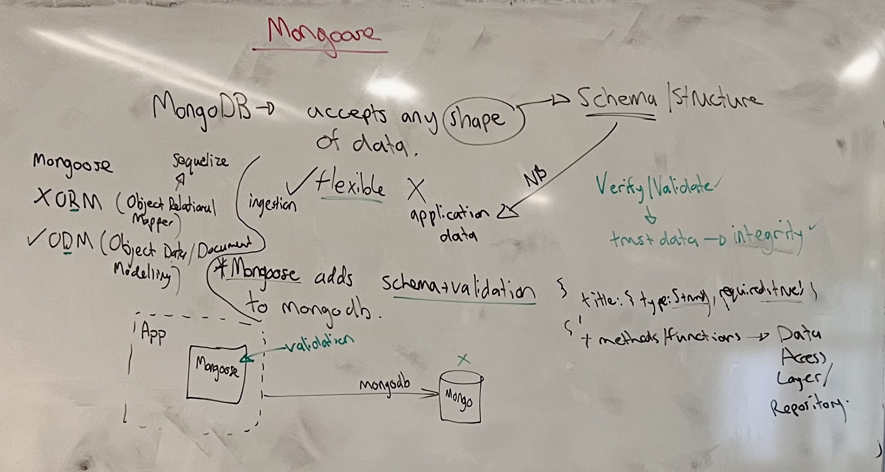
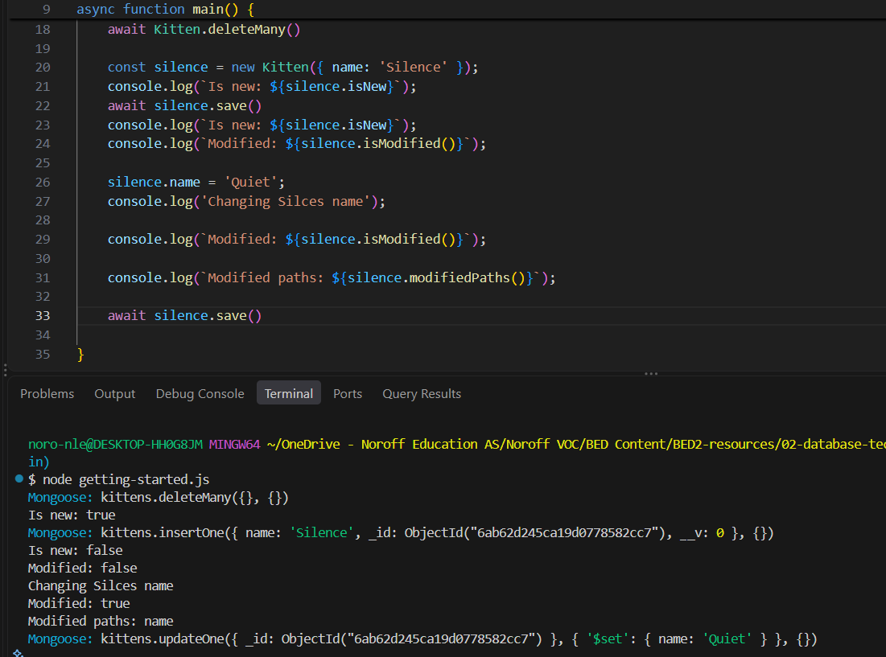
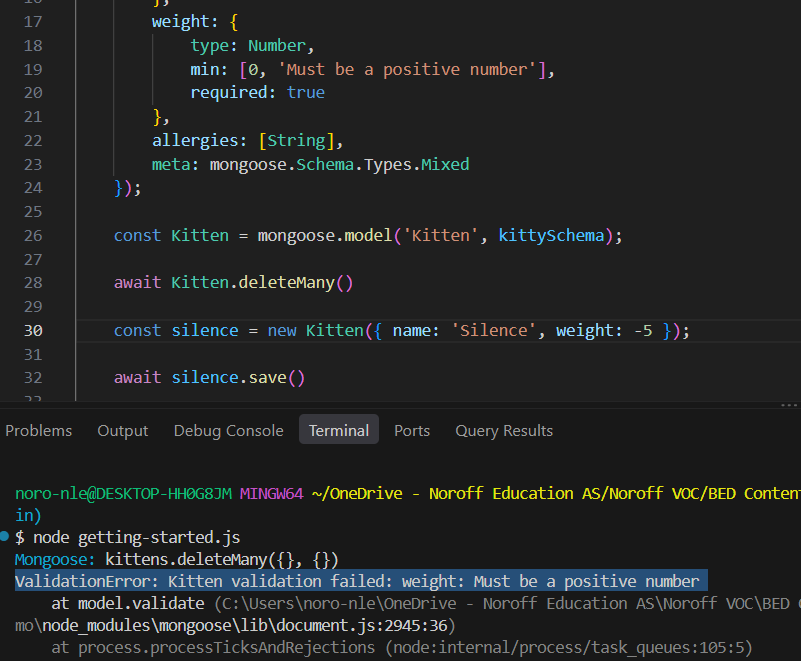
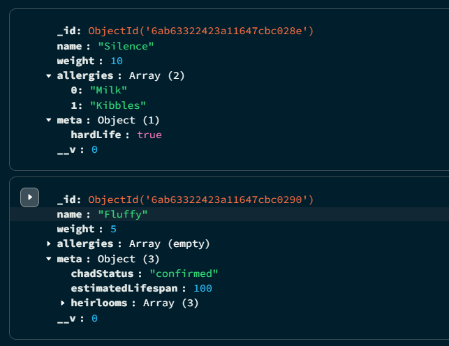
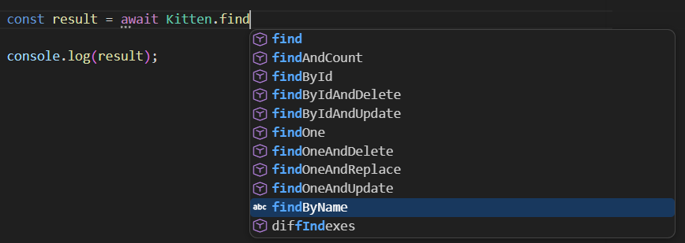

# Introduction to Mongoose

> In this lesson you will follow the Mongoose getting started guide to save a kitten to a local MongoDB database, rename it, and watch Mongoose track that change between your code and the database. Then you will give the kittens a schema with validation rules, handle the `ValidationError` that breaking those rules produces, move a search by name onto the model as a static, and add timestamps to every document. New terms get a plain-English version in brackets.

**By the end of this lesson you should be able to:**

1. **Explain** why application data needs a schema even though MongoDB accepts any shape.
2. **Explain** how Mongoose uses change tracking to decide what `save()` sends to the database.
3. **Demonstrate** the definition of a schema and the model compiled from it.
4. **Use** built-in validators to constrain the fields of a schema.
5. **Implement** error handling that separates a `ValidationError` from other errors.
6. **Apply** a static to a schema so a common query lives on the model.
7. **Use** the `timestamps` option to record when documents are created and updated.

## Contents

1. [Where we left off](#1-where-we-left-off)
2. [What Mongoose is](#2-what-mongoose-is)
   - [2.1 Any shape of data](#21-any-shape-of-data)
   - [2.2 What Mongoose adds](#22-what-mongoose-adds)
3. [Following the getting started guide](#3-following-the-getting-started-guide)
   - [3.1 Connecting](#31-connecting)
   - [3.2 A schema and a model](#32-a-schema-and-a-model)
4. [Change tracking](#4-change-tracking)
   - [4.1 New or not](#41-new-or-not)
   - [4.2 What changed](#42-what-changed)
5. [Validation](#5-validation)
   - [5.1 A required name](#51-a-required-name)
   - [5.2 A minimum weight with its own message](#52-a-minimum-weight-with-its-own-message)
   - [5.3 Telling a validation error apart](#53-telling-a-validation-error-apart)
6. [Arrays and Mixed](#6-arrays-and-mixed)
7. [A search that belongs to the model](#7-a-search-that-belongs-to-the-model)
   - [7.1 The search in `main`](#71-the-search-in-main)
   - [7.2 Moving it into statics](#72-moving-it-into-statics)
8. [Timestamps](#8-timestamps)
9. [The finished script](#9-the-finished-script)
10. [Command reference](#10-command-reference)
11. [Sources](#11-sources)

## 1. Where we left off

[Last lesson](../03-using-mongodb-driver/lecture.md) we used the official MongoDB driver to seed a `books` collection and wrote four functions to read and write books. The driver passed our objects straight to the server. Nothing checked what shape a book had, and every query was written out by hand wherever it was needed.

In this lesson you meet the tool that will sit between those functions and the database once we build them into an Express API.

[Back to contents](#contents)

## 2. What Mongoose is

### 2.1 Any shape of data

MongoDB accepts any shape of data. The ten books from last lesson had no two shapes alike, and the collection took all of them.

That flexibility is what you want for **ingestion** *[taking in data as it arrives from somewhere else, such as logs or sensor readings]*, where the job is to store whatever comes in. It's not what you want for **application data**, the books, users and orders your own code reads and writes. That code expects a certain shape. If a book gets in without a title, every part of the application that shows a title has to cope with it.

A missing field also goes wrong quietly. Last lesson's Neuromancer had no `year`, so it never matched a query on `year`, and nothing raised an error.

Application data needs a **schema** *[a description of the structure every document should have]*, and it needs to be checked against that schema before it's stored. That check is **validation**. Data that has been validated is data you can trust, which is what **data integrity** *[data being correct and consistent, so it can be relied on]* means.

### 2.2 What Mongoose adds

**Mongoose** is a Node.js library that adds a schema and validation to MongoDB.

It is an **ODM** *[object data modelling, also called object document modelling - describing the documents in the database as objects in your code]*, not an **ORM** *[object relational mapper - the same idea for tables and rows in a relational database]*. Sequelize, which you have used, is an ORM.

Mongoose runs inside your application. It uses the `mongodb` driver from last lesson to talk to the server, so validation happens in your code, before anything is sent. The database itself isn't checking anything - a document written without going through Mongoose, from `mongosh` for example, isn't validated.



Mongoose also keeps track of what you change in your objects after they've been saved, so it knows what needs writing back to the database. This is called **change tracking** *[recording which parts of an object have changed since it was loaded or last saved]*, and it's the first thing you'll see in the demo.

You can also add your own functions to a model, such as a query you use in lots of places. Those functions are where a **data access layer** *[the part of an application that is the only code talking to the database]* or **repository** can start to take shape.

When you pick up a new tool, start with its documentation: open the [getting started guide](https://mongoosejs.com/docs/), work down it, and use AI to help with the parts that don't make sense yet. Everything in this lesson comes from following that guide and then going further into the [schemas](https://mongoosejs.com/docs/guide.html), [validation](https://mongoosejs.com/docs/validation.html) and [timestamps](https://mongoosejs.com/docs/timestamps.html) pages.

It's an npm package called `mongoose`:

```bash
npm init -y
npm install mongoose
```

The demo uses Mongoose 9.

[Back to contents](#contents)

## 3. Following the getting started guide

The guide builds a small program about kittens, so ours is about kittens too. It all lives in one file, `getting-started.js`.

### 3.1 Connecting

```js
// getting-started.js
const mongoose = require('mongoose');
mongoose.set('debug', true);

main()
    .catch(err => console.log(err))
    .finally(() => mongoose.disconnect());

async function main() {
    await mongoose.connect('mongodb://127.0.0.1:27017/pets');
```

`mongoose.connect` takes a connection string, as `MongoClient` did. Two things are different from last lesson:

- The database name, `pets`, goes at the end of the string, so there's no separate step to select a database.
- The host is `127.0.0.1`, not `localhost`. That's the IPv4 address, so the `ECONNREFUSED ::1` error from [last lesson's 4.2](../03-using-mongodb-driver/lecture.md#42-connection-refused-on-1) can't happen and there's no `family: 4` option to set.

The `catch` and `finally` have moved outside `main`. `main` is `async`, so calling it returns a promise, and `.catch` and `.finally` attach to that promise. They do the same jobs as the `try`/`catch`/`finally` we wrote inside `main` last lesson: any error ends up in `catch`, and `mongoose.disconnect()` runs whether the script succeeds or fails. This is the shape the Mongoose guide uses.

`mongoose.set('debug', true)` makes Mongoose print every operation it sends to MongoDB. It's what lets you see the change tracking in section 4 happen.

### 3.2 A schema and a model

A schema is the blueprint for a collection's documents. It lists the fields, and for each field its type, whether it's required, its default value, and any other rules. The [schemas guide](https://mongoosejs.com/docs/guide.html) says that everything in Mongoose starts with a schema, and that each schema maps to a MongoDB collection and defines the shape of the documents in it:

```js
const kittySchema = new mongoose.Schema({
    name: String
});
```

Each key is a **path** *[Mongoose's word for a field in the schema]*, and its value is the type. The guide lists the types you can use, called **SchemaTypes**: `String`, `Number`, `Date`, `Boolean`, `ObjectId`, `Array` and a few more.

A schema on its own can't talk to the database. You build a **model** from the blueprint:

```js
const Kitten = mongoose.model('Kitten', kittySchema);
```

`Kitten` is the object you use to work with the collection: create kittens, find them, delete them. Mongoose names the collection from the model, lowercased and pluralised, so `Kitten` documents go in a collection called `kittens`. For the bookstore from last lesson, `mongoose.model('Book', bookSchema)` would give you a `Book` model and a `books` collection.

A model is what the rest of your application imports and uses. Its queries chain, as the driver's cursor methods did: `Book.find().where(...).sort(...)`.

An instance of the model is a **document**, one kitten. The first thing the script does with the model is empty the collection, for the same reason the seed did last lesson - so every run starts from nothing:

```js
await Kitten.deleteMany()
```

[Back to contents](#contents)

## 4. Change tracking

With the driver, your objects and the documents in the database had nothing to do with each other after an insert. If you changed an object in your code, the database didn't know, and to update it you wrote an `updateOne` with a filter and a `$set` yourself.

A Mongoose document keeps track of the difference between the two: the data in your application and the data in the database. That's the change tracking from section 2. When you call `save()`, Mongoose uses what it has recorded to decide what to send. You will see the same mechanism again in .NET with Entity Framework.

This is the rest of the first version of `main`:

```js
const silence = new Kitten({ name: 'Silence' });
console.log(`Is new: ${silence.isNew}`);
await silence.save()
console.log(`Is new: ${silence.isNew}`);
console.log(`Modified: ${silence.isModified()}`);

silence.name = 'Quiet';
console.log('Changing Silences name');

console.log(`Modified: ${silence.isModified()}`);

console.log(`Modified paths: ${silence.modifiedPaths()}`);

await silence.save()
```

Running it prints the `console.log` lines, with Mongoose's debug lines in between:



### 4.1 New or not

`new Kitten(...)` creates a document in your application only. Nothing has gone to the database yet, so `isNew` is `true`.

The [Document API](https://mongoosejs.com/docs/api/document.html) describes `isNew` as how Mongoose decides whether `save()` should use `insertOne()` to create a new document or `updateOne()` to update an existing one. The first `save()` is an insert, and the debug output shows an `insertOne` on `kittens`. The document it inserts has an `_id` you never wrote, and a `__v: 0`, which is a **version key** *[a counter Mongoose adds to every document for its own bookkeeping]*. After the insert, `isNew` is `false`: the document now exists in the database too.

Straight after saving, `isModified()` is `false`. Your object and the database hold the same data.

### 4.2 What changed

`silence.name = 'Quiet'` is an ordinary JavaScript assignment. Mongoose notices it, and `isModified()` becomes `true`. `modifiedPaths()` tells you which paths changed, here only `name`.

The second `save()` is an update, and according to the Document API it sends an `updateOne()` with **only** the modifications - it doesn't replace the whole document. The debug output shows it: an `updateOne` matched on the kitten's `_id`, with `{ '$set': { name: 'Quiet' } }` and nothing else.

This is the idea of a **unit of work** *[collecting the changes made to objects, then writing all of them to the database in one go]*. You change your objects however you need to, call `save()`, and Mongoose works out which fields on which documents need writing.

> `save()` inserts a new document, and updates an existing one with only the paths that changed.

[Back to contents](#contents)

## 5. Validation

The [validation guide](https://mongoosejs.com/docs/validation.html) says validation is defined in the SchemaType, and that it runs before a document is saved. If a document breaks a rule, `save()` throws and nothing is written.

To give a path rules, its value in the schema changes from a type to an object. The type moves into a `type` key, and the rules sit next to it.

### 5.1 A required name

We started by making the name required:

```js
const kittySchema = new mongoose.Schema({
    name: {
        type: String,
        required: true
    }
});
```

Then we saved a kitten without one, by replacing the first `new Kitten(...)` in `main` with this:

```js
const silence = new Kitten({}); // no name
await silence.save()
```

The `save()` throws, the `catch` on `main()` prints the error, and its first line reads:

```
ValidationError: Kitten validation failed: name: Path `name` is required.
```

That's the model, the path that failed, and a message Mongoose wrote for you.

### 5.2 A minimum weight with its own message

Next we added a `weight`, with a lowest allowed value:

```js
weight: {
    type: Number,
    min: [0, 'Must be a positive number'],
    required: true
},
```

This goes in the schema object, after `name`. `min` is one of the built-in validators. Numbers have `min` and `max`, and strings have `enum`, `match`, `minLength` and `maxLength`. `required` works on every type.

Written as an array, a validator takes the value first and the message second, so you choose what the error says. We gave Silence a negative weight:

```js
const silence = new Kitten({ name: 'Silence', weight: -5 });

await silence.save()
```

The `save()` fails with our message, and nothing is sent to the database - the only debug line is the `deleteMany` before it:



### 5.3 Telling a validation error apart

A validation error is a different kind of error from a lost connection or a bug in your code. The user sent bad data, and they need to be told what was wrong with it. So the `catch` on `main()` checks for it:

```js
main()
    .catch(err => {
        if (err.name == 'ValidationError') {
            console.error(`Mongoose Error: ${err.message}`);
        } else {
            console.error(err);
        }

    })
    .finally(() => mongoose.disconnect());
```

Every validation failure has `name` set to `'ValidationError'`. For those, we print only the message, which says which paths failed and why. Anything else gets printed whole, stack trace included, because that's what you need to find a real fault. The validation guide also describes an `errors` property on the error, with one entry per path that failed, for when you need them separately.

This is the check an Express error handler makes when it decides what to send back to the client, which is where it goes next lesson.

> Validation runs before `save()` writes anything, and a failure comes back as a `ValidationError`.

[Back to contents](#contents)

## 6. Arrays and Mixed

Two more paths went into the schema, after `weight`:

```js
allergies: [String],
meta: mongoose.Schema.Types.Mixed
```

`[String]` is an array of strings. The [SchemaTypes page](https://mongoosejs.com/docs/schematypes.html) says an array like this defaults to an empty array.

**Mixed** is described on the same page as an "anything goes" SchemaType. Mongoose doesn't check or **cast** *[convert a value to the type the schema expects]* anything you put in a Mixed path. It's the flexible schema from the driver, back inside one field.

We created two kittens whose `meta` objects have nothing in common, and saved them one at a time. The first kitten started out as Silence. We later renamed it Fluffster, so that the search in section 7 finds both kittens:

```js
const flufster = new Kitten({
    name: 'Fluffster',
    weight: 12,
    allergies: ['Milk', 'Kibbles'],
    meta: { hardLife: true }
});

const fluffy = new Kitten({
    name: 'Fluffy', weight: 5, meta: {
        chadStatus: 'confirmed',
        estimatedLifespan: 100,
        heirlooms: [
            'Sword of Gilgamesh',
            'Mask of devotion',
            'Players manual for DND 5e'
        ]
    }
});
```

Both are valid, and in Compass each has its own `meta`. Fluffy was created without allergies and has an empty `allergies` array:



We also checked that change tracking works the same on the bigger schema. After saving Fluffy, we changed its weight and printed the modified paths:

```js
await fluffy.save()

fluffy.weight = 8

console.log(fluffy.modifiedPaths());

await fluffy.save()
```

`modifiedPaths()` gives `[ 'weight' ]`, and the second save sets only `weight`:

![Terminal output: two insertOne calls for Silence and Fluffy, then [ 'weight' ], then updateOne with $set weight 8](images/05-change-tracking-weight.png)

That works because `weight` is a normal path. The SchemaTypes page says Mixed is different: because it has no schema, Mongoose loses the ability to detect changes inside it. If you change something inside `meta` on a saved kitten, you have to call `markModified('meta')` on it before `save()`, or the change isn't written.

In the finished script the two kittens are saved together:

```js
await Kitten.bulkSave([flufster, fluffy])
```

`Kitten.bulkSave` takes an array of documents and saves them all in one call to the server, instead of one `save()` each.

[Back to contents](#contents)

## 7. A search that belongs to the model

### 7.1 The search in `main`

With two kittens in the collection, we searched for them by name. First, written straight into `main`:

```js
const result = await Kitten.find({ name: new RegExp('fluff', 'i') })
    .select('name weight')

console.log(result);
```

`new RegExp('fluff', 'i')` is a **regular expression** *[a pattern for matching text]* that matches any name containing "fluff", and the `i` makes it case-insensitive. Both Fluffster and Fluffy come back.

`.select('name weight')` is a projection, the same job `.project()` did with the driver. It's written as a string of path names, and like every inclusion projection it keeps `_id` as well.

Unlike the driver, there's no `.toArray()`. You `await` the query and get the documents.

### 7.2 Moving it into statics

Searching by name is something an application does in lots of places. If every one of them writes out its own `find` with a `RegExp`, there are many copies to keep the same. It's better to attach the search to the model itself, where it's easy to find and there's one copy to maintain.

The schemas guide calls these **statics** *[functions attached to the model rather than to one document]*:

```js
kittySchema.statics.findByName = function (name) {
    return this.find({ name: new RegExp(name, 'i') }).select('name weight');
};

const Kitten = mongoose.model('Kitten', kittySchema);
```

The static goes on the schema, before `mongoose.model()` compiles it. The getting started guide makes the same point about methods: add them first, or the model won't have them.

Inside a static, `this` is the model, so `this.find` is `Kitten.find`. That's why it's written with `function` and not an arrow function. The schemas guide warns that arrow functions don't bind `this`, so a static written as one won't work.

The search in `main` becomes one line:

```js
const result = await Kitten.findByName('fluff')
```

`findByName` now sits on the model with Mongoose's own methods, and your editor offers it with them:



In the bookstore, the same idea gives you `Book.findByAuthor('author')`.

The schemas guide also has **instance methods**, on `schema.methods`, which you call on a single document instead of the model. The getting started guide's `speak` is one: `fluffy.speak()`. Both are plain JavaScript underneath. A static is a function on the model object, and a method is a function every document of that model shares.

> A query you repeat belongs on the model as a static.

[Back to contents](#contents)

## 8. Timestamps

Most applications want to know when each record was created and when it last changed. You could add a `createdAt` path and fill it in yourself with a **hook** *[a function Mongoose runs automatically before or after an operation, such as before every save]*. Hooks are part of Mongoose's **middleware**, which we didn't go into.

It's common enough that Mongoose has it built in. The [timestamps guide](https://mongoosejs.com/docs/timestamps.html) says that `timestamps: true` adds two `Date` paths to the schema, `createdAt` and `updatedAt`. It's the second argument to `new mongoose.Schema`, after the paths:

```js
}, { timestamps: true });
```

`createdAt` is set when the document is created and can't be changed after that. `updatedAt` is set at the same time, and again every time the document is modified through `save()`, `updateOne()` or similar.

[Back to contents](#contents)

## 9. The finished script

This is [`class-demo/getting-started.js`](class-demo/getting-started.js) as it stood at the end of class:

```js
// getting-started.js
const mongoose = require('mongoose');
mongoose.set('debug', true);

main()
    .catch(err => {
        if (err.name == 'ValidationError') {
            console.error(`Mongoose Error: ${err.message}`);
        } else {
            console.error(err);
        }

    })
    .finally(() => mongoose.disconnect());

async function main() {
    await mongoose.connect('mongodb://127.0.0.1:27017/pets');

    const kittySchema = new mongoose.Schema({
        name: {
            type: String,
            required: true
        },
        weight: {
            type: Number,
            min: [0, 'Must be a positive number'],
            required: true
        },
        allergies: [String],
        meta: mongoose.Schema.Types.Mixed
    }, { timestamps: true });

    kittySchema.statics.findByName = function (name) {
        return this.find({ name: new RegExp(name, 'i') }).select('name weight');
    };

    const Kitten = mongoose.model('Kitten', kittySchema);

    await Kitten.deleteMany()

    const flufster = new Kitten({
        name: 'Fluffster',
        weight: 12,
        allergies: ['Milk', 'Kibbles'],
        meta: { hardLife: true }
    });

    const fluffy = new Kitten({
        name: 'Fluffy', weight: 5, meta: {
            chadStatus: 'confirmed',
            estimatedLifespan: 100,
            heirlooms: [
                'Sword of Gilgamesh',
                'Mask of devotion',
                'Players manual for DND 5e'
            ]
        }
    });

    await Kitten.bulkSave([flufster, fluffy])

    const result = await Kitten.findByName('fluff')

    console.log(result);
}
```

The schema, its rules, its static and its timestamps are the parts of this file an application reuses. Next lesson they move out of this script and into the data access layer of an Express API.

[Back to contents](#contents)

## 10. Command reference

| Code | What it does |
|---|---|
| `npm install mongoose` | Add Mongoose to the project |
| `mongoose.set('debug', true)` | Print every operation sent to MongoDB |
| `await mongoose.connect(uri)` | Connect, with the database name at the end of `uri` |
| `mongoose.disconnect()` | Close the connection |
| `new mongoose.Schema(paths, options)` | Define the shape of a collection's documents |
| `mongoose.model(name, schema)` | Compile a schema into a model |
| `new Model(data)` | Create a document in your application only |
| `await doc.save()` | Insert if new, otherwise update the changed paths |
| `doc.isNew` | `true` until the document has been saved |
| `doc.isModified()` | `true` if any path changed since the last save |
| `doc.modifiedPaths()` | The paths that changed |
| `doc.markModified(path)` | Tell Mongoose a Mixed path changed |
| `{ type, required: true }` | Make a path required |
| `min: [value, message]` | Lowest allowed number, with your own message |
| `[String]` | An array of strings |
| `mongoose.Schema.Types.Mixed` | A path that accepts anything |
| `await Model.bulkSave([docs])` | Save several documents in one call |
| `await Model.deleteMany()` | Delete every document in the collection |
| `Model.find(filter).select('a b')` | Find, returning only the listed paths |
| `schema.statics.name = function () {}` | Add a function to the model |
| `schema.methods.name = function () {}` | Add a function to every document |
| `{ timestamps: true }` | Schema option: add `createdAt` and `updatedAt` |

[Back to contents](#contents)

## 11. Sources

1. Mongoose, *Getting Started* - [mongoosejs.com/docs](https://mongoosejs.com/docs/)
2. Mongoose, *Schemas* - [mongoosejs.com/docs/guide.html](https://mongoosejs.com/docs/guide.html)
3. Mongoose, *Validation* - [mongoosejs.com/docs/validation.html](https://mongoosejs.com/docs/validation.html)
4. Mongoose, *Timestamps* - [mongoosejs.com/docs/timestamps.html](https://mongoosejs.com/docs/timestamps.html)
5. Mongoose, *SchemaTypes* - [mongoosejs.com/docs/schematypes.html](https://mongoosejs.com/docs/schematypes.html)
6. Mongoose, *Document API* - [mongoosejs.com/docs/api/document.html](https://mongoosejs.com/docs/api/document.html)

[Back to contents](#contents)
