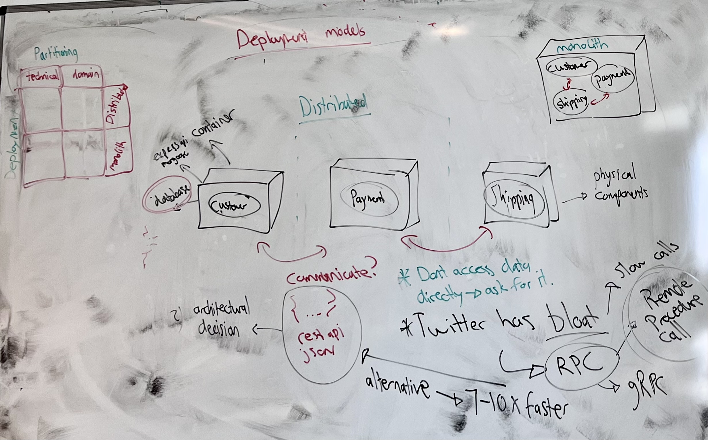
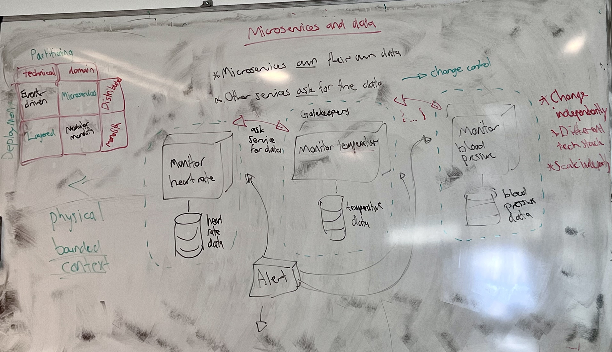
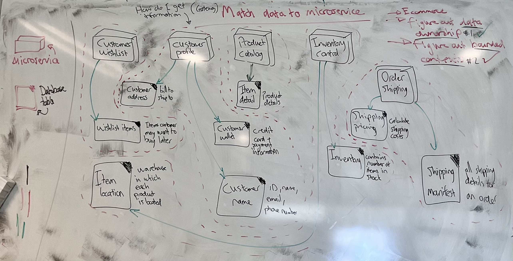

# Introduction to Software Architecture

> In this lesson you will describe a software system through the four dimensions of architecture, sort architectural styles by how their code is split and how they are deployed, and take a single health-monitoring service apart into microservices that each own their own data. At the end you will match the tables of an e-commerce system to the microservices that own them. New terms get a plain-English version in brackets.

**By the end of this lesson you should be able to:**

1. **Describe** the four dimensions of software architecture.
2. **Distinguish** between technical partitioning and domain partitioning of a codebase.
3. **Contrast** monolithic and distributed deployment.
4. **Classify** an architectural style by its partitioning and its deployment.
5. **Explain** why each microservice owns its own data.
6. **Organize** the tables of a system under the microservices that own them.

## Contents

1. [What architecture is](#1-what-architecture-is)
2. [Four ways of looking at a system](#2-four-ways-of-looking-at-a-system)
   - [2.1 Architectural characteristics](#21-architectural-characteristics)
   - [2.2 Architectural decisions](#22-architectural-decisions)
   - [2.3 Logical components](#23-logical-components)
   - [2.4 Architectural style](#24-architectural-style)
3. [How the code is split](#3-how-the-code-is-split)
   - [3.1 By technical concern](#31-by-technical-concern)
   - [3.2 By domain](#32-by-domain)
4. [How the system is deployed](#4-how-the-system-is-deployed)
   - [4.1 Monolithic](#41-monolithic)
   - [4.2 Distributed](#42-distributed)
   - [4.3 How distributed parts talk](#43-how-distributed-parts-talk)
5. [Four styles from two questions](#5-four-styles-from-two-questions)
6. [Microservices](#6-microservices)
   - [6.1 One service that monitors everything](#61-one-service-that-monitors-everything)
   - [6.2 One thing, done well](#62-one-thing-done-well)
   - [6.3 Each service owns its data](#63-each-service-owns-its-data)
7. [Activity: match data to microservice](#7-activity-match-data-to-microservice)
   - [7.1 The tables](#71-the-tables)
   - [7.2 Discussing the results](#72-discussing-the-results)
8. [Further reading](#8-further-reading)
9. [Sources](#9-sources)

## 1. What architecture is

Think about a house. Before anyone builds it, an architect draws the **blueprints** *[the plans that show a building's structure: its rooms, walls, doors and dimensions]*. The blueprint doesn't say what colour the walls are painted. It says where the load-bearing walls go, where the columns that hold up the roof stand, and how big everything is.

Some of those things are cheap to change later. You can move a door or repaint a room over a weekend. You can't move a **load-bearing wall** *[a wall that holds up the floors or roof above it]* without holding up the whole house while you do it.

**Software architecture** is the same idea applied to a system: its structure, and the decisions about that structure that are expensive to change afterwards. Which database you use, how the parts of the system talk to each other, and whether the whole thing ships as one unit or many are load-bearing walls. The name of a variable is paint.

You have already drawn an architecture. Recall the shape of the systems you've built so far: a front end that calls an API, and an API that reads and writes a database. That three-box sketch is a blueprint. It leaves out every line of code and still tells you how the system is built.

> Architecture is the part of a system that is expensive to change afterwards.

[Back to contents](#contents)

## 2. Four ways of looking at a system

A box has three dimensions: height, width and length. With those three numbers you can describe any box.

The textbook this module follows, *Head First Software Architecture*, describes software architecture with four dimensions. They aren't measurements. They are **lenses** *[ways of looking at the same system that each show you something different]*, and you need all four to describe a system properly.

### 2.1 Architectural characteristics

**Architectural characteristics** answer the question: what does this system need to support?

These are things like **scalability** *[whether the system can handle more users by adding more resources]*, **maintainability** *[how easy the system is to change and fix]* and **availability** *[how much of the time the system is up and usable]*. You'll also see them called **non-functional requirements** *[what a system has to be like, as opposed to what it has to do]*.

For example, a system might need to serve 10,000 users at once, stream video, be tested automatically, and let separate teams work on it without getting in each other's way. None of those describe a feature. All of them shape how the system has to be built.

### 2.2 Architectural decisions

**Architectural decisions** are the long-term choices about how the system is built. Which database does it use, SQL or NoSQL? How do the parts connect to each other - a REST API sending JSON, or something else?

You have made both of these decisions already this subject, every time you chose between SQL Server and MongoDB, or put an Express API in front of a database. They are architectural because undoing them later means rewriting a large part of the system.

### 2.3 Logical components

**Logical components** are the building blocks of the system - the things it does, named by what they are for.

In an e-commerce system, those are things like inventory management, payment processing and customer support. A logical component says nothing yet about where its code lives or how it runs. It's the list of jobs the system has.

### 2.4 Architectural style

The **architectural style** is the overall physical shape of the system. It's the answer to two questions:

- How is the code split up?
- How is the system deployed?

The next two sections take those questions one at a time, because each has two answers, and putting them together gives you the styles.

[Back to contents](#contents)

## 3. How the code is split

The first question is **partitioning** *[how the code is divided into parts]*. There are two ways to do it.

### 3.1 By technical concern

Recall the Books API from the last lesson. Its `src/` folder was split into `models/`, `services/` and `routes/`, and the reason was that each folder did one kind of job: the model talks to the database, the service holds the rules, the routes deal with HTTP.

```
src/
  models/
  services/
  routes/
```

That is **technical partitioning**: the code is grouped by the technical job it does. If the system had a user interface, a `views/` folder would sit alongside them. This is **separation of concerns** *[keeping code that does different kinds of job in different places]*, and you have been doing it since the start of the year.

Drawn as a picture, each folder is a **horizontal layer** that stretches across the whole system. Every feature - books, users, orders - has a piece in each layer.

### 3.2 By domain

The other way is to split by **domain** *[the problem the system is solving, in the words the business uses for it]*. Instead of one folder per technical job, you get one folder per part of the problem:

```
products/
  product model
  product service
  product routes
sales/
inventory/
```

That is **domain partitioning**. Everything about products lives together, with its model, service and routes inside the one folder. Each folder is a **vertical layer** that cuts down through every technical concern for one part of the problem.

Splitting code by domain comes from an approach called **Domain-Driven Design** *[designing software around the business problem and its language, rather than around the technology]*. It lines the code up with the logical components from [2.3](#23-logical-components): inventory management becomes an `inventory/` folder.

| | Technical partitioning | Domain partitioning |
|---|---|---|
| Groups code by | The job it does (model, service, route) | The part of the problem it belongs to (products, sales) |
| Layers run | Horizontally, across every feature | Vertically, through every technical job |
| Changing one feature touches | A file in every folder | One folder |

[Back to contents](#contents)

## 4. How the system is deployed

The second question is how the system gets from your machine to running in production.

Recall the pipeline from the cloud services subject. You change the code locally and push to git. A `.yml` workflow runs CI/CD, which builds a Docker image and puts it on a registry. The App Service picks up the new image, through a webhook or a GitHub Action, and runs it. Every change goes through that whole loop.

### 4.1 Monolithic

In a **monolithic** deployment *[the whole system is built and shipped as one unit]*, everything goes through that pipeline together.

Take an online shop with three logical components: customer, payment and shipping. In a monolith, all three live inside the one application. When payment needs to ask shipping something, it calls a function, and the call stays inside the same running process - **in-process communication** *[one part of a program calling another directly, in memory]*. That is fast and it can't get lost on the network.

The cost is on the deployment side. Change one line in the shipping code and the whole unit - customer, payment and shipping - gets rebuilt and redeployed together.

### 4.2 Distributed

In a **distributed** deployment *[the system is split into several separately deployed units that run on their own]*, customer, payment and shipping each become their own application.



The customer part is now an Express API with Mongoose, running in its own container, with its own database. Payment and shipping are the same. They are no longer logical components inside one program; each is a **physical component** *[a unit that is built, deployed and run on its own]*. A change to shipping redeploys shipping and nothing else.

One rule comes with this: a service doesn't reach into another service's database. If payment needs something about a customer, it asks the customer service for it. [Section 6.3](#63-each-service-owns-its-data) is about why.

### 4.3 How distributed parts talk

Once the parts are separate applications, a function call doesn't reach any more. They have to communicate over the network, and how they do that is an architectural decision from [2.2](#22-architectural-decisions).

The option you already know is a **REST API sending JSON**. It works, and every language can read it. But JSON is text, with every field name repeated in every message, so it's bulky compared to the data it carries. And every call now crosses a network, which is far slower than an in-process call.

The alternative is **RPC** *[Remote Procedure Call: calling a function that runs on another machine as if it were local]*. A common implementation is **gRPC**, which sends data in a compact binary format rather than as text. In class we put it at around 7-10 times faster than JSON over REST for the same call. The exact figure depends heavily on the payload.

Twitter is an example of where that speed matters. Its system has built up years of **technical debt** *[the extra work a system carries because of shortcuts and quick fixes made earlier]* and bloat, so refreshing a single feed sets off thousands of calls between its services. At that volume, REST was too slow, and those calls are made over RPC instead.

The choice of RPC there wasn't made on its own. Choosing a distributed style (the fourth lens) meant the services had to talk over the network. The number of calls a feed refresh makes set a speed requirement (the first lens). Together they forced a decision about how the services connect (the second lens). The four dimensions are separate ways of looking at a system, but a choice made through one of them shows up in the others.

> A distributed system trades cheap in-process calls for independent deployment.

[Back to contents](#contents)

## 5. Four styles from two questions

Put the two questions together and you get a grid. One side is how the code is partitioned; the other is how it is deployed. Each cell is an architectural style.

| | Technical partitioning | Domain partitioning |
|---|---|---|
| **Monolithic** | Layered | Modular monolith |
| **Distributed** | Event-driven | Microservices |

- **Layered**: one deployed unit, split into horizontal technical layers. The Books API is layered.
- **Modular monolith**: one deployed unit, split into vertical domain modules - `products/`, `sales/`, `inventory/` inside one application.
- **Event-driven**: separately deployed parts, split by technical job.
- **Microservices**: separately deployed parts, split by domain.

The rest of this lesson is the bottom-right cell.

[Back to contents](#contents)

## 6. Microservices

The **microservices** style is two choices from the grid: partition by domain, and deploy distributed.

### 6.1 One service that monitors everything

Take a health-monitoring system. It reads a patient's vital signs - heart rate, blood pressure, temperature, blood sugar, sleep cycle and more - and raises an alert when one of them looks wrong.

The first version is one **service** *[a separately deployed unit of software]* that monitors all the vital signs. It is distributed, in the sense that it's deployed on its own, but it does all the monitoring inside that one unit.

Now suppose the heart-rate monitoring fails. Because it lives in the same service as everything else, the whole service goes down with it, and temperature, blood pressure and every other reading stop being watched too. A patient whose temperature spikes gets no alert because of a bug in the heart-rate code.

What we want is independent monitoring: heart rate can fail while temperature and the rest keep working.

### 6.2 One thing, done well

The fix is to make the service smaller. Instead of one service that monitors all vital signs, there is one that monitors heart rate, one that monitors temperature, one that monitors blood pressure, and so on.

That's where the "micro" comes from. It isn't about how many lines of code the service has; it's about what the service does. The textbook's definition:

> A microservice is a single-purpose, separately deployed unit of software that does one thing really well.

Monitoring heart rate is one thing. Monitoring all vital signs is many things.

### 6.3 Each service owns its data

Each monitoring service keeps its own readings. The heart-rate service has the heart-rate data, the temperature service has the temperature data, and the blood-pressure service has the blood-pressure data.



The rule is: **microservices own their own data, and other services ask for it.** An alert service that needs heart-rate readings doesn't open the heart-rate database. It asks the heart-rate service, and the heart-rate service answers.

The naive version is to let the alert service read the heart-rate tables directly, since they're sitting right there. It works until the heart-rate team renames a column or changes how readings are stored. The alert service breaks, and the heart-rate team had no way of knowing it depended on that column.

Making every request go through the owning service is **change control**. The owning service is the **gatekeeper** for its data. As long as it keeps answering the same questions the same way, it can change its tables, its database, or its whole implementation, and nobody else notices.

The boundary around a service and the data it owns is its **bounded context** *[the edge inside which a service's model of the data applies, and which nothing outside is allowed to reach through]*. In microservices, that boundary is physical: it's a separate deployment with a separate database.

That boundary is what gives microservices their three main benefits:

- **Change independently.** A service can be changed and redeployed without touching the others.
- **Use a different tech stack.** Blood pressure could be a Node service on MongoDB and temperature a different language on SQL Server, because nobody outside sees inside.
- **Scale independently.** If heart rate gets ten times the traffic, you run more copies of the heart-rate service and leave the rest alone.

> A microservice owns its data; everyone else has to ask.

[Back to contents](#contents)

## 7. Activity: match data to microservice

An e-commerce system has five microservices: **Customer Wishlist**, **Customer Profile**, **Product Catalog**, **Inventory Control** and **Order Shipping**. Your job is to work out:

1. Which microservice owns each table.
2. Where the bounded contexts are - which services and tables sit together inside one boundary.

### 7.1 The tables

| Table | What it holds |
|---|---|
| Customer address | Bill-to and ship-to addresses |
| Wishlist items | Items a customer may want to buy later |
| Item location | The warehouse each product is located in |
| Item detail | Product details |
| Customer wallet | Credit card and payment information |
| Customer name | ID, name, email and phone number |
| Inventory | The number of each item in stock |
| Shipping pricing | Data for calculating shipping costs |
| Shipping manifest | All the shipping details for an order |


### 7.2 Discussing the results

The first step was **data ownership**: linking each table to the one service responsible for it.

| Microservice | Owns |
|---|---|
| Customer Wishlist | Wishlist items |
| Customer Profile | Customer name, customer address, customer wallet |
| Product Catalog | Item detail |
| Inventory Control | Inventory, item location |
| Order Shipping | Shipping pricing, shipping manifest |

Try it before reading on.



Item location sounds like it belongs with the product details, but where a product is stored is a question about stock, and it's Inventory Control that needs to answer it.

The second step was drawing a bounded context around each service and the tables it owns. Once ownership was settled, those lines were easy to draw, because every table already had exactly one service it belonged to.

Those lines are more than a grouping on a diagram. Each one shows how the system will be physically deployed: one service, with its own database holding its own tables, built and run on its own. That is the **physical bounded context** from [6.3](#63-each-service-owns-its-data), the same boundary we drew around each vital-signs monitor.

The boundaries also decide how data moves. Anything outside a boundary that needs that data goes through the service inside it. If Order Shipping needs a customer's ship-to address, it asks Customer Profile, which is the gatekeeper for it.

[Back to contents](#contents)

## 8. Further reading

Two companies came up in class as examples of the ideas in this lesson, going in opposite directions.

**Netflix** moved from a monolith to microservices after an outage in its monolithic system. Read about why it moved, and which of the benefits from [6.3](#63-each-service-owns-its-data) it was after:

- [Netflix's Evolution from Monolith to Microservices](https://www.yochana.com/netflixs-evolution-from-monolith-to-microservices-a-deep-dive-into-streaming-architecture/) - a shorter overview.
- [Journey to Scalability and Efficiency with Microservices and Serverless Computing](https://eajournals.org/bjms/wp-content/uploads/sites/21/2025/04/Journey-to-Scalability.pdf) - a longer paper on the same migration.

**Amazon Prime Video** moved one of its tools the other way, from distributed services back to a monolith. Read about what made the distributed version expensive, and connect it to the cost of network calls from [4.3](#43-how-distributed-parts-talk):

- [Amazon Prime Video Monitoring Service](https://bytebytego.com/guides/amazon-prime-video-monitoring-service/) - a short summary with diagrams.
- [Amazon Ditches Microservices for Monolith: Decoding Prime Video's Architectural Shift](https://dev.to/amplication/amazon-ditches-microservices-for-monolith-decoding-prime-videos-architectural-shift-5bk6) - a longer write-up.

[Back to contents](#contents)

## 9. Sources

1. Gandhi, R., Richards, M. and Ford, N., *Head First Software Architecture*, O'Reilly Media, 2024 - [oreilly.com](https://www.oreilly.com/library/view/head-first-software/9781098134341/)

[Back to contents](#contents)
