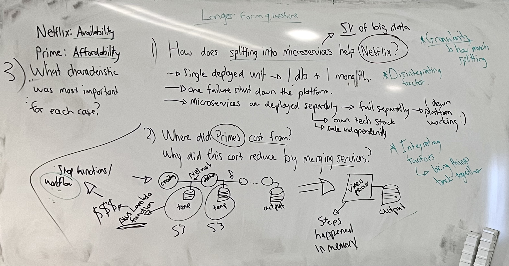
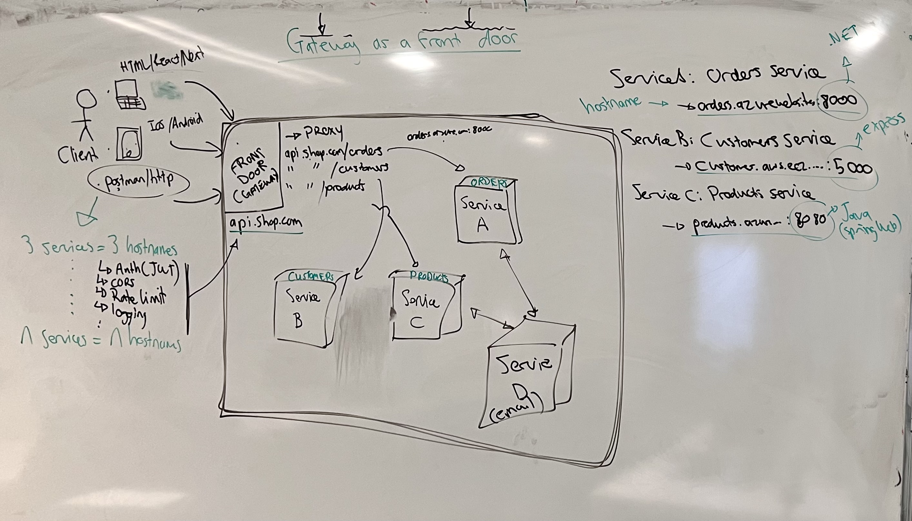

# Adding a Gateway

> In this lesson you will work out what pushed Netflix to split its system apart and Prime Video to merge one back together, and use that to decide how finely a system should be split. You will then put an API gateway in front of the three health-monitoring services, so clients call one address instead of three, and add request logging and a rate limit to it. New terms get a plain-English version in brackets.

**By the end of this lesson you should be able to:**

1. **Explain** how a system's most important architectural characteristic affects how finely it is split.
2. **Distinguish** between disintegrating and integrating factors.
3. **Describe** the problems a client faces when it calls each service directly.
4. **Explain** the role of an API gateway as the single entry point to a set of services.
5. **Implement** a logging middleware that records every request through the gateway.
6. **Apply** a rate limit to the requests that reach the gateway.

## Contents

1. [How finely to split a system](#1-how-finely-to-split-a-system)
   - [1.1 Netflix: splitting apart](#11-netflix-splitting-apart)
   - [1.2 Prime Video: merging back](#12-prime-video-merging-back)
   - [1.3 Granularity](#13-granularity)
2. [Clients and many services](#2-clients-and-many-services)
3. [The API gateway](#3-the-api-gateway)
4. [The health-monitoring gateway](#4-the-health-monitoring-gateway)
   - [4.1 The services](#41-the-services)
   - [4.2 Forwarding requests](#42-forwarding-requests)
5. [Logging every request](#5-logging-every-request)
   - [5.1 Middleware](#51-middleware)
   - [5.2 The logger](#52-the-logger)
6. [Rate limiting](#6-rate-limiting)
   - [6.1 Adding the limiter](#61-adding-the-limiter)
   - [6.2 Hitting the limit](#62-hitting-the-limit)
   - [6.3 Where the limiter sits](#63-where-the-limiter-sits)
7. [Sources](#7-sources)

## 1. How finely to split a system

We opened with the knowledge check on software architecture, and spent most of the time on its three discussion questions. They're about two companies that went in opposite directions.

Recall what makes something a microservice: it does one thing, it's deployed on its own, and it owns its own data. Keep that in mind for both cases.



### 1.1 Netflix: splitting apart

In 2008 a corrupted database took Netflix down for three days ([Netflix's Evolution from Monolith to Microservices](https://www.yochana.com/netflixs-evolution-from-monolith-to-microservices-a-deep-dive-into-streaming-architecture/)). At the time, Netflix was a monolith: a single deployed unit with one database.

That's why one failure shut down the whole platform. Everything ran in the same unit and depended on the same database, so when the database went, everything went with it.

Microservices are deployed separately, which means they also fail separately. If one service's database breaks, that one service goes down and the rest of the platform keeps working.

Splitting also gave Netflix the other two benefits. Each service can use its own tech stack, which is why Netflix now runs Cassandra, MySQL and Elasticsearch side by side. And each service can be scaled independently.

### 1.2 Prime Video: merging back

Prime Video had a tool that watched live streams for defects like frozen video ([Amazon Prime Video Monitoring Service](https://bytebytego.com/guides/amazon-prime-video-monitoring-service/)). It was built as separate stages, each running as an **AWS Lambda function** *[a small piece of code that AWS runs for you on demand, and charges for each time it runs]*. One stage converted the video, the next checked it for defects, and so on down to the output.

The stages were coordinated by **AWS Step Functions** *[an AWS service that runs a workflow of steps in order, and charges for every step it runs]*. Each stage saved its output to **S3** *[Amazon's file storage service]*, and the next stage downloaded it from there.

So the cost came from two places. The video crossed the network between every pair of stages, going into S3 and back out again, and the workflow charged for every step. Across thousands of live streams, that added up.

The team merged the stages into one video process. The steps then handed data to each other in memory, which costs nothing extra, and the bill dropped by 90%.

What they gave up is independence. The stages can no longer be deployed or scaled on their own.

### 1.3 Granularity

The third question asked which architectural characteristic mattered most in each case. For Netflix it was **availability**: a three-day outage showed that one failure could take everything down. For Prime Video it was **affordability**: the separate stages were spending most of their money moving data between each other.

Both companies were deciding the same thing, which is **granularity** *[how much a system is split up - how many pieces, and how small each one is]*. They just came to opposite answers.

The reasons for splitting something further are **disintegrating factors**. Netflix's need for availability is one: failures had to be kept apart, and separate deployments do that.

The reasons for bringing pieces back together are **integrating factors**. Prime Video's cost is one: the pieces passed so much data between them that the network had become the expense.

| | Netflix | Prime Video |
|---|---|---|
| Characteristic that mattered most | Availability | Affordability |
| Direction | Split into microservices | Merged stages into one process |
| Kind of factor | Disintegrating | Integrating |

> Granularity is a trade-off: disintegrating factors push a system apart, integrating factors pull it back together.

[Back to contents](#contents)

## 2. Clients and many services

Take an online shop split into microservices. There's an orders service, a customers service and a products service, and each one is deployed on its own.

Each one also has its own address. The orders service might be on `orders.azurewebsites...:8000`, the customers service on `customers.aws...:5000`, and the products service on `products.azure...:8080`. They don't even have to be on the same cloud, or written in the same language: orders could be .NET, customers Express, and products Java with Spring.

Now think about the **clients** *[the programs that call the API: a website, a mobile app, or you in Postman]*. A React front end, an iOS app and an Android app all need to call these services, and each of them has to know all three **hostnames** *[the address part of a URL, like `orders.azurewebsites.net`]*. Three services means three hostnames. Add a fourth service and every client needs updating. With *n* services, the clients have to remember *n* hostnames.

The hostnames aren't the only thing repeated. Every service that clients can reach has to deal with the same set of concerns:

- **Authentication**, such as checking a **JWT** *[JSON Web Token: a signed token a client sends to prove who it is]*.
- **CORS** *[Cross-Origin Resource Sharing: the rules a browser follows about which websites may call an API]*.
- **Rate limiting** - capping how many requests a client can make.
- **Logging** - recording what requests came in.

Each service has to implement all four. With three services in three different languages, that's the same four jobs written three times in three different ways ([API gateways](https://learn.microsoft.com/en-us/azure/architecture/microservices/design/gateway)).

[Back to contents](#contents)

## 3. The API gateway

The fix is to give the clients one place to go. An **API gateway** is a single entry point that sits between the clients and the services. It acts as a **reverse proxy** *[a server that takes requests on behalf of other servers and forwards each one to the right place]* ([API gateways](https://learn.microsoft.com/en-us/azure/architecture/microservices/design/gateway)).

Think of it as the front door. The shop's clients only ever call `api.shop.com`, and the gateway routes each request by its path:

| Client calls | Gateway forwards to |
|---|---|
| `api.shop.com/orders` | The orders service |
| `api.shop.com/customers` | The customers service |
| `api.shop.com/products` | The products service |

The clients now know one hostname. If the orders service moves to a new address, only the gateway needs to change.

A service doesn't need a route on the gateway at all if clients never call it. An email service that only the orders and products services talk to can sit behind the gateway with no public address.

The repeated concerns move to the gateway as well. Because every request comes through the front door, that's where authentication, CORS, rate limiting and logging can happen, once, for every service behind it.



> A gateway gives the clients one address and gives the shared concerns one place to live.

[Back to contents](#contents)

## 4. The health-monitoring gateway

Recall the health-monitoring system: heart rate, temperature and blood pressure are each monitored by their own microservice, so that one failing doesn't stop the others. We built a gateway in front of three of them. The code is in [`plan-class-demo/`](plan-class-demo/).

### 4.1 The services

There are four Express projects, each in its own folder with its own `package.json` and `.env`:

| Folder | Port | Endpoints |
|---|---|---|
| `gateway/` | 3000 | `GET /health`, and `/heart-rate/*`, `/temperature/*`, `/blood-pressure/*` forwarded to the services |
| `heart-rate-service/` | 3001 | `GET /health`, `GET /reading` |
| `temperature-service/` | 3002 | `GET /health`, `GET /reading` |
| `blood-pressure-service/` | 3003 | `GET /health`, `GET /reading` |

There's no database yet. Every call to `/reading` generates a new, realistic value.

Each project runs in its own terminal. For each folder:

```bash
cd heart-rate-service
npm install
npm run dev
```

With the services running, you can call one directly on its own port:

```bash
curl http://localhost:3001/reading
```

That's the problem from [section 2](#2-clients-and-many-services) in miniature. To get all three readings, a client has to know three ports.

### 4.2 Forwarding requests

The gateway starts with two things in `gateway/src/app.js`: its own `/health` endpoint, and one route per service.

```js
require('dotenv').config()

const express = require('express')
const proxy = require('express-http-proxy')

const app = express()

const SERVICE_NAME = process.env.SERVICE_NAME || 'gateway'
const ENVIRONMENT = process.env.ENVIRONMENT || 'default'

// Health endpoint for the gateway itself. It says the gateway is up, not that
// the services behind it are.
app.get('/health', (req, res) => {
  res.status(200).json({
    status: 'ok',
    service: SERVICE_NAME,
    uptime: process.uptime(),
    timestamp: new Date().toISOString(),
    environment: ENVIRONMENT
  })
})


// One route per service. The mount path is stripped before the request is
// forwarded, so GET /heart-rate/reading reaches the heart-rate service as
// GET /reading.
app.use('/heart-rate', proxy('http://localhost:3001'))
app.use('/temperature', proxy('http://localhost:3002'))
app.use('/blood-pressure', proxy('http://localhost:3003'))

module.exports = app
```

`express-http-proxy` is the package that does the forwarding. Its job is to "proxy request to another host and pass response back to original caller" ([express-http-proxy](https://github.com/villadora/express-http-proxy)). The gateway sends the request on, waits for the service to answer, and hands that answer back to the client.

`app.use('/heart-rate', ...)` mounts the proxy on a path, so it handles every request that starts with `/heart-rate`. The services don't know about the gateway and haven't changed: the heart-rate service still has a `/reading` route, not a `/heart-rate/reading` one.

Now the same reading comes through the gateway's one port:

```bash
curl http://localhost:3000/heart-rate/reading
```

[Back to contents](#contents)

## 5. Logging every request

Every request now passes through the gateway, so it's the one place that can see all of them. The first concern we moved there was logging.

### 5.1 Middleware

Express does this kind of work with **middleware** *[a function that runs on a request before it reaches the route that answers it]*. A middleware function gets the request (`req`), the response (`res`), and a function called `next` ([Using middleware](https://expressjs.com/en/guide/using-middleware.html)).

A middleware can do one of two things with a request. It can end it by sending a response, or it can call `next()` to pass it on to whatever comes next. If it does neither, the request is left hanging and the client never gets an answer.

Middleware added with `app.use()` runs in the order it appears in the file. Anything above the proxy routes runs before the request is forwarded.

### 5.2 The logger

Add this to `gateway/src/app.js`, below `const app = express()` and the two constants, and above the `/health` route:

```js
app.use((req, res, next) => {
  console.log(
    `[${new Date().toISOString()}] ${req.method} ${req.originalUrl} ` +
    `host=${req.get('host')} ip=${req.ip}`
  )

  next() // pass the request on, or it never reaches /health or the proxies
})
```

It writes one line per request to the gateway's terminal: when it came in, the method, the path, the host it was sent to, and the IP address of the client that sent it. A call to the heart-rate reading logs a line like this:

```
[2026-10-01T09:12:44.103Z] GET /heart-rate/reading host=localhost:3000 ip=::1
```

It uses `req.originalUrl` rather than `req.url` because of the mount path. Inside a mounted route, `req.url` has already had `/heart-rate` stripped off, and the log would only say `/reading` - which doesn't tell you which service was called.

Because the logger calls `next()`, the request carries on exactly as before. None of the three services had to change to get their requests logged.

[Back to contents](#contents)

## 6. Rate limiting

**Rate limiting** caps how many requests a client can make in a given time. Once a client goes over the cap, the gateway turns its requests away until the time window resets, and the services behind it never see them. It stops one client from flooding the system, whether by accident or on purpose.

### 6.1 Adding the limiter

We used the `express-rate-limit` package. In the `gateway/` folder:

```bash
npm install express-rate-limit
```

Then require it at the top of `gateway/src/app.js`, with the other packages:

```js
const rateLimit = require('express-rate-limit')
```

And add the limiter below the two constants and above the logger:

```js
// Deliberately low, so it can be hit by hand in class.
const limiter = rateLimit({
  windowMs: 60 * 1000,        // the time window: one minute, in milliseconds
  limit: 5,                   // requests allowed per client in each window
  standardHeaders: 'draft-8', // tell the client its limit in the response headers
  legacyHeaders: false,       // don't also send the older X-RateLimit-* headers
  message: { error: 'Too many requests, try again in a minute' }
})

app.use(limiter)
```

The limiter tells clients apart by their IP address, and keeps its counts in the gateway's memory ([express-rate-limit configuration](https://express-rate-limit.mintlify.app/reference/configuration)). Those counts are reset whenever the process restarts, which with `npm run dev` means every time you save a file.

Five requests a minute is far too low for a real system. It's set that low so you can hit the limit by hand.

### 6.2 Hitting the limit

Call the gateway eight times in a row, printing only the status code of each response:

```bash
for i in $(seq 1 8); do curl -s -o /dev/null -w "%{http_code}\n" http://localhost:3000/heart-rate/reading; done
```

The first five print `200`. The rest print `429`, which is **429 Too Many Requests** - the status code for a client that has gone over its rate limit. The body is the `message` from the config.

To see what the limiter tells the client, send one request with `curl -i`, which prints the response headers as well as the body:

```bash
curl -i http://localhost:3000/heart-rate/reading
```

Because of `standardHeaders: 'draft-8'`, the response carries a `RateLimit` header with how many requests are left and when the window resets, and a `RateLimit-Policy` header describing the limit itself.

### 6.3 Where the limiter sits

In the finished file the limiter comes first, above the logger and above `/health`. Recall that middleware runs in order, and that a middleware which sends a response ends the request there.

When the limiter rejects a request, it sends the `429` itself and doesn't call `next()`. So a rejected request never reaches the logger, and the log only shows the requests that were let through. And because `/health` is below the limiter, calls to the gateway's health check count towards the limit like any other request.

The finished `gateway/src/app.js`:

```js
require('dotenv').config()

const express = require('express')
const proxy = require('express-http-proxy')
const rateLimit = require('express-rate-limit')

const app = express()

const SERVICE_NAME = process.env.SERVICE_NAME || 'gateway'
const ENVIRONMENT = process.env.ENVIRONMENT || 'default'

// Deliberately low, so it can be hit by hand in class.
const limiter = rateLimit({
  windowMs: 60 * 1000,
  limit: 5,
  standardHeaders: 'draft-8',
  legacyHeaders: false,
  message: { error: 'Too many requests, try again in a minute' }
})

app.use(limiter)

app.use((req, res, next) => {
  console.log(
    `[${new Date().toISOString()}] ${req.method} ${req.originalUrl} ` +
    `host=${req.get('host')} ip=${req.ip}`
  )

  next()
})

// Health endpoint for the gateway itself. It says the gateway is up, not that
// the services behind it are.
app.get('/health', (req, res) => {
  res.status(200).json({
    status: 'ok',
    service: SERVICE_NAME,
    uptime: process.uptime(),
    timestamp: new Date().toISOString(),
    environment: ENVIRONMENT
  })
})


// One route per service. The mount path is stripped before the request is
// forwarded, so GET /heart-rate/reading reaches the heart-rate service as
// GET /reading.
app.use('/heart-rate', proxy('http://localhost:3001'))
app.use('/temperature', proxy('http://localhost:3002'))
app.use('/blood-pressure', proxy('http://localhost:3003'))

module.exports = app
```

Authentication and CORS belong at the gateway too, and come back once there's a front end calling it.

> Middleware order decides which requests each concern gets to see.

[Back to contents](#contents)

## 7. Sources

1. Gandhi, R., Richards, M. and Ford, N., *Head First Software Architecture*, O'Reilly Media, 2024 - [oreilly.com](https://www.oreilly.com/library/view/head-first-software/9781098134341/)
2. Yochana, [Netflix's Evolution from Monolith to Microservices](https://www.yochana.com/netflixs-evolution-from-monolith-to-microservices-a-deep-dive-into-streaming-architecture/)
3. ByteByteGo, [Amazon Prime Video Monitoring Service](https://bytebytego.com/guides/amazon-prime-video-monitoring-service/)
4. Microsoft, [API gateways](https://learn.microsoft.com/en-us/azure/architecture/microservices/design/gateway) - Azure Architecture Center
5. Express, [Using middleware](https://expressjs.com/en/guide/using-middleware.html)
6. express-rate-limit, [Configuration](https://express-rate-limit.mintlify.app/reference/configuration)
7. [express-http-proxy](https://github.com/villadora/express-http-proxy) - GitHub

[Back to contents](#contents)
