# Connecting Azure SQL and a Website

> In this lesson you will create an Azure SQL database in the Azure portal, connect to it from VS Code, and build a user service that reads and writes it with Sequelize, with the database code kept in services and out of its routes. You will put the gateway in front of that service and a website in front of the gateway, watch the browser block every request the website makes, and fix it with CORS. You will then add a rate limit to the gateway and lock it with an API key - which breaks the website again until it sends the key. New terms get a plain-English version in brackets.

**By the end of this lesson you should be able to:**

1. **Demonstrate** the creation of an Azure SQL database and its server in the Azure portal.
2. **Explain** how the server firewall decides which clients can connect to an Azure SQL database.
3. **Use** Sequelize to read and write an Azure SQL table that already exists.
4. **Apply** a service layer to keep database code out of an Express route.
5. **Explain** why a browser blocks the website's requests to the gateway until the gateway allows its origin.
6. **Implement** a CORS rule on the gateway that allows only the website's origin.
7. **Implement** an API key check on the gateway.

## Contents

1. [Connecting it all together](#1-connecting-it-all-together)
2. [Azure SQL Database](#2-azure-sql-database)
   - [2.1 What it is](#21-what-it-is)
   - [2.2 The server and the database](#22-the-server-and-the-database)
   - [2.3 Networking and the firewall](#23-networking-and-the-firewall)
   - [2.4 Creating the table](#24-creating-the-table)
3. [Connecting to the database](#3-connecting-to-the-database)
   - [3.1 The connection string](#31-the-connection-string)
   - [3.2 From VS Code](#32-from-vs-code)
4. [The user service](#4-the-user-service)
   - [4.1 Connecting with Sequelize](#41-connecting-with-sequelize)
   - [4.2 A model for a table that already exists](#42-a-model-for-a-table-that-already-exists)
   - [4.3 Services](#43-services)
   - [4.4 Error middleware](#44-error-middleware)
   - [4.5 The routes](#45-the-routes)
   - [4.6 Running it](#46-running-it)
5. [The gateway](#5-the-gateway)
6. [The website](#6-the-website)
   - [6.1 Serving the page](#61-serving-the-page)
   - [6.2 Calling the gateway](#62-calling-the-gateway)
7. [CORS](#7-cors)
   - [7.1 The browser blocks it](#71-the-browser-blocks-it)
   - [7.2 Allowing the website](#72-allowing-the-website)
   - [7.3 The preflight](#73-the-preflight)
   - [7.4 More than one origin](#74-more-than-one-origin)
8. [Searching for users](#8-searching-for-users)
9. [The gateway as the front door](#9-the-gateway-as-the-front-door)
   - [9.1 Logging](#91-logging)
   - [9.2 Rate limiting](#92-rate-limiting)
   - [9.3 An API key](#93-an-api-key)
   - [9.4 Sending the key](#94-sending-the-key)
10. [Sources](#10-sources)

## 1. Connecting it all together

In the [last lesson](../02-adding-a-gateway/lecture.md) we put a gateway in front of three health-monitoring services. Clients - a browser, Postman, `curl` - called the gateway on one address, and it proxied each request to the right service. Logging and rate limiting lived on the gateway, because every request passes through it.

That system had no database and no front end. This lesson adds both, with one service in the middle:


| Piece | Folder | Port | What it does |
|---|---|---|---|
| website | `website/` | 8080 | Serves a page that calls the gateway with `fetch` |
| gateway | `gateway/` | 3000 | The one way in. Proxies `/users` to the user service |
| user service | `user-service/` | 3001 | Reads and writes users with Sequelize |
| Azure SQL | - | 1433 | The database, in Azure |

All the code is in [`class-demo/`](class-demo/). Each piece has the same shape as the gateway lesson's services: its own folder, `package.json` and `.env`, routes in `src/app.js`, `app.listen()` in `src/server.js`, and a `/health` endpoint that reports which service answered.

We build it from the back: the database first, then the service that talks to it, then the gateway, then the website.

[Back to contents](#contents)

## 2. Azure SQL Database

### 2.1 What it is

Until now, SQL Server has run on your machine, in a container you started from a Compose file. You were responsible for all of it - starting it, keeping it running, and losing the data if the container went.

**Azure SQL Database** is the same database engine run for you by Microsoft. It's "a fully managed platform as a service (PaaS) database engine that handles most of the database management functions such as upgrading, patching, backups, and monitoring without user involvement" ([What is Azure SQL Database?](https://learn.microsoft.com/en-us/azure/azure-sql/database/sql-database-paas-overview)).

Recall PaaS from the cloud course: you look after your application and your data, and the provider looks after everything underneath - the operating system, the hardware and the network. Here, that means you write the tables and the queries, and Microsoft keeps the server running and backed up.

It's the same engine as the SQL Server you've been using, so the T-SQL you already know works unchanged. The difference is where it runs and how you get to it.

### 2.2 The server and the database

We created the database from the portal, under **SQL databases** → **Create**. A database in Azure has to belong to a server, so the form asks for one, and we created a new one alongside it.

That server is a **logical server** *[not a machine you can log in to, but a named place in Azure that groups databases and holds the settings they share]*. Microsoft describes it as "a central administrative point for a collection of databases" - the logins and the firewall rules are set on the server, not on each database ([What is a server in Azure SQL Database?](https://learn.microsoft.com/en-us/azure/azure-sql/database/logical-servers)).

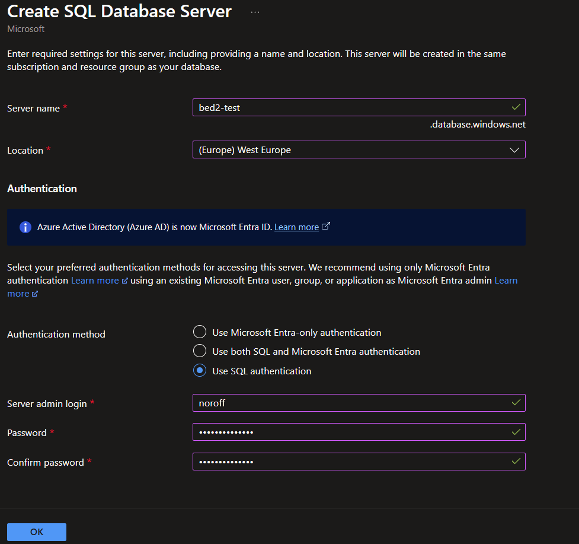

The server name becomes part of an address. `bed2-test` gives the server the hostname `bed2-test.database.windows.net`, which is why the name has to be unique across all of Azure, not only in your subscription.

For **Authentication method** we picked **SQL authentication** *[signing in with a username and password stored in the database server itself]*. The alternative is **Microsoft Entra** authentication *[signing in with an Azure account instead of a database password]*, which Microsoft recommends. SQL authentication is the one that works with a plain username and password from Node, so it's the one we used. The **server admin login** and password created here are the credentials the user service connects with later.

Back on the database form:

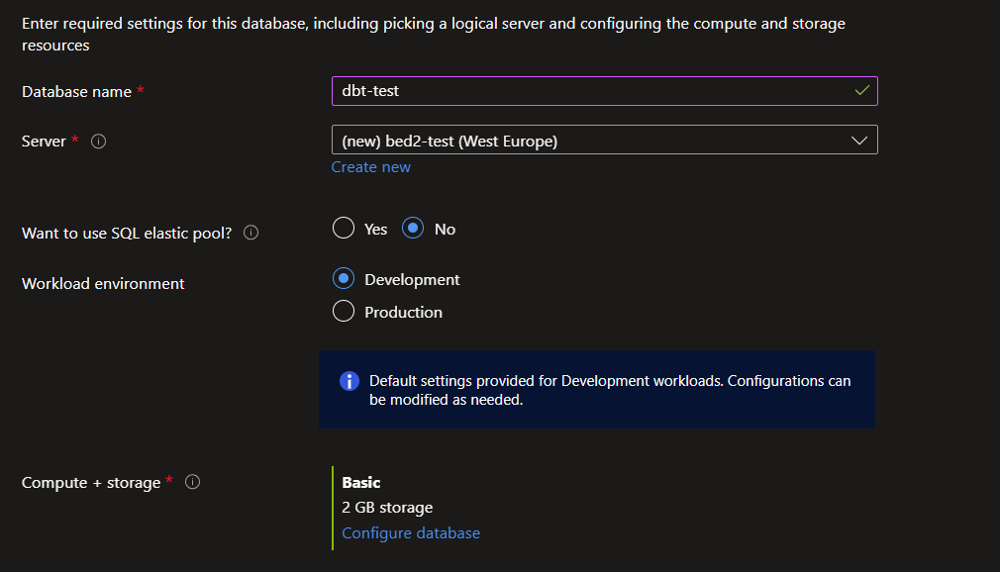

- **Database name** is `dbt-test`, on the new `bed2-test` server.
- **SQL elastic pool** is **No**. An **elastic pool** *[a shared pot of compute that several databases draw from]* is for running many databases at once, and we have one.
- **Workload environment** is **Development**, which presets cheaper options.
- **Compute + storage** is **Basic**, with 2 GB of storage - the smallest size, and enough for a table of users.

### 2.3 Networking and the firewall

When a new logical server is created, "a server-level firewall blocks all access to the public endpoint" ([IP firewall rules](https://learn.microsoft.com/en-us/azure/azure-sql/database/firewall-configure)). A **firewall** *[a filter that decides which network connections are let through]* on the server checks where each connection comes from, and only lets it through if a rule allows that address.

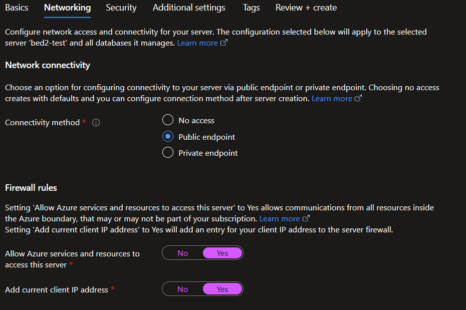

- **Connectivity method** is **Public endpoint**, so the server can be reached over the internet - from your laptop, for example. The firewall still decides who actually gets in.
- **Add current client IP address** adds a rule for the IP address of the machine you're creating the database from. Without it, your own laptop can't connect.
- **Allow Azure services and resources to access this server** adds a rule that lets anything running inside Azure connect, such as an App Service.

"Allow Azure services" means all of Azure, not only your own resources. Microsoft's docs warn that it allows connections from "all Azure services, including services running in other customers' subscriptions", and it's off by default in the portal. We turned it on, so for this server the login and password are the only thing keeping other Azure resources out.

Getting through the firewall only gives a client the chance to sign in. It still needs a valid login and password.

The review page sums up the choices before anything is created:


Recall that everything in Azure lives in a **resource group**. The database and the server both went into `BED2-2026`.

The deployment shows that the choices became separate resources: the server, the database, and one firewall rule for each of the two networking settings.

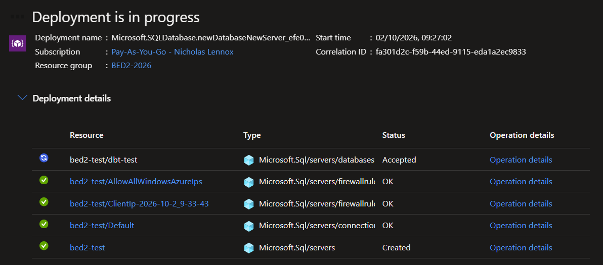

`AllowAllWindowsAzureIps` is the rule behind the "Allow Azure services" switch. `ClientIp-...` is the rule for the laptop the database was created from.

### 2.4 Creating the table

The portal has a **Query editor** in the database's menu, which runs SQL in the browser. It signs in with the same SQL authentication login we created with the server.

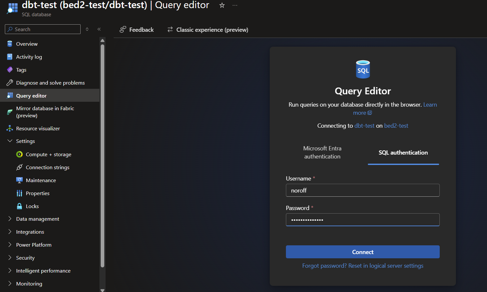

We created one table in it:

```sql
CREATE TABLE Users (
    UserId INT IDENTITY(1,1) PRIMARY KEY,
    Username NVARCHAR(50) NOT NULL,
    Email NVARCHAR(255) NOT NULL,
    CreateAt DATETIME2 NOT NULL DEFAULT SYSDATETIME()
)
```

Recall from the SQL lessons: `IDENTITY(1,1)` makes the database number each row itself, starting at 1 and going up by 1. `DEFAULT SYSDATETIME()` fills `CreateAt` with the current time when an insert doesn't give it a value. Both matter later, because the user service won't send either of them.

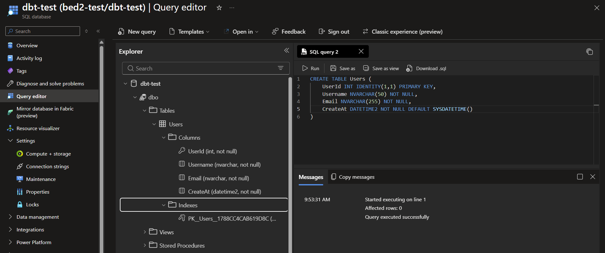

The table was created in the database itself, by hand, before any code existed. The service we write next has to fit the table, not the other way round.

> Azure SQL is SQL Server you don't run yourself, behind a firewall that blocks everyone until you add a rule.

[Back to contents](#contents)

## 3. Connecting to the database

### 3.1 The connection string

A **connection string** *[one line of text holding everything a program needs to reach a database: where it is, which database, and how to sign in]* is how most tools are told where a database is. The portal generates them under the database's **Connection strings** page, in a tab per kind of client.

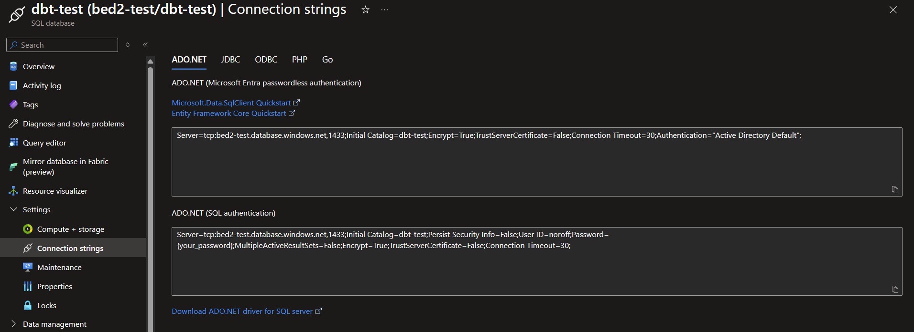

We used the **ADO.NET (SQL authentication)** one:

```
Server=tcp:bed2-test.database.windows.net,1433;Initial Catalog=dbt-test;Persist Security Info=False;User ID=noroff;Password={your_password};MultipleActiveResultSets=False;Encrypt=True;TrustServerCertificate=False;Connection Timeout=30;
```

It's a list of `Key=Value` pairs separated by semicolons. The ones that matter to us:

| Key | Value | Meaning |
|---|---|---|
| `Server` | `tcp:bed2-test.database.windows.net,1433` | The server's hostname, and **port** *[the numbered door on a machine that a service listens on]* 1433, SQL Server's default |
| `Initial Catalog` | `dbt-test` | Which database on that server |
| `User ID` | `noroff` | The admin login |
| `Password` | `{your_password}` | A placeholder - the portal never shows the real password, so you replace it yourself |
| `Encrypt` | `True` | Encrypt the connection |

The `{your_password}` placeholder catches people out. If you paste the string as it is, the connection fails at sign-in.

Connections go out on port 1433, so a network that blocks outgoing traffic on 1433 - some company and university networks do - stops you reaching the server even when the firewall rule is right ([IP firewall rules](https://learn.microsoft.com/en-us/azure/azure-sql/database/firewall-configure)).

### 3.2 From VS Code

Recall the **mssql** extension in VS Code, which you used to connect to SQL Server in a container. It connects to Azure SQL the same way. In the Connection Dialog, **Load from Connection String** takes the whole string and fills in the form:

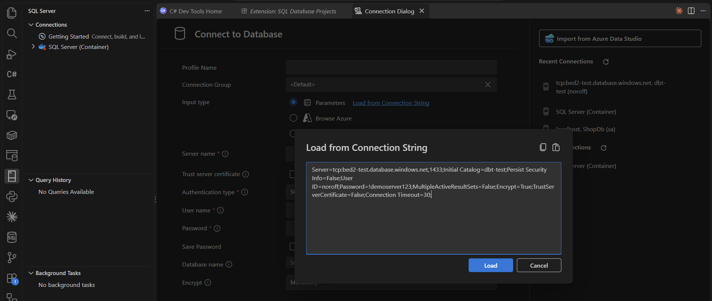

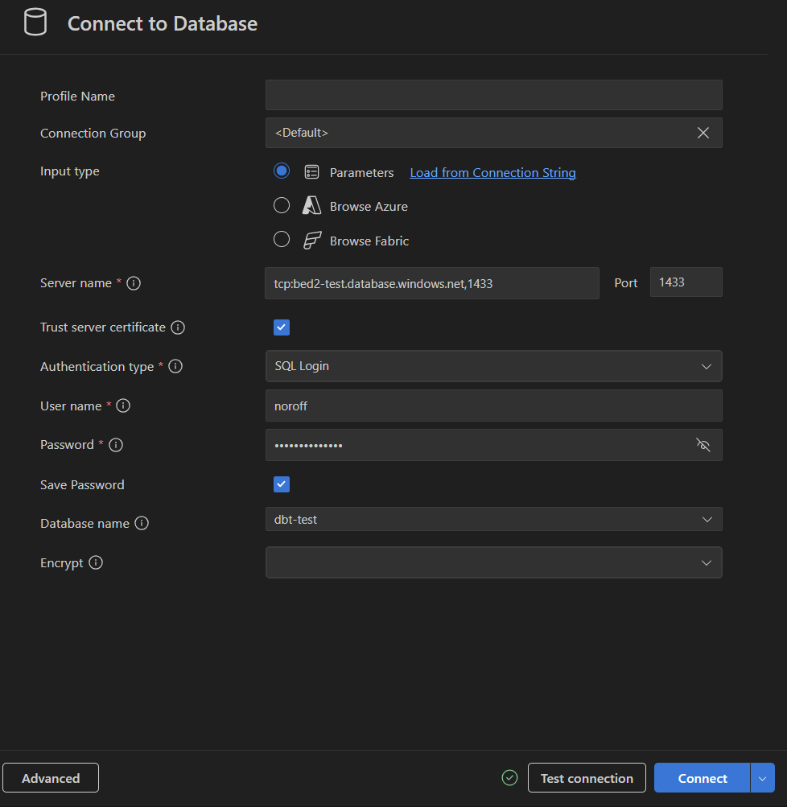

**Test connection** checks the details before you save them. Once connected, the server appears in the tree with the table we created in the portal:


It's the same database, reached from two places: the portal's Query editor, and your own machine through the firewall rule for your IP.

[Back to contents](#contents)

## 4. The user service

The user service is an Express API that reads and writes the `Users` table. It runs on port 3001.

### 4.1 Connecting with Sequelize

Recall **Sequelize**, the **ORM** *[object relational mapper - it lets you work with tables and rows as objects in your code, and writes the SQL for you]* you've used with MySQL. It talks to SQL Server too, through a driver package called **tedious** ([Dialect-specific things](https://sequelize.org/docs/v6/other-topics/dialect-specific-things/)). In `user-service/`:

```bash
npm install express sequelize tedious dotenv
```

You may have seen `npm install mssql sequelize` elsewhere. The `mssql` package is built on `tedious`, so installing it pulls `tedious` in too, and that's the only reason Sequelize works with it. Sequelize never uses `mssql` itself. Its dialect for SQL Server is called `mssql`, but the package it loads is `tedious`, and if `tedious` isn't installed it stops with `Please install tedious package manually`.

The values from the connection string go into `user-service/.env`, one per variable:

```
PORT=3001
SERVICE_NAME=user-service
ENVIRONMENT=development

HOST=bed2-test.database.windows.net
DATABASE_NAME=dbt-test
ADMIN_USERNAME=noroff
ADMIN_PASSWORD=!demoserver123
DIALECT=mssql
```

`src/models/index.js` builds the Sequelize instance from those values and loads the model:

```js
const Sequelize = require('sequelize')
require('dotenv').config()

// The connection string from the Azure portal, split into the pieces Sequelize
// wants. Azure SQL only accepts encrypted connections, hence `encrypt: true`.
const sequelize = new Sequelize(
  process.env.DATABASE_NAME,
  process.env.ADMIN_USERNAME,
  process.env.ADMIN_PASSWORD,
  {
    host: process.env.HOST,
    dialect: process.env.DIALECT,
    dialectOptions: {
      options: {
        encrypt: true
      }
    },
    logging: false
  }
)

const db = {}
db.sequelize = sequelize
db.User = require('./user')(sequelize, Sequelize)

module.exports = db
```

`encrypt: true` is the `Encrypt=True` from the connection string. Notice that it sits inside `dialectOptions.options`, not directly in `dialectOptions`. For SQL Server, Sequelize only passes the nested `options` object on to tedious - the docs call out "the need for this nested `options` field for MSSQL" - so an `encrypt` one level up is ignored.

The file exports a `db` object with the Sequelize instance and every model on it. The rest of the service requires `./models` and gets both.

### 4.2 A model for a table that already exists

`src/models/user.js` describes the `Users` table:

```js
// The Users table already exists in Azure - we created it with SQL in the
// portal. This model describes that table rather than creating it, so every
// name here matches a column exactly.
module.exports = (sequelize, Sequelize) => {
  const User = sequelize.define('User', {
    UserId: {
      type: Sequelize.INTEGER,
      primaryKey: true,
      autoIncrement: true
    },
    Username: {
      type: Sequelize.STRING(50),
      allowNull: false
    },
    Email: {
      type: Sequelize.STRING(255),
      allowNull: false
    },
    // No value needed on insert - the database fills it with SYSDATETIME().
    CreateAt: {
      type: Sequelize.DATE
    }
  }, {
    tableName: 'Users',
    timestamps: false
  })

  return User
}
```

The table was made first, so the model has to match it exactly:

- The attribute names are the column names, including `CreateAt`.
- `tableName: 'Users'` stops Sequelize guessing the table name from the model name.
- `timestamps: false` stops Sequelize expecting its own `createdAt` and `updatedAt` columns, which this table doesn't have.

There's also no `sequelize.sync()` anywhere in the service. `sync()` creates tables from the models, and the table already exists.

### 4.3 Services

A route's job is the request and the response: read what came in, and send something back. Fetching users is a different job. If the Sequelize calls go straight into the routes, every route has to know the model's methods and the table's column names, and changing how users are stored means editing every route.

So the database code goes in a **service** *[here, a class that holds the database code for one kind of thing]*, and the routes call its methods. Recall the `BookService` from the Mongoose API: the model was passed into the constructor, and the routes never touched the model themselves. `user-service/src/services/userService.js` is the same shape:

```js
// Everything that talks to the Users table lives here. The routes in app.js
// only deal with requests and responses - they never see Sequelize.
class UserService {
  // The model is passed in rather than required here, so app.js decides what
  // the service talks to
  constructor (User) {
    this.User = User
  }

  // All users.
  list () {
    return this.User.findAll()
  }

  getById (id) {
    return this.User.findByPk(id)
  }

  getByEmail (email) {
    return this.User.findOne({ where: { Email: email } })
  }

  // The API takes lowercase fields; the table columns are PascalCase.
  create ({ username, email }) {
    return this.User.create({
      Username: username,
      Email: email
    })
  }
}

module.exports = UserService
```

`create` is where the API's lowercase `username` and `email` become the table's `Username` and `Email` columns. A route passes `{ username, email }` and doesn't need to know what the columns are called. It doesn't pass `UserId` or `CreateAt` either, because the database fills those in.

The health check needs the database too, to ask whether Azure SQL can still be reached. That gets its own small service, `src/services/healthService.js`:

```js
// Answers one question for /health: can this service still reach Azure SQL?
class HealthService {
  constructor (sequelize) {
    this.sequelize = sequelize
  }

  async isDatabaseConnected () {
    try {
      await this.sequelize.authenticate()

      return true
    } catch (error) {
      return false
    }
  }
}

module.exports = HealthService
```

`authenticate()` signs in and runs a trivial query. `isDatabaseConnected()` turns that into a plain `true` or `false`, so the route doesn't have to deal with a Sequelize error.

### 4.4 Error middleware

Any call to the database can fail. The connection can drop, or the data can break a rule in the model, such as a POST with no `username` when the model says `allowNull: false`. Something has to turn that failure into a response. A `try`/`catch` in every route would repeat the same 500 in each one, and the POST's would also have to recognise Sequelize's validation error by name - Sequelize back in a route.

Express has a place for this. **Error-handling middleware** is middleware with four arguments instead of three - `(err, req, res, next)` - and it's defined "last, after other `app.use()` and routes calls" ([Error handling](https://expressjs.com/en/guide/error-handling.html)). In Express 5, when an `async` route throws, the error is passed to it automatically - their errors "reach Express with no extra work". So the routes don't need a `try`/`catch` at all.

`user-service/src/middleware/errorHandler.js`:

```js
// Four arguments is what tells Express this is an error handler.
// Express 5 sends anything thrown in an async route here.
function errorHandler (err, req, res, next) {
  // Sequelize: the data broke a rule in the model (e.g. a missing username)
  if (err.name === 'SequelizeValidationError') {
    return res.status(400).json({
      error: 'Validation failed',
      details: err.errors.map((e) => e.message)
    })
  }

  console.error(err)

  res.status(500).json({ error: 'Something went wrong' })
}

module.exports = errorHandler
```

Recall the error handler in the Mongoose API. It's the same shape - there it caught Mongoose's `ValidationError`, here it catches Sequelize's.

A validation error is the client's fault, so it gets a **400** with the reasons. Anything else is a **500** with a general message. The real error is printed in the user service's terminal, not sent to the client.

### 4.5 The routes

`src/app.js` brings the pieces together. Require them at the top, with `express`:

```js
const db = require('./models')
const UserService = require('./services/userService')
const HealthService = require('./services/healthService')
const errorHandler = require('./middleware/errorHandler')
```

Create each service once, below `const app = express()`:

```js
const userService = new UserService(db.User)
const healthService = new HealthService(db.sequelize)
```

This is where each service is handed what it talks to: the `User` model for one, the Sequelize instance for the other.

The `/health` route goes below `app.use(express.json())`:

```js
// Health endpoint.
// `service` says which service answered once requests come through the
// gateway. `database` says whether this service can still reach Azure SQL.
app.get('/health', async (req, res) => {
  const connected = await healthService.isDatabaseConnected()

  res.status(connected ? 200 : 503).json({
    status: connected ? 'ok' : 'degraded',
    service: SERVICE_NAME,
    uptime: process.uptime(),
    timestamp: new Date().toISOString(),
    environment: ENVIRONMENT,
    database: connected ? 'connected' : 'disconnected'
  })
})
```

As well as the service name, it reports whether the database can be reached, and answers **503 Service Unavailable** if it can't. That's the line you check first when something isn't working.

The user routes go below `/health`. None of them has a `try`/`catch`, and a comment above them says why:

```js
// No try/catch in the routes below. If anything throws, Express 5 passes the
// error to errorHandler at the bottom of this file.
```

All users is a GET on `/`:

```js
// All users.
app.get('/', async (req, res) => {
  const users = await userService.list()

  res.status(200).json(users)
})
```

A user by email, then a user by id:

```js
// User by email.
// This has to sit above /:id. Express matches routes in order, and /:id
// would otherwise swallow /email/... as an id.
app.get('/email/:email', async (req, res) => {
  const user = await userService.getByEmail(req.params.email)

  if (!user) {
    return res.status(404).json({ error: 'User not found' })
  }

  res.status(200).json(user)
})

// User by id.
app.get('/:id', async (req, res) => {
  const user = await userService.getById(req.params.id)

  if (!user) {
    return res.status(404).json({ error: 'User not found' })
  }

  res.status(200).json(user)
})
```

A user by email is `/email/:email`, not `/:email`. To Express, `/:email` and `/:id` are the same route - one segment after the slash - so whichever comes first would get every request. Giving email its own prefix, and putting it above `/:id`, keeps them apart.

A user that doesn't exist isn't an error. `findByPk` and `findOne` return `null`, and the route answers that with a 404 itself.

Creating a user is a POST on `/`, taking `username` and `email` as JSON:

```js
// Create a user.
app.post('/', async (req, res) => {
  const user = await userService.create({
    username: req.body.username,
    email: req.body.email
  })

  res.status(201).json(user)
})
```

The error handler goes at the very bottom, below the last route and above `module.exports`:

```js
// Last, after every route - it only sees errors the routes above threw.
app.use(errorHandler)
```

Each route now only calls the service and sends the result. Sequelize appears in the models, the services and the error handler, and nowhere in the routes.

### 4.6 Running it

`src/server.js` connects to the database, then starts listening:

```js
require('dotenv').config()

const app = require('./app')
const db = require('./models')

const PORT = process.env.PORT || 3001
const SERVICE_NAME = process.env.SERVICE_NAME || 'user-service'

async function start () {
  try {
    await db.sequelize.authenticate()

    console.log('Connected to Azure SQL')
  } catch (error) {
    // Not fatal. The service still starts, so /health can report that the
    // database is unreachable instead of the process just disappearing.
    console.error('Database connection failed:', error.message)
  }

  app.listen(PORT, () => {
    console.log(`${SERVICE_NAME} running on port ${PORT}`)
  })
}

start()
```

`authenticate()` signs in and runs a trivial query. If it fails - the firewall doesn't have your IP, or the password is wrong - the service logs the error and starts anyway, so `/health` can tell you the database is unreachable.

Run it with `npm run dev`, then:

```bash
curl http://localhost:3001/health
```

```json
{"status":"ok","service":"user-service","uptime":165.427983,"timestamp":"2026-10-02T08:34:51.304Z","environment":"development","database":"connected"}
```

With the database connected, we added five users through the POST route:

```bash
curl -X POST http://localhost:3001/ -H "Content-Type: application/json" -d '{"username":"ada","email":"ada@example.com"}'
```

```json
{"UserId":1,"Username":"ada","Email":"ada@example.com","CreateAt":"2026-10-02T08:34:56.365Z"}
```

We sent two fields and got four back. `UserId` came from `IDENTITY`, and `CreateAt` from the `DEFAULT` - the database filled both, and Sequelize returned the row as it was inserted.

Three requests show the error handler at work:

| Request | Response | Why |
|---|---|---|
| POST with no `username` | `400 {"error":"Validation failed","details":["User.Username cannot be null"]}` | `allowNull: false` on the model |
| `GET /abc` | `500 {"error":"Something went wrong"}` | SQL Server can't turn `abc` into an `INT`. The real error is printed in the user service's terminal, not sent to the client |
| `GET /99` | `404 {"error":"User not found"}` | Not an error at all - the route answers it directly |

> Routes handle the request and the response; services handle the data; the error handler handles what goes wrong.

[Back to contents](#contents)

## 5. The gateway

The gateway is the one from last lesson, with a single route. Recall that `express-http-proxy` forwards a request to another server and passes the answer back, and that the path the proxy is mounted on is stripped off first.

`gateway/.env`:

```
PORT=3000
SERVICE_NAME=gateway
ENVIRONMENT=development

USER_SERVICE_URL=http://localhost:3001
```

In `gateway/src/app.js`, below the `/health` route:

```js
// The one forwarding rule. The mount path is stripped before the request is
// forwarded, so GET /users/1 reaches the user service as GET /1.
app.use('/users', proxy(USER_SERVICE_URL))
```

So `localhost:3000/users` is the user service's `/`, and `localhost:3000/users/1` is its `/1`. Clients now only ever use port 3000.

The gateway starts with nothing else - no logging, no rate limit. It gets new jobs in [section 7](#7-cors) and [section 9](#9-the-gateway-as-the-front-door).

[Back to contents](#contents)

## 6. The website

### 6.1 Serving the page

The website is a third Express app, on port 8080. Its only job is to send the browser some files. `website/src/app.js`:

```js
require('dotenv').config()

const path = require('path')
const express = require('express')

const app = express()

const SERVICE_NAME = process.env.SERVICE_NAME || 'website'
const ENVIRONMENT = process.env.ENVIRONMENT || 'default'

app.get('/health', (req, res) => {
  res.status(200).json({
    status: 'ok',
    service: SERVICE_NAME,
    uptime: process.uptime(),
    timestamp: new Date().toISOString(),
    environment: ENVIRONMENT
  })
})

// Everything in public/ is sent to the browser as-is. The page then talks to
// the gateway on :3000 by itself - this server never touches the users.
app.use(express.static(path.join(__dirname, '..', 'public')))

module.exports = app
```

`express.static` serves every file in `public/` as it is. That folder holds `index.html` - a page styled with Bootstrap from a CDN, with a card to find users and a card to add one - and `users.js`, the script that page runs.

### 6.2 Calling the gateway

The important thing about `users.js` is where it runs. The website's server sends it to the browser, and the browser runs it. So when the page asks for users, the request goes from the **browser** to the gateway. The website's server isn't involved.

The top of `website/public/users.js` says where the gateway is:

```js
// This file runs in the browser, so it can't read .env - the gateway address
// is a plain constant. Change it here when the gateway is deployed.
const GATEWAY_URL = 'http://localhost:3000'

// /users is the gateway route that forwards to the user service.
const USERS_URL = `${GATEWAY_URL}/users`
```

The address is a constant rather than a `.env` value because `.env` is read by Node on the server. The browser only has the files it was sent, and anything in them can be read by whoever opens the page. Front-end tools like Vite read `.env` when they build the site and paste the values into the code, but with no build step a constant at the top of the script does the same job.

Every request uses `fetch` against `USERS_URL`. The first version of the page searched with a dropdown - all users, by id, or by exact email - and a text box.

[Back to contents](#contents)

## 7. CORS

### 7.1 The browser blocks it

With all three running, we opened `localhost:8080`. Nothing loaded:


The console explains it: the request was "blocked by CORS policy: No 'Access-Control-Allow-Origin' header is present on the requested resource."

An **origin** is the scheme, host and port a page was loaded from. The page came from `http://localhost:8080`. The gateway is `http://localhost:3000`. Same machine, different port, so they're different origins.

Browsers follow the **same-origin policy**: a script "can only request resources from the same origin the application was loaded from unless the response from other origins includes the right CORS headers" ([CORS](https://developer.mozilla.org/en-US/docs/Web/HTTP/Guides/CORS)). **CORS** *[Cross-Origin Resource Sharing - the set of headers a server uses to tell a browser which other origins may read its responses]* is how the gateway says "the page from 8080 is allowed".

The gateway didn't refuse anything. The same request from `curl` or Postman works, because they aren't browsers and don't apply the policy. The browser is protecting the person using it: without the policy, any website they visit could quietly call other sites in their name and read the answers.

### 7.2 Allowing the website

Recall from last lesson that CORS was one of the jobs that belongs on the gateway. Every request comes through it, so allowing the website once there covers every service behind it.

In `gateway/`:

```bash
npm install cors
```

The allowed origin goes in `gateway/.env`, below `USER_SERVICE_URL`:

```
ALLOWED_ORIGIN=http://localhost:8080
```

It goes in `.env` because it changes with the environment. Locally it's `localhost:8080`. Once the website is deployed, it's the real address - something like a site on `vercel.app` *[Vercel, a hosting platform for front ends]*.

In `gateway/src/app.js`, require it at the top with the other packages:

```js
const cors = require('cors')
```

Read the value with the other constants:

```js
const ALLOWED_ORIGIN = process.env.ALLOWED_ORIGIN || 'http://localhost:8080'
```

And add it above `/health` and the proxy:

```js
// CORS. The website is on a different origin (:8080) from the gateway (:3000),
// so the browser blocks its requests unless the gateway says that origin is
// allowed. Only the website is whitelisted - any other site is still blocked.
// This has to come before the proxy, so it also answers the browser's
// preflight OPTIONS request for the POST.
app.use(cors({ origin: ALLOWED_ORIGIN }))
```

`cors()` with no options would also have made the error go away, by answering `Access-Control-Allow-Origin: *` - any origin at all ([cors middleware](https://expressjs.com/en/resources/middleware/cors.html)). That's a **whitelist** of everyone. Naming the website's origin means a page on any other site is still blocked.

After a restart of the gateway, the page loaded:

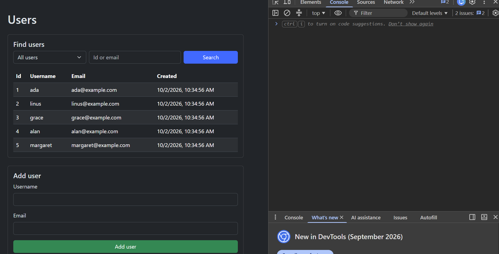

### 7.3 The preflight

Adding a user sends a POST with a JSON body. For some requests the browser asks permission before sending them: it sends an `OPTIONS` request first, called a **preflight**, and only sends the real request if the answer allows it. A `Content-Type` of `application/json` is one of the things that triggers it ([CORS](https://developer.mozilla.org/en-US/docs/Web/HTTP/Guides/CORS)).

The `cors` middleware answers preflights itself ([cors middleware](https://expressjs.com/en/resources/middleware/cors.html)). That's why it sits above the proxy: the `OPTIONS` request is answered at the gateway and never forwarded to the user service, which has no `OPTIONS` route.

### 7.4 More than one origin

We didn't need it, but a gateway often serves more than one front end. A `.env` value is always a single string, so the usual approach is to list the origins comma-separated and split them in code. The `cors` middleware takes an array for `origin`:

```
ALLOWED_ORIGINS=http://localhost:8080,http://localhost:5173
```

```js
const ALLOWED_ORIGINS = (process.env.ALLOWED_ORIGINS || 'http://localhost:8080')
  .split(',')
  .map((origin) => origin.trim())

app.use(cors({ origin: ALLOWED_ORIGINS }))
```

`cors` checks each request's `Origin` against the list and sends back only the one that matched, because `Access-Control-Allow-Origin` holds one value. An origin has no trailing slash, so `http://localhost:8080/` won't match.

> The browser enforces CORS, and the server's headers are what tell it to allow a request.

[Back to contents](#contents)

## 8. Searching for users

With the page working, the search showed two problems. The text box was there even when the dropdown said "All users", where it did nothing. And the email search only found an exact match, so `grace` didn't find `grace@example.com`.

The partial match needs the database, not the page. In SQL that's `LIKE` with `%` either side: `Email LIKE '%gra%'` matches any email with `gra` anywhere in it. Sequelize writes `LIKE` with the `Op.like` operator ([Model querying basics](https://sequelize.org/docs/v6/core-concepts/model-querying-basics/)).

Searching a list is a filter on the list, so it's a query string on `/`, not a new path: `/users?email=gra`.

The `LIKE` is database code, so it goes in the service. In `user-service/src/services/userService.js`, `list` takes an optional `email` and builds the filter from it:

```js
  // All users, or only those whose email contains `email`.
  // LIKE '%gra%' matches any email with "gra" anywhere in it.
  list ({ email } = {}) {
    const where = {}

    if (email) {
      where.Email = { [Op.like]: `%${email}%` }
    }

    return this.User.findAll({ where })
  }
```

with `Op` required at the top of the same file:

```js
const { Op } = require('sequelize')
```

With no `email`, `where` stays empty and `findAll` returns everyone, as before. The `= {}` lets `list()` still be called with nothing at all.

The route in `user-service/src/app.js` only has to pass the query string on:

```js
// All users, or only those whose email contains ?email=...
app.get('/', async (req, res) => {
  const users = await userService.list({ email: req.query.email })

  res.status(200).json(users)
})
```

That fixes the partial match. The empty text box is a problem with the page, so the rest of the change is back in the website, in `website/public/users.js` - the script the browser runs.

The page dropped the dropdown and kept a single search box. Instead of you choosing the kind of search, the script works it out from what you type and picks the endpoint to call:

```js
// One search box, three meanings:
//   empty         -> all users
//   only digits   -> exact id
//   anything else -> part of an email
function searchUrl (search) {
  if (search === '') {
    return USERS_URL
  }

  if (/^\d+$/.test(search)) {
    return `${USERS_URL}/${search}`
  }

  return `${USERS_URL}?email=${encodeURIComponent(search)}`
}
```

The gateway didn't change. The query string passes through the proxy, so `/users?email=gra` reaches the user service as `/?email=gra`.

[Back to contents](#contents)

## 9. The gateway as the front door

Every request comes in through the gateway, so anything that should apply to all of them goes there once rather than in each service.

### 9.1 Logging

Recall the logging middleware from last lesson: a function that logs each request and calls `next()` to pass it on. The gateway got a short version as its first middleware, above CORS:

```js
// Log every request that reaches the gateway. It is the single way in, so
// this one log line covers every service behind it.
app.use((req, res, next) => {
  console.log(`[${new Date().toISOString()}] ${req.method} ${req.originalUrl}`)

  next()
})
```

With it in place, adding a user from the website shows the preflight from [section 7.3](#73-the-preflight) in the gateway's terminal: an `OPTIONS /users` line, then the `POST /users`.

### 9.2 Rate limiting

Recall **rate limiting** from last lesson: the gateway caps how many requests each client can make in a time window, and answers **429 Too Many Requests** once a client goes over. The services behind it never see those requests. We used the same `express-rate-limit` package. In `gateway/`:

```bash
npm install express-rate-limit
```

Require it at the top of `gateway/src/app.js`, with the other packages:

```js
const rateLimit = require('express-rate-limit')
```

and add the limiter directly below the CORS line:

```js
// Rate limit: each client (by IP) gets 20 requests a minute, then 429s until
// the window resets. Low so it can be hit by hand in class.
// It sits after CORS, so the 429 still carries the CORS header (the page can
// read it instead of seeing a CORS error), and the preflights CORS answers
// don't use up the limit.
const limiter = rateLimit({
  windowMs: 60 * 1000,
  limit: 20,
  standardHeaders: 'draft-8',
  legacyHeaders: false,
  message: { error: 'Too many requests, try again in a minute' }
})

app.use(limiter)
```

The options are the ones from last lesson: a one-minute window, a limit per client, the limit reported in the `RateLimit` response headers, and the JSON body a rejected client gets. The limit is 20 rather than 5, because the website makes a request every time the page loads or you search.

Last lesson the limiter came first. Now there's a browser calling the gateway, so it goes **after CORS**, for two reasons:

- A 429 sent from above CORS would have no `Access-Control-Allow-Origin` header. The browser would block it, and the page would show `Failed to fetch` instead of the gateway's message.
- The `cors` middleware answers preflights itself and doesn't pass them on. Below it, the limiter only counts real requests, not the `OPTIONS` the browser sends before them.

Search a few times quickly and the page shows `Request failed: 429 Too many requests, try again in a minute` until the minute is up.

### 9.3 An API key

An **API key** *[a shared secret string a client sends with each request, so the API knows the request comes from an app it recognises]* is the simplest way to stop just anyone calling an API. You've probably met one already: the Google Maps API needs a key that identifies your project "for authentication and billing purposes" ([Google Maps Platform: API keys](https://developers.google.com/maps/documentation/javascript/get-api-key)).

Our key is one fixed value for now, not one generated per user. It goes in `gateway/.env`:

```
API_KEY=bed2-demo-key
```

It goes in `.env` and not in the code, because a key written in the code is a key anyone with the code has. For the same reason there's no `|| 'default'` fallback when it's read, near the top of `gateway/src/app.js`:

```js
// One fixed key for now, not one per user. No default on purpose - a key
// written in the code is a key anyone reading the code has.
const API_KEY = process.env.API_KEY
```

The check is a middleware, below `/health` and above the proxy:

```js
// API key check. Every request below this point must send the key in the
// x-api-key header, or it never reaches a service.
// It sits after CORS, so the browser's preflight OPTIONS (which never carries
// the key) is already answered, and after /health, so health stays open.
// `!API_KEY` matters: if .env has no API_KEY, both sides would be undefined
// and a request with no header would match - and get in.
app.use((req, res, next) => {
  if (!API_KEY || req.get('x-api-key') !== API_KEY) {
    return res.status(401).json({ error: 'Missing or invalid API key' })
  }

  next()
})
```

The client sends the key in a header called `x-api-key`. That name is a common convention rather than a standard. A request without the right key gets **401 Unauthorized** - the status for "you haven't said who you are" - and never reaches the user service.

The `!API_KEY` guard covers a missing `.env` entry. Without it, both sides of the comparison would be `undefined` for a request with no header, they'd be equal, and the request would get in. With it, a missing key refuses everything instead.

Where the check sits matters. The full order in the gateway is now: log, CORS, rate limit, `/health`, key check, proxy.

- **After CORS**, because the browser's preflight never carries the key. If the check came first, the preflight would get a 401, and every request would fail as a CORS error instead of a clear 401.
- **After `/health`**, so the gateway's health check stays open.
- **Before the proxy**, so a request without the key never reaches a service.

`npm run dev` restarts on code changes, not on `.env` changes, so restart the gateway by hand after adding the key.

The website doesn't send a key yet, so it broke:

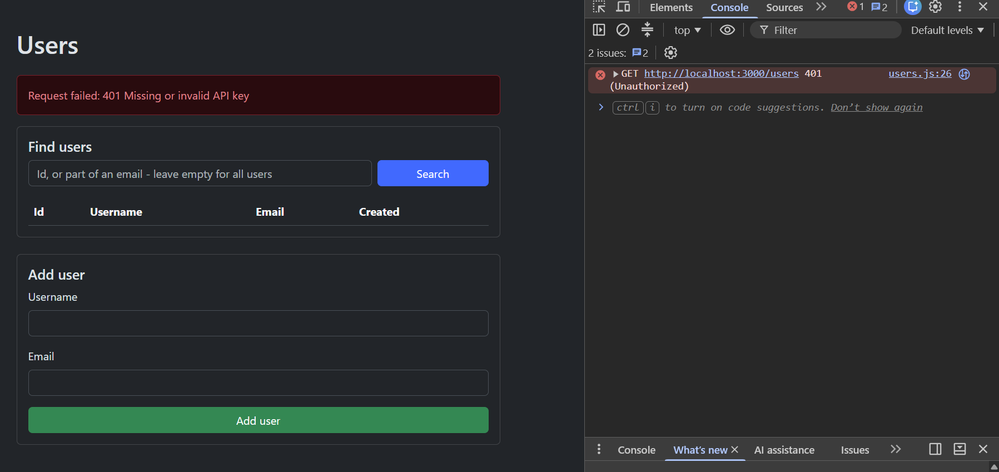

This isn't a CORS error. The browser got a real answer this time, and the answer was no.

The page can show the gateway's message because of how `fetch` fails. It only rejects when there's no response at all - a network error, or a response the browser blocks, like the CORS failure. If the server answers with an error status, "`fetch()` fulfills with a `Response`, so we have to check the status before we can read the response body" ([Using the Fetch API](https://developer.mozilla.org/en-US/docs/Web/API/Fetch_API/Using_Fetch)). `Response.ok` is `true` only for a status in the 200s.

So every request in `users.js` goes through one helper that checks it:

```js
async function request (url, options = {}) {
  const response = await fetch(url, options)
  const body = await response.json().catch(() => null)

  if (!response.ok) {
    const error = new Error(`${response.status} ${body?.error || response.statusText}`)
    error.status = response.status
    throw error
  }

  return body
}
```

On a 401 it throws with the status and the `error` from the gateway's JSON, which becomes `Request failed: 401 Missing or invalid API key` in the red alert. Without the `response.ok` check, the page would try to draw the error object as a row in the table.

### 9.4 Sending the key

The fix is on the website. The key goes next to the gateway address at the top of `users.js`:

```js
// Must match API_KEY in the gateway's .env. Anyone who opens this page can
// read it here - a key used from the browser can't stay secret.
const API_KEY = 'bed2-demo-key'
```

Every request already goes through `request()`, so that's the only place the header needs adding. The `fetch` call in it becomes:

```js
  const response = await fetch(url, {
    ...options,
    headers: { ...options.headers, 'x-api-key': API_KEY }
  })
```

`...options.headers` keeps any headers the caller passed - the `Content-Type` the add-user form sends - and adds the key to them.

After a refresh, users load and adding one works again. The gateway's log now shows an `OPTIONS` before every request, GETs included. A custom header like `x-api-key` is another thing that triggers a preflight, and the `cors` middleware allows it without any extra setup, because by default it allows whichever headers the preflight asks about ([cors middleware](https://expressjs.com/en/resources/middleware/cors.html)).

Now open DevTools and look at `users.js`. The key is right there, and anyone using the site can copy it and call the gateway themselves. A key that is sent from a browser can't be kept secret. It identifies the app, not the person using it. That's why Google recommends restricting a Maps key to your own website: the key is in the page for anyone to see, so the restriction is what stops it being used elsewhere.

> An API key identifies the app calling the gateway, and from a browser it's public.

[Back to contents](#contents)

## 10. Sources

1. Microsoft, [What is the Azure SQL Database service?](https://learn.microsoft.com/en-us/azure/azure-sql/database/sql-database-paas-overview) - Microsoft Learn
2. Microsoft, [What is a server in Azure SQL Database?](https://learn.microsoft.com/en-us/azure/azure-sql/database/logical-servers) - Microsoft Learn
3. Microsoft, [IP firewall rules - Azure SQL Database](https://learn.microsoft.com/en-us/azure/azure-sql/database/firewall-configure) - Microsoft Learn
4. Microsoft, [Create a single database - Azure SQL Database](https://learn.microsoft.com/en-us/azure/azure-sql/database/single-database-create-quickstart) - Microsoft Learn
5. Sequelize, [Dialect-specific things](https://sequelize.org/docs/v6/other-topics/dialect-specific-things/)
6. Sequelize, [Model querying basics](https://sequelize.org/docs/v6/core-concepts/model-querying-basics/)
7. MDN, [Cross-Origin Resource Sharing (CORS)](https://developer.mozilla.org/en-US/docs/Web/HTTP/Guides/CORS)
8. Express, [cors middleware](https://expressjs.com/en/resources/middleware/cors.html)
9. MDN, [Using the Fetch API](https://developer.mozilla.org/en-US/docs/Web/API/Fetch_API/Using_Fetch)
10. Express, [Error handling](https://expressjs.com/en/guide/error-handling.html)
11. Google, [Google Maps Platform: API keys](https://developers.google.com/maps/documentation/javascript/get-api-key) - Maps JavaScript API documentation
12. [express-http-proxy](https://github.com/villadora/express-http-proxy) - GitHub

[Back to contents](#contents)
